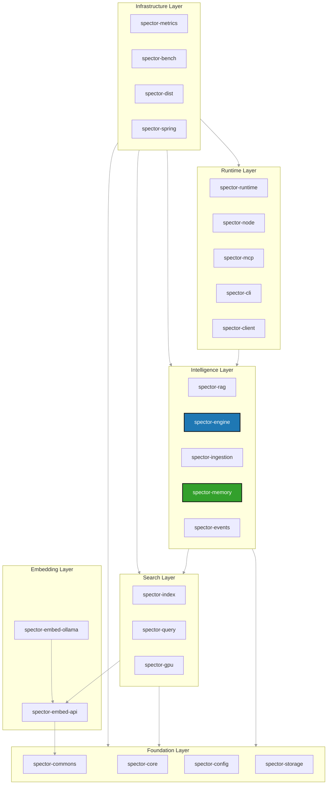

# Spector Project Context

Welcome to the **Spector** repository context guide. This document serves as the high-level onboarding and architectural blueprint for Spector, a state-of-the-art vector search engine with biologically-inspired cognitive memory. It acts as the "bridge" linking the actual source code with our agent rules, skills, and workflows.

---

## 1. Vision & Core Value Proposition

Traditional vector databases are simple document-matching engines. They perform static similarity searches on static embeddings with high latency, large GC overhead, and zero contextual awareness.

Spector reimagines search by mimicking biological cognitive structures:
*   **Volatile & Permanent Tiers**: Working Memory (Prefrontal Cortex) acts as a volatile circular buffer, while Episodic/Semantic layers represent permanent memory storage.
*   **Fused Scoring**: Instead of plain similarity, Spector evaluates `Similarity × Importance × Temporal Decay` in a single pass.
*   **Synaptic Gating**: Uses a 64-bit inline Bloom filter (Synaptic Tags) to eliminate 99% of candidate records before doing vector computations.
*   **Zero-GC Performance**: Built on off-heap Panama FFM and SIMD Vector APIs, processing 1M memories in under **0.13ms**.

---

## 2. Technology Stack & JVM Configuration

The Spector codebase relies on a bleeding-edge Java tech stack, taking full advantage of modern JVM capabilities:

| Technology Domain | Technology / Library | Version / Specs | Purpose |
|---|---|---|---|
| **Core Runtime** | OpenJDK 25 | JDK 25 (with Preview & Incubator) | Panama FFM, SIMD Vector API, Virtual Threads |
| **Build System** | Apache Maven | 22-module Maven Reactor | Modular builds, reproducible JAR outputs |
| **API Gateways** | Armeria / Javalin | Armeria 1.39.1 / Javalin 6.6.0 | Unified gRPC & HTTP on a single port (Netty-backed) |
| **JSON Parser** | Jackson | Jackson 3.x (BOM Jackson 2.x) | Fast off-heap compatible serialization/deserialization |
| **Observability** | Micrometer | 1.14.5 (Core & Prometheus) | Sub-microsecond metrics tracking |
| **Model Context** | Anthropic MCP Java SDK | 2.0.0-M3 (Official) | Native integration with Model Context Protocol |
| **Testing** | JUnit 5 / AssertJ / Mockito | JUnit 5.11.4 / AssertJ 3.27.3 | Fluent assertions and concurrent testing frameworks |
| **Micro-benchmarking** | OpenJDK JMH | 1.37 | Microsecond-accurate performance testing for hot paths |

### JVM Execution Flags
Because of the heavy dependency on Panama FFM and SIMD Vector APIs, compiler and surefire execution requires these exact JVM arguments:
```bash
--add-modules jdk.incubator.vector \
--enable-preview \
--enable-native-access=ALL-UNNAMED \
--add-opens java.base/java.lang=ALL-UNNAMED \
--add-opens java.base/java.lang.reflect=ALL-UNNAMED
```

---

## 3. Module & Layer Architecture

Spector is organized as a strict layered architecture to prevent circular dependencies and maintain clean boundaries:



### Module Responsibilities

1.  **Foundation Layer**
    *   `spector-commons`: Central utilities, standard exceptions, and `ErrorCode` enum registry.
    *   `spector-core`: Basic vector structures and underlying JNI/Panama FFM heap memory mappings.
    *   `spector-config`: Central configuration manager (`SpectorConfigFactory.java`).
    *   `spector-storage`: WAL (Write-Ahead Log) writing and native off-heap block allocations.
2.  **Embedding Layer**
    *   `spector-embed-api`: Provider interfaces for text-to-vector embedding.
    *   `spector-embed-ollama`: Concrete implementation connecting to local/remote Ollama embedding servers.
3.  **Search Layer**
    *   `spector-index`: Distance indexes (HNSW and brute-force).
    *   `spector-query`: Coordinate scoring and nearest-neighbor calculations.
    *   `spector-gpu`: CUDA-accelerated search operations (where applicable).
4.  **Intelligence Layer**
    *   `spector-memory`: Off-heap, biologically-inspired 4-tier cognitive memory.
    *   `spector-engine`: The main index management and retrieval coordinator.
    *   `spector-ingestion`: Documents chunking and routing.
    *   `spector-rag`: Retrieval-Augmented Generation context assembly.
    *   `spector-events`: Reactive publishing-subscription model.
5.  **Runtime Layer**
    *   `spector-runtime`: Combines `spector-memory` and `spector-engine` peers.
    *   `spector-node`: Orchestrates clustering and replication.
    *   `spector-mcp`: Anthropic Model Context Protocol server.
    *   `spector-cli` / `spector-client`: User interfaces and client libraries.
6.  **Infrastructure Layer**
    *   `spector-metrics`: Observability integration.
    *   `spector-bench`: JMH benchmark suite.
    *   `spector-spring`: Spring AI integration starter.

---

## 4. Agent Tooling Alignment (Rules & Workflows)

All agents working on this codebase must understand how our `.agents/` tooling maps to this layout:

### File System Rules (`.agents/rules/rules.md`)
*   **Virtual Threads Safe Concurrency**: Since Spector is built on virtual threads, agents are forbidden from using the `synchronized` keyword. You must use `ReentrantLock` or other non-pinning concurrency utilities.
*   **Platform-agnostic SIMD**: Lane widths cannot be hardcoded (e.g. AVX-512 vs AVX2); agents must use `FloatVector.SPECIES_PREFERRED` inside `spector-core`, `spector-index`, or `spector-memory/synapse/`.
*   **The Engine-Memory Independent Peer Rule**: `spector-memory` and `spector-engine` are independent peers. They are never allowed to depend on one another. If you need to wire them together, do so in `spector-runtime`.

### Automated Agent Workflows (`.agents/workflows/`)
Each workflow matches a specific slash command or task trigger. Use them sequentially as listed:

1.  **/feature-development** (`feature-development.md`): End-to-end framework for feature implementation. Guarantees that changes in foundation layers occur prior to search/intelligence modifications, and wraps everything in rigorous testing.
2.  **/exception-hardening** (`exception-hardening.md`): Audits code safety. Ensures all throw and catch sites inside a module throw domain-specific exceptions (e.g. `SpectorHebbianException` or `SpectorGraphPersistenceException`) registered in `ErrorCode.java`.
3.  **/dataset-generation** (`dataset-generation.md`): Dedicated workflow forMike Thompson's Cognitive Benchmark dataset. Calibrates emotional valence and importance tags under `datasets/cognitive-benchmark/`.
4.  **/module-lifecycle** (`module-lifecycle.md`): Guidelines on how to add, remove, or rename any modules inside the 22-module Maven reactor without breaking the reactor.
5.  **/pr-review** (`pr-review.md`): Quality gate. Automates compile checks, JaCoCo thresholds, and JMH benchmark runs before making a pull request.
6.  **/release-prep** (`release-prep.md`): Guides versions bumping, changelog additions, and GPG release signing profiles.

---

## 5. Quick Directory Map

*   **Runtime Config**: `spector-local.yml` (overrides default options).
*   **On-Disk Storage**: `.spector/` (ignored via `.gitignore` - do not delete or commit).
*   **Biologically-Inspired Design**: `spector-memory/RnD/` holds raw design math for cognitive memory mechanisms.
*   **Documentation Site**: `docs/` (built via MkDocs Material: `python -m mkdocs build --clean`).
