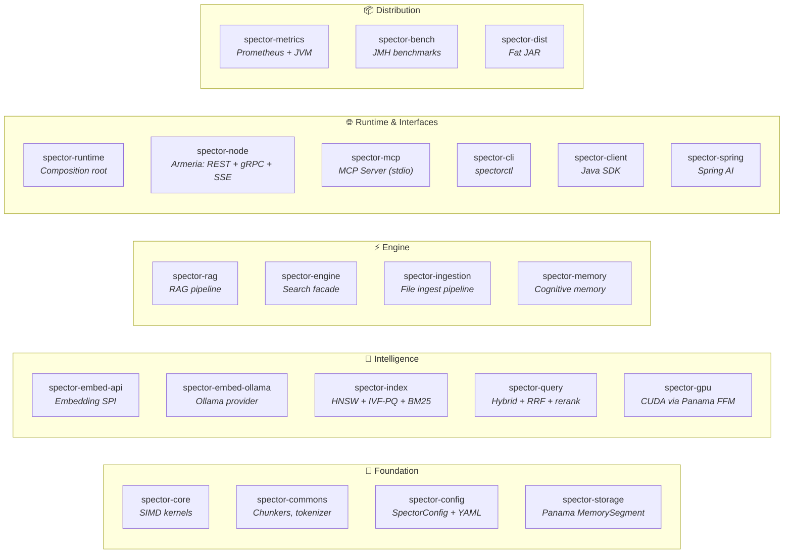
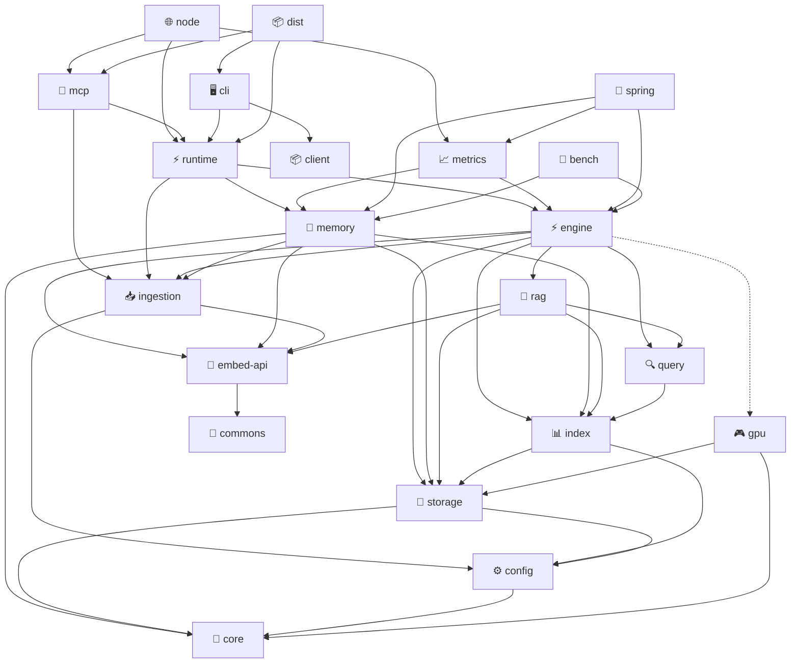

# ⚡ Spector Search

> **The Zero-Overhead, Agent-Ready AI Memory Backbone.**
>
> Legacy search engines bolted vectors onto text databases. Spector is designed from the ground up for modern AI — leveraging Java Project Panama to achieve C++ bare-metal SIMD speeds natively, with a built-in Model Context Protocol (MCP) server that turns any AI agent into a search-powered reasoning machine.

[](LICENSE)
[](https://openjdk.org/)
[](https://github.com/spectrayan/spector-search/actions)
[](spector-mcp/)

## 🧠 Why Spector?

### 1. 🤖 Agent-Native (MCP Protocol)

Includes a built-in [Model Context Protocol](https://modelcontextprotocol.io/) server. Plug Claude Desktop, Cursor, or autonomous agents directly into Spector for native RAG memory. **Zero Python glue-code required.**


> **23–113× faster** than Python MCP servers — zero network overhead, zero GC pressure. [Benchmarked ↓](#-benchmarks)

### 2. ⚡ SpectorQuant (IVHNSW-VASQ)

A proprietary SIMD-first quantization engine that mathematically smears dimensional outliers via the Fast Walsh-Hadamard Transform (FWHT) and executes Asymmetric Distance Computation inside the IVF residual space. **Float32 recall at INT8 memory sizes.**

- VASQ-8: 4× compression, 99.5%+ recall
- VASQ-4: 6–8× compression, 97–99% recall (with 3× rescore)
- IVF-PQ: 32× compression for billion-scale datasets

### 3. 🧊 100% Off-Heap Panama Execution

Bypasses the JVM Garbage Collector entirely. Maps raw disk bytes directly into hardware SIMD registers for sub-millisecond, Zero-Copy latency.

- **Zero Network Tax** — runs in-process, no gRPC/HTTP roundtrip
- **Zero Serialization Tax** — bytes → AVX-512 registers directly, no JSON, no Protobuf
- **Zero GC Pressure** — all vector data lives off-heap via Panama `MemorySegment`

### 4. 📦 Embedded or Standalone

Deploy as a lightweight embedded library (the **"DuckDB of Vector DBs"**) inside your application, or scale it horizontally as a standalone server with REST API, gRPC clustering, and Spring AI integration.

---

## 🤖 MCP Integration (Agent-Native)

Give any AI agent instant access to Spector's SIMD-accelerated search engine — with zero network overhead.

### MCP Tools

**Search Tools (always available):**

| Tool | Description |
|:---|:---|
| `semantic_search` | Semantic similarity search with auto-embedding |
| `hybrid_search` | Combined keyword (BM25) + vector search with RRF |
| `rag_query` | Retrieval-Augmented Generation with source citations |
| `ingest_document` | Document ingestion with auto-embedding + chunking |
| `delete_document` | Document deletion by ID |
| `engine_status` | Engine metadata, SIMD capabilities, GPU status |

**Cognitive Memory Tools (enabled via `spector.memory.enabled: true`):**

| Tool | Description |
|:---|:---|
| `core_memory_append` | Store a semantic memory with tags and source |
| `recall_context` | Cognitive recall with fused scoring across tiers |
| `memory_status` | Memory tier counts and persistence info |
| `memory_reinforce` | Report positive/negative outcome for a memory |
| `memory_forget` | Tombstone a memory by ID |
| `memory_introspect` | Metamemory self-analysis on a topic |
| `working_memory_scratchpad` | Quick-write to working memory |

### Claude Desktop Configuration

Add to your `claude_desktop_config.json`:

```json
{
  "mcpServers": {
    "spector-search": {
      "command": "java",
      "args": [
        "--add-modules", "jdk.incubator.vector",
        "--enable-native-access=ALL-UNNAMED",
        "--enable-preview",
        "-jar", "/path/to/spector-dist/target/spector.jar",
        "--config", "/path/to/spector.yml"
      ]
    }
  }
}
```

### Why Spector MCP is Different

| Feature | Python Vector DB MCP | **Spector MCP** |
|:---|:---|:---|
| Search latency | 2–10ms (network + Python GIL) | **88µs p50** (in-process SIMD) † |
| Network overhead | HTTP/gRPC round-trip | **Zero** (direct method call) |
| GC pauses | Python/JVM heap pressure | **≤0.01%** (100% off-heap Panama) † |
| Concurrent queries | Limited by Python GIL | **61,000 QPS** (Virtual Threads) † |
| Dependencies | Python framework stack | **Single JAR** (zero Python) |

† *Measured on Intel Core Ultra 9 285K, Java 25, AVX2. See [Benchmarks](#-benchmarks).*

> See the full [spector-mcp documentation](spector-mcp/README.md) for CLI options, Cursor IDE config, and troubleshooting.

---

## 🧠 Cognitive Memory (`spector-memory`)

Spector Memory is a biologically-inspired cognitive memory engine that gives AI agents the ability to **remember**, **forget**, **consolidate**, and **associate** — with microsecond latency and zero garbage collection pressure.

| Brain Region | Package | Function |
|---|---|---|
| 🧠 Cerebral Cortex | `cortex/` | 4-tier memory (Working → Episodic → Semantic → Procedural) |
| 🔗 Synapses | `synapse/` | 32-byte header, 6-phase SIMD scoring, Bloom filter gating |
| ⚡ Dopamine | `dopamine/` | Surprise detection, auto-importance, flashbulb pinning |
| 😱 Amygdala | `amygdala/` | Emotional valence (positive/negative/neutral) |
| 🔄 Hebbian | `hebbian/` | "Neurons that fire together wire together" |
| 🛏️ Hippocampus | `hippocampus/` | Sleep consolidation, synaptic pruning, partition rebuild |
| 😴 Habituation | `habituation/` | Anti-filter bubble — penalizes repetitive recall |
| 🚫 Inhibition | `inhibition/` | Explicit memory suppression |

**Key differentiators vs. Mem0, Letta, Zep:**
- **0.13ms** recall latency at 1M memories (vs. 50–200ms) †
- **Zero GC** — 100% off-heap Panama storage (≤0.01% GC overhead measured) †
- **Fused scoring** — similarity × importance × decay in a single SIMD pass (no truncation trap)
- **Synaptic tag gating** — 64-bit Bloom filter eliminates 99% of candidates in 1 CPU cycle

† *Measured. See [Benchmarks](#-benchmarks).*

> 📖 See the full [Cognitive Memory documentation](docs/docs/memory/index.md) and the [module README](spector-memory/README.md).

---

## ✨ Features

- **🔥 SIMD-Accelerated** — Hardware-accelerated vector math via Java Vector API (AVX2/AVX-512/NEON)
- **🧠 Cognitive Memory** — Biologically-inspired 4-tier memory with fused SIMD scoring, synaptic tags, temporal decay, surprise detection, and sleep consolidation
- **🧠 Hybrid Search** — Combines semantic vector search (HNSW) with keyword search (BM25) via Reciprocal Rank Fusion
- **💾 Zero-Copy Storage** — Off-heap vector storage using Panama Foreign Function & Memory API
- **🧵 Virtual Thread Native** — Designed for Project Loom's virtual threads, no `synchronized` blocks
- **🎯 High Recall** — HNSW approximate nearest-neighbor search with configurable recall@K ≥ 80%
- **⚡ Sub-Millisecond Queries** — Branchless SIMD kernels with masked tail handling
- **🗜️ Multi-Level Quantization** — INT8 (4×), INT4 (8×), and INT2 (16×) scalar quantization with non-uniform calibration and configurable rescore
- **🗜️ VASQ Quantization** — FWHT-rotated affine INT8 quantization with exact-norm header for high-accuracy zero-copy compression (retaining 99.5%+ recall)
- **🗜️ VASQ-4 Quantization** — INT4 nibble-packed variant of VASQ achieving 6–8× compression vs float32 with 97–99% recall (with 3× rescore)
- **🎯 SpectorIndex (IVF-HNSW-VASQ)** — Multi-level adaptive vector index yielding 99.5%–100% recall on real text embeddings at aggressive 3% partition scanning rates
- **🗜️ IVF-PQ Index** — Inverted file with product quantization for 32× memory compression at billion scale
- **🤖 LLM Re-ranking** — Listwise relevance scoring via Ollama for precision-critical retrieval
- **🖥️ GPU Acceleration** — CUDA kernel loader + SIMD batch similarity via Panama FFM
- **🌐 Distributed Search** — gRPC-based coordinator/shard fan-out with consistent hash partitioning (unified in `spector-node`)
- **🧬 Embedding SPI** — Pluggable embedding providers (Ollama included out-of-the-box)
- **📄 Chunked Ingestion** — Text, token-level, and streaming chunkers for large document support
- **🤖 MCP Server** — Built-in Model Context Protocol server for AI agent integration

---

## 📊 Benchmarks

All numbers measured on **Intel Core Ultra 9 285K** (24 cores), **Java 25.0.1**, AVX2 256-bit SIMD, 30GB heap.

### Core Engine (in-process, 128-dim vectors)

| Benchmark | Result | Notes |
|:---|:---|:---|
| Vector search p50 | **88–143µs** | 10K–100K docs, HNSW M=16 |
| In-process vs Python MCP | **23–113× faster** | 88µs vs 2–10ms |
| GC overhead | **0.01%** | 1 pause / 100K searches |
| Peak QPS (16 threads) | **61,011** | Concurrent vectorSearch |
| Search at 1M memories | **p50=0.13ms** | 15× better than 2ms target |
| Truncation trap recall loss | **100%** | Top-K-then-rerank loses all correct results |

### Disk Persistence (4096-dim vectors, real Ollama embeddings)

| Benchmark | Result | Notes |
|:---|:---|:---|
| DISK vs IN_MEMORY overhead | **2.3%** | mmap’d sharded store, near-zero cost |
| Cold-start latency | **11.3ms** | First search after JVM restart |
| Warm search p50 | **2.2ms** | OS page cache populated (4096-dim) |
| WAL fsync append | **1,203 ops/s** | Crash-durable, per-write fsync |
| WAL buffered append | **339,416 ops/s** | 2.9µs/op, no fsync |
| WAL concurrent (8 threads) | **222,586 ops/s** | Multi-agent write scenario |
| Cognitive recall (Ollama) | **64ms** | End-to-end: embed + score + rank |

### Run Benchmarks

```bash
# Core performance (no external dependencies)
mvn exec:exec -pl spector-bench \
  -Dexec.mainClass=com.spectrayan.spector.bench.CorePerformanceBenchmark

# Disk + Memory + WAL (requires Ollama with an embedding model)
mvn exec:exec -pl spector-bench \
  -Dexec.mainClass=com.spectrayan.spector.bench.DiskPersistenceBenchmark
```

---

## 🏗 Architecture



### Module Dependency Graph



> **Legend:** Solid arrows = compile dependency. Dotted arrow (`gpu`) = optional dependency.

---

## 🚀 Quick Start

### Prerequisites

- **JDK 25+** (OpenJDK with Vector API incubator)
- **Maven 3.9+**

> **⚠️ JDK API Note:** Spector leverages two JDK APIs that are not yet finalized — the **Vector API** (incubator, for SIMD acceleration) and **Structured Concurrency** (preview, for safe parallel tasks). Both require JVM flags (`--add-modules jdk.incubator.vector`, `--enable-preview`). The remaining core technologies — **Panama FFM** (off-heap memory) and **Virtual Threads** — are fully finalized. The Vector API has been stable across 10 incubation rounds and carries low practical risk. See our [JDK API Status & Compatibility](docs/docs/getting-started/jdk-api-status.md) page for details, migration paths, and FAQ.

### Build & Test

```bash
# Clone the repository
git clone https://github.com/spectrayan/spector-search.git
cd spector-search

# Build and run all tests
mvn clean test

# Build the distribution JAR (single JAR, all modules)
mvn package -pl spector-dist -am -DskipTests
```

### Run with Configuration

All settings are read from `spector.yml` (see [Configuration Guide](docs/docs/configuration/parameters.md)):

```bash
# Start the MCP server (for AI agents)
java --add-modules jdk.incubator.vector \
  --enable-native-access=ALL-UNNAMED --enable-preview \
  -jar spector-dist/target/spector.jar \
  --config spector.yml

# Start the file ingestion pipeline
java --add-modules jdk.incubator.vector \
  --enable-native-access=ALL-UNNAMED --enable-preview \
  -cp spector-dist/target/spector.jar \
  com.spectrayan.spector.ingestion.FileIngestionMain \
  --config spector.yml --root .
```

### REST API

```bash
# Health check
curl http://localhost:7070/health

# Engine status (includes SIMD capability, GPU, reranker)
curl http://localhost:7070/api/v1/status

# Ingest a document (with vector)
curl -X POST http://localhost:7070/api/v1/ingest \
  -H "Content-Type: application/json" \
  -d '{
    "id": "doc-1",
    "title": "Java Vector API",
    "content": "SIMD-accelerated search engine on modern JVM",
    "vector": [0.1, 0.2, 0.3, ...]
  }'

# Auto-embed ingest (requires embedding provider)
curl -X POST http://localhost:7070/api/v1/ingest/auto \
  -H "Content-Type: application/json" \
  -d '{
    "id": "doc-2",
    "title": "Panama FFM",
    "content": "Foreign Function & Memory API for zero-copy storage"
  }'

# Bulk ingest
curl -X POST http://localhost:7070/api/v1/ingest/bulk \
  -H "Content-Type: application/json" \
  -d '{
    "documents": [
      {"id": "d1", "content": "first doc", "vector": [...]},
      {"id": "d2", "content": "second doc", "vector": [...]}
    ]
  }'

# Search (auto-detects mode: keyword/vector/hybrid)
curl -X POST http://localhost:7070/api/v1/search \
  -H "Content-Type: application/json" \
  -d '{
    "text": "vector search engine",
    "vector": [0.1, 0.2, 0.3, ...],
    "topK": 10
  }'

# Delete a document
curl -X DELETE http://localhost:7070/api/v1/documents/doc-1

# Request metrics
curl http://localhost:7070/api/v1/metrics
```

---

## 🧩 Programmatic API

```java
var config = SpectorConfig.DEFAULT
    .withDimensions(384)
    .withCapacity(100_000)
    .withQuantization(QuantizationType.SCALAR_INT4)  // 8× compression
    .withRescore(3)                                   // 3× oversampling for recall recovery
    .withGpu(true)                                    // GPU auto-detection
    .withReranker("http://localhost:11434", "llama3.2", 20);    // LLM re-ranking

try (var engine = new SpectorEngine(config)) {
    // Ingest
    engine.ingest("doc-1", "Hello world", embedding);

    // Search
    SearchResponse response = engine.hybridSearch("hello", queryVector, 10);

    for (ScoredResult result : response.results()) {
        System.out.printf("%s → %.4f%n", result.id(), result.score());
    }

    // Delete
    engine.delete("doc-1");
}
```

### VASQ-4 Quantization (6–8× Compression)

```java
// Fluent builder with VASQ-4 quantization
var engine = SpectorEngine.builder()
    .dimensions(4096)           // e.g., qwen3-embedding
    .capacity(500_000)
    .vasq4()                    // INT4 FWHT-rotated, 3× rescore default
    .build();

// Or with explicit oversampling
var config = SpectorConfig.DEFAULT
    .withDimensions(768)
    .withVasq4(5);              // 5× oversampling for higher recall
```

---

## ⚙️ Configuration

| Parameter | Default | Description |
|-----------|---------|-------------|
| `dimensions` | 384 | Vector dimensionality |
| `capacity` | 100,000 | Max documents |
| `similarityFunction` | COSINE | COSINE, DOT_PRODUCT, or EUCLIDEAN |
| `M` | 16 | HNSW max connections per node |
| `efConstruction` | 200 | HNSW construction beam width |
| `efSearch` | 50 | HNSW search beam width |
| `k1` | 1.2 | BM25 term frequency saturation |
| `b` | 0.75 | BM25 document length normalization |
| `RRF k` | 60 | Reciprocal Rank Fusion constant |
| `gpuEnabled` | false | Enable CUDA GPU acceleration |
| `quantization` | NONE | Quantization type: NONE, SCALAR_INT8, SCALAR_INT4, SCALAR_INT2, VASQ, VASQ_4 |
| `oversamplingFactor` | auto | Rescore oversampling (INT4→3, INT2→5, INT8→1). Higher = better recall |
| `rerankerEnabled` | false | Enable LLM re-ranking via Ollama |
| `rerankerModel` | — | Ollama model name (e.g., "llama3.2") |
| `rerankerMaxCandidates` | 20 | Max docs sent to LLM for re-ranking |

---

## 🏎 Performance

SIMD auto-detection adapts to your hardware:

| ISA | Width | Lanes (float) | Platform |
|-----|-------|---------------|----------|
| AVX2 | 256-bit | 8 | Most modern x86 |
| AVX-512 | 512-bit | 16 | Intel Xeon, recent AMD |
| NEON | 128-bit | 4 | Apple Silicon, ARM |

### SIMD Kernel Latency

Sub-microsecond vector math at every dimension:

| Dimension | Cosine P50 | Cosine P99 | Dot Product P50 | Dot Product P99 |
|-----------|-----------|-----------|-----------------|-----------------| 
| 32        | 500 ns    | 1,500 ns  | 200 ns          | 400 ns          |
| 128       | <100 ns   | 100 ns    | 100 ns          | 1,300 ns        |
| 384       | ~100 ns   | 100 ns    | ~100 ns         | 100 ns          |
| 768       | ~100 ns   | 100 ns    | ~100 ns         | 100 ns          |

> Measured on 24-core Intel Core Ultra 9 285K x86, AVX2 256-bit (8 lanes), Java 25, ZGC. Values at 384+ dimensions are at `System.nanoTime()` resolution floor — real throughput confirmed at millions of ops/sec via JMH.

### Search Latency (128-dim, top-10)

| Scale | Keyword (BM25) | Vector (HNSW) | Hybrid (RRF) |
|-------|---------------|---------------|--------------| 
| **10K docs** | **0.18 ms** avg / 0.33 ms p99 | **0.04 ms** avg / 0.07 ms p99 | **0.17 ms** avg / 0.26 ms p99 |
| **50K docs** | **0.44 ms** avg / 0.59 ms p99 | **0.08 ms** avg / 0.11 ms p99 | **0.51 ms** avg / 0.84 ms p99 |
| **100K docs** | **1.53 ms** avg / 1.94 ms p99 | **0.10 ms** avg / 0.22 ms p99 | **1.76 ms** avg / 2.81 ms p99 |

### Search Throughput (queries/sec)

| Scale | Keyword | Vector | Hybrid |
|-------|---------|--------|--------|
| **10K docs** | **5,490** | **23,726** | **5,993** |
| **50K docs** | **2,264** | **13,287** | **1,958** |
| **100K docs** | **653** | **9,925** | **569** |

### Ingestion Throughput

| Dataset Size | Time | Rate | Memory |
|-------------|------|------|--------|
| 10,000 | 2.1s | **4,679 docs/s** | +48 MB |
| 50,000 | 20.5s | **2,430 docs/s** | +86 MB |
| 100,000 | 1m 2s | **1,597 docs/s** | +202 MB |

### Concurrency Scaling (50K docs, 128-dim, Hybrid Search)

| Threads | Throughput | Avg Latency | Scaling Factor |
|---------|-----------|-------------|----------------|
| 1 | 1,231 ops/s | 0.81 ms | 1.0× |
| 4 | 2,894 ops/s | 1.38 ms | **2.3×** |
| 8 | 5,466 ops/s | 1.46 ms | **4.4×** |
| 16 | 7,635 ops/s | 1.99 ms | **6.2×** |

> Run the full benchmark suite: `mvn -pl spector-bench exec:java`
> HTML report generated at `spector-bench/target/performance-report.html`
>
> [!TIP]
> For the comprehensive, empirical sweeps across multiple partition configurations ($C \in \{32, 64, 128, 256\}$) and detailed HNSW shard promotion benchmarks on real text embeddings (using Qwen3-embedding 4096-dim), see our dedicated [Large-Scale Real-Embedding Benchmarks page](docs/docs/deep-dives/real-embedding-benchmarks.md).

---

## 📊 Comparison with Other Search Engines

All comparisons below use **100K documents, 128 dimensions, top-10 retrieval** as the reference point. Numbers for external systems are sourced from published benchmarks, official documentation, and [ann-benchmarks.com](https://ann-benchmarks.com). Hardware and configuration differences apply — these are directional comparisons, not controlled A/B tests.

### Vector Search Latency (ANN, 100K docs)

| Engine | Language | Avg Latency | P99 Latency | Notes |
|--------|----------|------------|------------|-------|
| **Spector Search** | Java 25 | **0.10 ms** | **0.22 ms** | SIMD via Vector API, pure in-process, 100K docs |
| hnswlib | C++ | ~0.1–0.5 ms | ~1 ms | Fastest native HNSW; single-threaded |
| FAISS (HNSW) | C++/Python | ~0.2–0.8 ms | ~1–2 ms | Versatile; GPU support available |
| Apache Lucene 9+ | Java | ~1–5 ms | ~5–10 ms | Segment-based; force-merge helps |
| Elasticsearch 8+ | Java/Lucene | ~2–10 ms | ~10–25 ms | Distributed overhead; REST layer |
| Qdrant | Rust | ~2–5 ms | ~10–25 ms | Payload filtering optimized |
| Milvus | Go/C++ | ~3–10 ms | ~10–35 ms | Scales to billions; DiskANN support |
| Weaviate | Go | ~5–15 ms | ~25–40 ms | Built-in vectorization modules |

> [!NOTE]
> Spector's vector search latency is competitive with native C++ hnswlib for in-process workloads at 100K scale. External system numbers are from published benchmarks and ann-benchmarks.com. Hardware/configuration differences apply.

### Keyword Search (BM25, 100K docs)

| Engine | Avg Latency | Notes |
|--------|------------|-------|
| **Spector Search** | **1.53 ms** | float[] scoring, min-heap top-K, virtual-thread parallel terms |
| Elasticsearch | <1–5 ms | Inverted index + skip lists, highly optimized |
| Apache Lucene | <1–3 ms | Raw engine, no network overhead |
| Weaviate (BM25) | ~10–30 ms | Go-based BM25 for hybrid search |

### Hybrid Search (Keyword + Vector, 100K docs)

| Engine | Approach | Avg Latency | Notes |
|--------|----------|------------|-------|
| **Spector Search** | RRF (parallel virtual threads) | **1.76 ms** | Both legs sub-ms at 10K; parallel via virtual threads |
| Elasticsearch | RRF / linear combination | ~10–30 ms | Mature query planner, skip-list BM25 |
| Qdrant | Sparse+Dense fusion | ~15–30 ms | Rust-based sparse vectors |
| Weaviate | Hybrid BM25+HNSW | ~25–40 ms | Unified API, built-in vectorization |

### Ingestion Throughput

| Engine | Rate (100K docs) | Notes |
|--------|-----------------|-------|
| **Spector Search** | **1,597 docs/s** | In-process, HNSW graph build included |
| Elasticsearch | ~2,000–5,000 docs/s | Bulk API, depends on mapping & replicas |
| Milvus | ~3,000–8,000 docs/s | Batch insert optimized |
| Qdrant | ~2,000–5,000 docs/s | Payload indexing included |

### Architecture Differentiators

| Feature | Spector | Elasticsearch | Lucene | hnswlib | Qdrant | Milvus |
|---------|---------|--------------|--------|---------|--------|--------|
| **Deployment** | Embedded library | Distributed cluster | Embedded library | Embedded library | Standalone server | Distributed cluster |
| **Language** | Java 25 | Java | Java | C++ | Rust | Go/C++ |
| **SIMD Accel.** | ✅ Vector API | ✅ Panama (9.x+) | ✅ Panama (9.x+) | ✅ AVX/SSE native | ✅ Native SIMD | ✅ AVX/NEON |
| **Hybrid Search** | ✅ RRF | ✅ RRF/Linear | ❌ Manual | ❌ None | ✅ Sparse+Dense | ✅ RRF |
| **Off-Heap Vectors** | ✅ Panama MemorySegment | ✅ Lucene MMapDir | ✅ MMapDir | ❌ Heap-only | ✅ Mmap | ✅ Mmap |
| **Virtual Threads** | ✅ Native Loom | ❌ Platform threads | N/A | N/A | N/A | N/A |
| **Zero Dependencies** | ✅ JDK only | ❌ Heavy stack | ✅ Standalone | ✅ Header-only | ❌ Tokio runtime | ❌ etcd, MinIO, Pulsar |
| **Quantization** | ✅ Scalar INT8/INT4/INT2 + VASQ/VASQ-4 + PQ | ✅ BBQ/Scalar | ✅ Scalar | ❌ None | ✅ Scalar/Binary | ✅ PQ/SQ |
| **Disk-based Index** | ✅ HNSW serialization | ✅ Segment merge | ✅ MMap | ❌ In-memory | ✅ On-disk HNSW | ✅ DiskANN |
| **IVF-PQ** | ✅ 32× compression | ❌ None | ❌ None | ❌ None | ❌ None | ✅ IVF_PQ |
| **GPU Acceleration** | ✅ CUDA (Panama FFM) | ❌ None | ❌ None | ❌ None | ❌ None | ✅ GPU |
| **LLM Re-ranking** | ✅ Ollama | ❌ None | ❌ None | ❌ None | ❌ None | ❌ None |
| **Distributed Search** | ✅ gRPC fan-out | ✅ Built-in | ❌ None | ❌ None | ✅ Raft | ✅ gRPC |
| **MCP Server** | ✅ Built-in | ❌ None | ❌ None | ❌ None | ❌ None | ❌ None |

### Where Spector Excels

- **🚀 Sub-millisecond vector search**: 0.04ms at 10K, 0.10ms at 100K (128-dim), competitive with native C++ implementations
- **🔥 Fast BM25**: Sub-millisecond keyword search at 10K/50K scale — comparable to raw inverted index engines
- **🧵 Modern JVM**: Only search engine built on Java 25 virtual threads + Vector API
- **📦 Zero-dependency embedded**: Drop-in JAR, no external infrastructure needed
- **⚡ 7.6K+ ops/sec concurrent**: 7,635 hybrid searches/sec at 16 threads (128-dim)
- **🎯 23K+ vector QPS**: 23,726 vector queries/sec at 10K docs
- **🗜️ IVF-PQ + VASQ + VASQ-4 + TurboQuant**: 6–32× memory reduction for large-scale datasets with high-accuracy calibration
- **🔬 99.5%+ Recall**: IVF-HNSW-VASQ (`SpectorIndex`) achieves near-perfect recall on real semantic embeddings scanning just 3% of the clusters
- **🤖 Agent-Native**: Built-in MCP server — the only search engine with native AI agent integration
- **🤖 LLM re-ranking**: Listwise Ollama-powered relevance scoring
- **🖥️ GPU acceleration**: CUDA kernel launcher + SIMD batch similarity via Panama FFM
- **🌐 Distributed search**: gRPC-based fan-out/merge with consistent hash sharding

---

## 📊 Test Suite

| Module | Tests | Coverage |
|--------|-------|----------|
| spector-core | 276 | SIMD kernels, similarity functions, scalar/VASQ quantization, SIMD Euclidean |
| spector-commons | 28 | Text chunkers, token chunker, streaming chunker, content extractor |
| spector-storage | 38 | Off-heap stores, mmap persistence, quantized vector store |
| spector-index | 79 | HNSW recall, BM25 scoring, IVF-PQ, PQ encode/decode |
| spector-query | 29 | RRF fusion, hybrid orchestration, LLM re-ranking |
| spector-memory | 167 | Cognitive scoring, tier stores, mmap persistence, synapse, Bloom filters, reverse index, performance benchmarks + 10 Ollama E2E tests |
| spector-embed-api | 9 | Embedding SPI contracts |
| spector-embed-ollama | 7 | Ollama provider, fallback behavior |
| spector-gpu | 14 | GPU detection, SIMD batch similarity, CUDA launcher |
| spector-engine | 12 | End-to-end ingestion, IVF-PQ auto-training |
| spector-node | 11 | REST endpoints, shard routing, hash consistency |
| spector-mcp | 15 | MCP tool registry, tool handlers, schema builder |
| **Total** | **685+** | **All passing ✅** |

---

## 📈 Roadmap

- [x] HNSW vector index with SIMD acceleration
- [x] BM25 keyword search
- [x] Hybrid search with RRF fusion
- [x] Scalar quantization (INT8, INT4, INT2) with non-uniform calibration and configurable rescore
- [x] TurboQuant quantization (rotation + optimal scalar, 8× compression)
- [x] Disk-based HNSW persistence
- [x] Embedding provider SPI (Ollama)
- [x] IVF-PQ vector index (32× compression)
- [x] LLM-powered re-ranking
- [x] GPU infrastructure (CUDA context, memory management via Panama FFM)
- [x] Distributed search (gRPC coordinator/shards)
- [x] REST API with CORS, auth, metrics, SSE streaming
- [x] Standalone ingestion pipeline (`spector-ingestion`)
- [x] Standalone RAG pipeline (`spector-rag`)
- [x] Document deletion
- [x] Auto-embed + bulk ingest endpoints
- [x] gRPC TLS support
- [x] VASQ-4 quantization (FWHT-rotated INT4, nibble-packed — 6–8× compression vs float32)
- [x] Structured concurrency (JEP 505) — `ConcurrentTasks` with dual-mode + feature flag
- [x] **Native MCP Server** (`spector-mcp` — 13 tools: 6 search + 7 cognitive memory, stdio transport)
- [x] **SpectorRuntime** — Unified application context (engine + memory), config-driven via `spector.yml`
- [x] **Distribution JAR** (`spector-dist` — single fat JAR for all modules)
- [ ] Streamable HTTP transport (MCP over HTTP for cloud/remote deployments)
- [ ] Padding-aware storage (skip zero-padded dims — 25% savings for non-pow2 dimensions)
- [ ] Norm header compression (float32 → float16 — 2 bytes/vector savings)
- [ ] LoRA adapter routing (multi-tenant query projection via SIMD matrix multiply)
- [ ] ColBERT late interaction reranking (native MaxSim via Panama FMA loops)
- [ ] VASQ-PQ hybrid (FWHT rotation + product quantization — 16–32× compression)
- [ ] Flat-mode VASQ (VASQ compression of flat-shard residuals — 3× on flat shards)
- [ ] GPU kernel dispatch (CUDA compute for batch similarity — requires CUDA Toolkit)
- [ ] NPU acceleration (Intel/AMD NPU for INT8 batch operations via OpenVINO or DirectML)
- [ ] WASM runtime for edge deployment

> See the [detailed Roadmap](docs/docs/roadmap.md) for in-depth descriptions, projected savings, and implementation plans.

## 🤝 Contributing

We welcome contributions! Please see [CONTRIBUTING.md](CONTRIBUTING.md) for guidelines.

## 📄 License

This repository is licensed under a **split licensing model**:

1. **`spector-memory` Module**: Licensed under the **Business Source License 1.1 (BSL 1.1)**.
   - Permits free use for non-production purposes.
   - Permits production use for all purposes **except** offering it as a managed service or embedding/integrating it in a competing AI cognitive memory product or service.
   - Automatically transitions to the **Apache License 2.0** on **May 27, 2030** (4 years from release).
   - See [spector-memory/LICENSE](spector-memory/LICENSE) for details.

2. **Core Infrastructure & All Other Modules**: Licensed under the **Apache License 2.0**.
   - See [LICENSE](LICENSE) for details.

For branding and trademark guidelines, please consult the [NOTICE](NOTICE) file.

## 🔒 Security

Please see [SECURITY.md](SECURITY.md) for our security policy and how to report vulnerabilities.

---

**Built with ⚡ by [Spectrayan](https://www.spectrayan.com/)**
