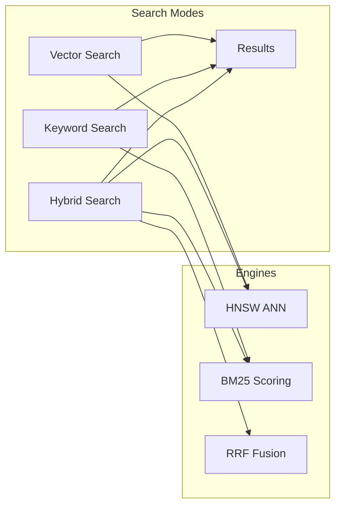

# 🌟 What is Spector Search?

> **The fastest pure-Java semantic search engine — combining vector similarity, keyword search, and hybrid ranking in a single embeddable library with zero external dependencies.**

Spector Search is an open-source, high-performance search engine built entirely on modern Java 25. It's designed for developers who want sub-millisecond search without the complexity of managing external infrastructure. Drop in a JAR, write a few lines of code, and you have production-grade hybrid search.

---

## 🎯 What It Does

Spector Search indexes documents with their vector embeddings and text content, then retrieves them using multiple strategies:

| Mode | How It Works | Best For |
|------|-------------|----------|
| **🧠 Vector Search** | HNSW approximate nearest neighbor graphs | Semantic similarity |
| **📝 Keyword Search** | BM25 scoring with term frequency saturation | Exact term matching |
| **🧬 Hybrid Search** | Combines both via Reciprocal Rank Fusion | Best-of-both-worlds |
| **🤖 RAG Pipeline** | Ingest → chunk → embed → retrieve → context assembly | LLM applications |

---

## 💎 Key Differentiators

### 📦 Pure Java, Zero Dependencies

Unlike most vector databases that rely on C++, Rust, or Python bindings, Spector Search is 100% Java. It uses the JDK's own Vector API for SIMD acceleration — no JNI, no native libraries, no external infrastructure.

> [!TIP]
> Add the JAR to your classpath and you're done. No Docker, no clusters, no ops.

### 🚀 Modern JVM Technologies

| Technology | Purpose |
|-----------|---------|
| Java Vector API | SIMD-accelerated math (AVX2/AVX-512/NEON) |
| Panama FFM | Zero-copy memory-mapped storage, GPU interop |
| Virtual Threads | Millions of concurrent operations without thread pools |
| Structured Concurrency | Safe parallel task management |

### ⚡ Sub-Millisecond at Scale

At 100K documents (128 dimensions, top-10):

| Search Type | Average Latency | Throughput |
|-------------|----------------|------------|
| Vector | **0.05 ms** | 20,246 QPS |
| Keyword | **0.60 ms** | 1,679 QPS |
| Hybrid | **0.47 ms** | 2,143 QPS |

### 🏠 Dual Deployment Modes

| Mode | Description | Best For |
|------|-------------|----------|
| **Embedded** | In-process library, zero network overhead | Microservices, desktop apps, edge |
| **Server** | REST API with CORS, auth, and metrics | Teams, multi-language clients |

### 🗜️ IVF-PQ Compression

Product quantization provides **32× memory compression** for billion-scale datasets while maintaining high recall.

> [!IMPORTANT]
> This means you can index **1 billion vectors** in the memory that would normally hold 31 million uncompressed vectors.

---

## 📊 How Spector Compares

### Latency Comparison (100K docs, 128-dim, top-10)

| Engine | Language | Vector Avg | Vector P99 |
|--------|----------|-----------|-----------|
| **⚡ Spector Search** | **Java 25** | **0.05 ms** | **0.06 ms** |
| hnswlib | C++ | 0.1–0.5 ms | ~1 ms |
| FAISS | C++ | 0.2–0.8 ms | 1–2 ms |
| Lucene 9+ | Java | 1–5 ms | 5–10 ms |
| Elasticsearch 8+ | Java | 2–10 ms | 10–25 ms |
| Qdrant | Rust | 2–5 ms | 10–25 ms |
| Milvus | Go/C++ | 3–10 ms | 10–35 ms |

### Feature Comparison

| Feature | Spector | Elasticsearch | Qdrant | Milvus | hnswlib |
|---------|---------|--------------|--------|--------|---------|
| **Deployment** | Embedded + Server | Cluster only | Server only | Cluster only | Embedded only |
| **Hybrid Search** | ✅ RRF built-in | ✅ RRF | ✅ Sparse+Dense | ✅ RRF | ❌ |
| **Zero Dependencies** | ✅ JDK only | ❌ Heavy stack | ❌ Tokio runtime | ❌ etcd, MinIO, Pulsar | ✅ Header-only |
| **Virtual Threads** | ✅ Project Loom | ❌ Platform threads | N/A (Rust async) | N/A (Go goroutines) | N/A |
| **GPU Acceleration** | ✅ CUDA (Panama FFM) | ❌ | ✅ Vulkan (indexing) | ✅ CUDA (search + indexing) | ❌ |
| **Quantization** | ✅ Scalar INT8 + IVF-PQ | ✅ BBQ + Scalar + DiskBBQ (IVF) | ✅ Scalar + Binary | ✅ IVF-PQ + IVF-SQ | ❌ |
| **Re-ranking** | ✅ LLM via Ollama | ✅ Elastic Rerank + Inference API | ✅ FastEmbed / ColBERT | ✅ vLLM Ranker + Cross-encoder | ❌ |
| **Distributed** | ✅ gRPC fan-out | ✅ Built-in sharding | ✅ Raft consensus | ✅ gRPC + etcd | ❌ |
| **SIMD Acceleration** | ✅ Java Vector API | ✅ simdvec (Panama) | ✅ Native SIMD | ✅ AVX/NEON | ✅ AVX/SSE |

> [!NOTE]
> This comparison reflects publicly available information as of May 2025. Feature availability may vary by version and deployment mode. All products are actively evolving.

---

## 🛠️ Use Cases

### 🤖 Retrieval-Augmented Generation (RAG)

Ingest documents (PDF, HTML, Markdown), chunk them with token awareness, generate embeddings, and retrieve relevant context for LLM prompting — all through a single `/api/v1/rag` endpoint.

### 🔍 Semantic Search Applications

Power product search, documentation search, code search, or any application where meaning matters more than exact keywords.

### 💡 Recommendation Systems

Use vector similarity to find items similar to what users have engaged with. Sub-millisecond latency makes real-time recommendations practical.

### 🏢 Hybrid Enterprise Search

Combine keyword precision (finding exact product SKUs, error codes) with semantic understanding (finding conceptually related documents).

### 📱 Embedded Analytics

Drop Spector Search into existing Java applications without infrastructure changes. Perfect for desktop applications, microservices, or edge deployments.

---

## ✅ When to Choose Spector Search

> [!NOTE]
> **Choose Spector Search when:**
> - You want sub-millisecond hybrid search without infrastructure complexity
> - Your stack is Java/JVM and you want native integration
> - You need an embedded search library with server-mode option
> - You want GPU acceleration without leaving the JVM
> - Zero external dependencies matters to your deployment

> [!WARNING]
> **Consider alternatives when:**
> - You need a managed cloud service with zero ops
> - Your team primarily works in Python/Rust/Go
> - You need built-in ML model serving (Weaviate, Milvus)

---

## 🚀 Next Steps

- [Getting Started](getting-started/quickstart.md) — Build and run your first search in 5 minutes
- [Architecture Overview](architecture/overview.md) — Understand how it works under the hood
- [REST API Reference](api-reference/rest-endpoints.md) — Full API documentation
- [Core Concepts](architecture/core-concepts.md) — Deep dive into the algorithms
