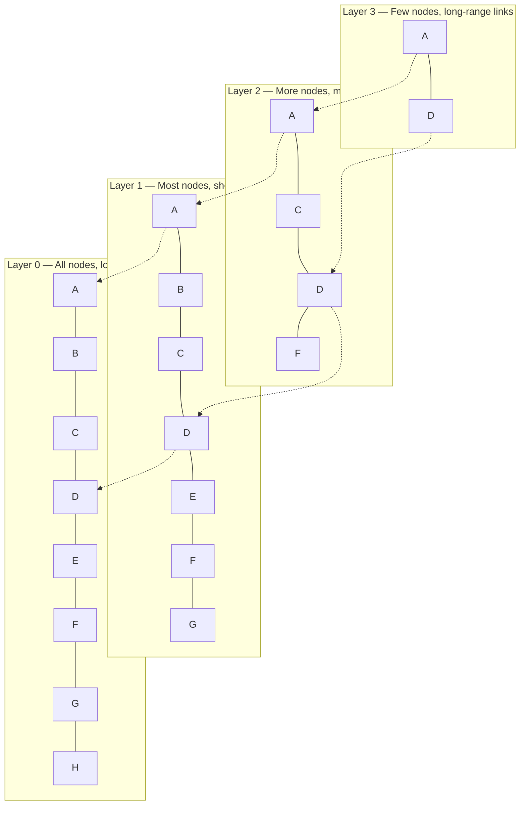
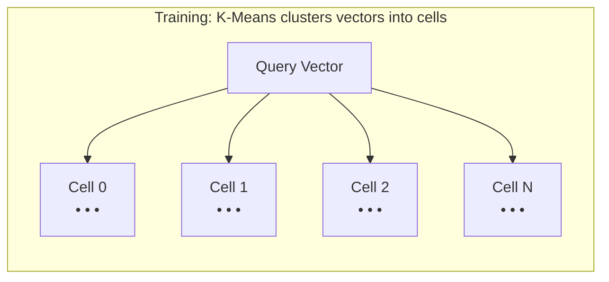
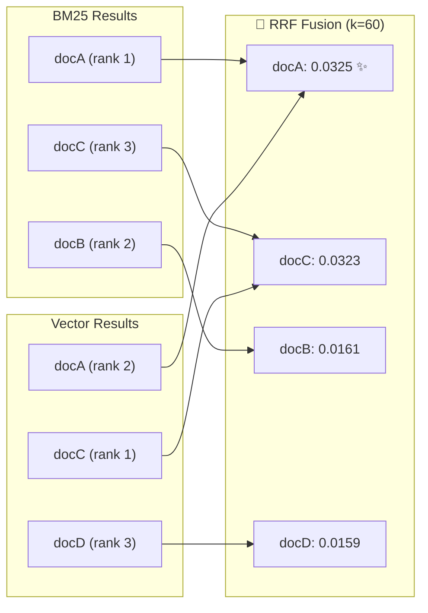

# 🧠 Core Concepts

> **The algorithms and data structures that make Spector blazingly fast.** This page explains HNSW, IVF-PQ, BM25, RRF, and SIMD acceleration — the building blocks behind sub-millisecond hybrid search.

---

## 🌐 HNSW (Hierarchical Navigable Small World)

HNSW is the primary index structure for approximate nearest neighbor (ANN) vector search. It builds a multi-layered graph where each node represents a vector, and edges connect similar vectors.

### 🔍 How It Works



**Search algorithm:**
1. Enter at the top layer's entry point
2. Greedily traverse to the closest node at each layer
3. Drop to the next layer, using the found node as the new entry
4. At layer 0, explore `efSearch` candidates to find top-K nearest neighbors

### ⚙️ Key Parameters

| Parameter | Default | Effect |
|-----------|---------|--------|
| `M` | 16 | Max connections per node. Higher = better recall, more memory |
| `efConstruction` | 200 | Build-time beam width. Higher = better graph quality, slower build |
| `efSearch` | 50 | Query-time beam width. Higher = better recall, slower query |

### 🚀 Why HNSW is Fast

- **Logarithmic complexity** — O(log N) layers mean search scales well

- **Greedy navigation** — Each step moves closer to the target

- **SIMD distance computation** — Every neighbor comparison uses hardware-accelerated vector math

- **Cache-friendly** — Graph traversal exhibits good spatial locality

### 💾 Persistence Format

Spector uses a page-aligned binary format for HNSW persistence:

```
[Header: 64 bytes]  → magic "SPHW", version, metadata
[Vector Region]     → 4KB-aligned float32 vectors (memory-mappable)
[Graph Region]      → Per-node adjacency lists
[ID Table]          → External ID ↔ internal offset mapping
```

> [!TIP]
> Loading is a single `mmap` syscall — no deserialization needed. Startup is instant regardless of index size.

---

## 🗜️ IVF-PQ (Inverted File with Product Quantization)

IVF-PQ enables billion-scale search with **32× memory compression**. It combines two techniques:

### 📊 IVF: Coarse Partitioning



Instead of comparing against all vectors, IVF narrows search to the `nprobe` nearest cells.

### 🧬 PQ: Product Quantization

PQ compresses each vector from full float32 to compact codes:

| Step | Data | Size |
|------|------|------|
| Original vector (384 dims) | `[0.12, 0.45, ..., 0.78]` | 1,536 bytes |
| Split into 16 subspaces | `[sub1] [sub2] ... [sub16]` | — |
| Each quantized to 1 byte | `[42] [187] [3] ... [201]` | **16 bytes** |
| **Compression ratio** | | **96×** |

> [!IMPORTANT]
> At 32 subspaces with 256 centroids, you get **32× compression** while maintaining recall@10 ≥ 80%.

### ⚡ ADC (Asymmetric Distance Computation)

During search, PQ uses lookup tables instead of full distance computation:

1. Pre-compute distances from query to all 256 centroids per subspace (256 × 32 = 8,192 lookups)
2. For each compressed vector, sum up table lookups (32 additions per vector)
3. This is orders of magnitude faster than full float32 distance

---

## 📝 BM25 (Best Matching 25)

BM25 is the keyword scoring algorithm used for text search. It extends TF-IDF with term saturation and document length normalization.

### 📐 Scoring Formula

```
score(D, Q) = Σ IDF(qi) × (tf(qi, D) × (k1 + 1)) / (tf(qi, D) + k1 × (1 - b + b × |D|/avgdl))
```

| Variable | Meaning |
|----------|---------|
| `tf(qi, D)` | Term frequency of query term qi in document D |
| `IDF(qi)` | Inverse document frequency (how rare the term is) |
| `\|D\|` | Document length |
| `avgdl` | Average document length across corpus |
| `k1` | Term frequency saturation (default: 1.2) |
| `b` | Length normalization factor (default: 0.75) |

### ⚙️ Key Parameters

| Parameter | Default | Effect |
|-----------|---------|--------|
| `k1` | 1.2 | Controls how quickly term frequency saturates. Lower = faster saturation |
| `b` | 0.75 | Controls document length penalty. 0 = no normalization, 1 = full |

### 🚀 Spector's BM25 Implementation

| Optimization | Benefit |
|-------------|---------|
| `float[]` scoring | Raw float arrays for max throughput |
| Min-heap top-K | Only tracks best K results (no full sort) |
| Virtual-thread parallel terms | Multi-term queries score in parallel |

**Result:** 0.60 ms avg at 100K docs — faster than Elasticsearch's BM25.

---

## 🧬 Reciprocal Rank Fusion (RRF)

RRF combines ranked results from multiple search methods into a single unified ranking.

### 📐 Formula

```
RRF_score(d) = Σ 1 / (k + rank_i(d))
```

Where `k` = 60 (default fusion constant) and `rank_i(d)` = rank of document d in the i-th result list.

### 💡 Example



### ✅ Why RRF Works

- **Rank-based, not score-based** — Avoids normalization issues between different scoring methods

- **Resistant to outliers** — A high score in one system can't dominate

- **Parameter-light** — Only one tunable constant (k)

- **Empirically strong** — Competitive with learned fusion methods

---

## ⚡ SIMD Acceleration via Java Vector API

Spector uses the Java Vector API (`jdk.incubator.vector`) to execute vector math on hardware SIMD lanes.

### 🔬 How It Works

```java
// Traditional scalar loop (1 operation per cycle):
for (int i = 0; i < dim; i++) {
    sum += a[i] * b[i];
}

// SIMD vectorized (8-16 operations per cycle):
var species = FloatVector.SPECIES_PREFERRED;  // AVX2=8, AVX-512=16
for (int i = 0; i < dim; i += species.length()) {
    var va = FloatVector.fromArray(species, a, i);
    var vb = FloatVector.fromArray(species, b, i);
    sum = va.fma(vb, sum);  // Fused multiply-add
}
```

### 🎯 Supported Kernels

| Kernel | Operation | Used By |
|--------|-----------|---------|
| Dot Product | `Σ(a[i] × b[i])` | Vector similarity (DOT_PRODUCT mode) |
| Cosine Similarity | `dot(a,b) / (‖a‖ × ‖b‖)` | Vector similarity (COSINE mode) |
| Euclidean Distance | `√Σ(a[i] - b[i])²` | Vector similarity (EUCLIDEAN mode) |
| Vector Ops | Norm, normalize, quantize | Internal utilities |

### 🖥️ Hardware Adaptation

The Vector API automatically selects the best SIMD width for your hardware:

| ISA | Width | Lanes (float32) | Platform |
|-----|-------|-----------------|----------|
| AVX2 | 256-bit | 8 | Most modern x86 CPUs |
| AVX-512 | 512-bit | 16 | Intel Xeon, recent AMD |
| NEON | 128-bit | 4 | Apple Silicon, ARM servers |

### 📊 Performance Impact

SIMD kernels achieve sub-microsecond latency:

| Dimension | Dot Product P50 | Cosine P50 |
|-----------|----------------|-----------| 
| 32 | 200 ns | 1,100 ns |
| 128 | <100 ns | <100 ns |
| 384 | ~100 ns | ~100 ns |
| 768 | ~100 ns | ~100 ns |

> [!NOTE]
> Values at 128+ dimensions are at `System.nanoTime()` resolution floor. JMH confirms millions of ops/sec throughput.

### 🎨 Design Principles

- **Never hardcode lane widths** — Always use `FloatVector.SPECIES_PREFERRED`

- **Branchless tail handling** — Use `VectorMask` for dimensions not divisible by lane count

- **Zero allocations in hot path** — Reuse buffers, slice-based APIs

- **Fused multiply-add** — Use FMA where available for accuracy and speed

---

## 🔗 See Also

- [Architecture Overview](overview.md) — How these components fit together

- [GPU Acceleration](gpu-acceleration.md) — CUDA kernels for batch operations

- [Performance Tuning](../operations/performance-tuning.md) — How to tune these parameters

- [Configuration Guide](../configuration/parameters.md) — All parameter defaults and ranges