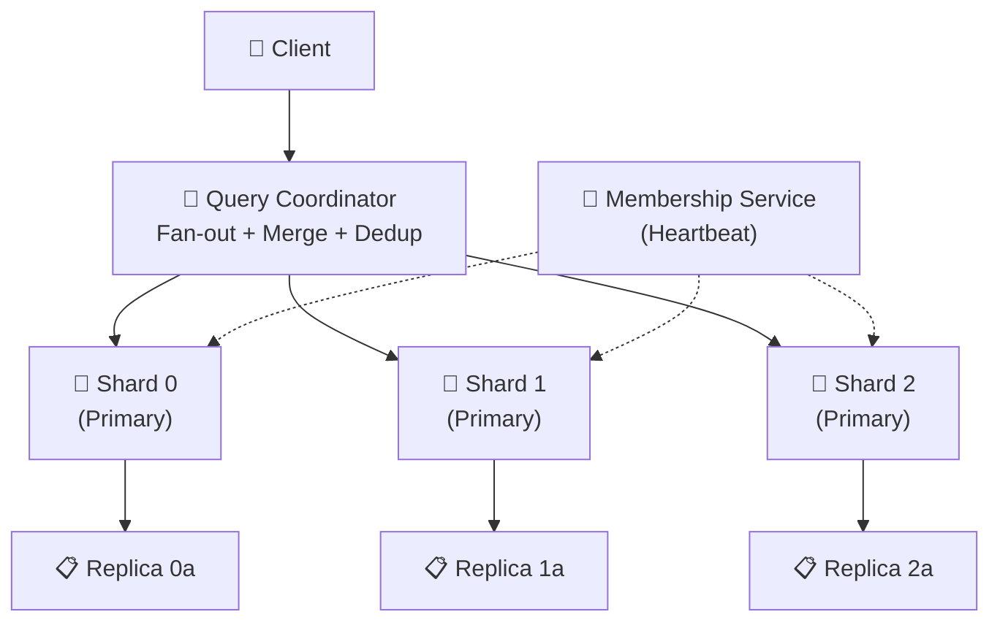
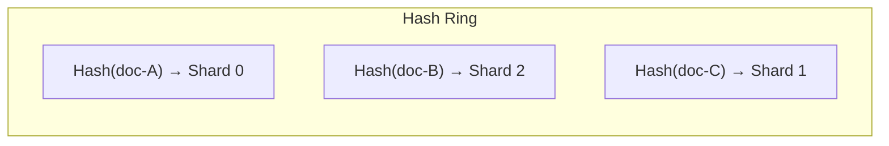
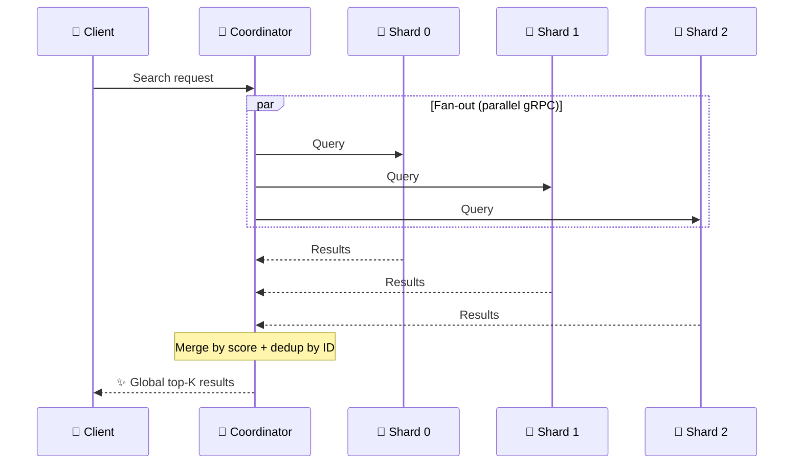
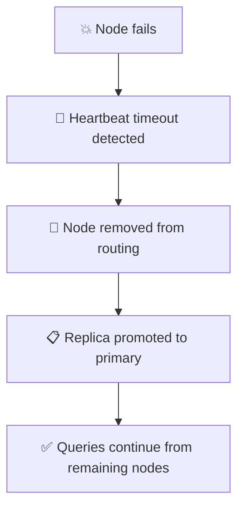
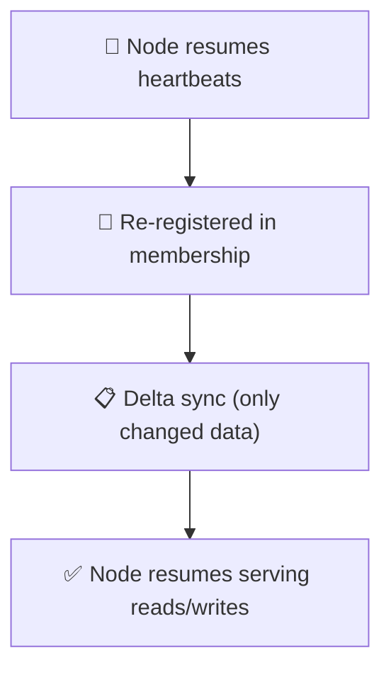

# 🌐 Distributed Mode

> **Scale Spector Search horizontally across multiple nodes.** The distributed architecture uses consistent hash sharding, configurable replication, heartbeat-based membership, and parallel query fan-out with result merging via gRPC.

---

## 🏗️ Architecture Overview



---

## 🧩 Components

### 🔑 Shard Manager

The `ConsistentHashShardManager` distributes documents across shards using consistent hashing on document IDs.



**Properties:**
- Each shard owns a range on a hash ring (using virtual nodes for even distribution)
- Document ID → hash → ring position → assigned shard (deterministic)
- Adding a shard migrates only affected documents (minimal data movement)
- Shard count changes apply without full cluster restart

---

### 📋 Replication Manager

Each shard maintains configurable replicas for fault tolerance.

| Behavior | Details |
|----------|---------|
| Writes | Go to primary, replicate to all replicas within 2s |
| Reads | Served from any fully-synchronized replica |
| Primary failure | Replica promoted within 10 seconds |
| Recovery | Delta sync only (data changed since failure) |

---

### 💓 Membership Service

Heartbeat-based cluster membership tracking.

| Parameter | Default | Range |
|-----------|---------|-------|
| `heartbeatInterval` | 2s | 500ms–30s |
| `heartbeatTimeout` | 10s | 3s–120s |

**Behavior:**
- Nodes send periodic heartbeats to announce liveness
- Missing heartbeats beyond timeout → node marked unavailable
- New nodes trigger shard rebalancing within 5 seconds
- All active nodes converge to the same membership view within 5 seconds

---

### 🧭 Query Coordinator



> [!NOTE]
> If some shards timeout, the coordinator returns **partial results** from responding shards plus metadata indicating which shards were unreachable.

---

## 🚀 Deployment Guide

### Prerequisites

- All nodes must run the same Spector Search version
- Nodes must be reachable via gRPC (default port: 9090)
- Network latency between nodes should be <10ms for optimal performance

### Starting a Cluster

**Node 1 (seed node):**

```bash
java -jar spector-server.jar \
  --cluster-mode \
  --node-id node-1 \
  --grpc-port 9090 \
  --shard-count 4 \
  --replica-count 2 \
  --seeds node-1:9090
```

**Node 2:**

```bash
java -jar spector-server.jar \
  --cluster-mode \
  --node-id node-2 \
  --grpc-port 9090 \
  --shard-count 4 \
  --replica-count 2 \
  --seeds node-1:9090
```

**Node 3:**

```bash
java -jar spector-server.jar \
  --cluster-mode \
  --node-id node-3 \
  --grpc-port 9090 \
  --shard-count 4 \
  --replica-count 2 \
  --seeds node-1:9090
```

### ✅ Verifying Cluster Health

```bash
curl http://node-1:7070/api/v1/status
```

```json
{
  "status": "RUNNING",
  "clusterMode": true,
  "activeNodes": 3,
  "shardCount": 4,
  "replicaCount": 2,
  "topology": {
    "node-1": {"status": "ACTIVE", "shards": [0, 1]},
    "node-2": {"status": "ACTIVE", "shards": [2, 3]},
    "node-3": {"status": "ACTIVE", "shards": ["0-replica", "2-replica"]}
  }
}
```

### 🔒 gRPC TLS Setup

For production deployments, enable TLS on gRPC communication:

```bash
java -jar spector-server.jar \
  --cluster-mode \
  --grpc-port 9090 \
  --grpc-tls \
  --grpc-cert /path/to/cert.pem \
  --grpc-key /path/to/key.pem \
  --grpc-ca /path/to/ca.pem
```

---

## 🛡️ Failure Scenarios

### 💥 Node Failure



### 🔄 Node Recovery



### 🌐 Network Partition

- Nodes on each side continue serving their local shards
- Queries to unreachable shards return partial results with timeout metadata
- When partition heals, membership reconverges and replicas sync

---

## 📈 Scaling Guidelines

| Cluster Size | Shards | Documents | Estimated Throughput |
|-------------|--------|-----------|---------------------|
| 2 nodes | 2–4 | Up to 500K | ~40K QPS |
| 4 nodes | 4–8 | Up to 2M | ~80K QPS |
| 8 nodes | 8–16 | Up to 5M | ~150K QPS |
| 16 nodes | 16–32 | Up to 10M | ~250K QPS |

> [!TIP]
> Throughput estimates assume 128-dim vectors, top-10, hybrid search. Actual results depend on hardware and query complexity.

---

## 🔗 See Also

- [Architecture Overview](overview.md) — Overall system architecture
- [Configuration Guide](../configuration/parameters.md) — Cluster parameters
- [Performance Tuning](../operations/performance-tuning.md) — Optimizing distributed performance
