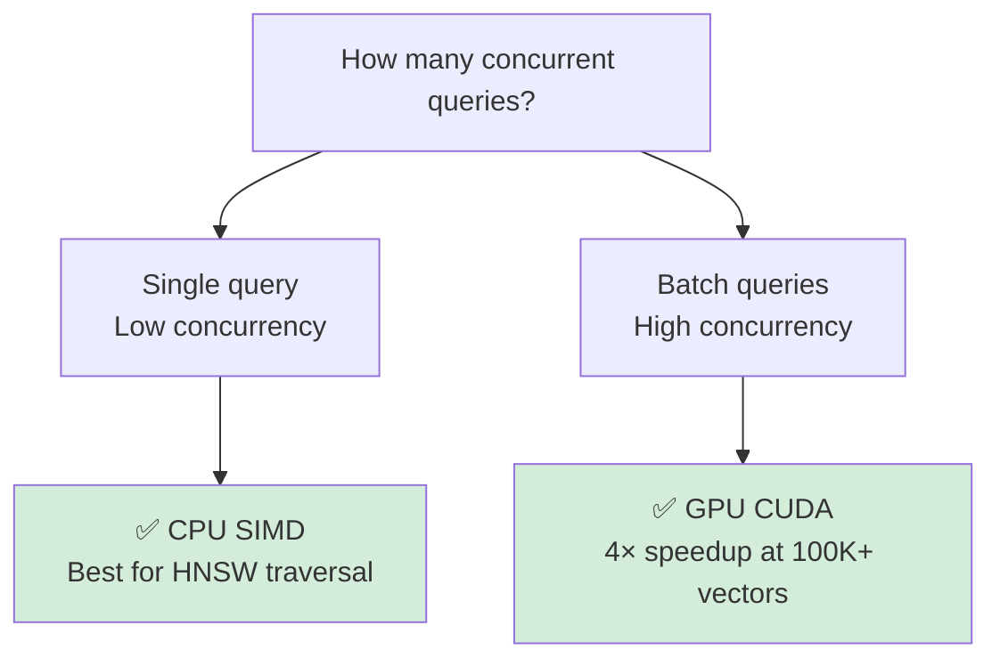
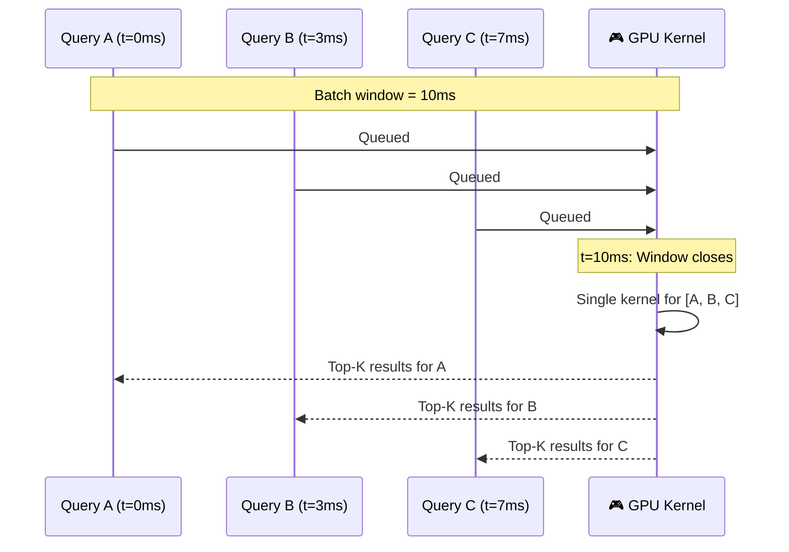
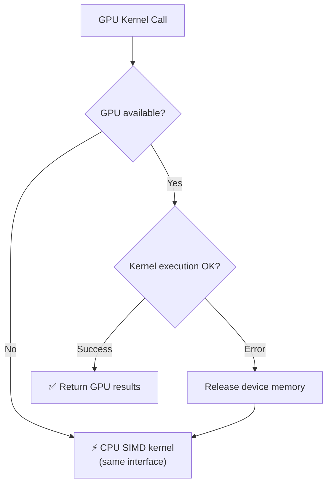

# 🎮 GPU Acceleration

> **Unlock massive parallel throughput with optional CUDA GPU acceleration.** Spector loads GPU kernels via Panama FFM (Foreign Function & Memory), maintaining the zero-JNI philosophy. GPU shines for batch workloads — single queries are already sub-millisecond on CPU SIMD.

---

## 🎯 When to Use GPU



| Scenario | Recommendation |
|----------|---------------|
| ✅ Batch search (multiple queries at once) | GPU |
| ✅ Large collections (>100K vectors) | GPU |
| ✅ High concurrency (many simultaneous users) | GPU |
| ✅ Brute-force similarity over IVF partitions | GPU |
| ⚡ Single queries | CPU SIMD |
| ⚡ Small datasets (<10K vectors) | CPU SIMD |
| ⚡ Ultra-low latency (<0.1ms) | CPU SIMD |

---

## 📋 Requirements

### Hardware

- NVIDIA GPU with Compute Capability ≥ 7.0 (Volta or newer)

- Recommended: RTX 3060+ or A100/H100 for production workloads

### Software

| Component | Version | Notes |
|-----------|---------|-------|
| CUDA Toolkit | 12.x | Runtime libraries required |
| NVIDIA Driver | 525+ | Must match CUDA version |
| JDK | 25+ | With Panama FFM support |

### 🐧 Installation (Linux)

```bash
# Install CUDA toolkit
wget https://developer.download.nvidia.com/compute/cuda/repos/ubuntu2204/x86_64/cuda-keyring_1.1-1_all.deb
sudo dpkg -i cuda-keyring_1.1-1_all.deb
sudo apt update
sudo apt install cuda-toolkit-12-4

# Verify
nvidia-smi
nvcc --version
```

### ✅ Verify Spector GPU Detection

```bash
curl http://localhost:7070/api/v1/status
```
```json
{
  "gpuAvailable": true,
  "gpuInfo": "NVIDIA RTX 4090, 24GB, CUDA 12.4"
}
```

---

## ⚙️ Configuration

```java
var config = SpectorConfig.DEFAULT
    .withDimensions(384)
    .withGpu(true)
    .withGpuMemoryBudget(2048);  // 2 GB
```

| Parameter | Default | Range | Description |
|-----------|---------|-------|-------------|
| `gpuEnabled` | false | — | Enable CUDA acceleration |
| `gpuMemoryBudget` | 256 MB | 256 MB – GPU max | Maximum device memory |
| `gpuBatchWindow` | 10 ms | 1–100 ms | Batching window for query collection |
| `gpuMaxBatchSize` | 1024 | 1–1024 | Max queries per kernel launch |

> [!TIP]
> Set `gpuMemoryBudget` to ~70% of available GPU memory to leave room for other processes.

---

## 🔬 GPU Kernels

### Dot Product Kernel

Computes dot-product similarity between a query vector and a batch of document vectors.

| Property | Value |
|----------|-------|
| Input | query (float32[D]) + database (float32[N × D]) |
| Output | similarity scores (float32[N]) |
| Dimensions | Multiples of 32, range 32–2048 |
| Batch size | 1–1,000,000 vectors per invocation |
| Tolerance | ≤1e-5 absolute error vs CPU SIMD |

### Cosine Similarity Kernel

Computes cosine similarity with cached norm computation.

| Optimization | Benefit |
|-------------|---------|
| Pre-computes norms | Cached across queries |
| Detects pre-normalized vectors | Skips norm computation |
| Falls back to dot product | For normalized inputs |
| Tolerance | ≤1e-6 vs CPU SIMD |

### HNSW Candidate Distance Kernel

Computes distances for HNSW graph traversal candidates — optimized for the small-batch, repeated-invocation pattern of HNSW search.

| Property | Value |
|----------|-------|
| Input | query (float32[D]) + candidates (float32[K × D]) |
| Output | distances/similarities (float32[K]) |
| Metrics | Cosine similarity and L2 squared distance |
| Batch size | 10–200 candidates (typical HNSW hop) |
| GPU threshold | ≥32 candidates (below: CPU SIMD faster) |

### SVASQ Quantized Distance Kernel

Asymmetric distance computation on SVASQ INT8-quantized vectors — the highest-throughput kernel since it operates on Spector's actual storage format.

| Property | Value |
|----------|-------|
| Input | qTilde (float32[D]) + codes (int8[N × D]) + norms (float16[N]) |
| Output | distances (float32[N]) |
| Metrics | L2 (≈ normSq + constL2Q - 2·dot) and Inner Product (≈ dot + offset) |
| GPU threshold | ≥1024 vectors |
| Formula | Matches `SvasqSimdKernel` exactly |

> [!TIP]
> The SVASQ kernel operates on INT8 codes directly — no dequantization to float32. This gives 4× memory bandwidth savings compared to the float32 batch kernels, enabling even larger batches in GPU memory.

### ⏱️ Batch GPU Search



**Properties:**

- Each query receives its own independent top-K results

- Individual query errors don't fail the batch

- Achieves ≥2× throughput vs sequential for batch sizes >4

- Large batches are automatically partitioned to fit GPU memory

---

## 💾 Memory Management

The `GpuMemoryManager` handles device memory via Panama FFM:

```java
// Allocation tied to Arena lifecycle
try (Arena arena = Arena.ofConfined()) {
    MemorySegment deviceMem = gpuMemoryManager.allocateDevice(sizeBytes, arena);
    // Use device memory...
} // Automatically freed when arena closes
```

**Key behaviors:**

- ✅ Allocations are Arena-scoped with explicit lifecycle

- ✅ Pinned host memory for efficient host↔device transfers

- ✅ Budget enforcement prevents over-allocation

- ✅ Device memory released within 100ms of Arena close

- ✅ Metrics available via monitoring API

---

## 🔄 Fallback Behavior



> [!NOTE]
> **No code changes required.** The same method signature returns results regardless of whether GPU or CPU executed the computation. Fallback is automatic and transparent.

**Fallback triggers:**

- GPU not detected at startup

- CUDA driver not installed

- Insufficient GPU memory

- CUDA kernel execution error

- GPU memory budget exceeded

---

## 📊 Performance Characteristics

### Single Query (CPU wins)

| Method | 100K vectors, 384-dim |
|--------|----------------------|
| ⚡ CPU SIMD (AVX2) | ~0.05 ms |
| 🎮 GPU (kernel launch overhead) | ~0.5–1 ms |

### Batch Queries (GPU shines)

| Batch Size | CPU SIMD | GPU (resident) | GPU Speedup |
|-----------|----------|----------------|-------------|
| 10K | 0.35 ms | 0.21 ms | **1.7×** |
| 100K | 9.13 ms | 2.24 ms | **4.1×** |
| 500K | 45.75 ms | 11.31 ms | **4.0×** |
| 1M | 90.77 ms | 22.09 ms | **4.1×** |

> [!IMPORTANT]
> GPU acceleration benchmarked on RTX 4060 Ti 16GB, 384-dim vectors, with database persistently resident in VRAM. The one-time upload cost is ~464ms for 1M vectors (1.5GB). Per-query cost only includes uploading the query vector (~1.5KB) and downloading results. GPU provides consistent 4× speedup for brute-force search at scale.

---

## 🔧 Troubleshooting

| Symptom | Cause | Solution |
|---------|-------|----------|
| `gpuAvailable: false` | CUDA not installed | Install CUDA toolkit, verify `nvidia-smi` |
| Slow GPU queries | Small batch sizes | Increase `gpuBatchWindow` or disable GPU |
| Out of GPU memory | Budget too low | Increase `gpuMemoryBudget` |
| CPU fallback always used | Native access not enabled | Add `--enable-native-access=ALL-UNNAMED` |

### JVM Arguments for GPU

```bash
java --add-modules jdk.incubator.vector \
     --enable-native-access=ALL-UNNAMED \
     -jar spector-node.jar
```

---

## 🔗 See Also

- [Core Concepts](core-concepts.md) — SIMD kernels that GPU extends

- [Performance Tuning](../operations/performance-tuning.md) — When to use GPU vs CPU

- [Configuration Guide](../configuration/parameters.md) — GPU parameters

- [Architecture Overview](overview.md) — Where GPU fits in the system