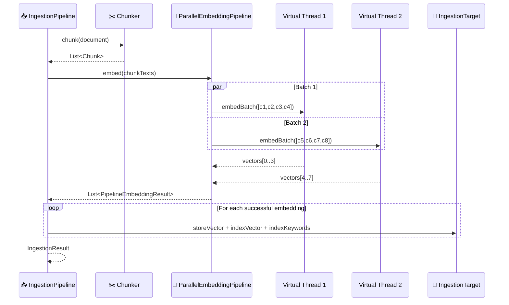

# 📥 Ingestion Pipeline

> **Standalone ingestion orchestration: document → chunk → embed → store → index.** The `spector-ingestion` module handles the full ingestion flow using virtual threads for parallel embedding, with no reactive framework overhead.

---

## Module: `spector-ingestion`

The ingestion pipeline is a standalone module that decouples document processing from the engine facade. It can be used directly for bulk offline ingestion, real-time pipelines, or custom ingestion flows.

**Key classes:**

| Class | Purpose |
|-------|---------|
| `IngestionPipeline` | Main orchestrator — coordinates chunk → embed → store |
| `IngestionTarget` | Abstraction for store/index writes |
| `IngestionResult` | Outcome with chunk counts, failures, timing |

---

## 🔄 Pipeline Flow


---

## 🏗️ Architecture

### Decoupled from the Engine

The `IngestionTarget` interface abstracts the underlying storage and indexing:

```java
public interface IngestionTarget {
    int storeVector(String id, float[] vector);
    void storeDocument(String id, String title, String content);
    void indexVector(String id, int storeIndex, float[] vector);
    void indexKeywords(String id, String content);
}
```

This means the pipeline doesn't depend on `SpectorEngine` — it can write to any target that implements this interface. Useful for:


- **Testing** — Mock the target for unit tests

- **Rebuilding indexes** — Point at a fresh index during reindexing

- **Multi-tenant setups** — Route documents to different targets

- **Custom stores** — Write to external systems alongside Spector

### Virtual Thread Parallelism

Embedding calls (I/O-bound, network) run in parallel using the `ParallelEmbeddingPipeline`:



> [!NOTE]
> CPU-bound work (chunking, keyword tokenization, SIMD index insertion) runs synchronously on the caller's virtual thread. Only the embedding I/O call is parallelized. This avoids context-switch overhead on hot paths.

---

## 📋 Ingestion Modes

### Single Document (with vector)

```java
var pipeline = new IngestionPipeline(target, embeddingProvider);
IngestionResult result = pipeline.ingest("doc-1", "Hello world", precomputedVector);
```

### Single Document (auto-embed)

```java
IngestionResult result = pipeline.ingest("doc-1", "Hello world");
// Automatically embeds via configured provider
```

### Chunked Ingestion (auto-embed)

For large documents that exceed embedding model token limits:

```java
IngestionResult result = pipeline.ingestChunked("doc-1", longDocumentText);
// Splits into chunks, embeds in parallel, stores each chunk
```

### Token-Level Chunking

For precise token-limit compliance:

```java
IngestionResult result = pipeline.ingestTokenChunked("doc-1", text, 512, 50);
// 512 tokens per chunk, 50 token overlap
```

### Streaming File Ingestion

For multi-GB files that can't fit in memory:

```java
IngestionResult result = pipeline.ingestFile(
    Path.of("corpus.txt"), "corpus", 512, 64);
// Bounded memory: only ~2× chunkSize held at once
```

### Custom Chunker Configuration

```java
var chunker = new TextChunker(1024, 128);  // larger chunks, more overlap
IngestionResult result = pipeline.ingestChunked("doc-1", text, chunker);
```

### Batch Ingestion

```java
List<IngestionResult> results = pipeline.ingestBatch(ids, contents, vectors);
```

---

## 📊 Result Tracking

Every ingestion operation returns an `IngestionResult`:

```java
public record IngestionResult(
    String documentId,
    int chunksStored,
    List<String> failures,  // chunk IDs that failed
    long durationMs
) {}
```

**Properties:**

- Failed chunks don't halt the pipeline — other chunks continue

- Failure reasons are logged at WARN level

- `isFullSuccess()` returns true only if all chunks succeeded

- Timing includes chunking + embedding + storage

---

## ⚡ Design Decisions

### Why not Reactor?

The pipeline uses virtual threads instead of Project Reactor because:

| Concern | Virtual Threads | Reactor |
|---------|----------------|---------|
| Embedding I/O | Native async via VT | Requires `Mono.fromCallable` wrapping |
| Error handling | try/catch, intuitive | `onErrorResume` chains |
| Debugging | Normal stack traces | Operator assembly traces |
| Testing | Standard JUnit | `StepVerifier` complexity |
| Dependencies | Zero (JDK only) | reactor-core + reactor-netty |

### Why a separate module?

Extracting ingestion from `SpectorEngine`:

1. **Testability** — Pipeline can be unit-tested with a mock `IngestionTarget`
2. **Reusability** — Bulk ingestion tools don't need the full engine
3. **Clarity** — Ingestion logic is isolated from search/lifecycle concerns
4. **Extensibility** — Custom pipelines can compose different chunkers/embedders

---

## 🔗 See Also


- [RAG Pipeline](rag-pipeline.md) — Retrieval and context assembly

- [Architecture Overview](overview.md) — Module dependency graph

- [REST API Reference](../api-reference/rest-endpoints.md) — Ingest endpoints

- [Configuration Guide](../configuration/parameters.md) — Chunking and embedding parameters
