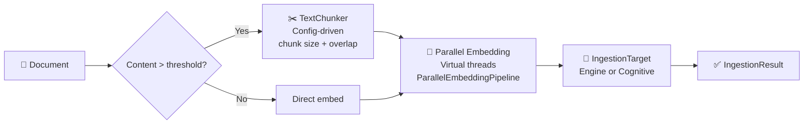
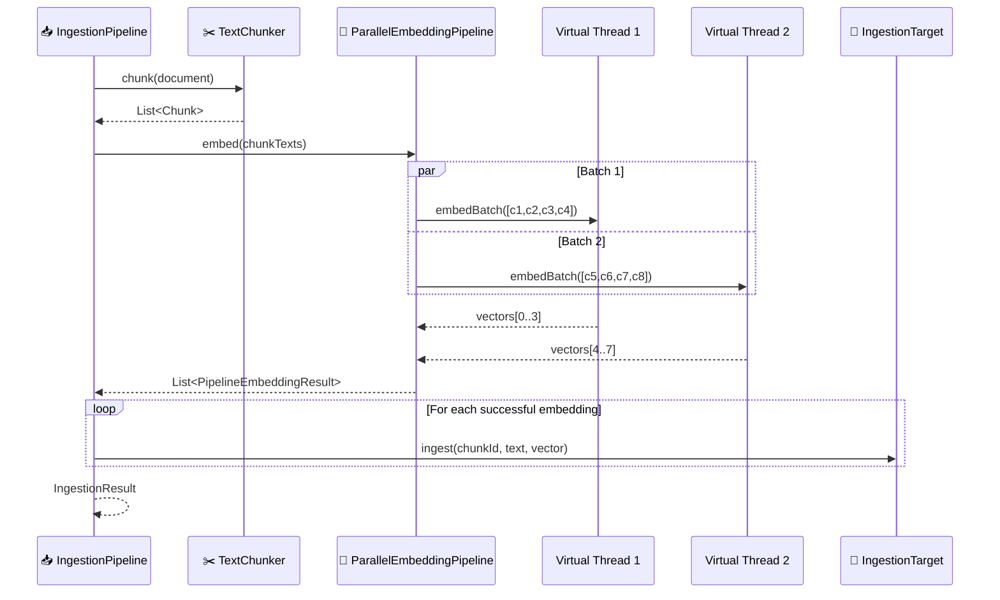

# 📥 Ingestion Pipeline

> **Unified ingestion: document → chunk → embed → target.** A single `IngestionPipeline` with builder configuration handles all ingestion — for both search engine and cognitive memory. The pipeline decides how to process content; the `IngestionTarget` decides where to store it.

---

## Architecture

All entry points (CLI, MCP, Server) route ingestion through `SpectorRuntime`:

```
CLI/MCP/Server → SpectorRuntime.ingestion() → IngestionHandler → IngestionPipeline
                                                                        │
                                                                  ┌─────┴─────┐
                                                                  ▼           ▼
                                                       EngineIngestionTarget  CognitiveIngestionTarget
                                                       (SEARCH mode)          (MEMORY mode)
```

- **`IngestionPipeline`** (in `spector-ingestion`) — unified chunk → embed → store orchestrator with builder pattern
- **`IngestionTarget`** (in `spector-ingestion`) — abstraction for storage backends (engine or memory)
- **`IngestionHandler`** (in `spector-runtime`) — thin routing layer over the pipeline
- **`FileDiscoveryService`** (in `spector-ingestion`) — pure file discovery + title extraction utility

## Module: `spector-ingestion`

The ingestion module is a **low-level utility** with no dependency on engine, runtime, or memory. It defines the pipeline and the `IngestionTarget` interface that downstream modules implement.

**Key classes:**

| Class | Purpose |
|-------|---------|
| `IngestionPipeline` | Builder-configured orchestrator — chunk → embed → store |
| `IngestionTarget` | Interface for storage backends (`ingest(id, text, vector)`) |
| `IngestionResult` | Outcome with chunk counts, failures, timing |
| `FileDiscoveryService` | File discovery, title extraction, config-driven filtering |

---

## 🔄 Pipeline Flow



---

## 🏗️ Builder Pattern

The pipeline is configured once via a builder, then reused for all ingestion in a session:

```java
// Read chunking config from spector.yml
var ingestionConfig = SpectorConfigFactory.ingestionDefaults(props);

var pipeline = IngestionPipeline.builder()
    .target(engineTarget)                    // or cognitiveTarget
    .embeddingProvider(embedder)             // for auto-embedding
    .chunking(new TextChunker(
        ingestionConfig.chunkSize(),
        ingestionConfig.chunkOverlap()))
    .chunkThreshold(ingestionConfig.chunkSize())
    .build();
```

The pipeline automatically selects a strategy based on content:

| Content | Strategy | Description |
|---------|----------|-------------|
| ≤ threshold | **Direct** | Embed whole text, store as single doc |
| > threshold | **Chunked** | Split via `TextChunker`, embed in parallel, store each chunk |
| Pre-embedded | **Passthrough** | Skip embedding, store vector directly |
| File path | **Streaming** | `StreamingChunker` for bounded-memory processing |

---

## 🎯 IngestionTarget Interface

The pipeline is decoupled from storage — it writes to any `IngestionTarget`:

```java
public interface IngestionTarget {
    void ingest(String id, String text, float[] vector);

    default void storeParentMetadata(String parentId, int chunkCount) {}
    default void onBatchComplete() {}
}
```

### Implementations

| Target | Module | What it does |
|--------|--------|-------------|
| `EngineIngestionTarget` | `spector-engine` | VectorStore → VectorIndex (HNSW/IVF/Spectrum) → KeywordIndex (BM25) |
| `CognitiveIngestionTarget` | `spector-memory` | Synaptic tags → Surprise detection → ICNU fusion → Quantize → Tier route → WAL |

This decoupling enables:

- **Testing** — Mock the target for unit tests
- **Rebuilding indexes** — Point at a fresh index during reindexing
- **Multi-tenant setups** — Route documents to different targets
- **Custom stores** — Write to external systems alongside Spector

### Virtual Thread Parallelism

Embedding calls (I/O-bound, network) run in parallel using the `ParallelEmbeddingPipeline`:



> [!NOTE]
> CPU-bound work (chunking, keyword tokenization, SIMD index insertion) runs synchronously on the caller's virtual thread. Only the embedding I/O call is parallelized. This avoids context-switch overhead on hot paths.

---

## 📋 Ingestion Modes

### Text Ingestion (auto-chunked)

```java
// Pipeline decides whether to chunk based on content length vs. threshold
IngestionResult result = pipeline.ingest("doc-1", longDocumentText);
```

### Pre-embedded (skip embedding)

```java
// For pre-computed vectors — no chunking, no embedding
IngestionResult result = pipeline.ingest("doc-1", "Hello world", precomputedVector);
```

### Streaming File Ingestion

For multi-GB files that can't fit in memory:

```java
IngestionResult result = pipeline.ingest(
    Path.of("corpus.txt"), "corpus");
// Bounded memory: only ~2× chunkSize held at once via StreamingChunker
```

---

## 📊 Result Tracking

Every ingestion operation returns an `IngestionResult`:

```java
public record IngestionResult(
    String documentId,
    int chunksStored,
    List<String> failures,  // chunk IDs that failed
    long durationMs
) {}
```

**Properties:**

- Failed chunks don't halt the pipeline — other chunks continue
- Failure reasons are logged at WARN level
- `isFullSuccess()` returns true only if all chunks succeeded
- Timing includes chunking + embedding + storage

---

## 🧠 Cognitive Target Pipeline

When the `CognitiveIngestionTarget` receives a chunk from the unified pipeline, it executes the cognitive processing steps:

```
IngestionPipeline                        CognitiveIngestionTarget
    │                                           │
    │  ingest(id, text, vector)                 │
    ├──────────────────────────────────────────► │
    │                                           ├── 2. Encode synaptic tags (Bloom filter)
    │                                           ├── 3. Compute surprise (Dopamine)
    │                                           ├── 3b. ICNU fusion (if hints provided)
    │                                           ├── 4. Flashbulb check (extreme surprise)
    │                                           ├── 5. Quantize to INT8
    │                                           ├── 6. Build cognitive header
    │                                           ├── 7. Write to tier store
    │                                           ├── 8. Register in MemoryIndex
    │                                           └── 9. WAL append
```

`SpectorMemory.remember()` calls `CognitiveIngestionTarget.ingestCognitive()` directly with full cognitive parameters (type, tags, source, ICNU hints).

---

## ⚡ Design Decisions

### Why not Reactor?

The pipeline uses virtual threads instead of Project Reactor because:

| Concern | Virtual Threads | Reactor |
|---------|----------------|---------|
| Embedding I/O | Native async via VT | Requires `Mono.fromCallable` wrapping |
| Error handling | try/catch, intuitive | `onErrorResume` chains |
| Debugging | Normal stack traces | Operator assembly traces |
| Testing | Standard JUnit | `StepVerifier` complexity |
| Dependencies | Zero (JDK only) | reactor-core + reactor-netty |

### Why a unified pipeline?

Consolidating from 3 separate ingestion paths:

1. **Single code path** — Same chunking + embedding logic for search and memory
2. **Config-driven** — Chunk size, overlap, threshold all read from `spector.yml`
3. **No OOM** — Streaming chunker ensures bounded memory for large files
4. **Extensible** — New targets only need to implement `IngestionTarget.ingest()`

### Why a separate module?

Extracting ingestion from `SpectorEngine`:

1. **Testability** — Pipeline can be unit-tested with a mock `IngestionTarget`
2. **Reusability** — Bulk ingestion tools don't need the full engine
3. **Clarity** — Ingestion logic is isolated from search/lifecycle concerns
4. **Extensibility** — Custom pipelines can compose different chunkers/embedders

---

## 🔗 See Also

- [RAG Pipeline](rag-pipeline.md) — Retrieval and context assembly
- [Architecture Overview](overview.md) — Module dependency graph
- [REST API Reference](../api-reference/rest-endpoints.md) — Ingest endpoints
- [Configuration Guide](../configuration/parameters.md) — Chunking and embedding parameters
