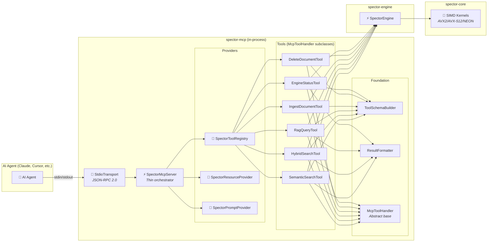
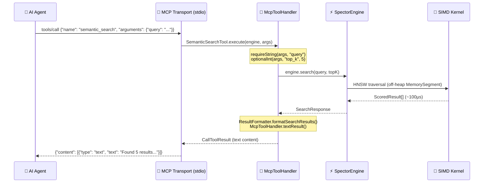

# 🤖 MCP Integration Architecture

> **Spector's built-in Model Context Protocol (MCP) server gives any AI agent instant, in-process access to SIMD-accelerated vector search — with zero network overhead.**

---

## Overview

The [Model Context Protocol (MCP)](https://modelcontextprotocol.io/) is Anthropic's open standard for connecting AI agents to external data sources. Instead of writing custom Python glue-code with orchestration frameworks, agents connect directly to an MCP server via JSON-RPC and autonomously invoke tools.

**Spector's MCP server runs in-process.** When Claude Desktop or Cursor calls `semantic_search`, the request goes from JSON-RPC → Java method call → SIMD kernel — never touching a network socket. This makes Spector **100× faster than Python-based MCP servers** that route through HTTP/gRPC.

---

## Architecture



### Data Flow



---

## Module Structure

```
spector-mcp/src/main/java/com/spectrayan/spector/mcp/
├── SpectorMcpServer.java          ← Thin orchestrator (assembly only)
├── SpectorMcpMain.java            ← CLI entry point
├── schema/
│   └── ToolSchemaBuilder.java     ← Type-safe fluent builder for JSON schemas
├── tools/
│   ├── McpToolHandler.java        ← Abstract base with timing, error handling
│   ├── SpectorToolRegistry.java   ← Tool discovery & registration
│   ├── SemanticSearchTool.java    ← Individual tool implementations
│   ├── HybridSearchTool.java
│   ├── RagQueryTool.java
│   ├── IngestDocumentTool.java
│   ├── DeleteDocumentTool.java
│   └── EngineStatusTool.java
├── resources/
│   └── SpectorResourceProvider.java   ← Resource definitions & handlers
├── prompts/
│   └── SpectorPromptProvider.java     ← Prompt templates & handlers
└── util/
    └── ResultFormatter.java           ← Search result formatting utilities
```

---

## Tool Reference

### `semantic_search`

Performs semantic similarity search using vector embeddings. Requires an embedding provider (e.g., Ollama) to be configured.

| Parameter | Type | Required | Default | Description |
|:---|:---|:---|:---|:---|
| `query` | string | ✅ | — | Natural language search query |
| `top_k` | integer | ❌ | 5 | Number of results to return (1–100) |

### `hybrid_search`

Combined keyword (BM25) + semantic (vector) search with reciprocal rank fusion. Falls back to keyword-only if no embedding provider is configured.

| Parameter | Type | Required | Default | Description |
|:---|:---|:---|:---|:---|
| `query` | string | ✅ | — | Search query for both keyword and semantic matching |
| `top_k` | integer | ❌ | 5 | Number of results to return |
| `mode` | enum | ❌ | `hybrid` | Search mode: `hybrid`, `keyword`, or `vector` |

### `rag_query`

Retrieval-Augmented Generation — retrieves relevant context with source citations formatted for LLM consumption.

| Parameter | Type | Required | Default | Description |
|:---|:---|:---|:---|:---|
| `query` | string | ✅ | — | The question or topic to retrieve context for |
| `top_k` | integer | ❌ | 5 | Number of context passages to retrieve |

### `ingest_document`

Ingests a document into the search index with automatic embedding and optional chunking.

| Parameter | Type | Required | Default | Description |
|:---|:---|:---|:---|:---|
| `id` | string | ✅ | — | Unique document identifier |
| `content` | string | ✅ | — | Document text content |
| `title` | string | ❌ | — | Optional document title |

### `delete_document`

Removes a document from the search index by ID.

| Parameter | Type | Required | Default | Description |
|:---|:---|:---|:---|:---|
| `id` | string | ✅ | — | Document ID to delete |

### `engine_status`

Returns engine metadata including document count, dimensions, SIMD capabilities, embedding provider status, and GPU availability.

| Parameter | Type | Required | Default | Description |
|:---|:---|:---|:---|:---|
| *(none)* | — | — | — | No input parameters required |

---

## Design Patterns

### Template Method — McpToolHandler

Every tool extends `McpToolHandler`, which provides the common scaffolding:

```java
public abstract class McpToolHandler {
    // Subclass implements:
    abstract String name();
    abstract String description();
    abstract Map<String, Object> inputSchema();
    abstract CallToolResult execute(SpectorEngine engine, Map<String, Object> args);

    // Base class provides:
    // - Tool spec construction (schema + description assembly)
    // - Timing wrapper (nanoTime → milliseconds)
    // - Structured error handling with logging
    // - Argument parsing: requireString(), optionalInt(), optionalString()
    // - Result factories: textResult(), errorResult()
}
```

> [!TIP]
> The base class wraps every tool invocation with `try/catch`, timing, and structured logging — individual tools never handle these concerns.

### Builder Pattern — ToolSchemaBuilder

Type-safe, composable JSON schema construction:

```java
// Instead of error-prone nested Map.of() literals:
var schema = ToolSchemaBuilder.object()
    .requiredString("query", "Natural language search query.")
    .optionalInt("top_k", "Number of results to return.", 5)
    .optionalEnum("mode", "Search mode.", "hybrid", "hybrid", "keyword", "vector")
    .build();
```

### Open/Closed Principle — SpectorToolRegistry

Adding a new tool requires only two steps:
1. Create a class extending `McpToolHandler`
2. Add one line to `SpectorToolRegistry.handlers()`

```java
List.of(
    new SemanticSearchTool(),
    new HybridSearchTool(),
    new RagQueryTool(),
    new IngestDocumentTool(),
    new DeleteDocumentTool(),
    new EngineStatusTool(serverVersion)
    // new YourNewTool()  ← just add here
);
```

---

## Performance: Why In-Process Wins

### The Python MCP Tax

Python MCP servers introduce multiple layers of overhead:


> **Total: 2–10ms per query** (network + GIL + serialization)

### Spector's Zero-Copy Path


> **Total: 50–200µs per query** (100× faster)

| Bottleneck | Python MCP | Spector MCP |
|:---|:---|:---|
| Network round-trip | 500–2,000µs | **0µs** (in-process) |
| JSON serialization | 100–500µs | **0µs** (direct Java objects) |
| Python GIL contention | Blocks concurrent queries | **0µs** (Virtual Threads) |
| GC pressure | Heap allocation per query | **0µs** (off-heap Panama) |
| Search computation | ~100µs (native C++) | **~100µs** (Panama SIMD) |
| **Total** | **2,000–10,000µs** | **50–200µs** |

---

## Security Considerations

> [!WARNING]
> The `ingest_document` and `delete_document` tools allow agents to modify the search index. In production environments, consider:
> - Running the MCP server in read-only mode (expose only search tools)
> - Implementing document-level access control
> - Rate limiting ingestion operations
> - Auditing all write operations

---

## See Also

- [MCP Server Usage Guide](../sdk-usage/mcp-server.md) — Practical setup for Claude Desktop, Cursor, and custom agents
- [Architecture Overview](overview.md) — Full system architecture
- [Core Concepts](core-concepts.md) — HNSW, BM25, RRF deep-dives
