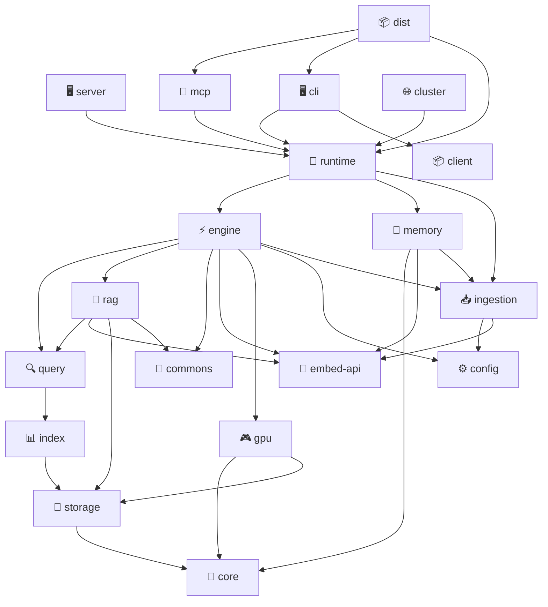
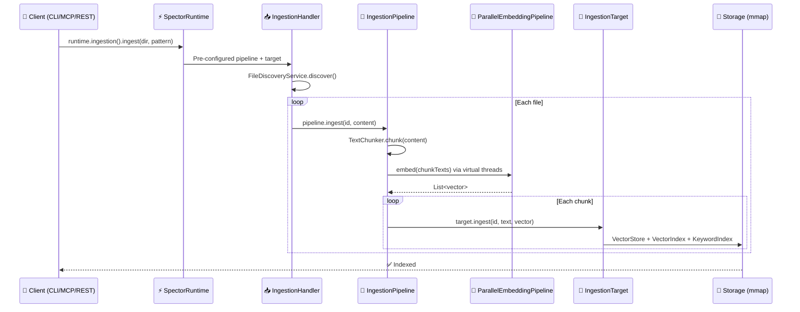
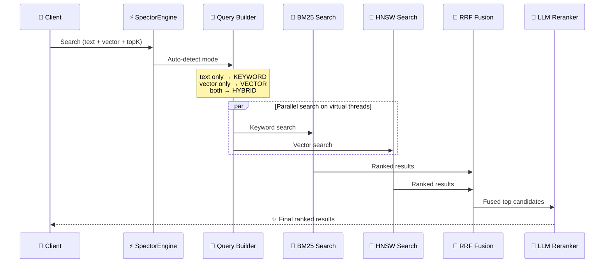
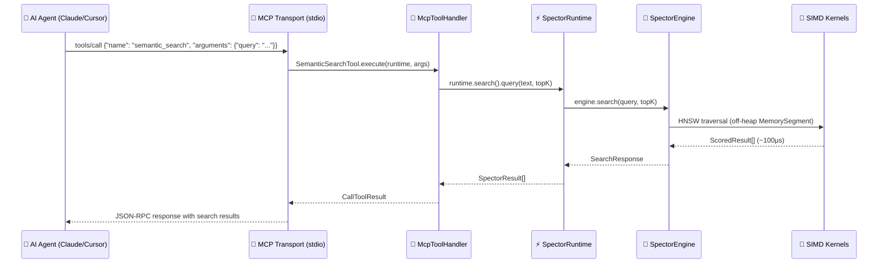
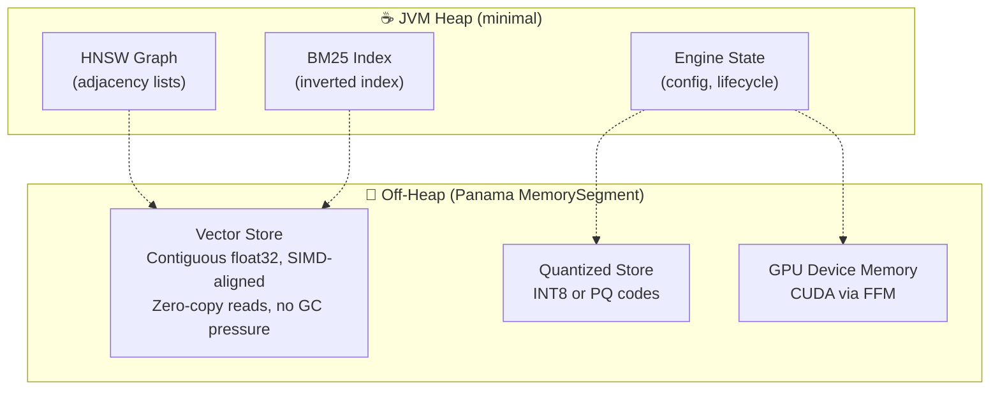
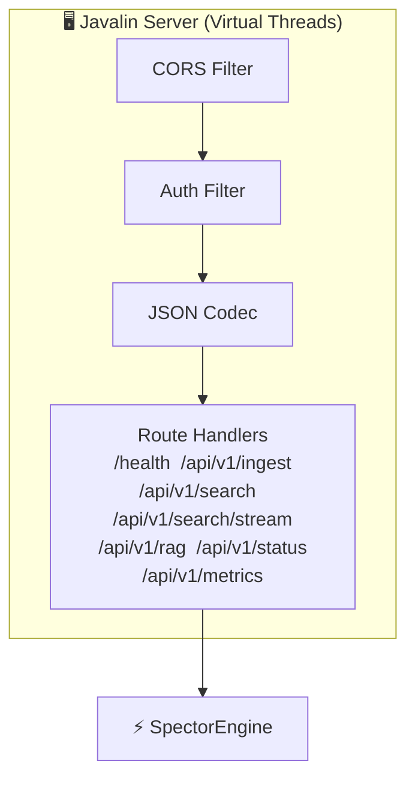

# 🏗️ Architecture Overview

> **Spector Search is a modular, JVM-native AI memory backbone organized as a Maven multi-module project.** This page covers the module structure, dependency graph, data flow, threading model, and memory architecture that make sub-millisecond, agent-native search possible.

---

## 📦 Module Diagram

> [!NOTE]
> **Index sub-modules:** `hnsw/` (graph-based ANN), `ivf/` (inverted file + posting lists), `pq/` (product quantizer, K-Means++, ADC), `bm25/` (keyword scoring + analyzers)

---

## 🔗 Dependency Graph

**Dependency rules:**

| Path | Description |
|------|-------------|
| `runtime → engine + memory + ingestion` | Composition root — wires all subsystems |
| `cli → runtime + client` | CLI with local batch (runtime) and remote (client) modes |
| `cluster → engine → query → index → storage → core` | Main data path |
| `server → runtime` | REST API entry point |
| `mcp → runtime` | MCP agent entry point (in-process, zero network) |
| `runtime → ingestion` | Unified pipeline: chunk → embed → store |
| `engine → ingestion` | `EngineIngestionTarget` implements `IngestionTarget` |
| `memory → ingestion` | `CognitiveIngestionTarget` implements `IngestionTarget` |
| `engine → rag` | RAG context assembly pipeline |
| `engine → gpu` | Optional GPU acceleration |
| `memory → core, embed-api` | Cognitive memory module |
| `dist → mcp + cli + runtime` | Fat JAR distribution |

> [!IMPORTANT]
> No circular dependencies. `spector-ingestion` defines the `IngestionPipeline` and `IngestionTarget` interface. `spector-engine` and `spector-memory` both depend on it to implement their targets. `SpectorRuntime` is the single composition root — all entry points go through it.

---

## 📥 Data Flow: Ingest Path

1. **Client** calls `runtime.ingestion().ingest()` — all entry points use this
2. **IngestionHandler** delegates to a pre-configured `IngestionPipeline`
3. **IngestionPipeline** handles chunking (from config) and parallel embedding
4. **IngestionTarget** receives pre-embedded chunks — `EngineIngestionTarget` for SEARCH, `CognitiveIngestionTarget` for MEMORY
5. Each target handles its own downstream storage (VectorStore/HNSW or Quantize/TierRoute/WAL)

> [!TIP]
> `FileDiscoveryService` can be used independently for file discovery without any engine or runtime dependency.

---

## 🔍 Data Flow: Search Path

1. **Query Builder** determines search mode from provided fields
2. **BM25** and **HNSW** searches run in parallel on virtual threads
3. **RRF Fusion** merges both ranked lists using `1/(k + rank)` scoring
4. Optional **LLM Reranker** rescores top candidates via Ollama

---

## 🤖 Data Flow: MCP Agent Path

The MCP path routes through `SpectorRuntime` — the single composition root that holds both the search engine and optional cognitive memory. The MCP server wraps runtime handler calls with JSON-RPC transport. There is **zero network overhead** because everything runs in the same JVM process.

> [!TIP]
> For full MCP architecture details, tool schemas, and design patterns, see the dedicated [MCP Integration](mcp-integration.md) page.

---

## 🧵 Threading Model: Virtual Threads

Spector Search is designed from the ground up for Java virtual threads:

> [!TIP]
> **No `synchronized` blocks** anywhere in the codebase. All coordination uses `ReentrantLock` to avoid virtual thread pinning.

| Operation | Threading Strategy |
|-----------|-------------------|
| REST request handling | One virtual thread per request |
| Hybrid search | Parallel BM25 + HNSW via `StructuredTaskScope` |
| Bulk ingest | Virtual thread per document |
| Embedding generation | Batched across virtual threads |
| HNSW construction (>10K) | Virtual threads per core for parallel insertion |
| Distributed fan-out | Virtual thread per shard query |

### 📈 Scaling Results

At 50K docs with hybrid search (384-dim, production-realistic):

| Virtual Threads | Throughput | Scaling |
|-----------------|-----------|---------|
| 1 | 3,739 ops/s | 1.0× |
| 4 | 10,317 ops/s | **2.8×** |
| 8 | 11,812 ops/s | **3.2×** |
| 16 | 14,022 ops/s | **3.7×** |

> [!NOTE]
> Scaling depends on vector dimensions and workload type. 384-dim shows ~3.7× at 16 threads due to higher per-query memory bandwidth. Individual HNSW queries are inherently sequential (graph traversal data dependencies) — scaling comes from concurrent queries sharing CPU cores.

---

## 💾 Memory Model: Panama Off-Heap

All vector data lives off-heap using the Panama Foreign Function & Memory API:

**Benefits:**

- ✅ **Zero GC pressure** — Vectors never touch the garbage collector

- ✅ **Instant startup** — Memory-mapped files load via `mmap` syscall, no deserialization

- ✅ **SIMD-friendly layout** — Contiguous float32 arrays ready for Vector API operations

- ✅ **Explicit lifecycle** — `Arena`-scoped memory with deterministic cleanup

- ✅ **Memory efficiency** — Store billions of vectors limited only by disk/address space

### 📊 Storage Types

| Store | Location | Use Case |
|-------|----------|----------|
| `InMemoryVectorStore` | Off-heap (Arena) | Development, small datasets |
| `MmapVectorStore` | Memory-mapped file | Production, persistence |
| `QuantizedVectorStore` | Off-heap (INT8) | Memory-constrained deployments |
| `IvfPqStore` | Off-heap (PQ codes) | Billion-scale (32× compression) |

---

## 🌐 API Layer

Every request runs on its own virtual thread — no thread pool sizing, no blocking concerns. The server can handle thousands of concurrent connections with minimal resource consumption.

### Streaming via SSE

The `/api/v1/search/stream` endpoint uses Server-Sent Events to emit results progressively. This enables real-time UX without requiring WebFlux or Reactor — Javalin's built-in SSE support runs natively on virtual threads.

---

## 🔗 See Also

- [Core Concepts](core-concepts.md) — Algorithms and data structures in detail

- [Distributed Mode](distributed-mode.md) — Multi-node clustering architecture

- [GPU Acceleration](gpu-acceleration.md) — CUDA kernel integration via Panama

- [Performance Tuning](../operations/performance-tuning.md) — Optimizing for your workload