# 🏗️ Architecture Overview

> **Spector is a modular, JVM-native AI memory backbone organized as a Maven multi-module project.** This page covers the module structure, dependency graph, data flow, threading model, and memory architecture that make sub-millisecond, agent-native search possible.

---

## 📦 Module Diagram

```mermaid
graph LR
    subgraph "🔬 Core Layer"
        core["spector-core<br/><i>SIMD kernels</i>"]
        commons["spector-commons<br/><i>Config, chunkers, tokenizer</i>"]
    end

    subgraph "💾 Storage Layer"
        storage["spector-storage<br/><i>Panama MemorySegment stores</i>"]
    end

    subgraph "📊 Index Layer"
        index["spector-index<br/><i>HNSW + IVF-PQ + BM25</i>"]
    end

    subgraph "🔍 Query Layer"
        query["spector-query<br/><i>Hybrid orchestrator + RRF</i>"]
    end

    subgraph "🧠 Intelligence"
        embedapi["spector-embed-api<br/><i>EmbeddingProvider SPI</i>"]
        embedollama["spector-embed-ollama<br/><i>Ollama provider</i>"]
        gpu["spector-gpu<br/><i>Panama FFM + CUDA</i>"]
    end

    subgraph "📥 Pipelines"
        ingestion["spector-ingestion<br/><i>Ingest orchestration</i>"]
        rag["spector-rag<br/><i>RAG pipeline</i>"]
    end

    subgraph "âš¡ Runtime & Interfaces"
        runtime["spector-runtime<br/><i>Unified context (engine + memory)</i>"]
        engine["spector-engine<br/><i>Search facade + lifecycle</i>"]
        node["spector-node<br/><i>Armeria: REST + gRPC + SSE + cluster</i>"]
        mcp["spector-mcp<br/><i>MCP Server — Agent-native</i>"]
        cli["spector-cli<br/><i>spectorctl CLI</i>"]
        client["spector-client<br/><i>Java client SDK</i>"]
        spring["spector-spring<br/><i>Spring AI VectorStore</i>"]
    end

    subgraph "🧠 Cognitive Memory"
        memory["spector-memory<br/><i>Biologically-inspired agent memory</i>"]
    end

    subgraph "📈 Distribution"
        bench["spector-bench<br/><i>JMH benchmarks</i>"]
        dist["spector-dist<br/><i>Single fat JAR</i>"]
    end
```

> [!NOTE]
> **Index sub-modules:** `hnsw/` (graph-based ANN), `ivf/` (inverted file + posting lists), `pq/` (product quantizer, K-Means++, ADC), `bm25/` (keyword scoring + analyzers)

---

## 🔗 Dependency Graph

```mermaid
graph TD
    node["🌐 node"] --> runtime["⚡ runtime"]
    node --> mcp["🤖 mcp"]
    node --> metrics["📈 metrics"]
    mcp --> runtime
    mcp --> ingestion["📥 ingestion"]
    cli["🖥️ cli"] --> runtime
    cli --> client["📦 client"]

    runtime --> engine["âš¡ engine"]
    runtime --> memory["🧠 memory"]
    runtime --> ingestion

    engine --> query["🔍 query"]
    engine --> rag["🤖 rag"]
    engine --> ingestion
    engine --> index["📊 index"]
    engine --> storage["💾 storage"]
    engine --> embedapi["🧬 embed-api"]
    engine -.-> gpu["🎮 gpu"]

    memory --> index
    memory --> storage
    memory --> ingestion
    memory --> embedapi
    memory --> core["🔬 core"]

    metrics --> engine
    metrics --> memory

    ingestion --> config["⚙️ config"]
    ingestion --> embedapi

    rag --> query
    rag --> index
    rag --> storage
    rag --> embedapi
    rag --> commons["📄 commons"]

    query --> index
    query --> commons
    index --> storage
    index --> config
    storage --> config
    storage --> core
    config --> core

    embedapi --> commons
    gpu --> core
    gpu --> storage

    dist["📦 dist"] --> mcp
    dist --> cli
    dist --> runtime

    spring["🌱 spring"] --> engine
    spring --> memory
    spring --> metrics
    bench["🧪 bench"] --> engine
    bench --> memory
```

> **Legend:** Solid arrows = compile dependency. Dotted arrow (`gpu`) = optional dependency.

**Dependency rules:**

| Path | Description |
|------|-------------|
| `runtime → engine + memory + ingestion` | Composition root — wires all subsystems |
| `cli → runtime + client` | CLI with local batch (runtime) and remote (client) modes |
| `node → runtime` | Unified Armeria node: REST + gRPC + cluster coordination |
| `mcp → runtime + ingestion` | MCP agent entry point (in-process, zero network) |
| `engine → ingestion` | `EngineIngestionTarget` implements `IngestionTarget` |
| `memory → ingestion` | `CognitiveIngestionTarget` implements `IngestionTarget` |
| `engine → rag` | RAG context assembly pipeline |
| `engine -.-> gpu` | Optional GPU acceleration |
| `memory → index, storage, core, embed-api` | Cognitive memory (independent of engine) |
| `dist → mcp + cli + runtime` | Fat JAR distribution |

!!! important
    **No circular dependencies.** `spector-memory` and `spector-engine` are **peers** — both depend on `spector-ingestion` for the `IngestionTarget` interface, but neither depends on the other. `SpectorRuntime` is the single composition root that wires them together.

---

## 📥 Data Flow: Ingest Path

```mermaid
sequenceDiagram
    participant Client as 👤 Client (CLI/MCP/REST)
    participant Runtime as âš¡ SpectorRuntime
    participant Handler as 📥 IngestionHandler
    participant Pipeline as 🔄 IngestionPipeline
    participant Embed as 🧠 ParallelEmbeddingPipeline
    participant Target as 💾 IngestionTarget
    participant Store as 💾 Storage (mmap)

    Client->>Runtime: runtime.ingestion().ingest(dir, pattern)
    Runtime->>Handler: Pre-configured pipeline + target
    Handler->>Handler: FileDiscoveryService.discover()
    loop Each file
        Handler->>Pipeline: pipeline.ingest(id, content)
        Pipeline->>Pipeline: TextChunker.chunk(content)
        Pipeline->>Embed: embed(chunkTexts) via virtual threads
        Embed-->>Pipeline: List<vector>
        loop Each chunk
            Pipeline->>Target: target.ingest(id, text, vector)
            Target->>Store: VectorStore + VectorIndex + KeywordIndex
        end
    end
    Store-->>Client: ✅ Indexed
```

1. **Client** calls `runtime.ingestion().ingest()` — all entry points use this
2. **IngestionHandler** delegates to a pre-configured `IngestionPipeline`
3. **IngestionPipeline** handles chunking (from config) and parallel embedding
4. **IngestionTarget** receives pre-embedded chunks — `EngineIngestionTarget` for SEARCH, `CognitiveIngestionTarget` for MEMORY
5. Each target handles its own downstream storage (VectorStore/HNSW or Quantize/TierRoute/WAL)

> [!TIP]
> `FileDiscoveryService` can be used independently for file discovery without any engine or runtime dependency.

---

## 🔍 Data Flow: Search Path

```mermaid
sequenceDiagram
    participant Client as 👤 Client
    participant Engine as âš¡ SpectorEngine
    participant QB as 🧭 Query Builder
    participant BM25 as 📝 BM25 Search
    participant HNSW as 🧠 HNSW Search
    participant RRF as 🧬 RRF Fusion
    participant LLM as 🤖 LLM Reranker

    Client->>Engine: Search (text + vector + topK)
    Engine->>QB: Auto-detect mode
    Note over QB: text only → KEYWORD<br/>vector only → VECTOR<br/>both → HYBRID
    par Parallel search on virtual threads
        QB->>BM25: Keyword search
        QB->>HNSW: Vector search
    end
    BM25->>RRF: Ranked results
    HNSW->>RRF: Ranked results
    RRF->>LLM: Fused top candidates
    LLM-->>Client: ✨ Final ranked results
```

1. **Query Builder** determines search mode from provided fields
2. **BM25** and **HNSW** searches run in parallel on virtual threads
3. **RRF Fusion** merges both ranked lists using `1/(k + rank)` scoring
4. Optional **LLM Reranker** rescores top candidates via Ollama

---

## 🤖 Data Flow: MCP Agent Path

```mermaid
sequenceDiagram
    participant Agent as 🤖 AI Agent (Claude/Cursor)
    participant MCP as 📡 MCP Transport (stdio)
    participant Handler as 🔧 McpToolHandler
    participant Runtime as âš¡ SpectorRuntime
    participant Engine as 🔧 SpectorEngine
    participant SIMD as 🔬 SIMD Kernels

    Agent->>MCP: tools/call {"name": "engine_search", "arguments": {"query": "..."}}
    MCP->>Handler: EngineSearchTool.execute(runtime, args)
    Handler->>Runtime: runtime.search().query(text, topK)
    Runtime->>Engine: engine.search(query, topK)
    Engine->>SIMD: HNSW traversal (off-heap MemorySegment)
    SIMD-->>Engine: ScoredResult[] (~100µs)
    Engine-->>Runtime: SearchResponse
    Runtime-->>Handler: SpectorResult[]
    Handler-->>MCP: CallToolResult
    MCP-->>Agent: JSON-RPC response with search results
```

The MCP path routes through `SpectorRuntime` — the single composition root that holds both the search engine and optional cognitive memory. The MCP server wraps runtime handler calls with JSON-RPC transport. There is **zero network overhead** because everything runs in the same JVM process.

> [!TIP]
> For full MCP architecture details, tool schemas, and design patterns, see the dedicated [MCP Integration](mcp-integration.md) page.

---

## 🧵 Threading Model: Virtual Threads

Spector is designed from the ground up for Java virtual threads:

> [!TIP]
> **No `synchronized` blocks** anywhere in the codebase. All coordination uses `ReentrantLock` to avoid virtual thread pinning.

| Operation | Threading Strategy |
|-----------|-------------------|
| REST request handling | One virtual thread per request |
| Hybrid search | Parallel BM25 + HNSW via `StructuredTaskScope` |
| Bulk ingest | Virtual thread per document |
| Embedding generation | Batched across virtual threads |
| HNSW construction (>10K) | Virtual threads per core for parallel insertion |
| Distributed fan-out | Virtual thread per shard query |

### 📈 Scaling Results

At 50K docs with hybrid search (384-dim, production-realistic):

| Virtual Threads | Throughput | Scaling |
|-----------------|-----------|---------|
| 1 | 3,739 ops/s | 1.0× |
| 4 | 10,317 ops/s | **2.8×** |
| 8 | 11,812 ops/s | **3.2×** |
| 16 | 14,022 ops/s | **3.7×** |

> [!NOTE]
> Scaling depends on vector dimensions and workload type. 384-dim shows ~3.7× at 16 threads due to higher per-query memory bandwidth. Individual HNSW queries are inherently sequential (graph traversal data dependencies) — scaling comes from concurrent queries sharing CPU cores.

---

## 💾 Memory Model: Panama Off-Heap

All vector data lives off-heap using the Panama Foreign Function & Memory API:

**Benefits:**

- ✅ **Zero GC pressure** — Vectors never touch the garbage collector

- ✅ **Instant startup** — Memory-mapped files load via `mmap` syscall, no deserialization

- ✅ **SIMD-friendly layout** — Contiguous float32 arrays ready for Vector API operations

- ✅ **Explicit lifecycle** — `Arena`-scoped memory with deterministic cleanup

- ✅ **Memory efficiency** — Store billions of vectors limited only by disk/address space

### 📊 Storage Types

| Store | Location | Use Case |
|-------|----------|----------|
| `InMemoryVectorStore` | Off-heap (Arena) | Development, small datasets |
| `MmapVectorStore` | Memory-mapped file | Production, persistence |
| `QuantizedVectorStore` | Off-heap (INT8) | Memory-constrained deployments |
| `IvfPqStore` | Off-heap (PQ codes) | Billion-scale (32× compression) |

---

## 🌐 API Layer

```mermaid
graph TD
    subgraph "SpectorNode - Armeria Server, single port"
        CORS["CorsService decorator"]
        Auth["API Key decorator"]
        COMPRESS["EncodingService - gzip/brotli"]
        subgraph "ApiModule Registration"
            SE["🔍 SearchEndpoint"]
            IE["📥 IngestEndpoint"]
            RE["🤖 RagEndpoint"]
            DE["🗑️ DocumentEndpoint"]
            STE["📊 StatusEndpoint"]
            ESE["📡 EventStreamEndpoint"]
        end
        gRPC["gRPC Service<br/>inter-node fan-out"]
        HEALTH["💚 /health"]
        PROM["📊 /metrics"]
    end

    subgraph "Service Facades"
        SS["SearchService"]
        IS["IngestService"]
        RS["RagService"]
    end

    SE --> SS
    IE --> IS
    RE --> RS
    SS & IS --> EB["SpectorEventBus<br/>17 event types"]
    SS --> ENGINE["âš¡ SpectorEngine"]
```

Every request runs on its own virtual thread. The Armeria server handles HTTP REST, gRPC, and SSE events on a single port. API endpoints are registered via the `ApiModule` factory pattern, enabling straightforward API versioning (`/api/v1`, `/api/v2`).

### Streaming via SSE

The `/api/v1/search/stream` endpoint uses Server-Sent Events to emit results progressively. The `/api/v1/events` endpoint provides a live event stream where clients can subscribe to search, ingest, cluster, MCP, and engine events with optional category filtering.

---

## 🔗 See Also

- [Core Concepts](core-concepts.md) — Algorithms and data structures in detail

- [Distributed Mode](distributed-mode.md) — Multi-node clustering architecture

- [GPU Acceleration](gpu-acceleration.md) — CUDA kernel integration via Panama

- [Performance Tuning](../operations/performance-tuning.md) — Optimizing for your workload
