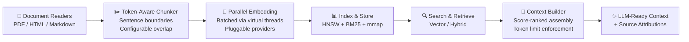
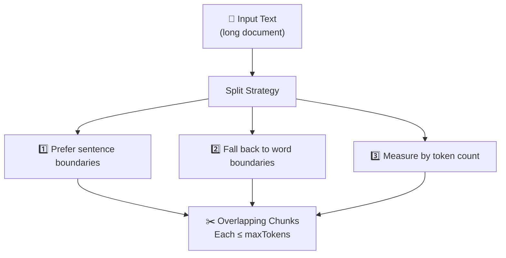
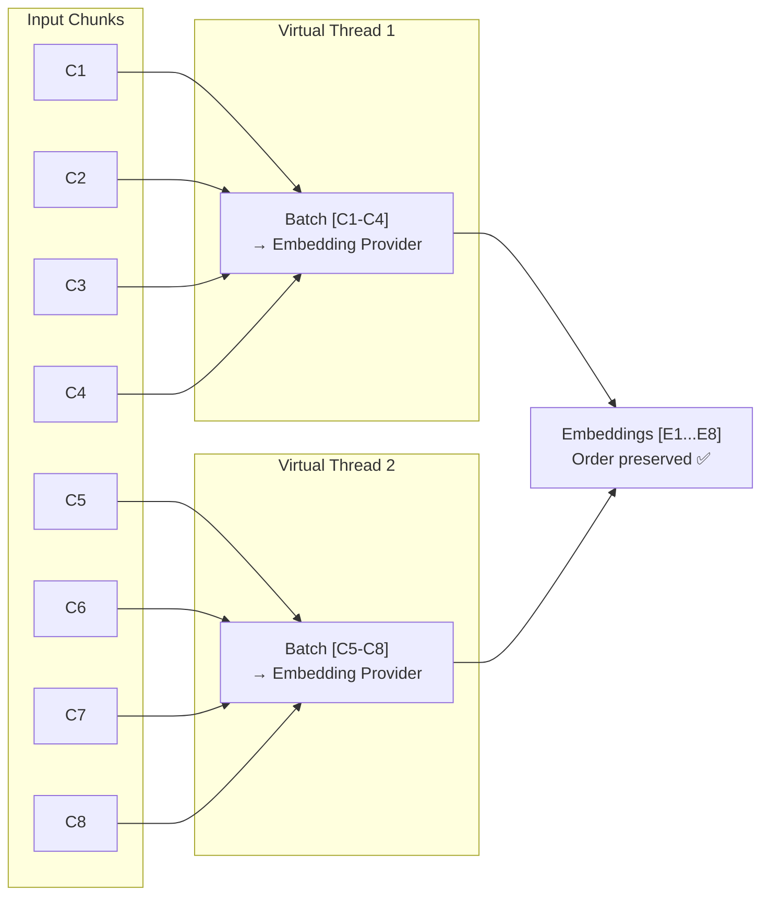
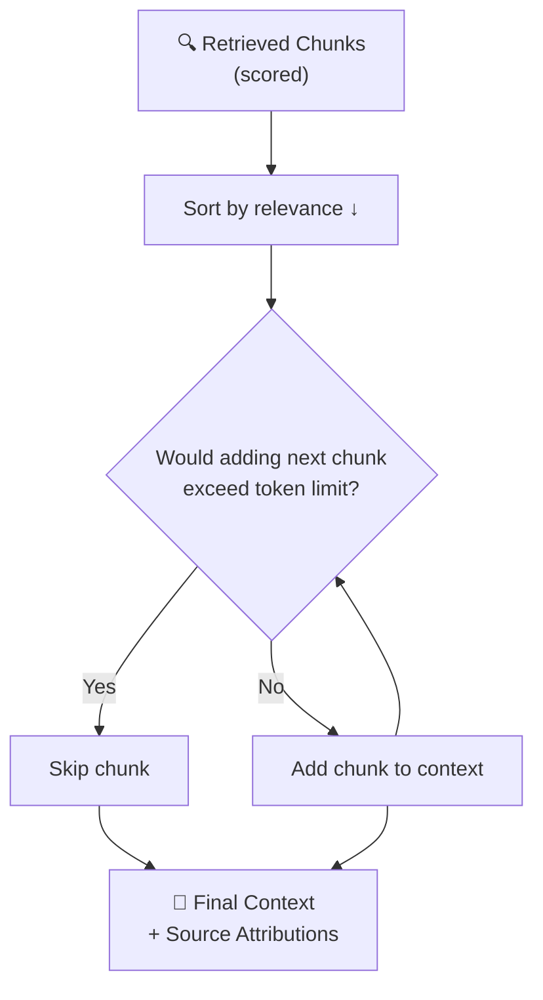

# 🤖 RAG Pipeline

> **End-to-end Retrieval-Augmented Generation built right into Spector Search.** From document ingestion to LLM-ready context assembly — with token-aware chunking, parallel embedding, and source attribution out of the box.

---

## 🔄 Pipeline Overview



---

## 📄 Document Readers

The pipeline supports three document formats out of the box:

| Reader | Format | Behavior |
|--------|--------|----------|
| `PdfDocumentReader` | PDF | Extracts text, preserves paragraph boundaries |
| `HtmlDocumentReader` | HTML | Strips tags, converts headings to sections |
| `MarkdownDocumentReader` | Markdown | Preserves heading structure as delimiters |

```java
DocumentReader reader = new PdfDocumentReader();
DocumentResult result = reader.read(Path.of("whitepaper.pdf"));
// result.text() → extracted text
// result.metadata() → {sourceFile, format: "PDF", characterCount}
```

| Property | Value |
|----------|-------|
| Max file size | 100 MB |
| Max extraction time | 30 seconds per file |
| Failure isolation | Per-file (one failure doesn't halt pipeline) |
| Output | Text string + metadata |

> [!NOTE]
> Unsupported formats return a descriptive error. Corrupted files report the failure without stopping the pipeline.

---

## ✂️ Token-Aware Chunking

The `TokenAwareChunker` splits text into chunks that respect token boundaries and embedding model limits.



### Configuration

| Parameter | Default | Range | Description |
|-----------|---------|-------|-------------|
| `maxTokens` | 512 | 1–8192 | Max tokens per chunk |
| `overlapTokens` | 50 | 0–maxTokens-1 | Overlap between chunks |

```java
ChunkConfig config = new ChunkConfig(512, 50);
List<TextChunk> chunks = chunker.chunk(extractedText, config);
```

### Properties

- ✅ **Round-trip reconstruction** — Concatenating chunks reconstructs the original text
- ✅ **Token limit guarantee** — Every chunk has ≤ maxTokens
- ✅ **Single chunk for short text** — Returns exactly one chunk if input fits
- ✅ Empty/whitespace input returns an empty list

> [!TIP]
> Set `maxTokens` to match your embedding model's max input length. Increase `overlapTokens` (100–200) if chunks need more surrounding context for coherence.

---

## 🧠 Parallel Embedding Pipeline

The `ParallelEmbeddingPipeline` generates vector embeddings from text chunks using configurable batch parallelism.



| Parameter | Default | Range | Description |
|-----------|---------|-------|-------------|
| `batchSize` | 32 | 1–256 | Chunks per embedding API call |
| `maxRetries` | 3 | 0–10 | Retries for failed batches |

**Failure handling:**
- Failed batches are retried up to `maxRetries` times
- Processing continues for remaining batches even if one fails
- Input-output ordering is always preserved

---

## 📝 Context Builder

The `ContextBuilder` assembles retrieved chunks into a coherent context window for LLM prompting.



| Parameter | Default | Range |
|-----------|---------|-------|
| `tokenLimit` | 4096 | 256–131,072 |

**Properties:**
- Context never exceeds the configured token limit
- Chunks appear in descending relevance order
- Every included chunk has a source attribution
- Empty context (not an exception) when no chunks fit

---

## 🌐 The `/api/v1/rag` Endpoint

A single API call for retrieval-augmented generation:

```bash
curl -X POST http://localhost:7070/api/v1/rag \
  -H "Content-Type: application/json" \
  -d '{
    "query": "How does HNSW indexing work?",
    "topK": 5,
    "tokenLimit": 4096,
    "searchMode": "hybrid"
  }'
```

**Request Parameters:**

| Field | Type | Default | Range | Description |
|-------|------|---------|-------|-------------|
| `query` | string | — | 1–2000 chars | The question/query |
| `topK` | int | 5 | 1–100 | Chunks to retrieve |
| `tokenLimit` | int | 4096 | 1–8192 | Max context tokens |
| `searchMode` | string | "vector" | "vector", "hybrid" | Search strategy |

**Response:**
```json
{
  "context": "HNSW builds a multi-layer graph structure where each layer contains a subset of nodes...",
  "attributions": [
    {"documentId": "architecture.md", "chunkOffset": 3},
    {"documentId": "algorithms.md", "chunkOffset": 0}
  ],
  "isEmpty": false
}
```

---

## 🎯 End-to-End Example

### 1️⃣ Ingest Documents via RAG Pipeline

```java
// Read documents
DocumentReader pdfReader = new PdfDocumentReader();
DocumentResult doc = pdfReader.read(Path.of("architecture.pdf"));

// Chunk
ChunkConfig chunkConfig = new ChunkConfig(512, 50);
List<TextChunk> chunks = chunker.chunk(doc.text(), chunkConfig);

// Embed in parallel
EmbedConfig embedConfig = new EmbedConfig(32, 3);
List<EmbeddingResult> embeddings = pipeline.embed(chunks, embedConfig);

// Index each chunk
for (int i = 0; i < chunks.size(); i++) {
    engine.ingest(
        doc.metadata().sourceFile() + "#" + i,
        chunks.get(i).text(),
        embeddings.get(i).embedding()
    );
}
```

### 2️⃣ Query via RAG

```bash
curl -X POST http://localhost:7070/api/v1/rag \
  -d '{"query": "What is product quantization?", "topK": 3}'
```

### 3️⃣ Use Context with an LLM

```python
import requests

# Get context from Spector
rag_response = requests.post("http://localhost:7070/api/v1/rag", json={
    "query": "Explain product quantization",
    "topK": 5,
    "tokenLimit": 3000
}).json()

# Use with your LLM
prompt = f"""Based on the following context, answer the question.

Context:
{rag_response['context']}

Question: Explain product quantization

Answer:"""
```

> [!TIP]
> For Spring AI applications, use the `SpectorRagService` or `QuestionAnswerAdvisor` for automatic context retrieval. See [Spring AI Integration](../sdk-usage/spring-ai.md).

---

## 🔗 See Also

- [Spring AI Integration](../sdk-usage/spring-ai.md) — Spring AI RAG service
- [REST API Reference](../api-reference/rest-endpoints.md) — RAG endpoint details
- [Core Concepts](core-concepts.md) — Algorithms used in retrieval
- [Configuration Guide](../configuration/parameters.md) — RAG pipeline parameters
