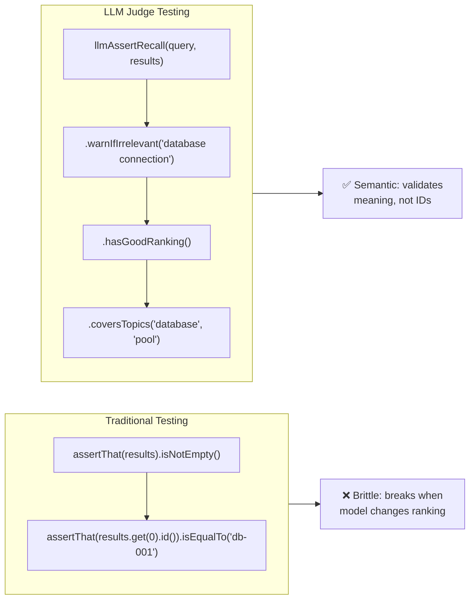
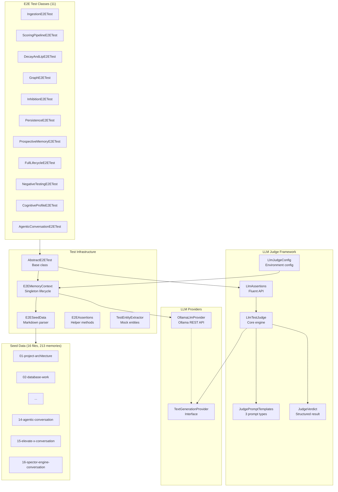
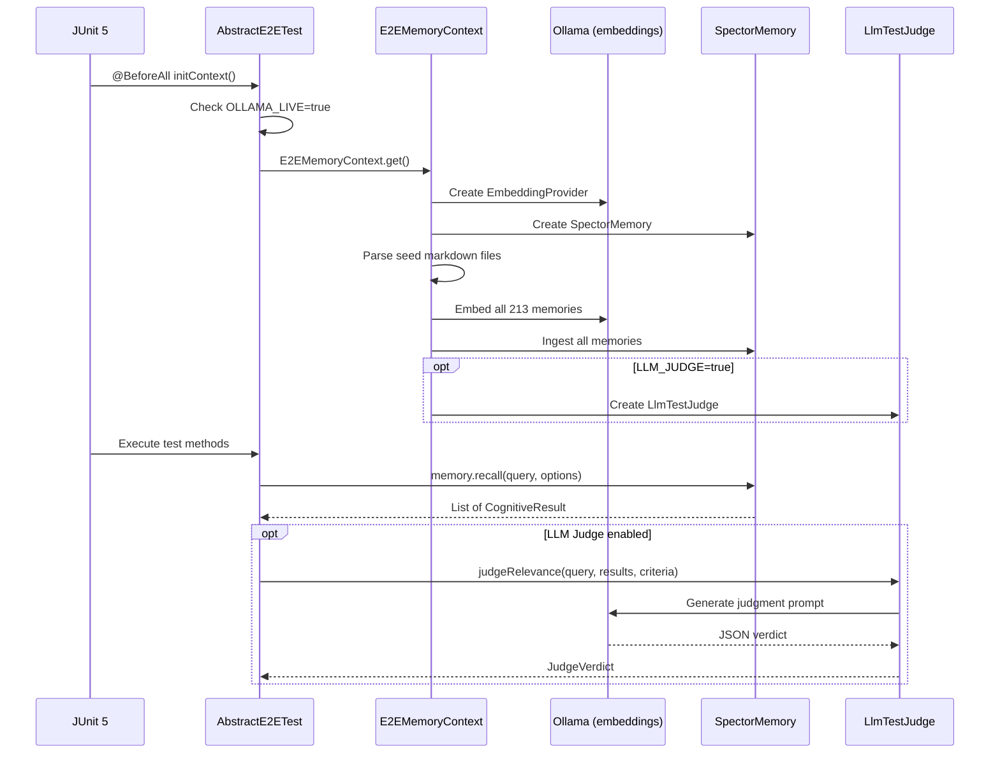
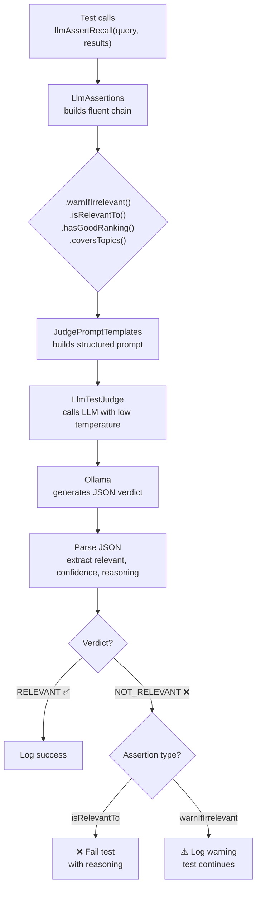

# Test Framework & LLM Judge

Spector's testing strategy goes beyond traditional unit tests. The project implements a comprehensive **E2E test framework** with a novel **LLM-as-Judge** system that uses a language model to semantically validate recall results — catching semantic drift and relevance degradation that deterministic assertions cannot detect.

## Why LLM-Based Test Validation?

Semantic search systems face a fundamental testing challenge: **correct behavior is subjective**. When you query "PostgreSQL connection pool exhaustion" and get back a memory about "HikariCP timeout configuration," is that relevant? A traditional assertion checking for exact string matches would miss it. A human would consider it highly relevant.

The LLM Judge bridges this gap by asking a language model to evaluate whether test results are semantically relevant to the query — the same way a human reviewer would, but automated and repeatable.



## Architecture

### Module Structure

The testing infrastructure spans two Maven modules:

| Module | Purpose |
|--------|---------|
| `spector-test-support` | Shared LLM Judge framework (module-agnostic) |
| `spector-memory` (test scope) | E2E test classes, seed data, context management |

### Component Architecture



## E2E Test Framework

### Test Lifecycle

All E2E tests share a single `SpectorMemory` instance through the `E2EMemoryContext` singleton. This ensures:

1. **Seed data is loaded once** — 213 memories are embedded and ingested at the start of the test suite
2. **Tests are independent** — each test queries the shared memory and validates results
3. **Ollama gating** — tests are skipped unless `OLLAMA_LIVE=true` is set



### Seed Data Format

Seed memories are authored in Markdown with YAML front matter. The `E2ESeedData` parser reads all `.md` files from `src/test/resources/e2e/memories/`:

```markdown
---
id: db-001
type: EPISODIC
source: OBSERVED
tags: database, postgresql, connection-pool
valence: -10
---
The PostgreSQL connection pool kept exhausting under load.
Increased HikariCP maximum pool size from 10 to 25 and added
connection timeout of 30 seconds. The root cause was a missing
connection release in the batch processing loop.
```

**Supported fields:**

| Field | Required | Values | Default |
|-------|----------|--------|---------|
| `id` | ✅ | Unique string identifier | — |
| `type` | ✅ | `EPISODIC`, `SEMANTIC`, `PROCEDURAL`, `PROSPECTIVE` | — |
| `source` | ❌ | `OBSERVED`, `REFLECTED`, `IMAGINED` | `OBSERVED` |
| `tags` | ❌ | Comma-separated tag list | `[]` |
| `valence` | ❌ | Integer from -20 to 20 | `0` |

### Seed Data Categories

The test suite uses **16 seed data files** organized by domain:

| # | File | Memories | Domain |
|---|------|----------|--------|
| 01 | `project-architecture` | 10 | Java project structure, Spring Boot, microservices |
| 02 | `database-work` | 13 | PostgreSQL, HikariCP, migrations, query optimization |
| 03 | `deployment-cicd` | 10 | Docker, Kubernetes, GitHub Actions, CI/CD |
| 04 | `authentication-security` | 8 | OAuth2, JWT, security incidents |
| 05 | `known-facts` | 14 | Factual Java knowledge (patterns, frameworks) |
| 06 | `procedures` | 6 | Step-by-step runbooks |
| 07 | `entity-relationships` | 8 | People, teams, projects with entity links |
| 08 | `surprise-and-lateral` | 10 | Unexpected discoveries, lateral connections |
| 09 | `preferences-and-context` | 9 | User preferences, tool choices |
| 10 | `edge-cases` | 20 | Adversarial: duplicates, contradictions, multilingual |
| 11 | `temporal-sequences` | 12 | Time-ordered Redis migration chain |
| 12 | `ambiguous-queries` | 11 | Multi-meaning terms ("pool", "spring", "node") |
| 13 | `negative-evidence` | 7 | Anti-patterns, failed approaches |
| 14 | `agentic-conversation` | 17 | Real Promptly app development sessions |
| 15 | `elevate-x-conversation` | 14 | Real Elevate-X fitness app sessions |
| 16 | `spector-engine-conversation` | 26 | Real Spector engine debugging sessions |

> **Total: 213 memories** across all categories.

### Test Classes

| Class | Tests | Focus |
|-------|-------|-------|
| `IngestionE2ETest` | 4 | Memory ingestion, embedding, storage verification |
| `ScoringPipelineE2ETest` | 21 | 6-phase scoring, valence filtering, deduplication |
| `DecayAndLtpE2ETest` | 5 | Temporal decay, long-term potentiation |
| `GraphE2ETest` | 7 | Hebbian graph, entity-aware recall, co-activation |
| `InhibitionE2ETest` | 7 | Suppression, habituation, retrieval-induced forgetting |
| `PersistenceE2ETest` | 5 | WAL, disk persistence, crash recovery |
| `ProspectiveMemoryE2ETest` | 3 | Future intents, deadline tracking |
| `FullLifecycleE2ETest` | 23 | 13-step lifecycle from ingestion to reflection |
| `NegativeTestingE2ETest` | 18 | Adversarial: gibberish, wrong domain, empty results |
| `CognitiveProfileE2ETest` | 12 | Profile auto-detection, scoring weight verification |
| `AgenticConversationE2ETest` | 11 | Agentic conversation recall, cross-domain isolation |

## LLM Judge Framework

### How It Works

The LLM Judge follows a simple pipeline:



### Prompt Engineering

Each judgment type uses a carefully engineered prompt that:

1. **Sets the role**: "You are a test validation judge"
2. **Provides context**: The query, relevance criteria, and truncated results
3. **Defines leniency**: "If at least 30% of results are relevant, judge as relevant"
4. **Forces structured output**: "Respond ONLY with this exact JSON format"
5. **Limits scope**: Max 10 results, 200 chars each to fit token budgets

Example prompt for relevance judgment:

```text
You are a test validation judge. Your job is to determine whether
a set of memory recall results is relevant to a given query.

QUERY: "PostgreSQL connection pool exhaustion timeout"

RELEVANCE CRITERIA: Results should contain memories about database
connection issues

RESULTS:
- The PostgreSQL connection pool kept exhausting under load...
- Increased HikariCP maximum pool size from 10 to 25...
- Switched from Flyway to Liquibase for database migrations...

Respond ONLY with this exact JSON format, no other text:
{"relevant": true, "confidence": 0.85, "reasoning": "Brief explanation"}
```

### Response Parsing

The `LlmTestJudge` handles common LLM output quirks:

- **Thinking tags**: Strips `<think>...</think>` blocks (qwen3 models)
- **Markdown fences**: Extracts JSON from `` ```json `` blocks
- **Extra text**: Uses regex to find the JSON object anywhere in the response
- **Retry logic**: Up to 2 retries on parse failure before giving up gracefully

### Assertion Types

#### `isRelevantTo(criteria)` — Hard Assertion

```java
llmAssertRecall(query, results)
    .isRelevantTo("Results must contain security-related memories");
// → Fails test if LLM judges NOT_RELEVANT
```

**Use when:** The semantic relationship is a hard business requirement. Example: security queries must never return cooking recipes.

#### `warnIfIrrelevant(criteria)` — Soft Warning

```java
llmAssertRecall(query, results)
    .warnIfIrrelevant("Results should relate to database connection pooling");
// → Logs: ⚠ LLM Judge [llama3.1]: NOT_RELEVANT (confidence=0.75) — ...
```

**Use when:** Semantic quality is important but model-dependent ranking makes hard assertions flaky.

#### `hasGoodRanking()` — Ranking Quality

```java
llmAssertRecall(query, results)
    .hasGoodRanking();
// → Warns if #5 is clearly more relevant than #1
```

**Use when:** Verifying that the scoring pipeline produces sensible ordering.

#### `coversTopics(topics...)` — Topic Coverage

```java
llmAssertRecall(query, results)
    .coversTopics("database", "connection pool", "timeout");
// → Warns if expected topics are missing from results
```

**Use when:** Ensuring recall results span the expected knowledge domains.

### Chaining

All assertions return `this` for fluent chaining:

```java
if (isLlmJudgeEnabled()) {
    llmAssertRecall("AI safety guardrails workout generation", results)
        .isRelevantTo("Results must describe fitness safety validation")
        .hasGoodRanking()
        .coversTopics("safety", "workout", "calorie");
}
```

## Configuration

### Environment Variables

| Variable | Default | Description |
|----------|---------|-------------|
| `OLLAMA_LIVE` | `false` | Gate for all E2E tests (embedding + recall) |
| `LLM_JUDGE` | `false` | Enable LLM-based semantic validation |
| `LLM_JUDGE_MODEL` | `llama3.1` | Ollama model for judging |
| `LLM_JUDGE_URL` | `http://localhost:11434` | Ollama server URL |
| `LLM_JUDGE_CONFIDENCE` | `0.6` | Minimum confidence threshold |

### Running Tests

```bash
# Run all E2E tests with Ollama embeddings (no LLM judge)
mvn test -pl spector-memory -DOLLAMA_LIVE=true

# Run with LLM judge enabled
mvn test -pl spector-memory -DOLLAMA_LIVE=true -DLLM_JUDGE=true

# Run specific test class
mvn test -pl spector-memory -DOLLAMA_LIVE=true \
    -Dtest=AgenticConversationE2ETest

# Run with custom model
mvn test -pl spector-memory -DOLLAMA_LIVE=true \
    -DLLM_JUDGE=true -DLLM_JUDGE_MODEL=qwen3:0.6b
```

## Design Decisions

### Why Non-Blocking by Default?

LLM models are non-deterministic — the same prompt can produce different verdicts across runs, especially with smaller models. Making all LLM assertions hard-fail by default would create flaky tests. Instead:

- **`warnIfIrrelevant`** is the recommended default — it provides semantic signal in test logs without blocking CI/CD
- **`isRelevantTo`** is reserved for invariants that should never be violated (e.g., cross-domain isolation)
- The `LLM_JUDGE_FAIL_ON_REJECT` flag exists for strict validation environments

### Why Ollama?

- **Local-first**: No API keys, no network dependency, no cost
- **Reproducible**: Pin to a specific model version for consistent results
- **Fast**: Small models (qwen3:0.6b) produce judgments in < 500ms
- **CI-friendly**: Ollama runs as a sidecar container in CI pipelines

### Why Separate Module?

`spector-test-support` is a standalone module rather than test-scoped code inside `spector-memory` because:

1. **Reusability**: Any Spector module can depend on it for LLM-based testing
2. **Clean dependencies**: The judge framework depends on `spector-embed-api` and `spector-embed-ollama`, not on `spector-memory`
3. **Independent versioning**: Test infrastructure evolves on its own schedule

## Current Metrics

| Metric | Value |
|--------|-------|
| Seed memory files | 16 |
| Total seed memories | 213 |
| E2E test classes | 11 |
| Total E2E tests | 116 |
| LLM assertions | 19 |
| Hard assertions (`isRelevantTo`) | 4 |
| Soft assertions (`warnIfIrrelevant`) | 12 |
| Topic coverage (`coversTopics`) | 2 |
| Ranking checks (`hasGoodRanking`) | 1 |
