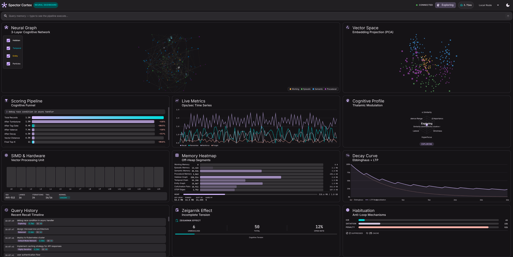
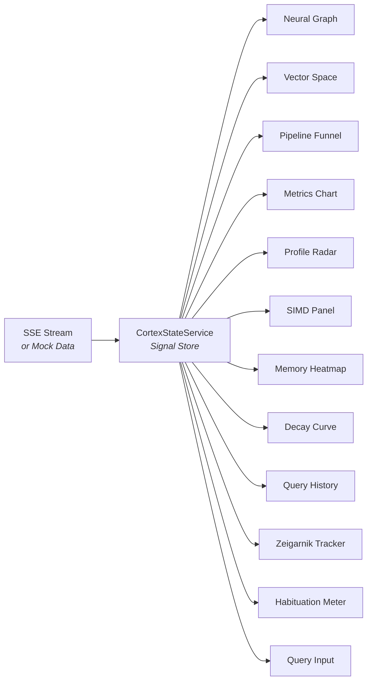

# 🧬 Spector Cortex — Neural Dashboard

!!! quote "The Vision"
    What if you could **watch your AI's brain think?** Spector Cortex is a real-time neural dashboard that visualizes the cognitive memory engine — from SIMD lanes firing to Hebbian edges strengthening to memories decaying along the Ebbinghaus curve. It's the difference between a black box and a living brain.

---



---

## Overview

Spector Cortex is an Angular 21 standalone application that provides a real-time, interactive visualization of Spector's cognitive memory engine. It connects to a running Spector Node via SSE (Server-Sent Events) and renders every cognitive event — queries, recalls, consolidation cycles, graph mutations — as they happen.

The dashboard is built around **12 panels** organized in a responsive 3-column grid, each visualizing a different aspect of the cognitive pipeline:

| Panel | Visualization | What It Shows |
|:------|:--------------|:--------------|
| **Neural Graph** | Three.js 3D graph | 200-node cognitive network with Hebbian, temporal, and entity edges — particles flow along connections during query spreading activation |
| **Vector Space** | Three.js point cloud | 300-point PCA-projected embedding space with query dot and nearest-neighbor lines |
| **Scoring Pipeline** | Animated funnel bars | The 6-phase cognitive scoring funnel — from total records → tombstone → tags → valence → decay → distance → final top-K |
| **Live Metrics** | Canvas time-series | Real-time recall/remember/reinforce/forget rates plotted as multi-line chart |
| **Cognitive Profile** | Canvas radar chart | 6-axis radar showing current thalamic modulation parameters (α, β, strictness, hyperfocus, lateral, valence range) |
| **SIMD & Hardware** | Canvas register grid | 16-lane SIMD register heatmap showing vector processing utilization |
| **Memory Heatmap** | Canvas segment bars | Off-heap memory segment utilization across all 4 tier stores + graph structures |
| **Decay Curve** | Canvas overlay chart | Ebbinghaus forgetting curve (dashed) vs. LTP reconsolidation curve (solid) — shows how recall events boost retention |
| **Query History** | Scrollable timeline | Chronological query traces with profile, latency, and augmented result counts |
| **Zeigarnik Effect** | Tension gauge | Unresolved memory count and cognitive tension percentage — the Zeigarnik effect biases recall toward incomplete tasks |
| **Habituation** | IoR/satiation bars | Inhibition of Return, semantic satiation, and habituation penalty gauges — the anti-filter-bubble mechanisms |
| **Query Input** | Search bar | Submit queries to see the full pipeline execute in real time |

---

## Architecture

### Technology Stack

| Layer | Technology |
|:------|:-----------|
| **Framework** | Angular 21 (standalone, zoneless) |
| **UI Components** | Angular Material 3 (M3 design tokens) |
| **3D Visualization** | Three.js (Neural Graph, Vector Space) |
| **2D Visualization** | Canvas 2D API with `requestAnimationFrame` |
| **State Management** | Angular Signals (reactive, fine-grained) |
| **Real-time Data** | SSE via `ng-sse-client` (mock data available) |
| **Styling** | SCSS with M3 CSS custom properties (`--mat-sys-*`) |
| **Theme** | Dark / Light toggle, fully token-based |

### Signal-Based Reactive Architecture

Spector Cortex uses a **pure signal-based architecture** — no RxJS, no NgRx, no zone.js.



**`CortexStateService`** is the single source of truth. It holds 20+ signals covering:

- **Query state**: current trace, query history, running status
- **Graph state**: nodes, edges, pulses, layer toggles, active profile
- **Metrics state**: time-series history, decay curves, habituation metrics
- **System state**: SIMD utilization, memory segments, JVM metrics
- **Vector state**: embedding points, query vector, nearest neighbors

All components are **pure presentation** — they read signals and render. No component contains business logic.

### Mock Data System

The `MockDataService` generates realistic runtime data so the dashboard is fully functional without a running Spector Node:

```typescript
// Toggle mock data on/off via signal
state.useMockData.set(true);   // Enable mock data
state.useMockData.set(false);  // Switch to real SSE stream
```

Mock data includes:

- **Simulated queries** every 2-4 seconds with randomized latency, profile selection, and scoring funnel
- **Graph pulses** cycling through Hebbian, temporal, and entity edge types
- **Reflect cycles** with consolidation animations (edge pruning, tombstone compaction)
- **Vector points** — 300 embeddings in PCA-projected 3D space with natural tier-based clustering
- **Metrics time-series** — recall/remember/reinforce/forget rates with realistic fluctuation
- **Decay curves** — 30-day Ebbinghaus + LTP reconsolidation with stochastic recall bumps
- **Habituation metrics** — IoR, satiation, and penalty values evolving over time
- **Zeigarnik tracking** — unresolved/total task counts with tension percentage

---

## Quick Start

### Prerequisites

- **Node.js** ≥ 20
- **npm** ≥ 10

### Run Locally

```bash
cd spector-cortex
npm install
npx ng serve --port 4300
```

Open [http://localhost:4300](http://localhost:4300) — the dashboard starts immediately with mock data.

### Connect to a Running Spector Node

By default, the dashboard uses mock data. To connect to a real Spector Node:

1. Ensure your Spector Node is running with SSE events enabled
2. Update the SSE endpoint in the environment configuration
3. Set `useMockData` to `false` in `CortexStateService`

---

## Panel Deep Dives

### Neural Graph

The centerpiece of the dashboard — a Three.js 3D graph with 200 nodes organized by memory tier:

- **Node colors**: Working (amber), Episodic (green), Semantic (blue), Procedural (purple)
- **Node radius**: Proportional to tier (Working = inner, Procedural = outer shell)
- **3 edge types**:
    - **Hebbian** — solid white lines (co-activation strength)
    - **Temporal** — dashed cyan lines (causal/temporal chains)
    - **Entity** — solid gold lines (entity-relationship knowledge)

**Interactive features:**

- [x] **Layer toggles** — show/hide each edge type independently
- [x] **Query traversal particles** — colored spheres flow along edges during spreading activation
- [x] **Particle trails** — each particle has a larger, dimmer glow sphere trailing behind
- [x] **Ambient particle stream** — continuous particles to keep the graph alive
- [x] **Profile visual transforms** — HYPERFOCUS (tunnel vision), PARANOID (red shift), DIVERGENT (rainbow shimmer)
- [x] **Consolidation animation** — edges dim and prune when `reflect()` fires
- [x] **Mouse interaction** — camera follows mouse position for parallax effect

### Vector Space

A Three.js point cloud of 300 memory embeddings projected into 3D via PCA:

- Points are colored by tier and sized by importance
- **Query dot** — when a query fires, a white pulsing sphere appears at the query vector position
- **Nearest-neighbor lines** — 5 translucent lines connect the query dot to its closest memories
- Camera orbits slowly with mouse parallax

### Scoring Pipeline

Animated horizontal funnel showing the 6-phase cognitive scoring pipeline:

| Phase | Description |
|:------|:------------|
| Total Records | Starting record count |
| After Tombstone | Tombstone-filtered records |
| After Tag Gate | Synaptic tag bloom filter pass |
| After Valence | Emotional valence range filter |
| After Decay | Temporal decay threshold |
| Vector Distance | L2 distance scoring |
| Final Top-K | Final result set |

Each bar animates smoothly to new values and shows the delta percentage (reduction) from the previous phase.

### Decay Curve

Visualizes the Ebbinghaus forgetting curve alongside LTP (Long-Term Potentiation) reconsolidation:

- **Red dashed line** — raw Ebbinghaus exponential decay (no intervention)
- **Primary solid line** — actual retention with LTP reconsolidation bumps from recall events
- **Filled area** — shows the retention gain from the reconsolidation system
- X-axis spans 30 days; Y-axis shows retention percentage

### Cognitive Profile Radar

6-axis radar chart showing the current cognitive profile's thalamic modulation parameters:

| Axis | Parameter | Range |
|:-----|:----------|:------|
| α Similarity | Similarity weight | 0–1.0 |
| β Importance | Importance weight | 0–1.0 |
| Strictness | Score threshold | 0–10.0 |
| Hyperfocus | Focus mode boost | 0–2.0 |
| Lateral | Divergent retrieval | 0–1.0 |
| Valence Range | Emotional filter width | 0–255 |

The radar morphs smoothly when the active profile changes (BALANCED → HYPERFOCUS → PARANOID → etc.).

---

## Project Structure

```
spector-cortex/
├── src/
│   ├── app/
│   │   ├── core/
│   │   │   ├── models/
│   │   │   │   ├── cortex-events.ts      # SSE event type interfaces
│   │   │   │   ├── graph-types.ts         # Graph pulse interfaces
│   │   │   │   └── memory-types.ts        # CognitiveProfile, PROFILE_PARAMS
│   │   │   └── services/
│   │   │       ├── cortex-state.service.ts # Signal store (single source of truth)
│   │   │       ├── mock-data.service.ts    # Simulated event generator
│   │   │       └── theme.service.ts        # Dark/light theme toggle
│   │   ├── features/
│   │   │   ├── dashboard/                  # Main layout (3-col grid)
│   │   │   ├── header/                     # Toolbar with status & controls
│   │   │   ├── neural-graph/               # Three.js neural graph
│   │   │   ├── vector-space/               # Three.js vector space
│   │   │   ├── pipeline-funnel/            # Scoring pipeline funnel
│   │   │   ├── simd-panel/                 # SIMD lane heatmap
│   │   │   ├── memory-heatmap/             # Off-heap segment visualization
│   │   │   ├── profile-radar/              # Cognitive profile radar chart
│   │   │   ├── metrics-chart/              # Live metrics time-series
│   │   │   ├── decay-curve/                # Ebbinghaus + LTP chart
│   │   │   ├── query-input/                # Search bar
│   │   │   ├── query-history/              # Query timeline
│   │   │   ├── zeigarnik-tracker/          # Incomplete tension gauge
│   │   │   └── habituation-meter/          # Anti-loop mechanism gauges
│   │   └── app.component.ts                # Root component
│   ├── styles.scss                          # Global M3 theme
│   └── index.html
├── angular.json
├── package.json
└── tsconfig.json
```

---

## Design Principles

### 1. Angular Material 3 Tokens Only

All colors reference M3 CSS custom properties — **zero hardcoded colors**:

```scss
// ✅ Correct — uses M3 token
color: var(--mat-sys-primary);
background: var(--mat-sys-surface-container-high);

// ❌ Wrong — hardcoded color
color: #bb86fc;
```

This ensures the entire dashboard automatically adapts when switching between dark and light themes.

### 2. Separation of Concerns

| Layer | Rule |
|:------|:-----|
| **Components** | Pure presentation only — read signals, render UI |
| **Services** | All business logic, state mutations, data processing |
| **Templates** | Separate `.html` files — no inline templates |
| **Styles** | Separate `.scss` files — no inline styles |

### 3. Canvas for Performance

All 2D charts use raw Canvas 2D API with `requestAnimationFrame` instead of chart libraries — this keeps the bundle small and eliminates third-party DOM overhead in animation-heavy panels.

### 4. Responsive Grid

The dashboard uses CSS Grid with breakpoints:

| Breakpoint | Columns | Behavior |
|:-----------|:--------|:---------|
| > 1200px | 3 columns | Full layout |
| 768–1200px | 2 columns | Neural Graph spans full width |
| < 768px | 1 column | Single column, stacked |

---

## Connecting to Real Data

Spector Cortex is designed to consume SSE events from `spector-node`. The event types map directly to signals:

| SSE Event Type | Signal | Panel |
|:---------------|:-------|:------|
| `query.trace` | `currentQueryTrace` | Neural Graph, Pipeline, History |
| `query.vector` | `queryVector` | Vector Space |
| `graph.pulse` | `graphPulses` | Neural Graph edges |
| `reflect.complete` | `lastReflect` | Neural Graph consolidation |
| `profile.change` | `activeProfile` | Profile Radar, Neural Graph |
| `metrics.snapshot` | `metricsHistory` | Metrics Chart |
| `habituation.update` | `habituation` | Habituation Meter |

When `useMockData` is `false`, the `EventStreamService` connects to the configured SSE endpoint and pushes events into `CortexStateService` signals.

---

## Future Roadmap

- [ ] **Integration with Synaptiq** — embed Cortex panels into the Synaptiq monitoring dashboard
- [ ] **Async event emission** — SSE events emitted on virtual threads (gated behind feature flag)
- [ ] **Replay mode** — record and replay cognitive sessions for debugging
- [ ] **Cluster view** — multi-node visualization for distributed Spector deployments
- [ ] **GPU acceleration panel** — CUDA kernel execution timeline visualization
- [ ] **Memory diff view** — before/after comparison of consolidation cycles
