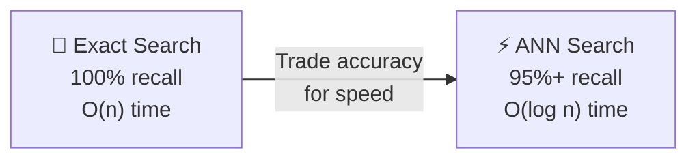
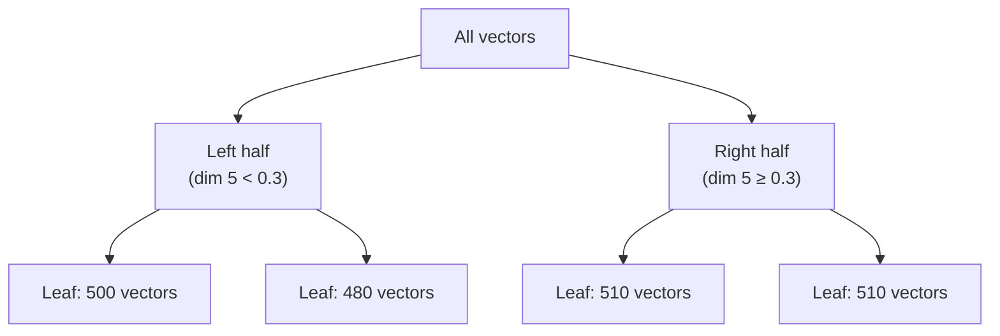
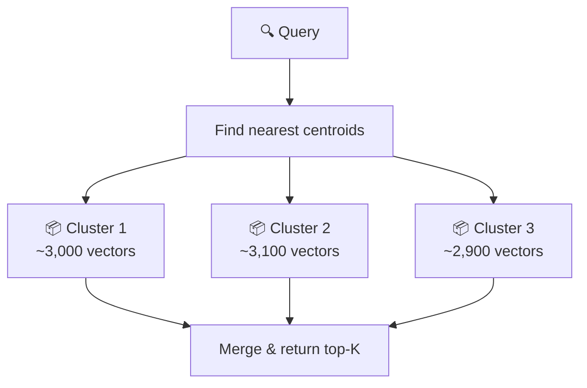
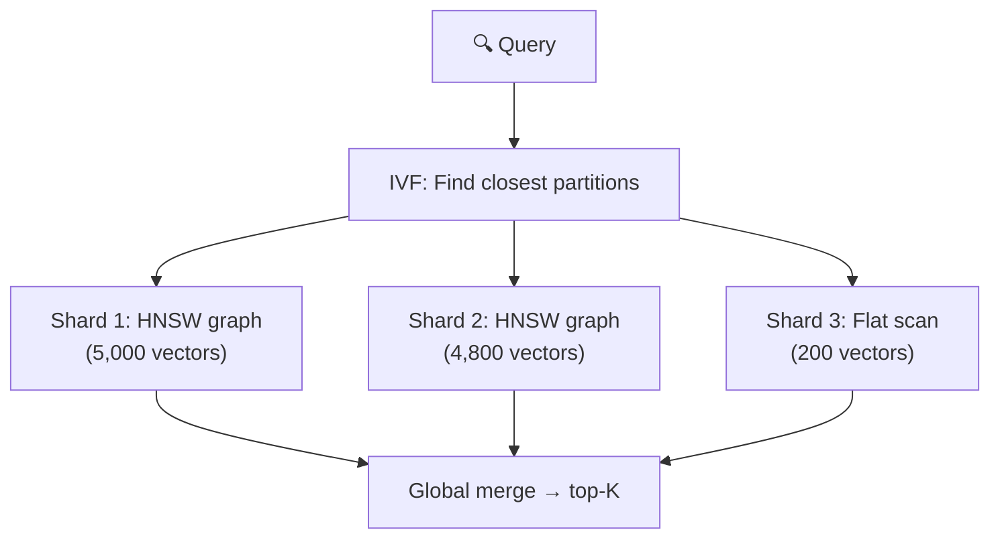
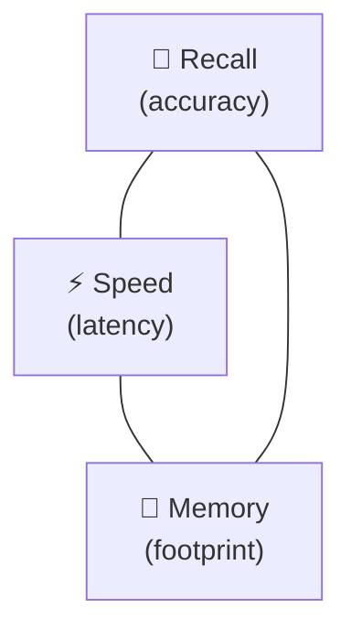

# 🔍 Approximate Nearest Neighbor Search

> **A beginner-friendly guide to how search engines find similar items in milliseconds, even across millions of records.** This page explains ANN from first principles — no math prerequisites required.

---

## 🤔 The Problem: Finding Similar Things

Imagine you have a photo of a sunset and want to find the 10 most similar sunset photos from a collection of 10 million images. Each image has been converted to a **vector** — a list of numbers that captures its visual essence:

```
🌅 Your photo  → [0.82, -0.15, 0.44, 0.67, ..., 0.21]  (768 numbers)
📸 Photo #1    → [0.79, -0.12, 0.41, 0.70, ..., 0.18]  (768 numbers)
📸 Photo #2    → [-0.55, 0.88, -0.23, 0.11, ..., 0.67] (768 numbers)
...
📸 Photo #10M  → [0.33, 0.44, -0.12, 0.55, ..., 0.91]  (768 numbers)
```

The **naive approach** compares your photo to every single photo in the collection:

```
10,000,000 comparisons × 768 multiplications each = 7.68 billion operations
```

Even on a fast CPU, that takes **seconds**. For a real-time search engine serving thousands of users simultaneously, seconds is an eternity.

> [!NOTE]
> This is called the **curse of dimensionality** — as vectors get longer (higher dimensional), the search space grows exponentially. Brute-force becomes impossible at scale.

---

## 💡 The Key Insight: "Close Enough" Is Good Enough

Here's the breakthrough: for most applications, you don't need the *mathematically perfect* top-10. You need results that are *really close* to perfect. If the true best match has a similarity score of 0.97 and your algorithm returns a match with 0.96, no user will notice the difference.

**Approximate Nearest Neighbor (ANN)** algorithms exploit this insight. They organize vectors into clever data structures that let you skip most comparisons while still finding excellent results.

The trade-off:



---

## 🏗️ ANN Algorithm Families

### 1. 🌳 Tree-Based Methods

**Idea:** Recursively split the vector space into regions. At search time, only explore the regions near the query.

**Example: KD-Trees**
- Split along one dimension at each level (like cutting a map into quadrants)
- Works well up to ~20 dimensions
- Falls apart in high dimensions (the "curse" again)

**Example: Annoy (Spotify)**
- Builds random projection trees
- Each tree splits space with random hyperplanes
- Uses multiple trees and merges results for better recall



> **Verdict:** Simple but limited. Trees struggle above 50 dimensions, which is far below modern embedding sizes (384–4096).

---

### 2. 🗂️ Inverted File (IVF)

**Idea:** Cluster vectors into groups (using K-Means). At search time, only search the closest clusters.

**How it works:**
1. **Training:** Run K-Means to find cluster centers (centroids)
2. **Ingestion:** Assign each vector to its nearest centroid
3. **Search:** Find the `nprobe` closest centroids to the query, then brute-force search only those clusters



**Speed:** With 1000 clusters and `nprobe=10`, you search only 1% of the data.

**Recall control:** The `nprobe` parameter is your recall/speed knob:
- `nprobe=1` → Fast but ~30% recall (might miss neighbors in adjacent clusters)
- `nprobe=10` → Balanced, ~85% recall
- `nprobe=50` → Slower but ~98% recall

> **Verdict:** Excellent at scale (billions of vectors). The foundation of most production systems.

---

### 3. 🕸️ Graph-Based Methods (HNSW)

**Idea:** Build a navigable graph where each vector is connected to its neighbors. At search time, traverse the graph like walking through a social network.

This is the most important ANN algorithm today. See our [HNSW Deep Dive](hnsw-explained.md) for the full story.

**Key properties:**
- **High recall** (95-99%) out of the box
- **Fast search** — O(log n) comparisons
- **Slow build** — each insertion requires graph updates
- **Memory hungry** — stores graph edges alongside vectors

> **Verdict:** Best recall-vs-speed trade-off for datasets up to ~10M vectors. The gold standard.

---

### 4. 🔗 Hybrid: IVF + HNSW (SpectorIndex)

**Idea:** Use IVF to partition the space, then build a small HNSW graph inside each partition. Best of both worlds.

This is what Spector Search's flagship **SpectorIndex** implements. See our [SpectorIndex Deep Dive](spector-index-architecture.md) for the full architecture.



> **Verdict:** Scales to millions while maintaining excellent recall. The future of vector search.

---

## 📐 Distance Metrics

How do we measure "similarity" between two vectors? Three common choices:

### Cosine Similarity

Measures the **angle** between vectors. Ignores magnitude (length).

$$\text{cosine}(a, b) = \frac{a \cdot b}{\|a\| \cdot \|b\|}$$

- Range: [-1, 1] (1 = identical direction, 0 = perpendicular, -1 = opposite)
- Best for: **text embeddings** (where direction captures meaning)

### Euclidean Distance (L2)

Measures the **straight-line distance** between two points.

$$L2(a, b) = \sqrt{\sum_i (a_i - b_i)^2}$$

- Range: [0, ∞) (0 = identical, higher = more different)
- Best for: **image embeddings**, clustering
- Key property: **translation-invariant** (shifting both vectors by the same amount doesn't change the distance)

### Dot Product

The raw inner product — like cosine but without normalization.

$$\text{dot}(a, b) = \sum_i a_i \cdot b_i$$

- Range: (-∞, ∞) (higher = more similar for normalized vectors)
- Best for: **recommendation systems** (where magnitude matters)

> [!TIP]
> For **unit-normalized vectors** (length = 1), all three metrics give equivalent rankings:
> $$L2^2(a, b) = 2 - 2 \cdot \text{cosine}(a, b)$$
> So choosing between them is mainly about convention and API design.

---

## 📊 The Recall–Speed–Memory Triangle

Every ANN algorithm makes trade-offs between three properties:



| Algorithm | Recall | Speed | Memory | Scale |
|-----------|--------|-------|--------|-------|
| Brute force | 100% | ❌ Slow | ✅ Minimal | < 100K |
| KD-Tree | 90-95% | ⚡ Fast | ✅ Low | < 1M (low-dim) |
| IVF-Flat | 85-98% | ⚡ Fast | ✅ Low | < 100M |
| HNSW | 95-99% | ⚡⚡ Very fast | ❌ High | < 10M |
| IVF-HNSW | 90-99% | ⚡⚡ Very fast | ⚡ Moderate | < 100M |
| IVF-PQ | 80-92% | ⚡ Fast | ⚡⚡ Very low | Billions |

---

## 🧪 How to Measure ANN Quality

### Recall@K

The most common metric. For each query, what fraction of the true top-K nearest neighbors did the algorithm find?

```
recall@10 = (true positives in top-10 results) / 10
```

A recall@10 of 0.95 means the algorithm found 9.5 out of 10 true nearest neighbors on average.

### QPS (Queries Per Second)

How many searches the system can handle per second. Higher is better.

### Build Time

How long it takes to index all vectors. Matters for systems with frequent updates.

---

## 🎓 Key Takeaways

1. **Brute force doesn't scale.** Beyond ~100K vectors, you need an ANN algorithm.
2. **HNSW is the default choice** for datasets up to 10M vectors — excellent recall with fast search.
3. **IVF shines at scale** — partitioning is essential for 10M+ vectors.
4. **Quantization complements ANN** — compress vectors to fit more in memory and scan faster.
5. **The `nprobe` and `efSearch` parameters** are your recall/speed knobs. Always tune them for your workload.
6. **Real embeddings have structure** — ANN algorithms perform much better on real data (which forms natural clusters) than on random vectors.

---

## 🔗 See Also

- [HNSW Explained](hnsw-explained.md) — How the most popular ANN algorithm works, step by step
- [SpectorIndex Architecture](spector-index-architecture.md) — Spector's IVF-HNSW-VASQ hybrid index
- [VASQ Quantization](vasq-deep-dive.md) — How VASQ compresses vectors with near-lossless quality
- [Understanding Quantization](understanding-quantization.md) — All quantization techniques compared
