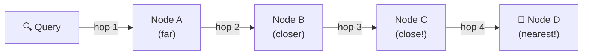
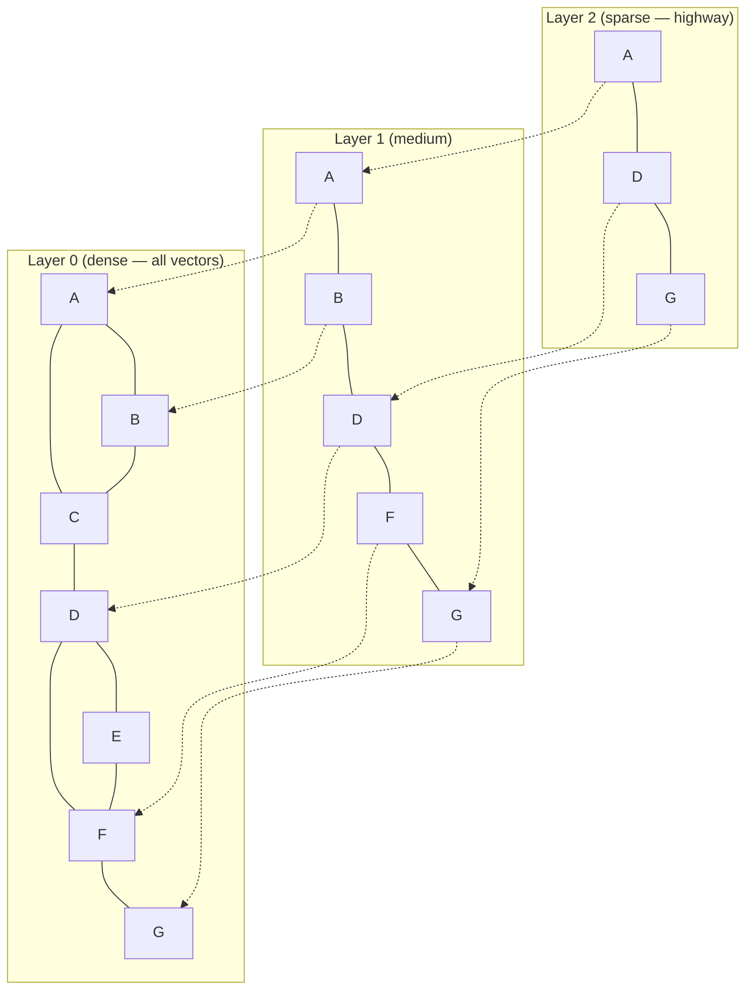
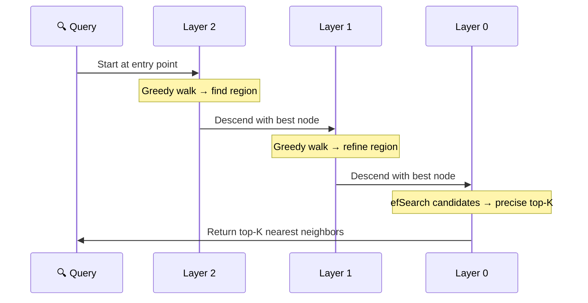

# 🕸️ HNSW Explained

> **How the world's most popular vector search algorithm works, from first principles.** Hierarchical Navigable Small World graphs power vector search in Pinecone, Weaviate, Qdrant, pgvector, and Spector Search. This page explains HNSW step by step, with intuition, diagrams, and practical tuning advice.

---

## 🤔 The Intuition: Six Degrees of Separation

You've probably heard that any two people on Earth are connected by at most six handshakes. This is the **small-world phenomenon** — in certain networks, you can reach any node in surprisingly few hops.

HNSW exploits this same principle for vector search. Instead of comparing your query against every vector, you **navigate a graph** — hopping from neighbor to neighbor, getting closer to the target with each step.



Instead of 10 million comparisons, you make ~100. That's the magic.

---

## 📐 From Flat to Hierarchical

### The Problem with a Single Graph

A simple navigable small-world (NSW) graph connects each vector to its nearest neighbors. Search starts at a random entry point and greedily walks toward the query — always moving to the neighbor closest to the target.

This works, but it has a problem: **local minima**. The greedy walk can get stuck in a region that's locally optimal but globally suboptimal.

### The Fix: Add Layers

HNSW solves this with a **hierarchy** — multiple layers of the same graph, each progressively sparser:



Think of it like navigating a city:
- **Layer 2 (highway):** A few major intersections — long jumps, coarse navigation
- **Layer 1 (main roads):** More nodes, shorter jumps
- **Layer 0 (streets):** Every single location — fine-grained search

---

## 🔧 How Search Works

### Step 1: Start at the Top

Enter the graph at the top layer's entry point. There are very few nodes here, so you can quickly find which region of the space the query belongs to.

### Step 2: Greedy Descent

At each layer, perform a **greedy search**: repeatedly move to the neighbor closest to the query until no neighbor is closer. Then descend to the next layer, starting from the same node.

### Step 3: Fine-Grained Search at Layer 0

At the bottom layer (which contains all vectors), perform a more thorough search. Instead of pure greedy descent, maintain a **candidate list** of the best nodes seen so far, exploring their neighbors to find even better candidates.



### The `efSearch` Parameter

At layer 0, the algorithm maintains a **dynamic candidate list** of size `efSearch`. Larger `efSearch` = more candidates explored = higher recall but slower search.

| `efSearch` | Recall@10 | Relative Speed |
|-----------|-----------|---------------|
| 10 | ~80% | Fastest |
| 50 | ~95% | Fast |
| 100 | ~98% | Moderate |
| 200 | ~99.5% | Slower |
| 500 | ~99.9% | Slowest |

> [!TIP]
> Start with `efSearch=64` and increase until you hit your recall target. For most applications, `efSearch=100-200` provides an excellent balance.

---

## 🏗️ How Construction Works

Building the HNSW graph is where the algorithm spends most of its time. Each vector is inserted one at a time.

### Step 1: Assign a Random Layer

Each new vector is assigned a maximum layer using an exponential distribution:

```
layer = floor(-ln(random()) × mL)
```

Where `mL = 1 / ln(M)` and M is the max connections per node. This ensures:
- Most vectors (85%) exist only at Layer 0
- ~12% reach Layer 1
- ~2% reach Layer 2
- ~0.2% reach Layer 3

### Step 2: Find Neighbors via Search

To insert a vector, first search the existing graph to find its nearest neighbors (exactly like a query search). The search quality during insertion is controlled by `efConstruction`.

### Step 3: Connect to Neighbors

Connect the new vector to its `M` nearest neighbors at each layer it belongs to. Also add reverse connections (the graph is bidirectional).

### The `efConstruction` Parameter

Higher `efConstruction` = better neighbor selection during build = higher-quality graph = better recall at search time. But it also means slower insertion.

| `efConstruction` | Build Speed | Graph Quality | Recall@10 |
|-----------------|------------|--------------|-----------|
| 16 | ⚡⚡ Fast | Low | ~85% |
| 100 | ⚡ Moderate | Good | ~95% |
| 200 | 🐌 Slow | High | ~98% |
| 500 | 🐌🐌 Very slow | Very high | ~99% |

### The `M` Parameter (Max Connections)

`M` controls how many edges each node has. More connections = more paths to explore = better recall, but more memory.

| M | Memory per vector | Recall impact |
|---|-------------------|---------------|
| 8 | Low | Good for low-dim (< 64) |
| **16** | **Moderate** | **Default — good for most cases** |
| 32 | High | Better for high-dim (768+) |
| 64 | Very high | Diminishing returns |

> [!IMPORTANT]
> The construction parameters `efConstruction` and `M` are permanent — they determine the graph structure. You can adjust `efSearch` at query time without rebuilding.

---

## 🧮 Complexity Analysis

| Operation | Time Complexity | Why |
|-----------|----------------|-----|
| **Search** | O(log n) | Each layer halves the search space |
| **Insert** | O(log n) | Same as search + edge updates |
| **Memory** | O(n × M) | Each vector stores M edges per layer |

For reference, with 1 million 768-dim vectors and M=16:
- **Search:** ~100-200 distance computations (vs 1,000,000 for brute force)
- **Memory:** ~12 bytes per edge × 16 edges × 1M vectors ≈ **192 MB** (just for edges, plus the vectors themselves)

---

## ⚡ Why HNSW Is Fast

Three factors combine to make HNSW remarkably efficient:

### 1. Logarithmic Hops

The hierarchical structure means you traverse O(log n) layers, each requiring a small number of greedy steps. For 1M vectors, that's ~6-8 layers with ~10 steps each = ~70 distance computations.

### 2. Locality

As you descend layers, you converge on a small region of the space. At layer 0, you're only exploring a local neighborhood — excellent CPU cache behavior.

### 3. SIMD Acceleration

Each distance computation (L2, cosine, dot product) can be parallelized using SIMD instructions. Spector Search uses the Java Vector API to compute 8-16 dimensions simultaneously:

```java
// 8 dimensions computed in a single CPU instruction
FloatVector va = FloatVector.fromArray(SPECIES, a, offset);
FloatVector vb = FloatVector.fromArray(SPECIES, b, offset);
FloatVector diff = va.sub(vb);
sum = diff.fma(diff, sum);  // sum += diff * diff
```

---

## 🚫 HNSW's Limitations

HNSW is excellent, but it's not perfect:

### 1. Memory Hungry

The graph edges consume significant memory — roughly 50-100% of the vector storage. This limits HNSW to datasets that fit in RAM.

### 2. Slow Construction

Building the graph requires O(n log n) total work. Inserting 1M vectors at `efConstruction=200` can take minutes. At 10M+, construction time becomes a serious concern.

### 3. No Deletion (Efficiently)

Removing vectors from an HNSW graph is tricky — you need to rewire edges, which can degrade graph quality over time.

### 4. Doesn't Scale Beyond ~10M

At 10M+ vectors, HNSW's memory consumption and construction time make it impractical as a standalone index. This is why hybrid approaches (like IVF-HNSW) are preferred at scale.

---

## 🔬 HNSW in Spector Search

Spector Search uses HNSW in two contexts:

### 1. Standalone HNSW Index

The `QuantizedHnswIndex` is the workhorse for datasets up to ~10M vectors. It combines HNSW with scalar or VASQ quantization:

- **Asymmetric Distance Computation (ADC):** Float32 query vs. quantized stored vectors
- **Off-heap memory:** Graph edges and quantized vectors stored in Panama `MemorySegment`
- **SIMD kernels:** Java Vector API for distance computation

### 2. Adaptive Shards in SpectorIndex

The flagship `SpectorIndex` (IVF-HNSW-VASQ) uses HNSW graphs inside large IVF shards:

- Shards below 20,000 vectors: exact flat scan (SIMD, faster than HNSW for small N)
- Shards above 20,000 vectors: automatically promoted to HNSW with VASQ quantization
- This **adaptive** approach avoids HNSW's overhead for small partitions while exploiting its efficiency for large ones

See [SpectorIndex Architecture](spector-index-architecture.md) for the full design.

---

## 📖 Further Reading

- **Original Paper:** Malkov & Yashunin, ["Efficient and robust approximate nearest neighbor using Hierarchical Navigable Small World graphs"](https://arxiv.org/abs/1603.09320) (2016)
- [ANN Search Primer](ann-search-primer.md) — Overview of all ANN algorithm families
- [SpectorIndex Architecture](spector-index-architecture.md) — How HNSW fits into the IVF-HNSW-VASQ design
- [Performance Tuning](../operations/performance-tuning.md) — Tuning `M`, `efConstruction`, and `efSearch` in Spector
