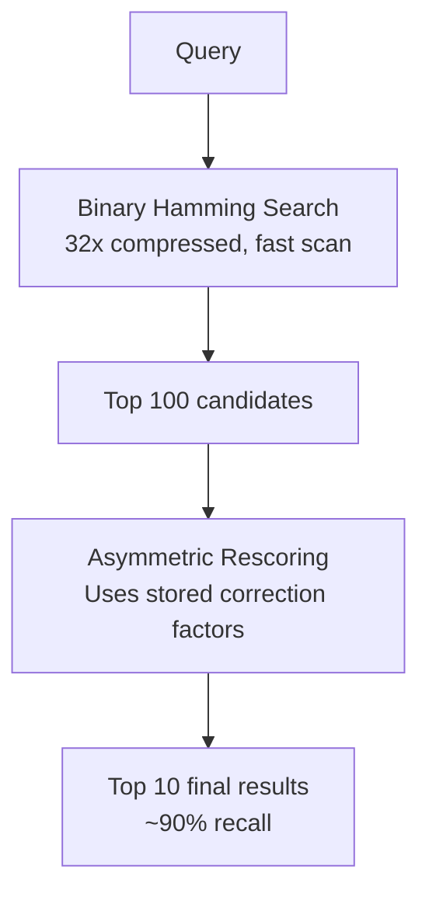
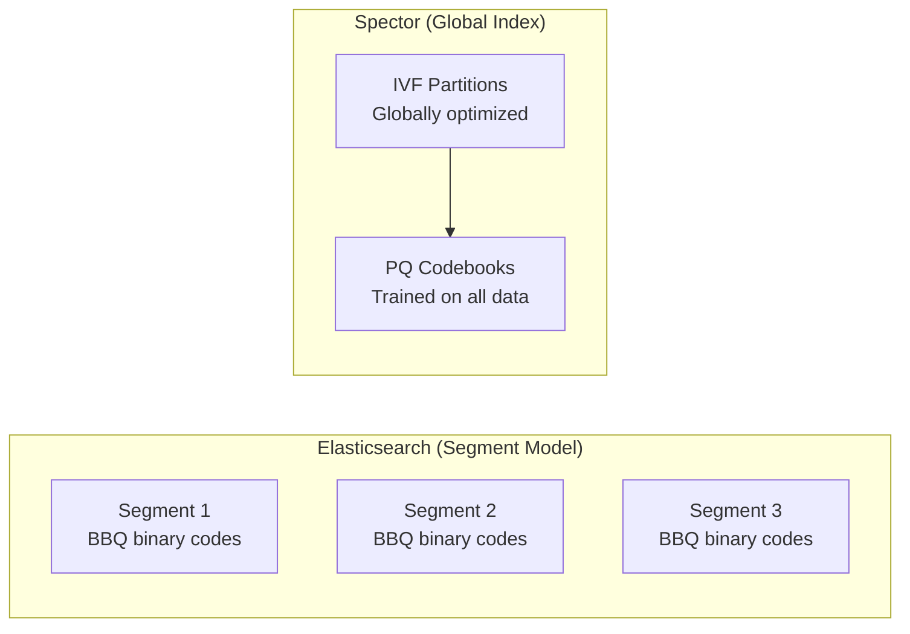
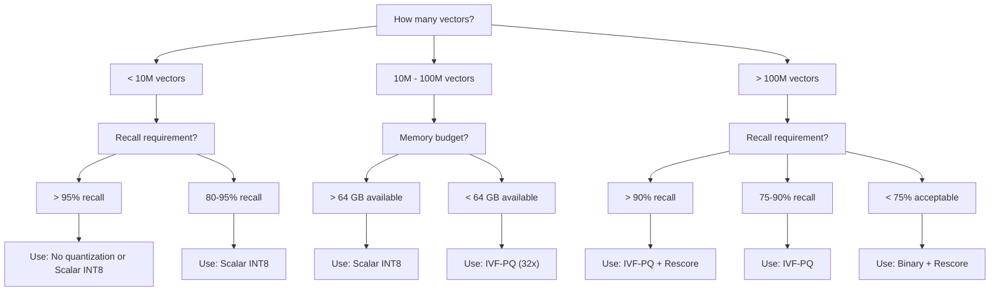

# ⚖️ Quantization Comparison

> **How different search engines approach vector compression — and why they make different choices.** Architecture constraints, legacy decisions, and design philosophy all shape which quantization methods an engine supports.

---

## 🌍 The Quantization Landscape

Every vector search engine faces the same fundamental problem: vectors are too big to fit in memory at scale. But each engine solves it differently based on their architecture:

| Constraint | Impact on Quantization Choice |
|-----------|-------------------------------|
| Immutable segments (Lucene) | Makes IVF training/updating difficult |
| Embedded vs. distributed | Affects whether training is practical |
| GPU availability | Enables larger codebook training |
| Disk vs. memory architecture | Changes what "compression" means |

> [!NOTE]
> There is no universally "best" quantization method. The right choice depends on your recall requirements, memory budget, dataset size, and which engine you're already using.

---

## 🟡 Elasticsearch's Approach: BBQ + DiskBBQ

### What is BBQ (Better Binary Quantization)?

BBQ is Elasticsearch's answer to vector compression, introduced in version 8.16. It's a **1-bit quantization** method — each float32 dimension becomes a single bit — enhanced with asymmetric rescoring to recover lost accuracy.

**How BBQ works:**
1. **Quantize:** Convert each vector to binary (sign bit extraction) — 32× compression
2. **Store metadata:** Keep per-vector correction factors (norm, mean)
3. **First-pass search:** Use Hamming distance on binary codes (very fast)
4. **Rescore:** Re-rank top candidates using stored correction factors for better accuracy

### Why Elasticsearch Chose Binary Over PQ

Elasticsearch is built on **Apache Lucene**, which uses an **immutable segment** architecture:

- Segments are write-once, read-many

- Merging combines segments but doesn't update in place

- New data goes to new segments

This makes IVF-PQ challenging because:

- **IVF centroids** need to be computed across all data — hard when data arrives in segments

- **PQ codebooks** need training on representative data — segment-local training produces poor codebooks

- **Partition rebalancing** on merge is expensive

Binary quantization, by contrast, is **per-vector** — no global training needed, works perfectly with immutable segments.

> [!TIP]
> BBQ is clever engineering within Lucene's constraints. The rescoring step recovers much of the recall lost by binary compression, achieving ~90% recall@10 for high-dimensional embeddings (768+).

### What is DiskBBQ?

DiskBBQ (introduced experimentally) adds IVF-like partitioning on top of BBQ:

- Vectors are grouped into clusters (similar to IVF)

- Only relevant clusters are loaded from disk during search

- Designed to work within Lucene's segment model by treating clusters as segment-local structures

**Trade-off:** More complex than plain BBQ, but enables disk-resident indexes for datasets that exceed RAM.

---

## 🔵 Spector's Approach: Scalar + VASQ + VASQ-4 + IVF-PQ

### Why These Two?

Spector Search is a **purpose-built vector engine** — no segment model, no legacy constraints. This gives freedom to implement whatever quantization works best for the use case.

The two-method strategy covers the full spectrum:

| Need | Solution | Compression | Recall |
|------|----------|-------------|--------|
| Quality-first (≤50M vectors) | Scalar INT8 | 4× | 95–99% |
| Quality + rotation (≤50M) | **VASQ INT8** | 4× | **97–99.5%** |
| Balanced (10M–100M vectors) | Scalar INT4 | 8× | 85–95% |
| Balanced + rotation (10M–100M) | **VASQ-4** | **6–8×** | **95–99%** |
| Memory-constrained (50M–500M) | Scalar INT2 | 16× | 75–90% |
| Scale-first (100M–1B+ vectors) | IVF-PQ | 32× | 75–90% |

### Advantages of Purpose-Built Indexes

Without Lucene's segment model:

- **Global IVF training** — K-Means runs over the entire dataset, producing optimal partitions

- **Codebook updates** — Retrain when data distribution shifts significantly

- **Partition rebalancing** — Redistribute vectors across partitions as the index grows

- **Memory-mapped storage** — Custom binary format designed for quantized data layout

### IVF-PQ vs. BBQ at Same Compression (32×)

| Metric | Spector IVF-PQ | Elasticsearch BBQ |
|--------|---------------|-------------------|
| Compression | 32× | 32× |
| Recall@10 (384-dim) | 80–92% | 70–85% |
| Recall@10 (768-dim) | 85–95% | 85–92% |
| Training required | Yes (K-Means + PQ) | No (per-vector) |
| Works with segments | No (global index) | Yes |
| Disk-friendly | Via mmap | Via DiskBBQ |

> [!IMPORTANT]
> At the same 32× compression ratio, PQ preserves more information than binary because it learns the data distribution. Binary quantization discards magnitude entirely — only direction (sign) survives.

---

## 🟣 Other Approaches

### Milvus: IVF-PQ + IVF-SQ8 + DiskANN

Milvus offers the widest quantization menu:

| Method | Compression | Use Case |
|--------|-------------|----------|
| IVF-PQ | 32×+ | Billion-scale, memory-constrained |
| IVF-SQ8 | 4× | Moderate scale, high recall |
| DiskANN | Varies | Disk-resident billion-scale search |
| HNSW | None (full) | Highest recall, unlimited memory |

**Philosophy:** Give users every option and let them choose. This flexibility comes with complexity — users must understand trade-offs to configure correctly.

### Qdrant: Scalar + Binary + Oversampling

Qdrant takes a practical approach:

| Method | Details |
|--------|---------|
| Scalar INT8 | Standard 4× compression, applied per-segment |
| Binary | 32× with configurable oversampling for rescoring |
| Oversampling | Retrieve 3–5× more candidates, rescore with full vectors |

**Key innovation:** Qdrant's oversampling strategy is straightforward but effective. Retrieve more candidates with cheap binary search, then rescore the shortlist with full-precision vectors. Recall depends on oversampling factor.

### FAISS: The Research Gold Standard

Meta's FAISS library is the reference implementation for quantization research:

| Method | Description |
|--------|-------------|
| IVF-PQ | The classic — inverted file + product quantization |
| OPQ | Optimized PQ — rotates data before splitting to minimize quantization error |
| IVFADC | IVF with Asymmetric Distance Computation |
| IVF-PQ + Refine | Two-stage: PQ shortlist → full-precision rescore |
| ScaNN | Anisotropic quantization (prioritizes angular error) |
| Binary (LSH) | Locality-Sensitive Hashing for binary codes |

> [!NOTE]
> FAISS isn't a search engine — it's a library. Most production vector databases (including Milvus) build on FAISS's algorithms internally.

---

## 🧭 Decision Guide

Use this flowchart to pick the right quantization for your workload:

### Quick Rules of Thumb

| Situation | Recommendation |
|-----------|---------------|
| "I need maximum recall" | No quantization or Scalar INT8 |
| "I want balanced compression/recall" | Scalar INT4 + rescore (8×, 85–95%) |
| "I need to fit in a single machine" | Scalar INT2 (16×) or IVF-PQ (32×) |
| "I need the fastest possible filtering" | Scalar INT2 as first pass + rescore |
| "I'm using Elasticsearch" | BBQ (it's your best option there) |
| "I'm building from scratch" | INT4 for moderate scale, IVF-PQ for billions |
| "I don't want training complexity" | Scalar INT8 or INT4 (calibration is automatic) |

---

## 📊 Summary Table

Which quantization methods are available in each engine:

| Engine | Scalar INT8 | Scalar INT4/INT2 | Binary | Product Quantization | IVF-PQ | DiskANN | Rescoring |
|--------|:-----------:|:----------------:|:------:|:-------------------:|:------:|:-------:|:---------:|
| **Spector Search** | ✅ | ✅ (non-uniform) | ❌ | ✅ (via IVF-PQ) | ✅ | ❌ | ✅ (VASQ/VASQ-4 + configurable oversampling) |
| **Elasticsearch** | ✅ | ❌ | ✅ (BBQ) | ❌ | ❌ | ❌ | ✅ (asymmetric) |
| **Milvus** | ✅ (IVF-SQ8) | ❌ | ❌ | ✅ | ✅ | ✅ | ✅ |
| **Qdrant** | ✅ | ❌ | ✅ | ❌ | ❌ | ❌ | ✅ (oversampling) |
| **FAISS** | ✅ | ❌ | ✅ (LSH) | ✅ | ✅ | ❌ | ✅ |
| **Weaviate** | ✅ | ❌ | ✅ | ✅ | ❌ | ❌ | ✅ |

### Compression × Recall Trade-off by Engine

| Engine | 4× (Scalar) Recall | 8× (INT4) Recall | 16× (INT2) Recall | 32× (Best Method) Recall | Architecture Constraint |
|--------|:------------------:|:-----------------:|:------------------:|:------------------------:|------------------------|
| **Spector** | 97–99.5% (VASQ) | 95–99% (VASQ-4+rescore) | 75–90% (INT2+rescore) | 80–92% (IVF-PQ) | None (purpose-built) |
| **Elasticsearch** | 95–99% | — | — | 70–90% (BBQ + rescore) | Lucene segments |
| **Milvus** | 95–99% | — | — | 80–92% (IVF-PQ) | Distributed complexity |
| **Qdrant** | 95–99% | — | — | 65–85% (Binary + oversample) | Per-segment quantization |
| **FAISS** | 95–99% | — | — | 85–95% (OPQ) | Library, not engine |

> [!TIP]
> FAISS achieves the highest PQ recall because OPQ (Optimized Product Quantization) rotates the vector space before splitting into subspaces, minimizing quantization error. This is computationally expensive during training but pays off at query time.

---

## 🔗 See Also

- [Understanding Quantization](understanding-quantization.md) — Quantization from first principles

- [Core Concepts](../architecture/core-concepts.md) — HNSW, IVF-PQ, BM25, and SIMD fundamentals

- [Performance Tuning](../operations/performance-tuning.md) — How to tune nprobe, subspaces, and other parameters

- [Architecture Overview](../architecture/overview.md) — How Spector's storage layer is designed