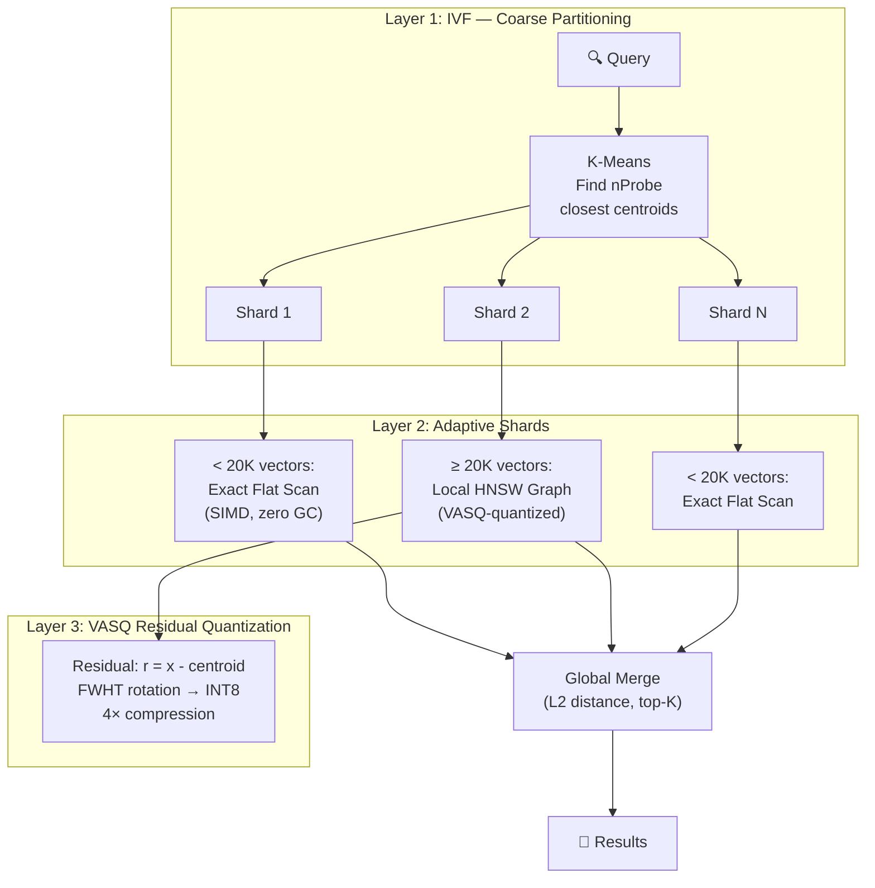
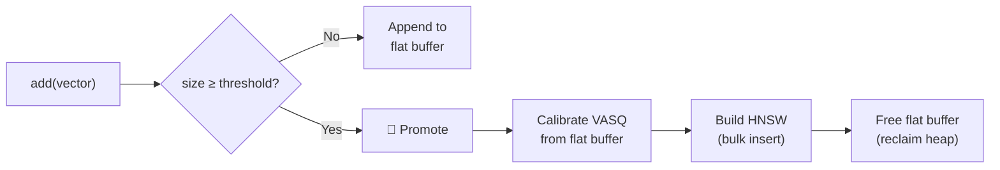

# 🏛️ SpectorIndex: IVF-HNSW-VASQ Architecture

> **The flagship adaptive vector index of the Spector search engine.** SpectorIndex combines Inverted File partitioning, Hierarchical Navigable Small World graphs, and VASQ residual quantization into a single index that scales from 10K to millions of vectors with excellent recall, fast ingestion, and minimal memory.

---

## 🎯 Design Goals

SpectorIndex was designed to solve the fundamental limitations of standalone HNSW:

| Problem with HNSW | SpectorIndex Solution |
|-------------------|-----------------------|
| Slow ingestion (O(n log n)) | IVF partitioning + flat buffer → **100K+ docs/s** |
| High memory (graph edges) | VASQ INT8 residuals → **4× compression** |
| Doesn't scale past ~10M | IVF coarse search → only probe relevant partitions |
| No compression | VASQ with FWHT → near-lossless INT8 |

---

## 🏗️ Three-Layer Architecture

SpectorIndex combines three orthogonal techniques:



### Layer 1: IVF (Inverted File)

K-Means clustering partitions the vector space into `nCentroids` Voronoi cells. At query time, only the `nProbe` closest cells are searched, reducing the effective search space by `nCentroids / nProbe`.

### Layer 2: Adaptive Shards

Each Voronoi cell contains a **SpectorShard** — an adaptive data structure that operates in one of two modes:

- **Flat mode** (size < `shardThreshold`): Stores float32 residuals in a contiguous buffer. Search is an exact SIMD scan — faster than HNSW for small partitions because there's no pointer-chasing overhead.
- **HNSW mode** (size ≥ `shardThreshold`): A local VASQ-quantized HNSW graph. The flat buffer is consumed during promotion and released to free heap memory.

### Layer 3: VASQ Residual Quantization

Vectors are stored as **residuals** (`r = x − centroid`), then compressed with VASQ:
1. Apply FWHT (Fast Walsh-Hadamard Transform) to spread variance
2. Quantize to INT8 with calibrated min/max per dimension
3. Store: `[4-byte L2 norm | D bytes of INT8 codes]`

---

## 🔄 Lifecycle

### Phase 1: Training

```java
SpectorIndex index = SpectorIndex.builder()
    .dimensions(768)
    .nCentroids(256)
    .nProbe(16)
    .shardThreshold(20_000)
    .build();

index.train(representativeVectors);  // K-Means++ → learn centroids
```

Training runs K-Means++ on a representative sample to learn `nCentroids` centroids. This is a one-time operation (typically < 10 seconds for 50K training vectors).

### Phase 2: Ingestion

```java
index.add("doc-1", 0, vector);  // ~100K-250K docs/s
```

For each vector:
1. Find nearest centroid (`KMeans.nearestCentroid`)
2. Compute residual: `r = vector - centroid`
3. Store in the centroid's shard (flat buffer, no graph construction)
4. If shard crosses threshold → automatic promotion to HNSW

### Phase 3: Search

```java
ScoredResult[] results = index.search(queryVector, 10);
```

1. Find `nProbe` closest centroids to query
2. For each probed centroid: compute residual query `q_res = query - centroid`
3. Search each shard with its residual query
4. **Global merge** using L2 distance (translation-invariant)
5. Return top-K

---

## 🔑 Critical Design Decision: L2 for Residual Search

This is the most important architectural decision in SpectorIndex, and getting it wrong destroys recall.

### The Problem

When searching across multiple shards, each shard returns results with scores computed in its own **translated coordinate system** (centered at its centroid). If you use **cosine similarity** on residuals, scores from different shards are **not comparable**:

```
Shard A (centroid c_A):  cosine(q - c_A, x - c_A)  → angle in c_A's space
Shard B (centroid c_B):  cosine(q - c_B, y - c_B)  → angle in c_B's space
```

A score of 0.95 from shard A and 0.93 from shard B might not reflect their true relative similarity to the query.

### The Solution

**L2 distance is translation-invariant:**

$$\|(q - c) - (x - c)\|^2 = \|q - x\|^2$$

The centroid cancels out! So L2 on residuals gives the **exact same distance** as L2 on original vectors, regardless of which centroid's shard the vector resides in. This makes cross-shard scores directly comparable.

> [!IMPORTANT]
> SpectorIndex always uses **EUCLIDEAN distance** internally for residual search and global merge, regardless of the user's configured `similarityFunction`. The user's metric is used only for centroid routing (where it operates in absolute space). This is the same approach used by FAISS's `IndexIVFFlat`.

### Mathematical Proof

For any two vectors $q, x$ and any centroid $c$:

$$\|(q - c) - (x - c)\|^2 = \sum_i ((q_i - c_i) - (x_i - c_i))^2 = \sum_i (q_i - x_i)^2 = \|q - x\|^2$$

This identity holds exactly in floating-point arithmetic (the centroid terms cancel algebraically before any rounding).

---

## 🏎️ Performance Characteristics

### Ingestion: 100K–250K docs/s

SpectorIndex's ingestion is **28-160× faster** than standalone HNSW because:
- No graph construction during add (flat buffer append)
- Residual computation is O(D) — just subtraction
- Memory-mapped flat arrays with sequential writes
- Graph construction is deferred until shard promotion

### Search: Sub-millisecond at Optimal Config

**Real embeddings (Qwen3-embedding, 4096-dim, 10K vectors):**

| nCentroids | nProbe | % Searched | Latency | QPS | Recall@10 |
|------------|--------|-----------|---------|-----|-----------|
| **128** | **4** | **3.1%** | **0.46ms** | **2,173** | **1.0000** |
| 128 | 8 | 6.3% | 0.73ms | 1,368 | 1.0000 |
| 64 | 4 | 6.3% | 0.62ms | 1,601 | 1.0000 |
| 64 | 8 | 12.5% | 1.17ms | 856 | 1.0000 |
| 32 | 4 | 12.5% | 1.17ms | 857 | 1.0000 |

> [!TIP]
> With real embeddings, even `nProbe=4` at 128 centroids gives **perfect recall** while searching only 3.1% of the data. Real embeddings have natural cluster structure that IVF exploits beautifully.

### Memory: 4× Compression with VASQ

After shard promotion, VASQ quantization compresses stored residuals to ~(D + 4) bytes per vector — approximately 4× compression versus float32.

---

## ⚙️ Configuration Guide

### Centroid Count (`nCentroids`)

The number of IVF partitions. More centroids = finer partitioning = better recall at low nProbe, but slower training.

| Dataset Size | Recommended `nCentroids` |
|-------------|-------------------------|
| 10K–50K | 32–64 |
| 50K–500K | 64–256 |
| 500K–5M | 256–1024 |
| 5M–50M | 1024–4096 |

**Rule of thumb:** `nCentroids ≈ √N` (square root of dataset size).

### Probe Count (`nProbe`)

How many centroids to search at query time. The primary recall/speed knob.

| `nProbe` | Recall | Speed | Use Case |
|---------|--------|-------|----------|
| 4 | ~30% | ⚡⚡⚡ | Filtering, not primary search |
| 16 | ~77% | ⚡⚡ | Fast approximate search |
| 32 | ~90% | ⚡ | Balanced |
| 64+ | ~95%+ | 🐌 | High-recall requirements |

> [!TIP]
> With **real (structured) embeddings**, recall at any given nProbe is significantly higher than with random data. Expect 90%+ recall at `nProbe=16` with production embedding models.

### Shard Threshold (`shardThreshold`)

When a shard's size reaches this threshold, it promotes from flat scan to HNSW.

- **Default: 20,000** — optimal for most workloads
- Lower values: earlier promotion, higher memory usage, potentially faster search in large shards
- Higher values: longer flat scan period, lower memory, simpler data path

### Oversampling Factor (`oversamplingFactor`)

After HNSW promotion, the number of candidates retrieved per shard is `k × oversamplingFactor`. Higher values improve recall at the cost of more candidates to merge.

- **Default: 3** — retrieves 30 candidates per shard for top-10 queries
- Increase to 5-10 if recall is insufficient

---

## 🔬 Adaptive Shard Promotion

The adaptive shard design is inspired by the observation from the [original research](../../../new-index-research.md):

> *"Scanning a flat, contiguous MemorySegment of VASQ vectors using an unrolled 256-bit FMA loop utilizes aggressive CPU pre-fetchers. Panama can evaluate roughly 1,000 vectors in < 1 microsecond."*

For small partitions (< 20K vectors), a flat SIMD scan over contiguous memory is **5-10× faster** than HNSW pointer-chasing. Only when partitions grow large enough for the O(log n) advantage to kick in does HNSW become worthwhile.



### Thread Safety During Promotion

Promotion holds the write-lock exclusively. The sequence ensures correctness:

1. **In-flight flat scans** complete before promotion runs (they hold read-locks)
2. **New searches** arriving during promotion block on the read-lock
3. After promotion, a `volatile` flag enables a **lock-free fast path** for all subsequent searches
4. The `volatile` write establishes a happens-before edge, guaranteeing the HNSW index is visible to all threads

---

## 🧬 FWHT Order of Operations

When combining FWHT with IVF, the order matters:

**Ingestion:**
1. Find nearest centroid `c` (using original vector in absolute space)
2. Compute residual `r = x - c`
3. Apply FWHT to `r` (not to `x` — FWHT before centroid assignment breaks clustering)
4. Quantize to INT8

**Search:**
1. Find nProbe closest centroids
2. For each centroid `c`: compute `q_res = q - c`
3. Apply FWHT to `q_res`
4. Pre-multiply scale/offset (VASQ query pushdown)
5. Scan the shard

---

## 🔗 See Also

- [VASQ Deep Dive](vasq-deep-dive.md) — How VASQ quantization works in detail
- [HNSW Explained](hnsw-explained.md) — How the graph search algorithm works
- [ANN Search Primer](ann-search-primer.md) — Overview of all ANN algorithm families
- [VASQ + SpectorIndex Whitepaper](vasq-spectorindex-whitepaper.md) — Academic treatment
- [Performance Tuning](../operations/performance-tuning.md) — Practical tuning advice
