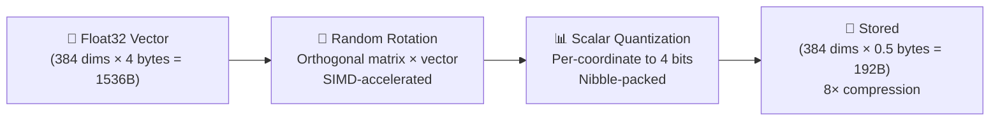

# ⚡ TurboQuant: Near-Optimal Vector Quantization

> **8× compression with ~97%+ recall — no heavy training required.** TurboQuant applies a random orthogonal rotation before scalar quantization, making per-coordinate quantization near-optimal for any data distribution.

---

## 🧠 How It Works

TurboQuant is a two-step quantization scheme:



### Step 1: Random Orthogonal Rotation

A fixed random orthogonal matrix R is applied to every vector before quantization. This:


- **Isotropizes** the distribution — coordinates become near-independent

- **Spreads information** uniformly across all dimensions

- **Preserves distances** — orthogonal transforms don't change L2/cosine/IP

The rotation matrix is generated once at calibration time from a deterministic seed.

### Step 2: Per-Coordinate Scalar Quantization

After rotation, each coordinate is quantized independently using linear min/max scaling to 4-bit values [0, 15]. Because the rotation made coordinates near-independent and uniformly distributed, this simple scalar quantization achieves near-optimal distortion rates.

---

## 📊 Comparison with Other Quantization Methods

| Method | Compression | Recall@10 | Training | SIMD-Friendly |
|--------|-------------|-----------|----------|---------------|
| Float32 (none) | 1× | 100% | None | ✅ |
| Scalar INT8 | 4× | ~99.5% | Min/max calibration | ✅ |
| **TurboQuant (4-bit)** | **8×** | **~97%+** | **Rotation + min/max** | **✅** |
| Scalar INT4 | 8× | ~93% | Quantile calibration | ✅ |
| Product Quantization | 32× | ~95% | K-Means (expensive) | ❌ |
| Scalar INT2 | 16× | ~88% | Quantile calibration | ✅ |

### Key Advantages over Standard SQ4

Standard INT4 quantization has uneven distortion because embedding dimensions are correlated and non-uniform. TurboQuant's rotation decorrelates them first, resulting in:


- **4-5% higher recall** at the same bit budget

- **No quantile training** needed (just min/max in rotated space)

- **Better theoretical guarantees** (matches rate-distortion bounds)

### Key Advantages over Product Quantization


- **No K-Means training** — PQ requires expensive clustering; TurboQuant is data-oblivious

- **Simpler implementation** — No codebooks, no ADC lookup tables

- **SIMD-friendly** — Packed 4-bit values use the same NibblePacker as standard SQ4

- **Lower latency** — Direct scalar operations vs. table lookups

---

## 🚀 SIMD-Accelerated Implementation

The rotation (the most expensive step) uses the Java Vector API for hardware acceleration:

```java
// Inner dot product uses SIMD fused-multiply-add
FloatVector mv = FloatVector.fromArray(SPECIES, matrixRow, j);
FloatVector vv = FloatVector.fromArray(SPECIES, vector, j);
acc = mv.fma(vv, acc);  // acc += mv * vv (single instruction)
```

### Memory Layout Optimizations

| Optimization | Purpose |
|--------------|---------|
| Flat 1D array (not `float[][]`) | Sequential memory access, no pointer chasing |
| Pre-transposed matrix for inverse | Cache-friendly row access during decode |
| `System.arraycopy` for bulk ops | JVM intrinsic, bypasses bounds checks |
| SIMD dot products in Gram-Schmidt | Faster calibration (one-time cost) |

### Performance Characteristics

| Operation | Complexity | SIMD Speedup |
|-----------|-----------|--------------|
| Rotation (384-dim) | O(n²) = 147K muls | ~4-8× via FMA lanes |
| Scalar quantize | O(n) = 384 ops | Negligible cost |
| Pack to nibbles | O(n) = 192 bytes | Memory-bound |
| Distance computation | O(n) per vector | Same as scalar |

> [!NOTE]
> For 384-dim vectors, rotation takes ~20µs on modern hardware with AVX2. This is amortized across thousands of distance computations in a search query.

---

## 💻 Usage

### Calibration

```java
// Calibrate from a representative sample (100+ vectors recommended)
float[][] sampleVectors = loadSampleVectors();
TurboQuantizer tq = TurboQuantizer.calibrate(sampleVectors, 384, 4, 42L);
//                                           samples    dims  bits seed
```

The calibration:
1. Generates a random orthogonal matrix from the seed
2. Rotates all sample vectors
3. Computes per-dimension min/max in the rotated space (with 5% margin)

### Encoding & Decoding

```java
// Encode a vector
TurboQuantizer.TurboCode code = tq.encode(vector);
// code.packed() → 192 bytes (384 dims × 4 bits / 8)
// code.norm()   → original L2 norm (for cosine/IP reconstruction)

// Decode (approximate reconstruction)
float[] reconstructed = tq.decode(code);
```

### Distance Computation

```java
// Approximate distances in quantized space
float l2dist = tq.approximateL2Distance(queryVector, code);
float ip     = tq.approximateInnerProduct(queryVector, code);
float cosine = tq.approximateCosineSimilarity(queryVector, code);
```

### Batch-Optimized Search

```java
// Rotate query once, then scan many database vectors
float[] rotatedQuery = tq.rotateQuery(queryVector);

for (byte[] dbVector : database) {
    float dist = tq.distanceFromRotatedQuery(rotatedQuery, dbVector);
    // ...
}
```

### With QuantizedVectorStore

```java
// Create a TurboQuant-backed store
var store = new QuantizedVectorStore(384, 100_000, turboQuantizer);

// Store vectors (automatically rotated + quantized)
store.put("doc-1", embedding);

// Retrieve (automatically dequantized + inverse-rotated)
float[] approx = store.getFloat(0);
```

### With SpectorEngine

```java
SpectorEngine engine = SpectorEngine.builder()
    .dimensions(384)
    .quantization(QuantizationType.TURBO_QUANT)
    .build();
```

---

## 🔬 Mathematical Foundation

TurboQuant is based on the observation that for a random orthogonal rotation R:

1. If x has any distribution, then Rx has coordinates that are **near-independent**
2. For near-independent coordinates, **per-coordinate scalar quantization** achieves the **rate-distortion bound**
3. The rotation preserves all geometric relationships (L2, cosine, IP)

This means:

- **MSE** between original and reconstructed vectors is minimized

- **Inner product estimation** is near-unbiased

- **Nearest-neighbor search** quality matches the information-theoretic optimum for the given bit budget

> [!TIP]
> For most use cases, 4-bit TurboQuant is the sweet spot: 8× compression with recall loss under 3%. Use 8-bit for maximum quality (4× compression, <0.5% loss) or 2-bit for extreme compression (16×, ~8% loss).

---

## 🔗 See Also


- [Understanding Quantization](understanding-quantization.md) — Quantization theory and tradeoffs

- [Quantization Comparison](quantization-comparison.md) — Benchmarks across all modes

- [Architecture Overview](../architecture/overview.md) — How quantization fits in the stack

- [Configuration Guide](../configuration/parameters.md) — Setting quantization parameters
