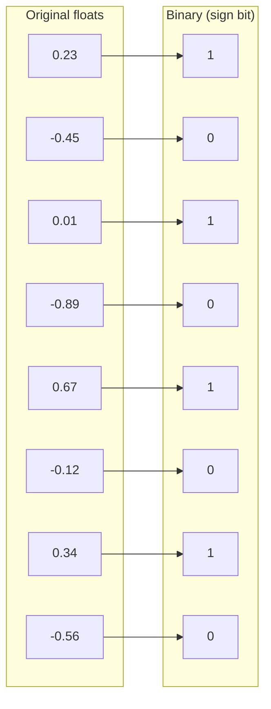
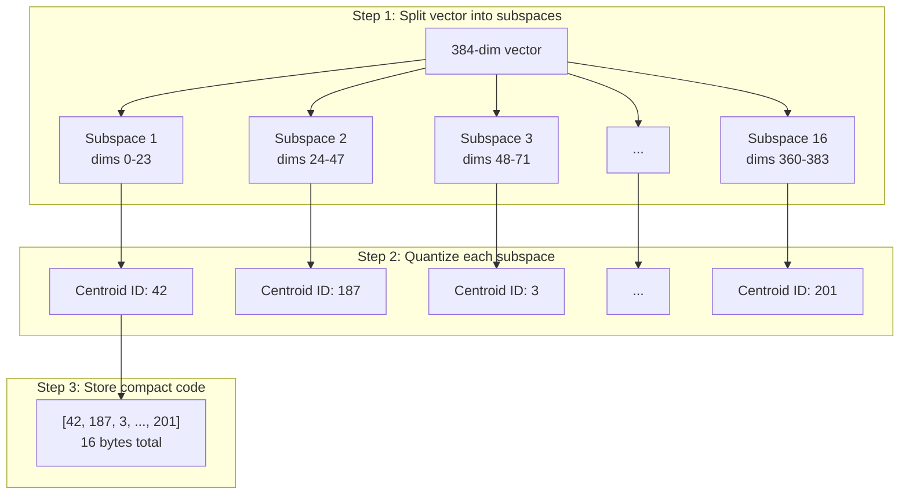
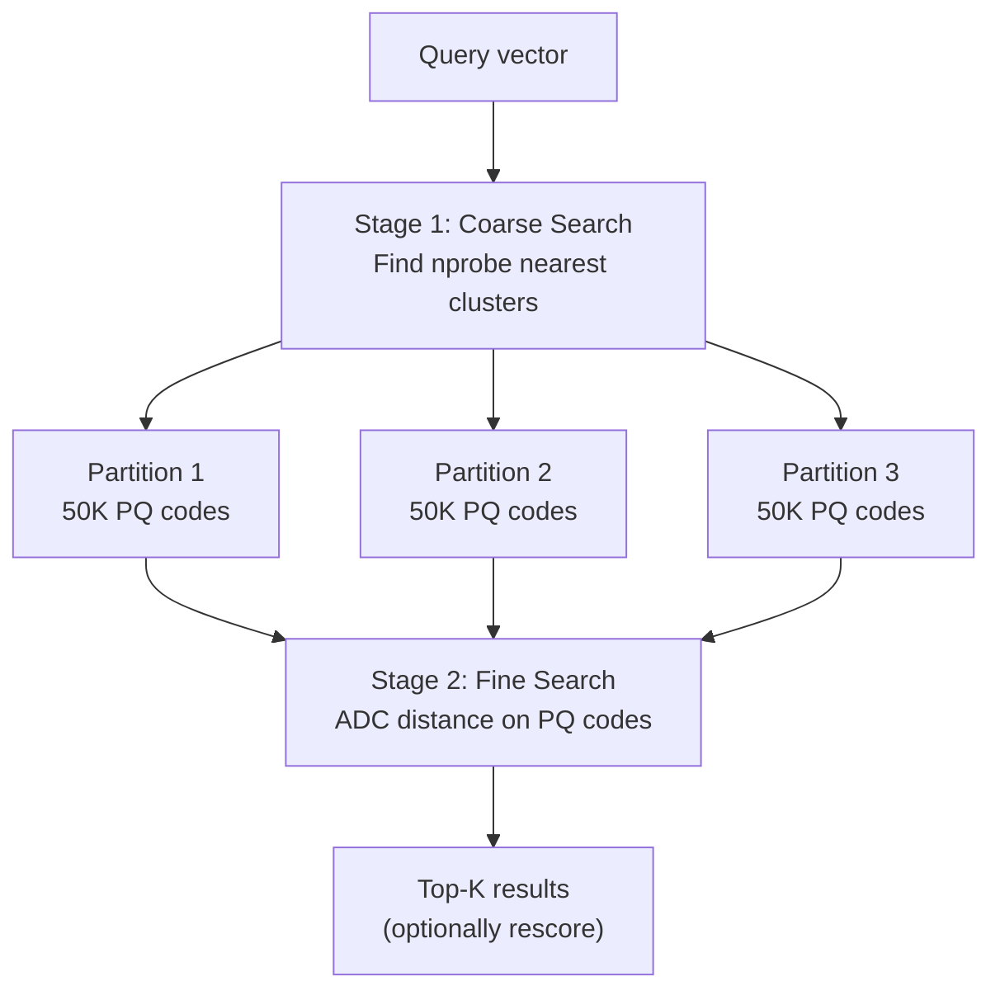
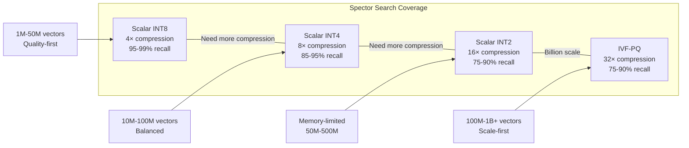

# 🗜️ Understanding Quantization

> **How search engines compress vectors to fit billions of embeddings in memory.** This page explains vector quantization from first principles — what it is, why it matters, and how different techniques trade off accuracy for efficiency.

---

## 🤔 What is Quantization?

Think of quantization like compressing a photo. A RAW image from your camera might be 25 MB — full precision, every detail preserved. Save it as JPEG and it drops to 2 MB. You lose some information, but for most purposes the image looks identical.

Vector quantization does the same thing for embeddings. When a machine learning model encodes text or images, it produces a **vector** — a list of numbers (typically 128–1536 floating-point values) that captures meaning. These vectors are precise, but they're also *big*.

```
"The quick brown fox" → [0.0234, -0.1567, 0.4521, ..., 0.0891]
                         ↑ 384 float32 values = 1,536 bytes per vector
```

Quantization reduces the precision of each number — or replaces groups of numbers with compact codes — so vectors take less space while still being "close enough" for similarity search.

!!! note
    **Quantization ≠ dimensionality reduction.** Dimensionality reduction (like PCA) removes dimensions entirely. Quantization keeps all dimensions but reduces the *precision* of each value.

---

## 💰 Why Compress Vectors?

Let's do the math. A typical embedding model produces 384-dimensional vectors in float32:

```
1 vector = 384 dimensions × 4 bytes = 1,536 bytes
```

Now scale that up:

| Dataset Size | Memory (float32) | With 4× Compression | With 32× Compression |
|-------------|-----------------|---------------------|----------------------|
| 100K vectors | 146 MB | 37 MB | 4.6 MB |
| 1M vectors | **1.5 GB** | 375 MB | 46 MB |
| 10M vectors | **15 GB** | 3.7 GB | 460 MB |
| 100M vectors | **150 GB** | 37 GB | 4.6 GB |
| 1B vectors | **1.5 TB** | 375 GB | **46 GB** |

At billion scale, full-precision vectors require **1.5 terabytes** of RAM — far beyond what typical servers provide. With 32× compression (Product Quantization), that same dataset fits in 46 GB — a single machine with a decent memory budget.

!!! tip
    Even at smaller scales, compression matters. Less memory means better cache utilization, which means faster search. A 4× compressed index that fits in L3 cache will outperform a full-precision index that spills to RAM.

---

## 📊 Types of Quantization

### 🔢 Scalar Quantization (INT8)

The simplest approach: map each float32 value to an int8 (8-bit integer). This gives exactly **4× compression** — every 4-byte float becomes a 1-byte integer.

#### How It Works

For each dimension, find the min and max values across all vectors, then linearly scale every float into the [0, 255] range:

```
quantized_value = round(255 × (value - min) / (max - min))
```

To reconstruct (dequantize):

```
reconstructed = min + quantized_value × (max - min) / 255
```

#### Properties

| Metric | Value |
|--------|-------|
| Compression ratio | **4×** |
| Recall@10 | **≥ 95%** (often 98%+) |
| Speed impact | Faster (smaller data = better cache) |
| Complexity | Very low — simple min/max scaling |
| Calibration | Linear (min/max per dimension) |

!!! tip
    Scalar INT8 is the "safe default" — you get meaningful memory savings with almost no recall loss. Start here unless you need more aggressive compression.

---

### 🔢 Scalar Quantization (INT4) — Non-Uniform

INT4 quantization maps each float32 value to a 4-bit integer (0–15), packed two values per byte. This gives **8× compression**. Unlike INT8's linear mapping, INT4 uses **non-uniform (quantile-based) calibration** to better preserve the data distribution.

#### How It Works

1. **Calibration:** Compute quantile-based boundaries per dimension from a representative sample. This creates 16 non-uniformly spaced buckets that match the actual data distribution.
2. **Encoding:** Assign each dimension value to the nearest boundary interval (0–15).
3. **Packing:** Store two 4-bit values per byte (nibble packing) — first value in bits 7–4, second in bits 3–0.

```
Original:    [0.23, -0.45, 0.67, 0.01]
Encoded:     [9, 2, 14, 7]       (4-bit level per dimension)
Packed:      [0x92, 0xE7]        (two nibbles per byte → 50% storage)
```

#### Properties

| Metric | Value |
|--------|-------|
| Compression ratio | **8×** |
| Recall@10 | **85–95%** (with rescore) |
| Speed impact | Fast — SIMD-accelerated packed dot product |
| Complexity | Medium — requires calibration on representative data |
| Calibration | Non-uniform (quantile-based boundaries per dimension) |
| Rescore default | 3× oversampling |

!!! tip
    INT4 hits the sweet spot between INT8 and IVF-PQ: **8× compression with 85–95% recall** when paired with the configurable rescore strategy. Ideal for 10M–100M vector workloads that can't afford full PQ training complexity.

---

### 🔢 Scalar Quantization (INT2) — Non-Uniform

INT2 quantization maps each float32 value to a 2-bit integer (0–3), packed four values per byte. This gives **16× compression** — the most aggressive scalar quantization before going to binary.

#### How It Works

1. **Calibration:** Same quantile-based approach as INT4, but with only 4 buckets per dimension.
2. **Encoding:** Assign each dimension value to one of 4 levels.
3. **Packing:** Store four 2-bit values per byte (crumb packing) — values stored in bits 7–6, 5–4, 3–2, 1–0.

```
Original:    [0.23, -0.45, 0.67, 0.01]
Encoded:     [2, 0, 3, 1]        (2-bit level per dimension)
Packed:      [0x8D]              (four crumbs per byte → 75% storage reduction)
```

#### Properties

| Metric | Value |
|--------|-------|
| Compression ratio | **16×** |
| Recall@10 | **75–90%** (with rescore) |
| Speed impact | Fastest scalar — minimal data to scan |
| Complexity | Medium — same calibration as INT4 |
| Calibration | Non-uniform (quantile-based boundaries per dimension) |
| Rescore default | 5× oversampling |

!!! important
    INT2 is aggressive — only 4 levels per dimension. The higher default oversampling (5×) compensates by rescoring more candidates with exact float32 distances. Best suited for memory-constrained environments where you accept some recall trade-off.

---

### 🔲 Binary Quantization (1-bit)

The most aggressive approach: each float becomes a single bit — 0 if negative, 1 if positive. This gives **32× compression** (32 float32 values → 32 bits = 4 bytes).

#### How It Works

```
bit = 1 if value > 0, else 0
```

A 384-dimensional vector becomes just 384 bits = **48 bytes** (down from 1,536 bytes).



#### Hamming Distance

With binary vectors, similarity is measured using **Hamming distance** — just count how many bits differ. Modern CPUs have a hardware `POPCNT` instruction that makes this blazing fast:

```
vector_a = 10101010
vector_b = 10100110
XOR      = 00001100  → popcount = 2 (Hamming distance = 2)
```

#### Properties

| Metric | Value |
|--------|-------|
| Compression ratio | **32×** |
| Recall@10 | **60–80%** (varies by dataset) |
| Speed impact | Extremely fast (bitwise ops + POPCNT) |
| Complexity | Trivial — just sign extraction |

!!! important
    Binary quantization loses significant information. It works best with **high-dimensional embeddings** (768+) where the sign pattern alone carries meaning. For 384-dim or lower, expect noticeable recall degradation. Always pair with rescoring (recompute exact distance on top candidates).

---

### 🧩 Product Quantization (PQ)

Product Quantization is the "sweet spot" — achieving **32× compression** while maintaining much higher recall than binary quantization. It's more complex, but the idea is elegant.

#### The Core Idea

Instead of compressing each number independently, PQ groups dimensions into **subspaces** and finds the best approximation for each group from a learned codebook.

#### Step by Step



**Training phase:**
1. Split all vectors into M subspaces (e.g., 16 subspaces of 24 dims each)
2. Run K-Means clustering on each subspace independently (K=256 centroids)
3. Store the 16 codebooks (256 centroids × 24 dims × 4 bytes each)

**Encoding phase:**
1. For each vector, split into M subspaces
2. Find the nearest centroid in each subspace's codebook
3. Store M centroid indices (1 byte each) → **M bytes per vector**

**Search phase (Asymmetric Distance Computation):**
1. Compute distances from the *full-precision query* to all 256 centroids in each subspace → 256 × M lookup table
2. For each stored code, sum up M table lookups → approximate distance
3. Return top candidates (optionally rescore with full vectors)

#### Properties

| Metric | Value |
|--------|-------|
| Compression ratio | **32×** (with 16 subspaces) to **96×** (with 48 subspaces) |
| Recall@10 | **80–92%** (depends on subspaces and dataset) |
| Speed impact | Fast — table lookups instead of floating-point math |
| Complexity | High — requires training codebooks on representative data |

!!! note
    The "product" in Product Quantization refers to the Cartesian product of subspace codebooks. Each subspace is quantized independently, and the full approximation is the product of these independent approximations.

---

### 📂 IVF-PQ (Inverted File + Product Quantization)

IVF-PQ combines two techniques for maximum efficiency at billion scale:

1. **IVF (Inverted File):** Partition vectors into clusters using K-Means. At search time, only examine the nearest clusters.
2. **PQ (Product Quantization):** Compress vectors within each cluster.

#### Two-Level Search



**How it reduces work:**
- With 1000 partitions and `nprobe=10`, you only examine **1% of the dataset**
- Within those partitions, PQ codes are tiny, so scanning is cache-friendly
- Combined effect: search billions of vectors in milliseconds

#### Properties

| Metric | Value |
|--------|-------|
| Compression ratio | **32×** (same as PQ) |
| Recall@10 | **75–90%** (depends on nprobe and PQ settings) |
| Speed | Very fast — coarse filtering + compressed scan |
| Scale | **Billions of vectors** on a single node |
| Complexity | Requires training (K-Means for partitions + PQ codebooks) |

!!! tip
    **Tuning `nprobe`** is the key recall/speed knob. Higher nprobe = more partitions searched = higher recall but slower queries. Start with nprobe=10 and increase until you hit your recall target.

---

## 📋 Comparison Table

| Method | Compression | Recall@10 | Speed | Memory (1B × 384d) | Best For |
|--------|------------|-----------|-------|---------------------|----------|
| **Scalar INT8** | 4× | 95–99% | ⚡ Fast | 375 GB | High-recall, moderate scale |
| **Scalar INT4** | 8× | 85–95% | ⚡ Fast | 188 GB | Balanced compression/recall |
| **Scalar INT2** | 16× | 75–90% | ⚡⚡ Very Fast | 94 GB | Memory-constrained, pre-filter |
| **Binary (1-bit)** | 32× | 60–80% | ⚡⚡ Fastest | 46 GB | First-pass candidate generation |
| **Product Quantization** | 32–96× | 80–92% | ⚡ Fast | 46 GB (32×) | Large-scale with good recall |
| **IVF-PQ** | 32–96× | 75–90% | ⚡⚡ Very Fast | 46 GB (32×) | Billion-scale, balanced |

---

## 🎯 What Spector Search Uses

Spector Search provides a full spectrum of scalar quantization plus IVF-PQ, covering every memory/recall trade-off:

### Scalar INT8 — For High-Recall Scenarios

When recall is critical (search quality matters more than memory), Scalar INT8 delivers:
- **4× compression** with nearly lossless quality (≥ 95% recall)
- Simple min/max calibration — no training phase needed
- SIMD-friendly — int8 operations parallelize beautifully on modern CPUs
- Ideal for datasets up to ~50M vectors on a 64 GB machine

### Scalar INT4 — The Balanced Sweet Spot

When you need more compression than INT8 but don't want the complexity of PQ:
- **8× compression** with **85–95% recall** when paired with rescore
- Non-uniform (quantile-based) calibration adapts to your data distribution
- Nibble-packed storage (2 values/byte) with SIMD-accelerated distance
- Default 3× oversampling rescore recovers recall lost to quantization
- Ideal for 10M–100M vector workloads on moderate hardware

### Scalar INT2 — Maximum Scalar Compression

When memory is the primary constraint and you can tolerate some recall loss:
- **16× compression** — just 4 levels per dimension
- Same quantile-based calibration as INT4 for optimal bucket placement
- Crumb-packed storage (4 values/byte) for minimal memory footprint
- Default 5× oversampling rescore compensates for aggressive quantization
- Ideal for memory-constrained environments or as a fast pre-filter

### IVF-PQ — For Billion-Scale Scenarios

When you need to search billions of vectors on commodity hardware:
- **32× compression** brings 1B vectors down to ~46 GB
- Two-level search (coarse IVF + fine PQ) keeps latency low
- Trained codebooks preserve more information than binary quantization
- `nprobe` parameter lets you dial recall vs. speed at query time

### Configurable Rescore Strategy

All quantization modes support an **oversampling-based rescore** to recover recall:
1. Retrieve `oversamplingFactor × k` candidates using fast quantized distance
2. Recompute exact float32 distances for those candidates
3. Return the true top-K based on exact scores

| Quantization | Default Oversampling | Effective Recall |
|-------------|---------------------|-----------------|
| INT8 | 1 (no rescore) | 95–99% |
| INT4 | 3× | 85–95% |
| INT2 | 5× | 75–90% |

!!! note
    Set oversampling to 1 to disable rescore entirely (faster but lower recall). GPU acceleration for INT4/INT2 requires dimensions to be a multiple of 32; otherwise Spector automatically falls back to CPU/SIMD.

### The Full Spectrum



---

## 💻 Code Examples

### Configuring Scalar INT8 Quantization

```java
// Scalar INT8 — 4× compression, near-lossless recall
var config = SpectorConfig.DEFAULT
    .withDimensions(384)
    .withCapacity(10_000_000)       // 10M vectors
    .withQuantization(QuantizationType.SCALAR_INT8);

try (var engine = new SpectorEngine(config)) {
    // Ingest as normal — quantization happens automatically
    engine.ingest("doc-1", "Vector search fundamentals", embedding);
    
    // Search uses quantized vectors for distance computation
    // Recall remains ≥ 95% with 4× less memory
    var results = engine.hybridSearch("vector compression", queryVector, 10);
}
```

### Configuring Scalar INT4 (Non-Uniform, with Rescore)

```java
// Scalar INT4 — 8× compression, non-uniform calibration, rescore for recall
var config = SpectorConfig.DEFAULT
    .withDimensions(384)
    .withCapacity(50_000_000)       // 50M vectors
    .withQuantization(QuantizationType.SCALAR_INT4)
    .withRescore(3);                // 3× oversampling (default for INT4)

try (var engine = new SpectorEngine(config)) {
    // Calibration happens automatically from ingested vectors
    engine.ingestBulk(vectors);
    
    // Search: fast quantized distance → rescore top candidates with exact float32
    // Effective recall: 85–95%
    var results = engine.vectorSearch(queryVector, 10);
}
```

### Configuring Scalar INT2 (Maximum Compression)

```java
// Scalar INT2 — 16× compression, aggressive but memory-efficient
var config = SpectorConfig.DEFAULT
    .withDimensions(384)
    .withCapacity(100_000_000)      // 100M vectors
    .withQuantization(QuantizationType.SCALAR_INT2)
    .withRescore(5);                // 5× oversampling (default for INT2)

try (var engine = new SpectorEngine(config)) {
    engine.ingestBulk(vectors);
    
    // 16× less memory than float32 — fits large datasets in RAM
    // Rescore compensates for aggressive quantization
    var results = engine.vectorSearch(queryVector, 10);
}
```

### Configuring IVF-PQ for Billion-Scale

```java
// IVF-PQ — 32× compression for billion-scale datasets
var config = SpectorConfig.DEFAULT
    .withDimensions(384)
    .withCapacity(1_000_000_000)    // 1 billion vectors
    .withQuantization(QuantizationType.IVF_PQ)
    .withIvfPartitions(4096)        // Number of coarse clusters
    .withPqSubspaces(32)            // Subspaces (384/32 = 12 dims each)
    .withNprobe(16);                // Partitions to search (recall/speed knob)

try (var engine = new SpectorEngine(config)) {
    // Training happens automatically on first batch of vectors
    engine.ingestBulk(trainingVectors);  // First batch trains codebooks
    
    // Subsequent ingestion uses trained codebooks
    engine.ingestBulk(remainingVectors);
    
    // Search: coarse IVF lookup → PQ distance within partitions
    var results = engine.vectorSearch(queryVector, 10);
}
```

### REST API Configuration

```bash
# Start with Scalar INT4 + rescore
curl -X PUT http://localhost:7070/api/v1/config \
  -H "Content-Type: application/json" \
  -d '{
    "quantization": "scalar_int4",
    "oversamplingFactor": 3
  }'

# Start with Scalar INT2 + higher rescore for better recall
curl -X PUT http://localhost:7070/api/v1/config \
  -H "Content-Type: application/json" \
  -d '{
    "quantization": "scalar_int2",
    "oversamplingFactor": 5
  }'

# Start with IVF-PQ
curl -X PUT http://localhost:7070/api/v1/config \
  -H "Content-Type: application/json" \
  -d '{
    "quantization": "ivf_pq",
    "ivfPartitions": 4096,
    "pqSubspaces": 32,
    "nprobe": 16
  }'
```

---

## 🔗 See Also

- [Core Concepts](../architecture/core-concepts.md) — HNSW, BM25, RRF, and SIMD fundamentals
- [Quantization Comparison](quantization-comparison.md) — How different engines approach quantization
- [Performance Tuning](../operations/performance-tuning.md) — Tuning quantization parameters for your workload
- [Architecture Overview](../architecture/overview.md) — How quantization fits into the storage layer
- [Configuration Guide](../configuration/parameters.md) — All quantization parameters and defaults