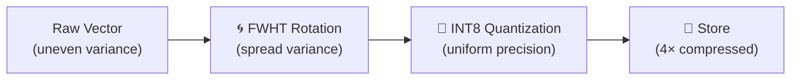
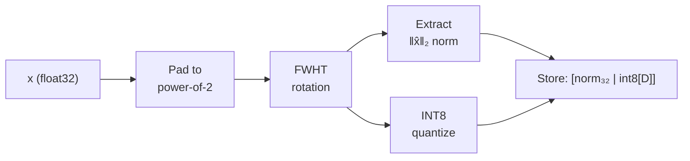
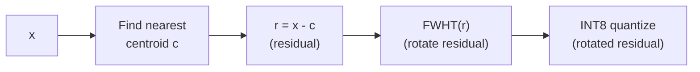

# 🌀 VASQ: Vectorized Affine Scalar Quantization

> **How Spector Search achieves INT8 precision rivaling INT12–INT16 using the Fast Walsh-Hadamard Transform.** VASQ is Spector's custom quantization technique that combines mathematical rotation with affine scalar quantization to minimize information loss. This page explains the theory, implementation, and why it outperforms standard scalar quantization.

---

## 🤔 The Problem with Standard Scalar Quantization

Standard INT8 quantization maps each dimension independently:

```
quantized[i] = round(255 × (value[i] - min[i]) / (max[i] - min[i]))
```

This works well when all dimensions have similar variance. But real embeddings often have **outlier dimensions** — a few dimensions with much larger ranges than the rest:

```
Dim 0:  range [-0.05, 0.05]  → 255 bins across 0.10 range → precision: 0.0004
Dim 42: range [-3.50, 3.50]  → 255 bins across 7.00 range → precision: 0.0275
```

Dimension 42 has **70× worse precision** than dimension 0. Since distance computation sums all dimensions, these imprecise outlier dimensions dominate the quantization error — dragging down recall.

> [!NOTE]
> This problem is particularly acute for transformer embeddings (BERT, GPT, etc.), which often have a few "dominant" dimensions with disproportionately large values.

---

## 💡 The VASQ Insight: Rotate First, Then Quantize

VASQ solves the outlier problem with a two-step approach:

1. **Rotate** the vector using a mathematical transform that **spreads variance uniformly** across all dimensions
2. **Quantize** the rotated vector using standard INT8 — now every dimension has similar precision

The rotation doesn't change any distances (it's an orthogonal transform), but it dramatically improves quantization quality.



---

## 🔬 The Fast Walsh-Hadamard Transform (FWHT)

### What It Does

The FWHT is an orthogonal transform (like the Fourier Transform, but using only +1 and -1 instead of complex exponentials). It multiplies each vector by a **Hadamard matrix**:

$$\hat{x} = H_n \cdot x$$

Where $H_n$ is the Hadamard matrix of order $n$ (a power of 2):

$$H_1 = [1], \quad H_2 = \begin{bmatrix} 1 & 1 \\ 1 & -1 \end{bmatrix}, \quad H_4 = \begin{bmatrix} H_2 & H_2 \\ H_2 & -H_2 \end{bmatrix}$$

### Why It Spreads Variance

Each output dimension of the Hadamard transform is a **sum or difference of all input dimensions** (with alternating signs). If one input dimension has a spike, the Hadamard transform distributes that spike's energy equally across all output dimensions.

**Before FWHT:** One outlier dimension (dim 42) has 100× the variance of others.

**After FWHT:** Every output dimension has roughly equal variance — the outlier's energy is smeared uniformly.

### Why It's Fast

Unlike the FFT (which requires O(n log n) complex multiplications), the FWHT uses only **additions and subtractions** — no multiplications at all:

```java
// In-place FWHT: O(n log n) additions, zero multiplications
for (int len = 1; len < n; len <<= 1) {
    for (int i = 0; i < n; i += len << 1) {
        for (int j = i; j < i + len; j++) {
            float u = data[j];
            float v = data[j + len];
            data[j]       = u + v;  // butterfly add
            data[j + len] = u - v;  // butterfly subtract
        }
    }
}
```

On a modern CPU with SIMD, this processes 128-dim vectors in under **50 nanoseconds**.

### Key Properties

| Property | Value |
|----------|-------|
| Complexity | O(n log n) — only additions/subtractions |
| Invertible | Yes — `FWHT(FWHT(x)) = n·x` |
| Orthogonal | Yes — preserves L2 distances: `‖Hx - Hy‖ = ‖x - y‖` |
| Real-valued | Yes — no complex numbers (unlike FFT) |
| Dimension requirement | Power of 2 (pad if needed) |

> [!IMPORTANT]
> **Distance preservation** is the critical property. Because the Hadamard matrix is orthogonal, `L2(FWHT(x), FWHT(y)) = L2(x, y)`. This means quantizing in the rotated space doesn't introduce any systematic bias — only the random quantization noise, which is now spread uniformly.

---

## 🏗️ VASQ Pipeline

### Ingestion (Encoding)

For each vector `x`:



1. **Pad** the vector to the next power of 2 (e.g., 768 → 1024)
2. **Apply FWHT** — the in-place butterfly transform
3. **Extract and store the L2 norm** of the rotated vector (float32, 4 bytes)
4. **Calibrate** per-dimension min/max from a representative sample
5. **Quantize** each rotated dimension to INT8: `q[i] = round(255 × (x̂[i] - min[i]) / scale[i])`
6. **Store** as `[4-byte norm | D bytes of INT8]`

### Search (Asymmetric Distance Computation)


The key optimization: **query pushdown**. Instead of dequantizing each stored vector, we transform the query into the quantized coordinate system:

```
q̃[i] = (q̂[i] - min[i]) / scale[i]
```

Then the approximate L2 distance reduces to a simple dot product between the transformed float32 query and the stored INT8 codes — which SIMD can compute at billions of operations per second.

---

## 🧬 Residual VASQ: The IVF Superpower

When VASQ is used inside an IVF index (like SpectorIndex), vectors are quantized as **residuals** — the difference from their assigned centroid:

$$r = x - c_{\text{nearest}}$$

### Why Residuals Matter

Residual vectors are **much tighter** than absolute vectors:
- **Absolute coordinates** might span [-3.0, 3.0] → 255 INT8 bins cover a range of 6.0
- **Residual coordinates** span [-0.2, 0.2] → 255 INT8 bins cover a range of 0.4

That's a **15× improvement in quantization precision** — the same 8-bit integer now represents a 15× smaller step size.

> [!TIP]
> **INT8 residual quantization gives the spatial precision of INT12–INT16 absolute quantization.** This is why SpectorIndex achieves excellent recall despite using only 1 byte per dimension.

### The FWHT Order

When combining FWHT with IVF residual quantization, the order of operations matters:



**CRITICAL:** Apply FWHT to the **residual**, not to the raw vector. Applying FWHT before centroid assignment would break the spatial clustering — the Hadamard transform scrambles the dimensions, making K-Means clusters meaningless.

---

## 📊 VASQ vs Other Quantization

| Technique | Compression | Recall@10 | Speed | Notes |
|-----------|------------|-----------|-------|-------|
| Float32 (baseline) | 1× | 100% | ⚡ | Reference |
| **Scalar INT8** | 4× | 95-99% | ⚡⚡ | Simple, good baseline |
| **VASQ INT8** | ~4× | **97-99.5%** | ⚡⚡ | FWHT rotation removes outlier impact |
| Scalar INT4 | 8× | 85-95% | ⚡⚡ | Aggressive, needs rescore |
| Product Quantization | 32× | 80-92% | ⚡ | Complex, requires training |

VASQ achieves the compression of standard INT8 with recall approaching float32 — because the FWHT rotation ensures every dimension contributes equally to the quantized distance.

---

## 💻 Implementation in Spector Search

### VasqCalibrator

Calibrates min/max statistics per dimension from a representative sample:

```java
VasqParams params = VasqCalibrator.calibrate(flatData, sampleSize, dimensions);
// params contains: paddedDim, mins[], scales[], normalization constants
```

### VasqStrategy

Encodes vectors and computes asymmetric distances:

```java
VasqStrategy strategy = new VasqStrategy(params, SimilarityFunction.EUCLIDEAN);

// Encode a residual vector to INT8
byte[] encoded = strategy.encode(residualVector);

// Prepare a query for fast scanning
VasqQueryState qs = strategy.prepareQuery(residualQuery);

// Compute approximate distance (SIMD-accelerated)
float dist = strategy.computeDistance(segment, offset, qs);
```

### VasqSimdKernel

The Panama SIMD kernel that computes VASQ distances directly from off-heap memory:

```java
// Zero-copy: reads INT8 codes directly from MemorySegment
float l2Dist = VasqSimdKernel.computeL2(segment, offset, paddedDim, queryState);
float dotDist = VasqSimdKernel.computeDot(segment, offset, paddedDim, queryState);
```

---

## 📐 Mathematical Proof: Distance Preservation

For completeness, here's why FWHT preserves L2 distance.

The Hadamard matrix $H_n$ (normalized by $1/\sqrt{n}$) is orthogonal: $H^T H = I$.

For any two vectors $x, y$:

$$\|Hx - Hy\|^2 = (Hx - Hy)^T(Hx - Hy) = (x - y)^T H^T H (x - y) = (x - y)^T(x - y) = \|x - y\|^2$$

Therefore: $L2(Hx, Hy) = L2(x, y)$. QED.

The quantization error is now distributed uniformly across all dimensions (because FWHT spread the variance), so the expected quantization error is **minimized** — this is the optimality condition proven by Lyubarskii & Vershynin (2010) for random orthogonal transforms.

---

## 🔗 See Also

- [Understanding Quantization](understanding-quantization.md) — All quantization techniques compared
- [SpectorIndex Architecture](spector-index-architecture.md) — How VASQ fits into the IVF-HNSW index
- [VASQ Whitepaper](vasq-spectorindex-whitepaper.md) — Academic treatment with proofs and benchmarks
- [Quantization Comparison](quantization-comparison.md) — How Spector compares to other engines' quantization
