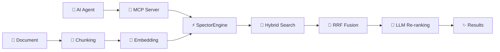

# ⚡ Welcome to Spector

> **The Zero-Overhead, Agent-Ready AI Memory Backbone.**

Welcome to the Spector documentation — your central hub for the high-performance, agent-native AI search engine. Whether you're connecting AI agents via MCP, building RAG pipelines, powering recommendation systems, or need sub-millisecond search with zero infrastructure, you're in the right place.

---

## 🔥 Why Spector?

| Metric | Value |
|--------|-------|
| 🤖 MCP Tools | **6 agent-ready tools** (semantic, hybrid, RAG, ingest, delete, status) |
| ⚡ Vector Search Latency | **0.05 ms** avg @ 10K docs (128-dim) |
| 🔍 Keyword Search Latency | **0.98 ms** avg @ 100K docs |
| 🧬 Hybrid Search Latency | **0.17 ms** avg @ 10K docs |
| 🚀 Vector Throughput | **18,800 queries/sec** @ 10K |
| 🧵 Concurrent Hybrid | **14,000+ ops/sec** @ 16 threads (384-dim) |
| 🗜️ IVF-PQ + TurboQuant | **8–32× memory reduction** |
| ✅ Test Suite | **331+ tests**, all passing |
| 📦 Dependencies | **Zero** (JDK only) |

---

## 🗺️ Quick Navigation

### 🚀 Getting Started

| Page | Description |
|------|-------------|
| [Getting Started](getting-started/quickstart.md) | Build, run, and search in 5 minutes |
| [What is Spector](about.md) | Product overview, use cases, and comparisons |
| [JDK API Status](getting-started/jdk-api-status.md) | Vector API, Panama FFM, and preview feature compatibility |
| [FAQ](faq.md) | Common questions answered |

### 🤖 Agent Integration (MCP)

| Page | Description |
|------|-------------|
| [MCP Integration Architecture](architecture/mcp-integration.md) | How the MCP server works under the hood |
| [MCP Server Guide](sdk-usage/mcp-server.md) | Setup for Claude Desktop, Cursor, and custom agents |

### 🏗️ Architecture & Concepts

| Page | Description |
|------|-------------|
| [Architecture Overview](architecture/overview.md) | Module diagram, data flow, threading model |
| [Core Concepts](architecture/core-concepts.md) | HNSW, IVF-PQ, BM25, RRF, SIMD deep-dives |
| [Ingestion Pipeline](architecture/ingestion-pipeline.md) | Document → chunk → embed → index pipeline |
| [RAG Pipeline](architecture/rag-pipeline.md) | End-to-end retrieval-augmented generation |
| [Distributed Mode](architecture/distributed-mode.md) | Clustering, sharding, and replication |
| [GPU Acceleration](architecture/gpu-acceleration.md) | CUDA setup and kernel details |

### 📖 Reference

| Page | Description |
|------|-------------|
| [REST API Reference](api-reference/rest-endpoints.md) | All endpoints with curl examples |
| [Java SDK Guide](sdk-usage/java-client.md) | Programmatic usage (client + embedded) |
| [Spring AI Integration](sdk-usage/spring-ai.md) | Spring AI VectorStore adapter |
| [CLI Reference](cli-reference/spectorctl.md) | `spectorctl` commands |
| [Configuration Guide](configuration/parameters.md) | All parameters with tuning advice |

### ⚙️ Operations & Community

| Page | Description |
|------|-------------|
| [Performance Tuning](operations/performance-tuning.md) | Benchmarks and optimization strategies |
| [Contributing](operations/contributing.md) | Development setup and PR process |

---

## 💡 Highlights at a Glance

> [!TIP]
> New here? Start with [Getting Started](getting-started/quickstart.md) to build and run your first search in under 5 minutes. Want to connect an AI agent? See the [MCP Server Guide](sdk-usage/mcp-server.md).

---

## 🌟 Project Stats

| | |
|---|---|
| **Language** | Java 25 |
| **License** | Apache 2.0 · [BSL 1.1](https://github.com/spectrayan/spector/blob/main/spector-memory/LICENSE) (memory module) |
| **Modules** | 18 Maven modules |
| **Dependencies** | Zero (JDK only) |
| **SIMD** | AVX2 / AVX-512 / NEON |
| **GPU** | CUDA via Panama FFM |
| **MCP** | Built-in, 6 agent-ready tools |
| **Distributed** | gRPC fan-out + consistent hashing |

---

**Built with ⚡ by [Spectrayan](https://www.spectrayan.com/)** · [GitHub](https://github.com/spectrayan/spector) · [Apache 2.0](https://github.com/spectrayan/spector/blob/main/LICENSE) · [BSL 1.1 (memory)](https://github.com/spectrayan/spector/blob/main/spector-memory/LICENSE)