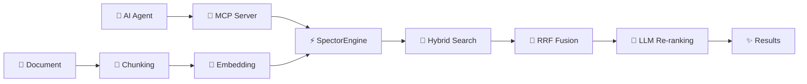

# ⚡ Welcome to Spector

> **The Zero-Overhead, Agent-Ready AI Memory Backbone.**

Welcome to the Spector documentation. Whether you're connecting AI agents via MCP, building RAG pipelines, or need sub-millisecond search with zero infrastructure — you're in the right place.

---

## 🗺️ Choose Your Path

### 🚀 I want to use Spector

| Page | Description |
|------|-------------|
| [Quick Start](getting-started/quickstart.md) | Build, run, and search in 5 minutes |
| [Installation](getting-started/installation.md) | Prerequisites and setup options |
| [MCP Server Guide](sdk-usage/mcp-server.md) | Connect Claude Desktop, Cursor, or custom agents |
| [Configuration](configuration/parameters.md) | All parameters with tuning advice |
| [REST API Reference](api-reference/rest-endpoints.md) | All endpoints with curl examples |
| [Cognitive Memory](memory/index.md) | Getting started with AI agent memory |

### 🧠 I want to understand how it works

| Page | Description |
|------|-------------|
| [Architecture Overview](architecture/overview.md) | Module diagram, data flow, threading model |
| [Core Concepts](architecture/core-concepts.md) | HNSW, IVF-PQ, BM25, RRF, SIMD deep-dives |
| [SVASQ Quantization](deep-dives/svasq-deep-dive.md) | Our proprietary SIMD-first quantization engine |
| [Memory Internals](memory/architecture.md) | How cognitive memory works under the hood |
| [6-Phase Scoring Pipeline](memory/scoring-pipeline.md) | Fused SIMD scoring across memory tiers |
| [Real-Embedding Benchmarks](deep-dives/real-embedding-benchmarks.md) | Empirical sweeps on 4096-dim embeddings |

### 🤝 I want to contribute

| Page | Description |
|------|-------------|
| [Contributing Guide](operations/contributing.md) | Development setup and PR process |
| [JDK API Status](getting-started/jdk-api-status.md) | Vector API, Panama FFM compatibility |
| [FAQ](faq.md) | Common questions answered |

---

## 🔥 Key Numbers

| Metric | Value |
|--------|-------|
| 🧠 Cognitive Recall | **0.13ms** p50 at 1M memories |
| ⚡ Vector Search | **88µs** p50 (10K docs, 128-dim) |
| 🚀 Peak QPS | **61,011** concurrent searches |
| 🤖 MCP Tools | **13 tools** (6 search + 7 cognitive memory) |
| 🗜️ Compression | **4×–32×** (SVASQ-8 to IVF-PQ) |
| ✅ Test Suite | **685+ tests**, all passing |
| 📦 Dependencies | **Zero** (JDK only) |

---

## 💡 How It Works

> [!TIP]
> New here? Start with [Quick Start](getting-started/quickstart.md) to build and run your first search in under 5 minutes. Want to connect an AI agent? See the [MCP Server Guide](sdk-usage/mcp-server.md).

---

## 🌟 Project Stats

| | |
|---|---|
| **Language** | Java 25 |
| **License** | Apache 2.0 · [BSL 1.1](https://github.com/spectrayan/spector/blob/main/spector-memory/LICENSE) (memory module) |
| **Modules** | 25 Maven modules |
| **Dependencies** | Zero (JDK only) |
| **SIMD** | AVX2 / AVX-512 / NEON |
| **GPU** | CUDA via Panama FFM |
| **MCP** | Built-in, 13 agent-ready tools |
| **Distributed** | gRPC fan-out + consistent hashing |

---

**Built with ⚡ by [Spectrayan](https://www.spectrayan.com/)** · [GitHub](https://github.com/spectrayan/spector) · [Apache 2.0](https://github.com/spectrayan/spector/blob/main/LICENSE) · [BSL 1.1 (memory)](https://github.com/spectrayan/spector/blob/main/spector-memory/LICENSE)