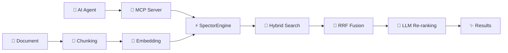

# ⚡ Spector — The AI Memory Backbone

> **Zero-overhead, agent-ready AI search and cognitive memory — embedded in a single JVM.**

Spector is a **Java-native AI search engine** and **cognitive memory system** that combines SIMD-accelerated vector search, keyword search (BM25), and biologically-inspired memory consolidation into a single embeddable library. No Docker, no external databases, no Python — just a JAR.

Connect AI agents via the **built-in MCP server** (Claude Desktop, Cursor, custom agents), embed directly in your Spring Boot app, or run standalone. Spector delivers **sub-millisecond search** at scale with **zero garbage collection pressure** thanks to Project Panama off-heap memory.

---

## 🔥 Key Numbers

| Metric | Value |
|:-------|:------|
| 🧠 Cognitive Recall | **0.13ms** p50 at 1M memories |
| ⚡ Vector Search | **88µs** p50 (10K docs, 128-dim) |
| 🚀 Peak QPS | **61,011** concurrent searches |
| 🤖 MCP Tools | **13 tools** (6 search + 7 cognitive memory) |
| 🗜️ Compression | **4×–32×** (SVASQ-8 to IVF-PQ) |
| ✅ Test Suite | **685+ tests**, all passing |
| 📦 Dependencies | **Zero** (JDK only) |

---

## 🗺️ Choose Your Path

=== "🚀 I want to use Spector"

    | Page | What you'll learn |
    |:-----|:------------------|
    | [Quick Start](getting-started/quickstart.md) | Build, run, and search in 5 minutes |
    | [MCP Server Guide](sdk-usage/mcp-server.md) | Connect Claude Desktop, Cursor, or custom agents |
    | [Installation](getting-started/installation.md) | Prerequisites and setup options |
    | [Configuration](configuration/parameters.md) | All parameters with tuning advice |
    | [REST API Reference](api-reference/rest-endpoints.md) | All endpoints with curl examples |
    | [Cognitive Memory](memory/index.md) | Getting started with AI agent memory |
    | [Cortex Dashboard](cortex/index.md) | Real-time neural visualization dashboard |

=== "🧠 I want to understand how it works"

    | Page | What you'll learn |
    |:-----|:------------------|
    | [Architecture Overview](architecture/overview.md) | Module diagram, data flow, threading model |
    | [Core Concepts](architecture/core-concepts.md) | HNSW, IVF-PQ, BM25, RRF, SIMD deep-dives |
    | [Memory Architecture](memory/architecture.md) | How cognitive memory works under the hood |
    | [6-Phase Scoring Pipeline](memory/scoring-pipeline.md) | Fused SIMD scoring across memory tiers |
    | [Cortex Dashboard](cortex/index.md) | Watch your AI's brain think — 12+ live panels |
    | [SVASQ Quantization](deep-dives/svasq-deep-dive.md) | Our proprietary SIMD-first quantization engine |
    | [Benchmarks](deep-dives/real-embedding-benchmarks.md) | Empirical sweeps on 4096-dim embeddings |

=== "🤝 I want to contribute"

    | Page | What you'll learn |
    |:-----|:------------------|
    | [Contributing Guide](operations/contributing.md) | Development setup and PR process |
    | [JDK API Status](getting-started/jdk-api-status.md) | Vector API, Panama FFM compatibility |
    | [Roadmap](roadmap.md) | What's planned next |
    | [FAQ](faq.md) | Common questions answered |

---

## 💡 How It Works

Spector combines **three search modalities** — semantic vectors, keyword matching, and cognitive scoring — into a single fused pipeline:

### What Makes Spector Different

- **Embedded deployment** — runs as a library inside your JVM. No Docker, no servers, no network hops.
- **Agent-native** — 13 MCP tools for search, memory, and cognitive operations. Connect Claude Desktop or Cursor in one config line.
- **Cognitive memory** — the only system combining power-law decay, Two-Factor strengthening (Bjork & Bjork), emotional valence, and Hebbian association in a single scoring formula.
- **Zero GC pressure** — all vector data and headers live off-heap via Project Panama. The JVM garbage collector never sees memory records.
- **SIMD everywhere** — vector distance, quantization, and scoring use Java Vector API (AVX2/AVX-512/NEON) for hardware-accelerated computation.

!!! tip "New here?"
    Start with [Quick Start](getting-started/quickstart.md) to build and run your first search in under 5 minutes. Want to connect an AI agent? See the [MCP Server Guide](sdk-usage/mcp-server.md).

---

## 🌟 Project Stats

| | |
|:---|:---|
| **Language** | Java 25 |
| **License** | Apache 2.0 · [BSL 1.1](https://github.com/spectrayan/spector/blob/main/spector-memory/LICENSE) (memory module) |
| **Modules** | 25 Maven modules |
| **Dependencies** | Zero (JDK only) |
| **SIMD** | AVX2 / AVX-512 / NEON |
| **GPU** | CUDA via Panama FFM |
| **MCP** | Built-in, 13 agent-ready tools |
| **Distributed** | gRPC fan-out + consistent hashing |

---

**Built with ⚡ by [Spectrayan](https://www.spectrayan.com/)** · [GitHub](https://github.com/spectrayan/spector) · [Apache 2.0](https://github.com/spectrayan/spector/blob/main/LICENSE) · [BSL 1.1 (memory)](https://github.com/spectrayan/spector/blob/main/spector-memory/LICENSE)