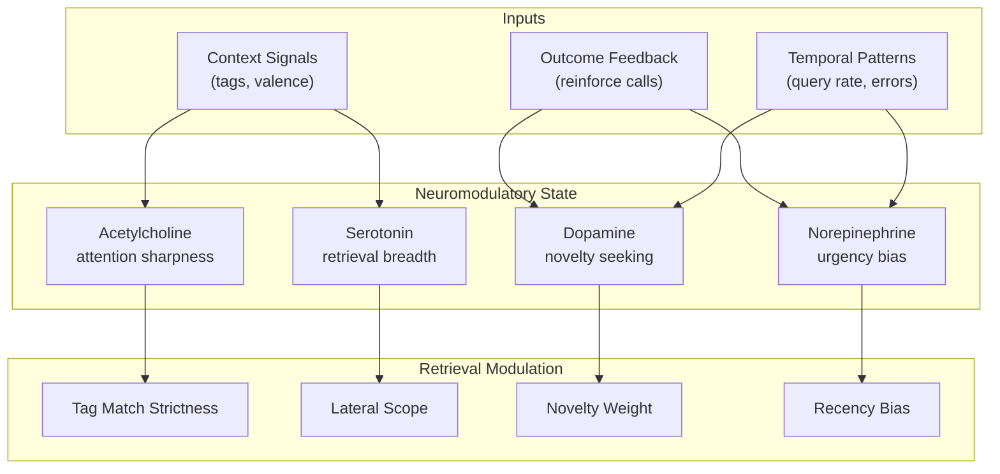
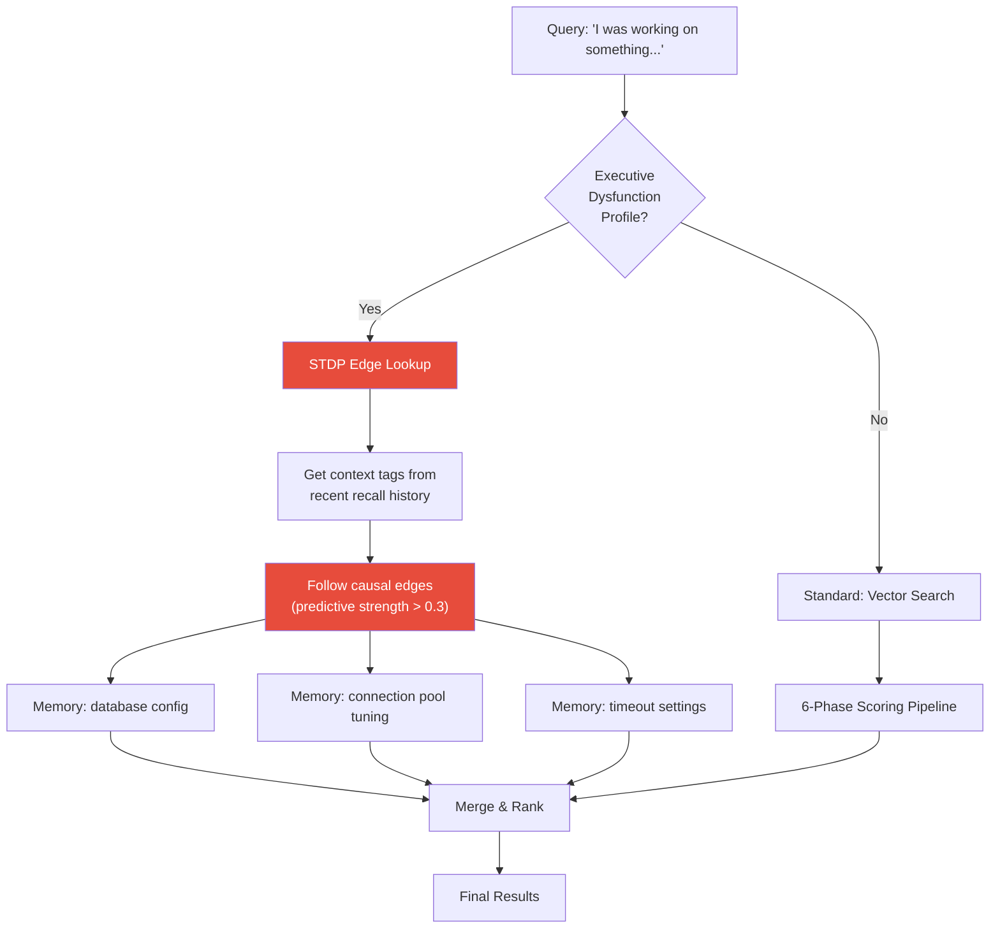
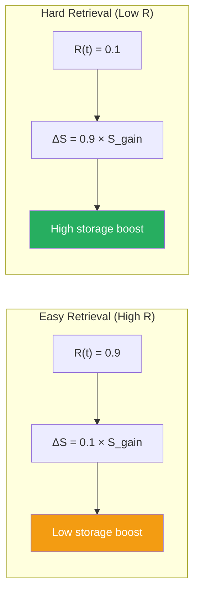
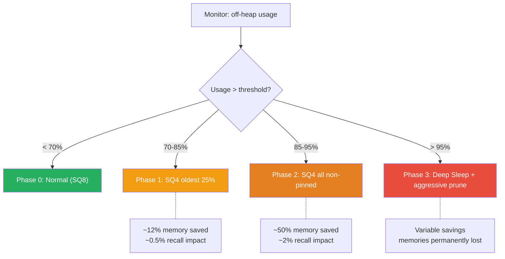

# 🔬 Labs — Experimental Features

> **Status**: Research / Future Work
>
> These features are under active research and planned for implementation
> in the `labs` branch. They are not yet available in the main release.

---

## Neuromodulatory Gain Control

### Concept

Dynamic retrieval tuning via simulated neurotransmitter modulation. Rather than using static cognitive profiles, the system would maintain a **runtime neuromodulatory state** that continuously adjusts retrieval parameters based on the agent's recent activity, outcomes, and context.

### Biological Basis

The brain's retrieval characteristics aren't fixed — they shift moment-to-moment based on neuromodulatory tone. A developer who just encountered a production outage has elevated norepinephrine, which sharpens recency bias and narrows attention. A developer brainstorming during a design review has elevated serotonin, which broadens associative scope.

Currently, Spector models this via discrete [Cognitive Profiles](../memory/cognitive-profiles.md) (DEBUGGING, EXPLORING, etc.). Neuromodulatory Gain Control would replace discrete switching with **continuous, gradient modulation**.

### Proposed Architecture



### Modulation Parameters

| Neurotransmitter | Parameter Affected | Low Level Effect | High Level Effect |
|:---|:---|:---|:---|
| Acetylcholine (ACh) | `tagMatchStrictness` | Loose tag gating (any overlap passes) | Strict tag gating (all bits must match) |
| Serotonin (5-HT) | `lateralDistanceThreshold` | Narrow scope (close matches only) | Wide scope (cross-domain retrieval active) |
| Dopamine (DA) | `noveltyWeight` in ICNU | Familiar memories preferred | Novel/surprising memories preferred |
| Norepinephrine (NE) | `recencyBias` | All ages equal | Strong recency bias (last hour dominates) |

### State Update Model

Each neurotransmitter level $n_i(t)$ follows an exponential decay toward a baseline, with spikes driven by events:

$$
n_i(t + \Delta t) = n_i^{\text{base}} + \left(n_i(t) - n_i^{\text{base}}\right) \cdot e^{-\Delta t / \tau_i} + \sum_{\text{events}} \Delta n_i
$$

Where:

- $n_i^{\text{base}}$ — resting level for neurotransmitter $i$ (profile-dependent)
- $\tau_i$ — decay constant (how quickly it returns to baseline after a spike)
- $\Delta n_i$ — event-driven spike (e.g., negative reinforcement → +NE, +ACh)

**Example decay constants:**

| Neurotransmitter | $\tau$ | Rationale |
|:---|:---|:---|
| ACh | 5 minutes | Attention shifts are fast |
| 5-HT | 30 minutes | Mood/scope changes are slow |
| DA | 10 minutes | Novelty-seeking is moderate |
| NE | 2 minutes | Urgency is very transient |

### Event-to-Spike Mapping

| Event | ACh | 5-HT | DA | NE |
|:---|:---:|:---:|:---:|:---:|
| Negative reinforcement (bug found) | +0.3 | -0.1 | — | +0.5 |
| Positive reinforcement (solution worked) | — | +0.2 | +0.3 | -0.2 |
| High recall latency (slow query) | +0.1 | — | — | +0.2 |
| Lateral result selected by agent | — | +0.3 | +0.2 | — |
| Repeated query (same topic, 3rd time) | +0.4 | -0.2 | -0.1 | — |
| No results found | — | +0.2 | +0.4 | +0.1 |

### Implementation Sketch

```java
public final class NeuromodulatoryState {
    
    private volatile float acetylcholine = 0.5f;  // baseline
    private volatile float serotonin = 0.5f;
    private volatile float dopamine = 0.5f;
    private volatile float norepinephrine = 0.3f;
    
    private volatile long lastUpdateMs = System.currentTimeMillis();
    
    /**
     * Applies exponential decay toward baseline, then adds event spikes.
     */
    public synchronized void update(NeuroEvent... events) {
        long now = System.currentTimeMillis();
        float dtSeconds = (now - lastUpdateMs) / 1000f;
        
        // Exponential decay toward baseline
        acetylcholine = decayToward(acetylcholine, 0.5f, dtSeconds, TAU_ACH);
        serotonin = decayToward(serotonin, 0.5f, dtSeconds, TAU_5HT);
        dopamine = decayToward(dopamine, 0.5f, dtSeconds, TAU_DA);
        norepinephrine = decayToward(norepinephrine, 0.3f, dtSeconds, TAU_NE);
        
        // Apply event spikes
        for (var event : events) {
            acetylcholine = clamp(acetylcholine + event.deltaACh());
            serotonin = clamp(serotonin + event.delta5HT());
            dopamine = clamp(dopamine + event.deltaDA());
            norepinephrine = clamp(norepinephrine + event.deltaNE());
        }
        
        lastUpdateMs = now;
    }
    
    /**
     * Modulates RecallOptions based on current neuromodulatory state.
     */
    public RecallOptions modulate(RecallOptions base) {
        return base.toBuilder()
            .lateralDistanceThreshold(base.lateralDistanceThreshold() * (2.0f * serotonin))
            .hyperfocusBoost(base.hyperfocusBoost() * (1.0f + acetylcholine))
            // ... other modulations
            .build();
    }
}
```

### Dependencies & Complexity

- **Dependencies:** CognitiveProfile extensions, configurable ICNU weights
- **Complexity:** High — requires runtime state management, thread-safe neuromodulatory state, and careful calibration of decay constants and spike magnitudes
- **Risk:** Over-tuning can create oscillatory behavior (agent flip-flops between modes)

---

## Executive Dysfunction Profile

### Concept

A Hebbian-first recall path that bypasses vector similarity entirely. When the agent can't formulate a clear query (analogous to executive dysfunction), it falls back to associative recall: "what have I been thinking about recently?"

### Biological Basis

In executive dysfunction, the prefrontal cortex struggles with **top-down, goal-directed retrieval** — the ability to say "I need to find X" and systematically search for it. However, **bottom-up, associative recall** remains intact — memories surface via association chains rather than directed search.

This is common in ADHD: you can't remember the specific thing you were looking for, but a tangential mention triggers a cascade of related memories. The [STDP infrastructure](../memory/hebbian.md#stdp--spike-timing-dependent-plasticity) now makes this possible — directed causal edges encode "thinking about A leads to thinking about B."

### Proposed Architecture



### Recall Algorithm

1. **Collect context tags** from the last N recall results (default N=10)
2. **Query STDP edges** for all causal predictions from those context tags
3. **Filter edges** by predictive strength threshold (default > 0.3)
4. **Retrieve memories** whose synaptic tags match the predicted tags
5. **Rank by STDP weight** instead of vector similarity
6. **Optionally blend** with a low-weight vector search for hybrid results

### Key Differences from Standard Recall

| Aspect | Standard Recall | Executive Dysfunction |
|:---|:---|:---|
| Primary signal | Vector similarity | STDP causal edges |
| Query requirement | Clear, specific query | Vague or absent query |
| Scoring formula | $\alpha \cdot sim + \beta \cdot imp \cdot decay$ | $stdp\_weight \cdot recency$ |
| Tag usage | Bloom filter pre-screen | Primary retrieval key |
| Lateral mode | Optional (DIVERGENT) | Always enabled |

### Implementation Sketch

```java
public List<CognitiveResult> recallAssociative(RecallOptions options) {
    // Step 1: Collect recent context tags
    Set<String> contextTags = recallHistory.recentTags(10);
    
    // Step 2: Query STDP for causal predictions
    Map<String, Float> predictions = new LinkedHashMap<>();
    for (String tag : contextTags) {
        tracker.getStdpEdgesFrom(tag).forEach((targetTag, weight) -> {
            if (weight.weight() > 0.3f) {
                predictions.merge(targetTag, weight.weight(), Math::max);
            }
        });
    }
    
    // Step 3: Encode predicted tags as a synaptic mask
    long predictedMask = SynapticTagEncoder.encode(
        predictions.keySet().toArray(String[]::new));
    
    // Step 4: Scan with STDP-weighted scoring
    var modifiedOptions = options.toBuilder()
        .synapticTagMask(predictedMask)
        .alpha(0.1f)   // minimal vector similarity
        .beta(0.9f)    // importance-dominated
        .build();
    
    return recallPipeline.execute(queryVector, modifiedOptions);
}
```

### Dependencies & Complexity

- **Dependencies:** Full STDP (Stage 3) ✅ **Complete** — directed, timestamped edges are live in `CoActivationTracker`
- **Complexity:** Medium — the STDP infrastructure is the hard part (done). Remaining work is the bypass routing logic and recall history tracking.
- **Risk:** Cold-start problem — STDP edges are empty until the agent has sufficient recall history

---

## Two-Factor Memory Strength (Bjork & Bjork, 1992)

### Concept

Separate **retrieval strength** R(t) from **storage strength** S(t). Currently, Spector uses a single decay curve based on age. The Two-Factor model captures a deeper truth: a memory's *accessibility* (can I recall it now?) and its *durability* (will it survive long-term?) are independent dimensions.

### Biological Basis

The New Theory of Disuse (Bjork & Bjork, 1992) explains several well-known memory phenomena:

| Phenomenon | Explanation via R(t) and S(t) |
|:---|:---|
| **Spacing effect** | Spaced retrieval at low R(t) produces higher ΔS than massed retrieval at high R(t) |
| **Testing effect** | Active retrieval (low R(t)) boosts S(t) more than passive re-study |
| **Savings in relearning** | High S(t) memory with low R(t) relearns faster than a genuinely new memory |
| **Tip-of-the-tongue** | High S(t), very low R(t) — the memory is stored but temporarily inaccessible |

### Mathematical Model

**Retrieval strength** decays with time since last access:

$$
R(t) = e^{-\lambda / S(t) \cdot (t - t_{\text{last}})}
$$

Where $\lambda$ is the base decay rate (currently modeled by `DecayStrategy.ageToBucket()`).

**Storage strength** increases at each retrieval, with the boost inversely proportional to R(t):

$$
\Delta S = S_{\text{gain}} \times (1 - R(t))
$$

This creates the spacing effect: when R(t) is near 0 (memory is hard to retrieve), the storage boost is maximal. When R(t) is near 1 (memory is easily retrieved), the storage boost is minimal.

### Visual Model



### Integration with Existing Header Layout

The `storage_strength` field is already present in the V2 (48B) and V3 (64B) header layouts:

```
V2 Header Layout (48 bytes):
  [32B core]                     — shared with V1
  [1B  arousal]        Offset 32 — emotional intensity
  [3B  padding]        Offset 33 — alignment
  [4B  storage_str]    Offset 36 — S(t) ← THIS FIELD
  [8B  reserved]       Offset 40 — future use
```

**Current default:** `storage_strength = 1.0f` for all new memories. The field is written and read but not yet used in scoring.

### Proposed Scoring Integration

The current scoring formula:

$$
\text{score} = \alpha \cdot \text{similarity} + \beta \cdot \text{importance} \cdot \text{decay}(t)
$$

Would become:

$$
\text{score} = \alpha \cdot \text{similarity} + \beta \cdot \text{importance} \cdot R(t) \cdot S(t)^{0.3}
$$

Where $S(t)^{0.3}$ provides a gentle boost for well-stored memories without dominating the score.

### Wiring into `reinforce()`

The `reinforce()` path in `DefaultSpectorMemory` already updates valence and recall count. The Two-Factor update would add:

```java
public void reinforce(String memoryId, byte valence) {
    MemoryLocation loc = index.lookup(memoryId);
    MemorySegment segment = tierRouter.segmentFor(loc.type());
    long offset = loc.offset();
    
    // Existing: update valence
    segment.set(LAYOUT_VALENCE, offset + OFFSET_VALENCE, valence);
    
    // Existing: increment recall count (atomic CAS)
    int recallCount = incrementRecallCount(segment, offset);
    
    // NEW: Two-Factor update
    if (layout.headerLayout().headerBytes() >= 48) {  // V2+
        long timestamp = segment.get(LAYOUT_TIMESTAMP, offset + OFFSET_TIMESTAMP);
        float currentS = segment.get(LAYOUT_STORAGE_STRENGTH, offset + OFFSET_STORAGE_STRENGTH);
        
        // Compute current R(t)
        float ageFraction = DecayStrategy.decay(
            DecayStrategy.ageToBucket(timestamp, System.currentTimeMillis()));
        
        // ΔS = S_gain × (1 - R(t)) — maximum boost when retrieval is hard
        float deltaS = S_GAIN * (1.0f - ageFraction);
        float newS = Math.min(currentS + deltaS, MAX_STORAGE_STRENGTH);
        
        segment.set(LAYOUT_STORAGE_STRENGTH, offset + OFFSET_STORAGE_STRENGTH, newS);
    }
}
```

### Calibration Challenges

| Parameter | Proposed Default | Notes |
|:---|:---|:---|
| $S_{\text{gain}}$ | 0.1 | Per-retrieval storage increment |
| $S_{\text{max}}$ | 5.0 | Cap to prevent runaway storage strength |
| $\lambda$ | 0.1 | Base decay rate |
| S(t) exponent in scoring | 0.3 | Gentle boost, prevents S domination |

These need empirical calibration with real agent workloads. The key question: how quickly should storage strength accumulate to produce meaningful behavioral differences?

### Dependencies & Complexity

- **Dependencies:** V2+ header layout (`storage_strength` field) ✅ **Ready** — field exists and is read/written
- **Complexity:** Medium — formula is simple, calibration is the hard part
- **Risk:** Miscalibrated S_gain can cause "immortal" memories that never decay

---

## Dynamic Quantization Stepping

### Concept

Auto-downgrade vector precision under memory pressure. When off-heap memory usage exceeds a configurable threshold, the system progressively reduces vector quantization from SQ8 (8-bit scalar) to SQ4 (4-bit scalar), trading a small amount of recall accuracy for 2× memory savings.

### Biological Basis

The brain performs a similar optimization — older memories are stored with less perceptual detail (lower precision) but retain their gist (semantic meaning). You remember *that* you had a great dinner, but not the exact flavors. The gist is sufficient for retrieval; the sensory detail is pruned.

### Quantization Precision Impact

| Format | Bits/Dim | Memory/Vector (768d) | Recall@10 Impact |
|:---|:---:|:---:|:---|
| FP32 | 32 | 3,072 bytes | Baseline |
| SQ8 (current) | 8 | 768 bytes | ~0.5% degradation |
| SQ4 (proposed) | 4 | 384 bytes | ~2-3% degradation |
| Binary | 1 | 96 bytes | ~8-12% degradation |

### Pressure-Based Stepping



### SQ4 Encoding

SQ4 packs two dimensions into a single byte using 4-bit uniform quantization:

$$
q_4(x) = \text{round}\left(\frac{x - \min}{\max - \min} \times 15\right)
$$

```java
/**
 * Encodes two float values into a single byte (4 bits each).
 */
static byte encodeSQ4Pair(float v1, float v2, float min, float scale) {
    int q1 = Math.clamp(Math.round((v1 - min) / scale * 15f), 0, 15);
    int q2 = Math.clamp(Math.round((v2 - min) / scale * 15f), 0, 15);
    return (byte) ((q1 << 4) | q2);
}

/**
 * Decodes a byte back to two approximate float values.
 */
static float[] decodeSQ4Pair(byte packed, float min, float scale) {
    int q1 = (packed >> 4) & 0x0F;
    int q2 = packed & 0x0F;
    return new float[]{
        min + (q1 / 15f) * scale,
        min + (q2 / 15f) * scale
    };
}
```

### Online Re-Quantization

The critical engineering challenge: re-quantizing vectors **without locking the store**. The proposed approach:

1. **Shadow copy:** Create a parallel SQ4 segment alongside the existing SQ8 segment
2. **Background conversion:** A background Virtual Thread re-quantizes records in batches of 1,000
3. **Atomic swap:** Once complete, atomically update the `CognitiveRecordLayout` stride to use SQ4 offsets
4. **Lazy cleanup:** The old SQ8 bytes become dead space, reclaimed at next compaction

```java
/**
 * Re-quantizes a batch of records from SQ8 to SQ4 in-place.
 * 
 * Thread safety: uses compare-and-swap on a "quantization version" byte
 * in the header flags to prevent double-conversion.
 */
public int requantizeBatch(MemorySegment segment, int startRecord, 
                            int batchSize, CognitiveRecordLayout layout) {
    int converted = 0;
    for (int i = startRecord; i < startRecord + batchSize; i++) {
        long offset = (long) i * layout.stride();
        byte flags = segment.get(LAYOUT_FLAGS, offset + OFFSET_FLAGS);
        
        // Skip pinned, already-SQ4, or tombstoned
        if (isPinned(flags) || isSQ4(flags) || isTombstoned(flags)) continue;
        
        // Read SQ8 vector, re-quantize to SQ4
        byte[] sq8 = readVector(segment, offset, layout);
        byte[] sq4 = convertSQ8toSQ4(sq8);
        
        // Write SQ4 in-place (half the space)
        writeVectorSQ4(segment, offset, layout, sq4);
        
        // Mark as SQ4 in flags (atomic CAS)
        setQuantizationFlag(segment, offset, QUANT_SQ4);
        converted++;
    }
    return converted;
}
```

### Mixed-Precision Scoring

The `CognitiveScorer` must handle mixed SQ8/SQ4 segments:

```java
// Phase 5: Vector distance — check quantization format per-record
byte flags = segment.get(LAYOUT_FLAGS, offset + OFFSET_FLAGS);
float l2dist;
if (isSQ4(flags)) {
    l2dist = SimilarityFunction.EUCLIDEAN.computeSQ4FromSegment(
        queryVector, segment, layout.vectorOffset(offset),
        effectiveMins, effectiveScales, layout.quantizedVecBytes() / 2);
} else {
    l2dist = SimilarityFunction.EUCLIDEAN.computeQuantizedFromSegment(
        queryVector, segment, layout.vectorOffset(offset),
        effectiveMins, effectiveScales, layout.quantizedVecBytes());
}
```

### Dependencies & Complexity

- **Dependencies:** ReflectDaemon Phase 0 (memory pressure monitoring), ScalarQuantizer SQ4 support (new)
- **Complexity:** High — online re-quantization without locking, mixed-precision scoring in the hot loop, SIMD kernel for SQ4 distance computation
- **Risk:** SQ4 distance computation is not yet SIMD-optimized; 4-bit unpacking adds ~30% overhead per distance call until a dedicated SIMD kernel is written

---

## Priority Matrix

| Feature | Value | Complexity | Dependencies Ready? | Estimated Effort |
|:---|:---:|:---:|:---:|:---|
| Two-Factor Memory (R+S) | 🟢 High | Medium | ✅ | 1-2 weeks |
| Executive Dysfunction | 🟡 Medium | Medium | ✅ | 1-2 weeks |
| Neuromodulatory Gain | 🟡 Medium | High | ⏳ | 3-4 weeks |
| Dynamic Quantization | 🟡 Medium | High | ⏳ | 4-6 weeks |

---

## Contributing to Labs

Labs features are developed on `labs/*` branches and are not merged to `main` until they graduate from experimental status. If you're interested in contributing:

1. Check the [Contributing Guide](../operations/contributing.md)
2. Open an issue with the `labs` label describing which feature and your proposed approach
3. Branch from `main` as `labs/feature-name`
4. Labs branches have relaxed test coverage requirements (60% vs 80% for main)
5. Features graduate to `main` after passing a design review + benchmark validation
