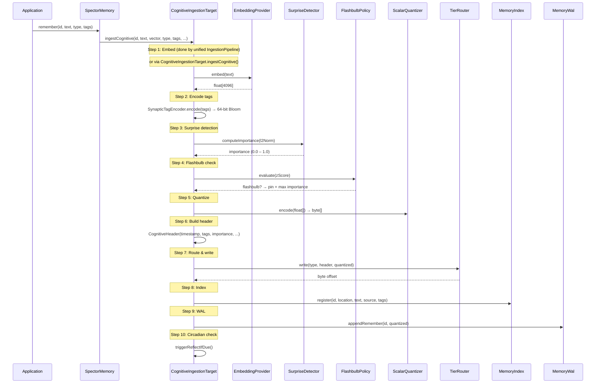
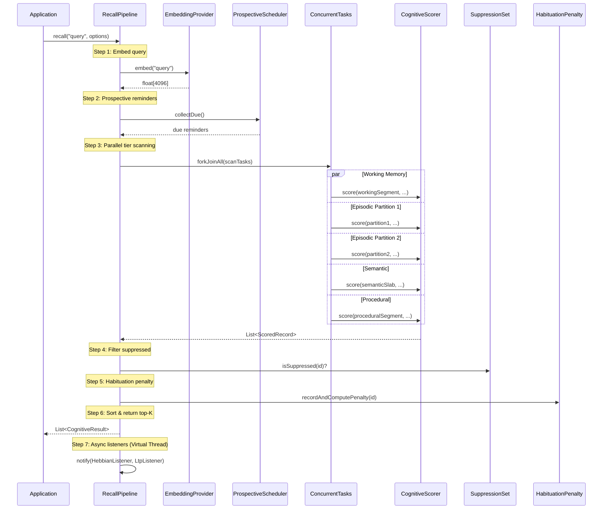
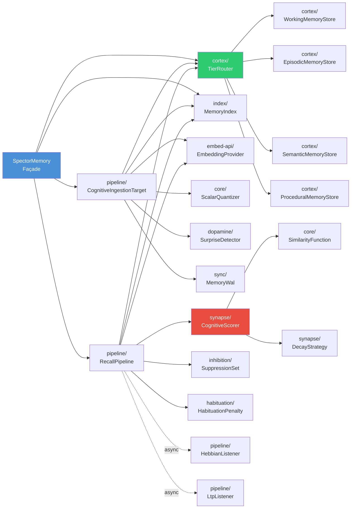

# System Architecture

Spector Memory is organized around a **biological metaphor** where each Java package corresponds to a brain region or cognitive mechanism. This isn't just naming — the architecture genuinely mirrors how biological memory systems interact.

---

## Extensibility

| Component | Extension point | What you can customize |
|---|---|---|
| `SpectorMemory` | Single entry point for all operations | Configure tiers, capacities, embedding providers |
| `TierStore` interface | Add new memory tiers | Implement the interface + register in `TierRouter` — no other changes needed |
| `AbstractTierStore` | Common tier lifecycle | Extend for new off-heap tier stores with Arena/segment management |
| `RecallListener` | Post-recall hooks | Add async listeners for co-activation tracking, logging, metrics |
| `CognitiveIngestionTarget` / `RecallPipeline` | Discrete processing steps | Each step is independently testable and replaceable |

---

## Data Flow: Ingestion

The ingestion pipeline is split across two layers:

- **`IngestionPipeline`** (in `spector-ingestion`) — handles step 1 (embed) and chunking for large documents
- **`CognitiveIngestionTarget`** (in `spector-memory`) — handles steps 2–9 (synaptic encoding → WAL)



> [!NOTE]
> When ingestion comes through the unified `IngestionPipeline` (e.g., file ingestion), embedding (step 1) is handled by the pipeline itself. `CognitiveIngestionTarget.ingest()` receives a pre-embedded vector and executes steps 2–9. When called via `SpectorMemory.remember()`, `CognitiveIngestionTarget.ingestCognitive()` handles embedding internally.

---

## Data Flow: Recall

The recall pipeline executes parallel tier scans using Virtual Threads:



---

## Package Dependency Graph



---

## The 32-Byte Cognitive Record

Every memory is stored as a fixed-size binary record in off-heap memory:

```
┌──────────────────────────────────────────────────────────┐
│                   32-Byte Synaptic Header                 │
├────────────┬──────────┬──────────┬────────┬──────────────┤
│ timestamp  │ synaptic │ exactNorm│ import │ centroidId   │
│ 8 bytes    │ tags     │ 4 bytes  │ ance   │ 4 bytes      │
│ (offset 0) │ 8 bytes  │ (off 16) │ 4 bytes│ (offset 24)  │
│            │ (off 8)  │          │(off 20)│              │
├────────────┴──────────┴──────────┴────────┼──────┬───┬───┤
│                                           │recall│val│flg│
│              (continued)                  │count │enc│s  │
│                                           │2B    │1B │1B │
│                                           │off 28│o30│o31│
├───────────────────────────────────────────┴──────┴───┴───┤
│              Quantized Vector (N bytes)                   │
│              INT8 values, 32-byte aligned                 │
└──────────────────────────────────────────────────────────┘
```

**Total record size** = 32 (header) + N (quantized vector bytes), aligned to 32 bytes.

At 768 dimensions (INT8): **32 + 768 = 800 bytes/memory** — 50,000 memories fit in 40 MB of off-heap RAM.

---

## Next Steps

- :material-lightning-bolt: [**6-Phase Scoring Pipeline**](scoring-pipeline.md) — the SIMD hot-loop that makes it fast
- :material-brain: [**Cortex — Tier Stores**](cortex.md) — the 4-tier memory architecture
- :material-memory: [**Off-Heap Panama Design**](panama-design.md) — zero-GC binary layout
