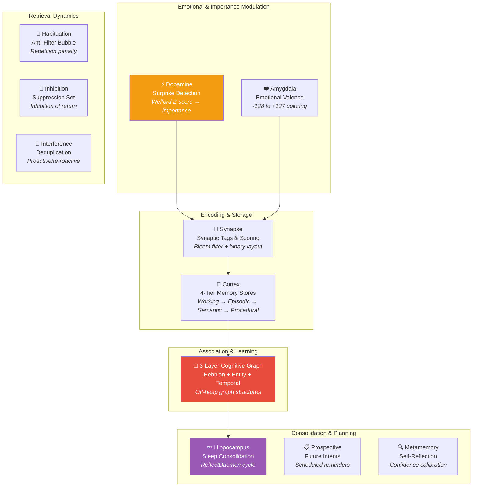

# 🧬 Biological Systems — Overview

Spector Memory doesn't just borrow neuroscience *terminology* — it implements the actual **computational principles** behind biological memory. Each package in `spector-memory` corresponds to a distinct brain region or cognitive mechanism, implementing the mathematical models that neuroscientists have validated over decades of research.

---

## The Brain–Code Mapping

---

## Systems at a Glance

| System | Brain Region | Key Concept | Spector Implementation | Reference |
|---|---|---|---|---|
| [**Cortex**](cortex.md) | Prefrontal, Hippocampus, Neocortex, Basal Ganglia | Multi-store memory model | 4-tier off-heap stores (Working, Episodic, Semantic, Procedural) | Atkinson & Shiffrin, 1968[^1] |
| [**Synapse**](synapse.md) | Synaptic junction | Synaptic tagging & capture | 64-bit Bloom filter tag encoding, 32B binary header | Frey & Morris, 1997[^2] |
| [**Dopamine**](dopamine.md) | Ventral tegmental area | Prediction error signaling | Welford Z-score surprise detection, flashbulb encoding | Schultz, 1997[^3] |
| [**Amygdala**](amygdala.md) | Amygdala | Emotional memory modulation | Signed valence byte (-128 to +127), emotional filtering | McGaugh, 2004[^4] |
| [**3-Layer Graph**](hebbian.md) | Cortical networks, Hippocampus | Hebbian learning, STDP, episodic sequences | Off-heap HebbianGraph, EntityGraph, TemporalChain | Hebb, 1949[^5]; Bi & Poo, 2001[^6] |
| [**Habituation**](habituation.md) | Sensory cortex | Response decrement to repetition | Exponential penalty on repeated recall | Thompson & Spencer, 1966[^7] |
| [**Inhibition**](inhibition.md) | Prefrontal cortex | Inhibition of return | SuppressionSet with TTL-based suppression windows | Klein, 2000[^8] |
| [**Interference**](interference.md) | Hippocampus | Proactive/retroactive interference | Similarity-based deduplication during ingestion | Underwood, 1957[^9] |
| [**Hippocampus**](hippocampus.md) | Hippocampus | Sleep consolidation & replay | ReflectDaemon: decay, compaction, episodic→semantic promotion | Rasch & Born, 2013[^10] |
| [**Prospective**](prospective.md) | Prefrontal cortex | Prospective memory | Scheduled future intent reminders | Einstein & McDaniel, 1990[^11] |
| [**Metamemory**](metamemory.md) | Prefrontal cortex | Metacognitive monitoring | Confidence calibration, recall quality estimation | Nelson & Narens, 1990[^12] |
| [**Sync**](sync.md) | — (engineering) | Persistence & replication | WAL + mmap-backed partitions | — |

---

## Key Mathematical Models

### Temporal Decay (Ebbinghaus Forgetting Curve)

Spector approximates the exponential forgetting curve using precomputed decay buckets — avoiding expensive `Math.exp()` calls in the hot loop:

$$R(t) = e^{-\lambda t / S}$$

Where $R(t)$ is retrieval strength, $\lambda$ is the decay rate, $t$ is time since encoding, and $S$ is storage strength. Spector discretizes this into 9 buckets (see [Scoring Pipeline](scoring-pipeline.md)).

> **Reference**: Ebbinghaus, H. (1885). *Über das Gedächtnis*[^13]

### Reconsolidation (Spacing Effect)

Each recall shifts the decay bucket backward, simulating how retrieved memories become more durable:

$$\text{adjustedBucket} = \text{rawBucket} - \lfloor \text{recallCount} / 3 \rfloor$$

> **Reference**: Bjork & Bjork (1992). *A New Theory of Disuse*[^14]

### Surprise Detection (Dopamine Prediction Error)

The importance signal uses a Z-score from Welford's online statistics:

$$\text{importance} = \alpha \cdot \sigma\left(\frac{x - \mu}{\sigma}\right) + \beta \cdot \text{temporalNovelty}$$

Where $\sigma()$ is the sigmoid function, $\alpha = 0.6$, $\beta = 0.4$.

> **Reference**: Schultz, W. (1997). *A neural substrate of prediction and reward*[^3]

### Hebbian Edge Strengthening

Co-ingested memories strengthen their bidirectional edge:

$$w_{ij}(t+1) = w_{ij}(t) + \Delta w$$

With decay during consolidation: $w_{ij}(t+1) = 0.9 \cdot w_{ij}(t)$

> **Reference**: Hebb, D.O. (1949). *The Organization of Behavior*[^5]

### STDP — Spike-Timing Dependent Plasticity

Directed causal edges are strengthened when tag A is recalled *before* tag B:

$$\Delta w = \begin{cases} A_+ \cdot e^{-\Delta t / \tau_+} & \text{if } \Delta t > 0 \text{ (causal)} \\ -A_- \cdot e^{\Delta t / \tau_-} & \text{if } \Delta t < 0 \text{ (anti-causal)} \end{cases}$$

> **Reference**: Bi & Poo (2001). *Synaptic modification by correlated activity*[^6]

### Habituation Penalty

Repeated recall of the same memory incurs an exponentially increasing penalty:

$$\text{penalty}(n) = 1 - e^{-\gamma \cdot n}$$

Where $n$ is the number of times the memory appeared in recent results and $\gamma$ controls penalty steepness.

> **Reference**: Thompson & Spencer (1966). *Habituation: A model phenomenon*[^7]

---

## Design Principles

1. **Fidelity to neuroscience**: Each system implements a real cognitive mechanism, not just a metaphor. The mathematical models are drawn from peer-reviewed research.

2. **Independent testability**: Each biological system is a standalone package with its own unit tests. Systems compose via dependency injection, not inheritance.

3. **Graceful degradation**: Every system is optional. Disabling surprise detection, habituation, or graph augmentation produces a functional (if less intelligent) memory system.

4. **Performance-first biology**: Biological accuracy is constrained by microsecond latency requirements. Where exact models are too expensive (e.g., continuous exponential decay), we use precomputed approximations (decay buckets, Bloom filter tags).

---

## Explore Each System

-   :material-brain:{ .lg .middle } **Cortex — Tier Stores**

    ---

    Working, Episodic, Semantic, and Procedural memory tiers

    [:octicons-arrow-right-24: Cortex](cortex.md)

-   :material-flash:{ .lg .middle } **Synapse — Tags & Scoring**

    ---

    Bloom filter encoding, binary layout, 6-phase scorer

    [:octicons-arrow-right-24: Synapse](synapse.md)

-   :material-head-lightning-bolt:{ .lg .middle } **Dopamine — Surprise**

    ---

    Welford Z-score, flashbulb encoding, importance scoring

    [:octicons-arrow-right-24: Dopamine](dopamine.md)

-   :material-heart:{ .lg .middle } **Amygdala — Valence**

    ---

    Emotional coloring, valence-based filtering

    [:octicons-arrow-right-24: Amygdala](amygdala.md)

-   :material-share-variant:{ .lg .middle } **3-Layer Cognitive Graph**

    ---

    Hebbian, Entity-Relationship, and Temporal Causal graphs

    [:octicons-arrow-right-24: Cognitive Graph](hebbian.md)

-   :material-sleep:{ .lg .middle } **Hippocampus — Consolidation**

    ---

    Sleep cycles, decay, episodic-to-semantic promotion

    [:octicons-arrow-right-24: Hippocampus](hippocampus.md)

---

## References

[^1]: Atkinson, R.C. & Shiffrin, R.M. (1968). Human memory: A proposed system and its control processes. In *Psychology of Learning and Motivation*, 2, 89–195. [doi:10.1016/S0079-7421(08)60422-3](https://doi.org/10.1016/S0079-7421(08)60422-3)

[^2]: Frey, U. & Morris, R.G.M. (1997). Synaptic tagging and long-term potentiation. *Nature*, 385, 533–536. [doi:10.1038/385533a0](https://doi.org/10.1038/385533a0)

[^3]: Schultz, W. (1997). A neural substrate of prediction and reward. *Science*, 275(5306), 1593–1599. [doi:10.1126/science.275.5306.1593](https://doi.org/10.1126/science.275.5306.1593)

[^4]: McGaugh, J.L. (2004). The amygdala modulates the consolidation of memories of emotionally arousing experiences. *Annual Review of Neuroscience*, 27, 1–28. [doi:10.1146/annurev.neuro.27.070203.144157](https://doi.org/10.1146/annurev.neuro.27.070203.144157)

[^5]: Hebb, D.O. (1949). *The Organization of Behavior: A Neuropsychological Theory*. New York: Wiley.

[^6]: Bi, G. & Poo, M. (2001). Synaptic modification by correlated activity: Hebb's postulate revisited. *Annual Review of Neuroscience*, 24, 139–166. [doi:10.1146/annurev.neuro.24.1.139](https://doi.org/10.1146/annurev.neuro.24.1.139)

[^7]: Thompson, R.F. & Spencer, W.A. (1966). Habituation: A model phenomenon for the study of neuronal substrates of behavior. *Psychological Review*, 73(1), 16–43. [doi:10.1037/h0022681](https://doi.org/10.1037/h0022681)

[^8]: Klein, R.M. (2000). Inhibition of return. *Trends in Cognitive Sciences*, 4(4), 138–147. [doi:10.1016/S1364-6613(00)01452-2](https://doi.org/10.1016/S1364-6613(00)01452-2)

[^9]: Underwood, B.J. (1957). Interference and forgetting. *Psychological Review*, 64(1), 49–60. [doi:10.1037/h0044616](https://doi.org/10.1037/h0044616)

[^10]: Rasch, B. & Born, J. (2013). About sleep's role in memory. *Physiological Reviews*, 93(2), 681–766. [doi:10.1152/physrev.00032.2012](https://doi.org/10.1152/physrev.00032.2012)

[^11]: Einstein, G.O. & McDaniel, M.A. (1990). Normal aging and prospective memory. *Journal of Experimental Psychology: Learning, Memory, and Cognition*, 16(4), 717–726. [doi:10.1037/0278-7393.16.4.717](https://doi.org/10.1037/0278-7393.16.4.717)

[^12]: Nelson, T.O. & Narens, L. (1990). Metamemory: A theoretical framework and new findings. In *Psychology of Learning and Motivation*, 26, 125–173. [doi:10.1016/S0079-7421(08)60053-5](https://doi.org/10.1016/S0079-7421(08)60053-5)

[^13]: Ebbinghaus, H. (1885). *Über das Gedächtnis: Untersuchungen zur experimentellen Psychologie*. Leipzig: Duncker & Humblot. English translation: *Memory: A Contribution to Experimental Psychology* (1913).

[^14]: Bjork, R.A. & Bjork, E.L. (1992). A new theory of disuse and an old theory of stimulus fluctuation. In *From Learning Processes to Cognitive Processes: Essays in Honor of William K. Estes*, 2, 35–67.
