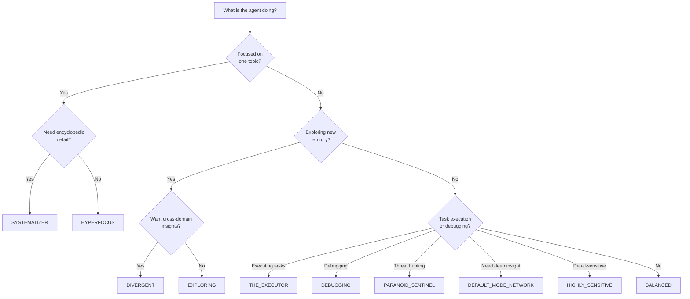

# Cognitive Profiles

Cognitive profiles are **pre-configured scoring presets** that modulate how the memory system prioritizes, retrieves, and consolidates information. They act as a thalamic filter — adjusting the balance between similarity-driven and importance-driven recall to match different task contexts.

## How Profiles Work

Every recall query is scored using the **fused cognitive score** formula:

$$
\text{score} = \alpha \cdot \text{similarity} + \beta \cdot \text{importance} \cdot \text{decay}
$$

Where:

- **α (alpha)** — Weight on vector similarity (how close is this memory to the query?)
- **β (beta)** — Weight on learned importance (how important was this memory at ingestion?)
- **α + β = 1.0** — Always normalized

A profile sets α, β, and optional modifiers (hyperfocus boost, lateral mode, episode pinning) to bias the scoring pipeline for a specific cognitive strategy.

## Built-in Profiles

### Standard Profiles

| Profile | α | β | Valence Filter | Best For |
|:---|:---:|:---:|:---:|:---|
| `BALANCED` | 0.6 | 0.4 | All | General-purpose recall |
| `EXPLORING` | 0.8 | 0.2 | All | Broad discovery, creative exploration |
| `DEBUGGING` | 0.3 | 0.7 | Negative only (≤ -10) | Precise error-matching, diagnostic search |
| `RECALLING` | 0.4 | 0.6 | Positive only (≥ +10) | Retrieving proven solutions and successes |
| `CRITICAL` | 0.2 | 0.8 | All | Security audits, compliance checks, high-stakes |

### Advanced Profiles — Neurodivergent

These profiles go beyond α/β tuning — they activate specialized scoring mechanics in the [6-Phase Pipeline](scoring-pipeline.md) and model specific neurocognitive patterns.

| Profile | α | β | Biological Analog | Special Mechanics |
|:---|:---:|:---:|:---|:---|
| `HYPERFOCUS` | 1.0 | 0.0 | Monotropism | [Focus Mode](focus-mode.md) — Zero decay, strict tag gate, boost multiplier |
| `SYSTEMATIZER` | 0.3 | 0.7 | Bottom-up processing (autism) | [Systemizer](focus-mode.md#systemizer) — Pins source episodes during consolidation |
| `DIVERGENT` | 0.8 | 0.2 | Reduced Latent Inhibition (ADHD) | [Explorer](lateral-retrieval.md) — Lateral cross-domain retrieval |
| `PARANOID_SENTINEL` | 0.2 | 0.8 | Amygdala threat-detection | Negative-only valence, mood-congruent threat recall |
| `THE_EXECUTOR` | 0.3 | 0.7 | Prefrontal executive function | Heaviside Cliff (strictness=10.0), no lateral retrieval |
| `HIGHLY_SENSITIVE` | 0.7 | 0.3 | Sensory Processing Sensitivity | Low flashbulb threshold, strong lateral inhibition |
| `DEFAULT_MODE_NETWORK` | 0.2 | 0.8 | Brain's resting state network | Skips Working + Episodic, Semantic + Procedural only |

---

## New Profile Deep Dives

### PARANOID_SENTINEL — Amygdala Threat Detection

**Biological analog:** The amygdala's threat-detection circuitry, which filters sensory input for potential dangers and amplifies recall of negative experiences (mood-congruent memory bias).

**Use case:** SRE agents, security auditors, compliance monitors. Only surfaces memories associated with negative outcomes — errors, failures, security incidents, regressions.

```java
PARANOID_SENTINEL(0.2f, 0.8f, Byte.MIN_VALUE, (byte) -1)
//                 α      β    minValence     maxValence
```

**How it works:**

- **Valence range [-128, -1]:** Only negative memories pass the valence filter in Phase 3 of the scorer. Successes, neutral logs, and positive outcomes are invisible.
- **α=0.2, β=0.8:** Importance-dominated — the severity of the past failure matters more than how closely it matches the current query.
- **Valence alignment:** Query valence is set to -128 (maximum threat), triggering mood-congruent recall amplification.

!!! example "Scenario"
    Agent query: "deployment configuration" → BALANCED returns general config docs. PARANOID_SENTINEL returns only the config-related incidents: the time a bad config caused a 4-hour outage, the security CVE from an exposed config file, the memory leak from misconfigured thread pool.

### THE_EXECUTOR — Prefrontal Executive Function

**Biological analog:** The prefrontal cortex in full executive function mode — goal-directed, no tangential exploration, pure task completion.

**Use case:** Devin-style agentic task runners. Combined with Zeigarnik Effect (`markUnresolved()`) for tracking open tasks that resist decay.

```java
THE_EXECUTOR(0.3f, 0.7f, Byte.MIN_VALUE, Byte.MAX_VALUE)
// + strictnessCoefficient = 10.0
// + lateralMode = false
```

**How it works:**

- **Heaviside Cliff scoring:** The strictness coefficient reshapes the similarity curve into a cliff function:

$$
\text{similarity} = \frac{1}{1 + d_{L2} \times 10.0}
$$

At strictness=1.0 (default), this is a gentle hyperbola. At strictness=10.0, it's a **cliff** — 95% of candidates score near zero, and only the closest matches survive.

- **Lateral retrieval disabled:** No DIVERGENT-style cross-domain exploration. Results must be directly relevant.
- **Zeigarnik integration:** Unresolved tasks (flagged via `markUnresolved()`) resist time-decay entirely — their decay bucket is clamped to 0.

### HIGHLY_SENSITIVE — Sensory Processing Sensitivity

**Biological analog:** Enhanced sensory processing depth (Aron & Aron, 1997). The highly sensitive brain processes stimuli more deeply, captures finer environmental details, and has a lower threshold for emotional activation.

```java
HIGHLY_SENSITIVE(0.7f, 0.3f, Byte.MIN_VALUE, Byte.MAX_VALUE)
// + flashbulbThreshold = 2.0 (default: 3.0)
// + inhibitionFloor = 0.3 (stronger lateral inhibition)
// + minImportance = 0.01
```

**How it works:**

- **Lower flashbulb threshold (2.0 vs 3.0):** Captures more "important" moments as flashbulb memories. Events that BALANCED would consider routine, HIGHLY_SENSITIVE pins permanently.
- **Stronger lateral inhibition (0.3 floor):** Less interference between memories. Each memory maintains its distinctiveness rather than blurring with similar neighbors.
- **minImportance=0.01:** Nothing is too small to remember. Subtle signals that other profiles would round down to zero are preserved.
- **α=0.7:** Similarity-leaning — captures nuanced matches that importance-dominated profiles would miss.

!!! tip "Ideal for"
    Medical reasoning, quality assurance, code review, accessibility testing — anywhere subtle signals could be critical.

### DEFAULT_MODE_NETWORK — "Shower Thoughts"

**Biological analog:** The brain's default mode network (DMN), which activates during rest, mind-wandering, and unfocused cognition. The DMN surfaces deep, consolidated knowledge rather than recent events.

```java
DEFAULT_MODE_NETWORK(0.2f, 0.8f, Byte.MIN_VALUE, Byte.MAX_VALUE)
// + memoryTypes = {SEMANTIC, PROCEDURAL}
// + skipTiers = {WORKING, EPISODIC}
```

**How it works:**

- **Skips Working and Episodic tiers entirely.** Only Semantic (consolidated facts) and Procedural (learned procedures) are searched.
- **α=0.2, β=0.8:** Importance-dominated. The DMN isn't looking for direct matches — it surfaces whatever the agent "knows deeply" about a topic.
- **No recency bias:** Since Episodic is skipped, all results are from long-term consolidated memory. No "what happened today" noise.

!!! example "Scenario"
    Agent is stuck on a performance problem → switches to DEFAULT_MODE_NETWORK → surfaces a deep architectural principle from 3 months ago that reframes the problem entirely. This is the computational equivalent of "sleeping on it."

---

## Usage

### Via CognitiveProfile Enum

```java
// Simple: use a profile preset
List<CognitiveResult> results = memory.recall("database deadlock", CognitiveProfile.HYPERFOCUS);
```

### Via RecallOptions Builder

```java
// Advanced: profile + custom overrides
var options = RecallOptions.builder()
    .profile(CognitiveProfile.DIVERGENT)
    .topK(20)
    .lateralDistanceThreshold(1.5f)  // override default
    .build();

List<CognitiveResult> results = memory.recall("performance optimization", options);
```

### Via MCP Tool

The `memory_recall` MCP tool accepts a `profile` parameter:

```json
{
  "name": "memory_recall",
  "arguments": {
    "query": "database deadlock",
    "profile": "HYPERFOCUS",
    "top_k": 10
  }
}
```

---

## Profile Selection Guide



---

## Agent Self-Extension

Agents can dynamically switch profiles during a conversation:

1. **Start with `BALANCED`** for general context
2. **Switch to `HYPERFOCUS`** when a specific topic is identified (e.g., user mentions "database deadlock")
3. **Switch to `DIVERGENT`** when stuck — lateral results may surface unexpected solutions
4. **Switch to `SYSTEMATIZER`** when building a comprehensive knowledge base

The `HyperfocusState` object supports TTL-based activation with agent self-extension:

```java
// Agent detects a focused topic
memory.hyperfocusState().activateFromTags("database", "deadlock");

// Agent extends focus when the topic continues
memory.hyperfocusState().extend();

// Focus automatically expires after TTL (default: 30 minutes)
```

---

## Custom Profiles

You can create custom profiles by using `RecallOptions.builder()` directly:

```java
var customProfile = RecallOptions.builder()
    .alpha(0.9f)
    .beta(0.1f)
    .hyperfocusMask("java", "concurrency")
    .hyperfocusBoost(2.0f)
    .lateralMode(false)
    .build();
```

---

## Result Metadata

Each `CognitiveResult` carries a `RetrievalMode` indicating how it was retrieved:

| Mode | Meaning |
|:---|:---|
| `STANDARD` | Normal similarity + importance scoring |
| `LATERAL` | Cross-domain retrieval via the Explorer dual-heap |
| `HYPERFOCUS` | Tag-matched with zero decay and boost multiplier |

```java
for (CognitiveResult r : results) {
    if (r.isLateral()) {
        // Cross-domain insight — consider carefully
    } else if (r.isHyperfocused()) {
        // Focused match — high confidence
    }
}
```

## What's Next

- [Focus Mode](focus-mode.md) — Deep dive on HYPERFOCUS and SYSTEMATIZER
- [Explorer — Lateral Retrieval](lateral-retrieval.md) — Cross-domain dual-heap mechanics
- [Importance Fusion (ICNU)](importance-fusion.md) — Sigmoid-gated importance with dopaminergic I×N interaction
- [Synapse — Tags & Scoring](synapse.md) — Versioned header layouts (V1/V2/V3) and arousal-modulated decay
- [Hebbian — Association Learning](hebbian.md) — STDP with directed causal edges
- [Labs — Research Roadmap](../labs/roadmap.md) — Neuromodulatory Gain, Executive Dysfunction Profile

