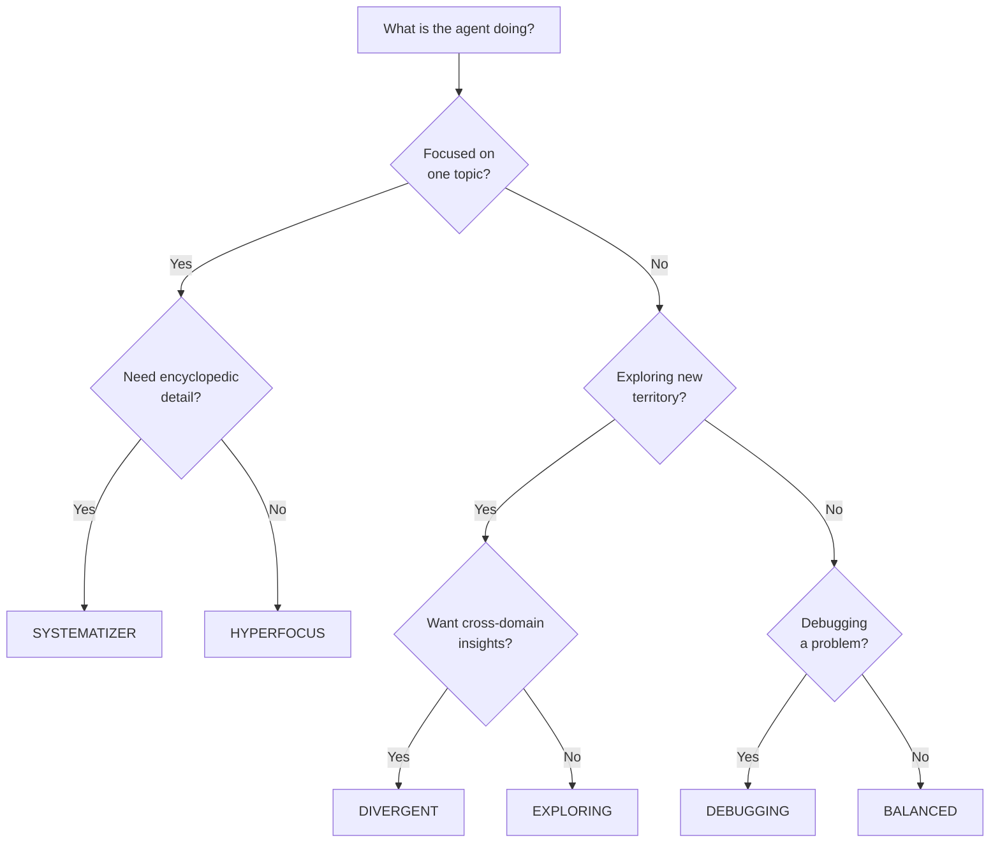

# Cognitive Profiles

Cognitive profiles are **pre-configured scoring presets** that modulate how the memory system prioritizes, retrieves, and consolidates information. They act as a thalamic filter — adjusting the balance between similarity-driven and importance-driven recall to match different task contexts.

## How Profiles Work

Every recall query is scored using the **fused cognitive score** formula:

$$
\text{score} = \alpha \cdot \text{similarity} + \beta \cdot \text{importance} \cdot \text{decay}
$$

Where:

- **α (alpha)** — Weight on vector similarity (how close is this memory to the query?)
- **β (beta)** — Weight on learned importance (how important was this memory at ingestion?)
- **α + β = 1.0** — Always normalized

A profile sets α, β, and optional modifiers (hyperfocus boost, lateral mode, episode pinning) to bias the scoring pipeline for a specific cognitive strategy.

## Built-in Profiles

### Standard Profiles

| Profile | α | β | Best For |
|:---|:---:|:---:|:---|
| `BALANCED` | 0.5 | 0.5 | General-purpose recall |
| `EXPLORING` | 0.7 | 0.3 | Broad discovery, creative exploration |
| `DEBUGGING` | 0.8 | 0.2 | Precise error-matching, diagnostic search |
| `RECALLING` | 0.4 | 0.6 | Retrieving important known facts |
| `CRITICAL` | 0.6 | 0.4 | Security audits, compliance checks |

### Advanced Profiles

These profiles go beyond α/β tuning — they activate specialized scoring mechanics in the [6-Phase Pipeline](scoring-pipeline.md).

| Profile | α | β | Special Mechanics |
|:---|:---:|:---:|:---|
| `HYPERFOCUS` | 1.0 | 0.0 | [Focus Mode](focus-mode.md) — Zero decay, strict tag gate, boost multiplier |
| `SYSTEMATIZER` | 0.3 | 0.7 | [Systemizer](focus-mode.md#systemizer) — Pins source episodes during consolidation |
| `DIVERGENT` | 0.8 | 0.2 | [Explorer](lateral-retrieval.md) — Lateral cross-domain retrieval |

---

## Usage

### Via CognitiveProfile Enum

```java
// Simple: use a profile preset
List<CognitiveResult> results = memory.recall("database deadlock", CognitiveProfile.HYPERFOCUS);
```

### Via RecallOptions Builder

```java
// Advanced: profile + custom overrides
var options = RecallOptions.builder()
    .profile(CognitiveProfile.DIVERGENT)
    .topK(20)
    .lateralDistanceThreshold(1.5f)  // override default
    .build();

List<CognitiveResult> results = memory.recall("performance optimization", options);
```

### Via MCP Tool

The `recall_context` MCP tool accepts a `profile` parameter:

```json
{
  "name": "recall_context",
  "arguments": {
    "query": "database deadlock",
    "profile": "HYPERFOCUS",
    "top_k": 10
  }
}
```

---

## Profile Selection Guide



---

## Agent Self-Extension

Agents can dynamically switch profiles during a conversation:

1. **Start with `BALANCED`** for general context
2. **Switch to `HYPERFOCUS`** when a specific topic is identified (e.g., user mentions "database deadlock")
3. **Switch to `DIVERGENT`** when stuck — lateral results may surface unexpected solutions
4. **Switch to `SYSTEMATIZER`** when building a comprehensive knowledge base

The `HyperfocusState` object supports TTL-based activation with agent self-extension:

```java
// Agent detects a focused topic
memory.hyperfocusState().activateFromTags("database", "deadlock");

// Agent extends focus when the topic continues
memory.hyperfocusState().extend();

// Focus automatically expires after TTL (default: 30 minutes)
```

---

## Custom Profiles

You can create custom profiles by using `RecallOptions.builder()` directly:

```java
var customProfile = RecallOptions.builder()
    .alpha(0.9f)
    .beta(0.1f)
    .hyperfocusMask("java", "concurrency")
    .hyperfocusBoost(2.0f)
    .lateralMode(false)
    .build();
```

---

## Result Metadata

Each `CognitiveResult` carries a `RetrievalMode` indicating how it was retrieved:

| Mode | Meaning |
|:---|:---|
| `STANDARD` | Normal similarity + importance scoring |
| `LATERAL` | Cross-domain retrieval via the Explorer dual-heap |
| `HYPERFOCUS` | Tag-matched with zero decay and boost multiplier |

```java
for (CognitiveResult r : results) {
    if (r.isLateral()) {
        // Cross-domain insight — consider carefully
    } else if (r.isHyperfocused()) {
        // Focused match — high confidence
    }
}
```

## What's Next

- [Focus Mode](focus-mode.md) — Deep dive on HYPERFOCUS and SYSTEMATIZER
- [Explorer — Lateral Retrieval](lateral-retrieval.md) — Cross-domain dual-heap mechanics
- [Importance Fusion (ICNU)](importance-fusion.md) — How ingestion-time importance is computed
