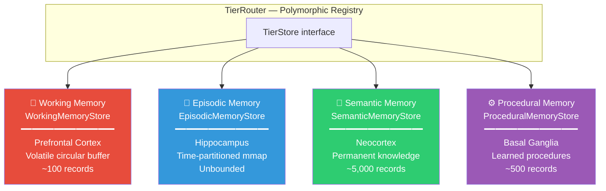
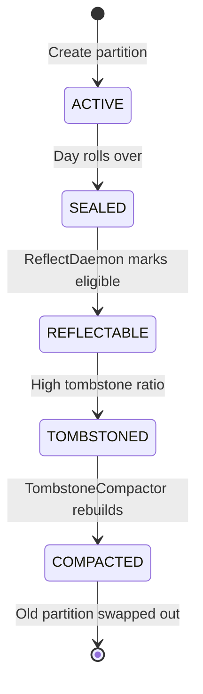

# 🧠 Cortex — Tier Stores

> **Package**: `com.spectrayan.spector.memory.cortex`
>
> **Biological Analog**: The **Cerebral Cortex** — the outer layer of the brain responsible for higher-order cognitive functions. Different cortical regions specialize in different types of memory.

---

## The 4-Tier Architecture

Human memory is not a single system. Cognitive science identifies distinct memory systems with different characteristics, durations, and purposes. Spector mirrors this with four tier stores:



---

## TierStore Interface

All four stores implement a common `TierStore` interface, enabling polymorphic dispatch in the router:

```java
public interface TierStore extends AutoCloseable {
    MemoryType type();
    int size();
    CognitiveRecordLayout layout();
    MemorySegment primarySegment();
    long write(CognitiveHeader header, byte[] quantizedVec);
}
```

The `TierRouter` holds an `EnumMap<MemoryType, TierStore>` and dispatches all operations polymorphically:

```java
// Zero switch statements — polymorphic dispatch
public long write(MemoryType type, CognitiveHeader header, byte[] quantized) {
    return get(type).write(header, quantized);
}
```

> Adding a new tier (e.g., `FLASH` for ultra-fast scratch memory) requires only: (1) implement `TierStore`, (2) register in `TierRouter`. No changes needed in `SpectorMemory`, `RecallPipeline`, or `CognitiveIngestionTarget`.

---

## AbstractTierStore

Three of the four stores (Working, Semantic, Procedural) extend `AbstractTierStore`, which provides:

- **Arena lifecycle**: `Arena.ofShared()` for thread-safe off-heap access
- **Segment allocation**: 32-byte aligned via `arena.allocate(bytes, 32)`
- **Layout creation** from quantized vector byte count
- **Capacity tracking** and size reporting
- **Close/cleanup** lifecycle

`EpisodicMemoryStore` implements `TierStore` directly because it uses mmap-backed partitions rather than a single Arena-allocated segment.

---

## 🧪 Working Memory (Prefrontal Cortex)

**Biological Analog**: The **Prefrontal Cortex** maintains a limited workspace for active processing. It holds ~7±2 items in biological systems.

| Property | Value |
|---|---|
| Storage | `Arena.ofShared()` volatile segment |
| Capacity | Configurable (default: 100) |
| Eviction | Circular buffer — oldest entries overwritten |
| Persistence | **None** — lost on JVM shutdown |
| Use case | Current task context, recent conversation |

```java
// Circular buffer write
public long write(CognitiveHeader header, byte[] quantizedVec) {
    long offset = (long) (count % capacity) * layout.stride();
    layout.writeHeader(segment, offset, header);
    MemorySegment.copy(MemorySegment.ofArray(quantizedVec), 0,
        segment, layout.vectorOffset(offset), quantizedVec.length);
    count++;
    return offset;
}
```

**Special capability**: Synaptic tag search without vector math. WorkingMemoryStore supports a `findByTag(mask)` method that scans only the 64-bit Bloom filter field — useful for fast context lookups.

---

## 📝 Episodic Memory (Hippocampus)

**Biological Analog**: The **Hippocampus** encodes autobiographical events as time-ordered traces. New events are appended rapidly (one-trial learning), and during sleep the hippocampus replays sequences for consolidation into cortical memory.

| Property | Value |
|---|---|
| Storage | `FileChannel.map()` mmap-backed files |
| Capacity | Unbounded (1 partition per day, each up to 10,000 records) |
| Eviction | Tombstone + compaction |
| Persistence | **Full** — survives JVM restarts |
| Use case | "What error did we debug yesterday?", "What did the user say last week?" |

### Partition Lifecycle

Each episodic partition is a memory-mapped file with a 64-byte metadata header:

```
┌─── Partition File ─────────────────────────────────────────┐
│ [64B Metadata Header]                                       │
│   ├── 4B magic (0x45504943 = "EPIC")                       │
│   ├── 4B version (1)                                        │
│   ├── 4B count (live records)                               │
│   ├── 4B tombstoneCount                                     │
│   ├── 4B capacity                                           │
│   ├── 4B state (ACTIVE/SEALED/REFLECTABLE/TOMBSTONED/...)  │
│   ├── 4B stride                                             │
│   └── 36B reserved                                          │
├── [Record 0: 32B header + NB vector] ──────────────────────┤
├── [Record 1: 32B header + NB vector] ──────────────────────┤
│   ...                                                       │
└── [Record N-1]  ───────────────────────────────────────────┘
```

**Partition state machine**:



---

## 🧬 Semantic Memory (Neocortex)

**Biological Analog**: The **Neocortex** stores distilled, permanent world knowledge — facts, concepts, and generalized rules extracted from repeated experience.

| Property | Value |
|---|---|
| Storage | Header-only slab (`Arena.ofShared()`) |
| Capacity | Configurable (default: 5,000) |
| Eviction | None (permanent) |
| Persistence | Via WAL replay |
| Use case | "The user prefers dark mode", "Java uses garbage collection" |

!!! info "Header-Only Storage"
    Semantic memories store only the 32-byte synaptic header, not the full quantized vector. This enables fast metadata scans (tag match, importance, valence) at minimal memory cost. For vector similarity, the text is re-embedded at query time when needed.

**Creation**: Semantic memories are created either:

1. **Directly** by the user (`MemoryType.SEMANTIC`)
2. **By consolidation** — the `ReflectDaemon` clusters similar episodic memories during "sleep" and promotes the cluster centroid to semantic memory

---

## ⚙️ Procedural Memory (Basal Ganglia)

**Biological Analog**: The **Basal Ganglia** stores learned motor programs and habitual behaviors — "how to ride a bicycle" type knowledge that operates below conscious awareness.

| Property | Value |
|---|---|
| Storage | `Arena.ofShared()` linear segment |
| Capacity | Configurable (default: 500) |
| Eviction | None (append-only) |
| Persistence | Via WAL replay |
| Use case | "Always use exponential backoff", "Format SQL with uppercase keywords" |

Procedural memories represent **rules and patterns** that the agent has internalized. They are typically higher-importance, persistent, and rarely forgotten.

---

## TierRouter

The `TierRouter` dispatches all operations to the appropriate store via an `EnumMap`:

```java
public final class TierRouter implements AutoCloseable {
    private final EnumMap<MemoryType, TierStore> stores = new EnumMap<>(MemoryType.class);
    
    // Polymorphic dispatch — zero switch statements
    public long write(MemoryType type, CognitiveHeader header, byte[] quantized) {
        return get(type).write(header, quantized);
    }
    
    public MemorySegment segmentFor(MemoryType type) {
        return get(type).primarySegment();
    }
    
    public static boolean shouldScan(MemoryType type, MemoryType[] targetTypes) {
        if (targetTypes == null || targetTypes.length == 0) return true;
        for (MemoryType t : targetTypes) if (t == type) return true;
        return false;
    }
}
```

---

## Next Steps

- :material-sleep: [**Hippocampus — Sleep Consolidation**](hippocampus.md) — how episodic memories are consolidated into semantic knowledge
- :material-flash: [**Synapse — Tags & Scoring**](synapse.md) — the 32-byte header and Bloom filter
- :material-lightning-bolt: [**6-Phase Scoring Pipeline**](scoring-pipeline.md) — the SIMD hot-loop
