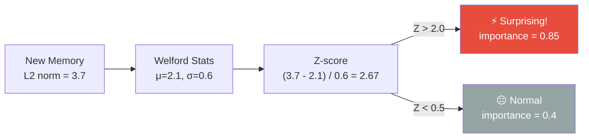

# ⚡ Dopamine — Surprise Detection

> **Package**: `com.spectrayan.spector.memory.dopamine`
>
> **Biological Analog**: The **dopaminergic system** signals prediction error — the difference between what the brain expected and what actually happened. When a stimulus is surprising (high prediction error), dopamine release strengthens memory encoding. This is why we vividly remember surprising events (flashbulb memories) but quickly forget routine ones.

---

## The Problem

Without surprise detection, an AI agent treats all memories as equally important. A routine "code compiled successfully" gets the same importance as "production database corrupted." This leads to:

- Important memories drowning in noise
- Critical errors being forgotten as quickly as routine events
- No adaptive importance — every memory starts at the same baseline

---

## SurpriseDetector

The `SurpriseDetector` maintains a running statistical model of "normal" memory vectors using **Welford's online algorithm** (numerically stable one-pass mean/variance). When a new memory arrives, its L2 distance from the running centroid is converted to a Z-score:



### Dual Importance Formula

```java
public float computeDualImportance(float distanceToNearest, long synapticTags,
                                    float spatialWeight, float temporalWeight) {
    // Spatial surprise: how far is this from the running centroid?
    float zScore = welford.zScore(distanceToNearest);
    float spatialSurprise = sigmoid(zScore);
    
    // Temporal surprise: how long since we saw this tag pattern?
    Long lastSeen = lastSeenByTags.put(synapticTags, nowMs);
    float temporalSurprise = lastSeen == null ? 1.0f 
        : Math.min(1.0f, (nowMs - lastSeen) / (float) DAY_MS);
    
    // Fused importance
    return spatialWeight * spatialSurprise + temporalWeight * temporalSurprise;
}
```

Two dimensions of surprise:

| Dimension | Signal | Weight |
|---|---|---|
| **Spatial surprise** | Z-score of L2 norm vs. running statistics | 0.6 (default) |
| **Temporal surprise** | Time since last memory with matching tags | 0.4 (default) |

---

## WelfordStats — Online Statistics

`WelfordStats` implements Welford's algorithm for numerically stable online mean and variance computation:

```java
public final class WelfordStats {
    private long count = 0;
    private double mean = 0.0;
    private double m2 = 0.0;  // Sum of squared differences
    
    public synchronized void update(double value) {
        count++;
        double delta = value - mean;
        mean += delta / count;
        double delta2 = value - mean;
        m2 += delta * delta2;
    }
    
    public double variance() {
        return count < 2 ? 0.0 : m2 / (count - 1);
    }
    
    public float zScore(double value) {
        double stdDev = Math.sqrt(variance());
        return stdDev < 1e-9 ? 0f : (float) ((value - mean) / stdDev);
    }
}
```

!!! tip "Why Welford?"
    Naive variance computation (`Σ(x-μ)²/n`) requires two passes or suffers from catastrophic cancellation with floating-point arithmetic. Welford's algorithm maintains numerical stability with a single pass — critical for an always-running system that processes millions of memories over its lifetime.

---

## FlashbulbPolicy — Extreme Surprise

**Biological analog**: **Flashbulb memories** are vivid, long-lasting memories formed during moments of extreme surprise or emotional intensity (e.g., hearing about a major world event). The amygdala signals the hippocampus to strengthen encoding.

When the Z-score exceeds a threshold (default: 3.0), the `FlashbulbPolicy` kicks in:

```java
public FlashbulbDecision evaluate(float zScore, float baseImportance) {
    if (zScore >= flashbulbThreshold) {
        return new FlashbulbDecision(
            true,     // isFlashbulb
            1.0f,     // maxImportance
            true      // pinned (exempt from decay)
        );
    }
    return FlashbulbDecision.NORMAL;
}
```

**Effects**:

- Importance is set to **1.0** (maximum)
- The **pinned flag** (bit 1 of flags byte) is set — this memory is exempt from temporal decay in Phase 4 of the scoring pipeline
- The memory will persist indefinitely unless explicitly `forget()`'d

!!! example "Use Case"
    An AI coding agent encounters `OutOfMemoryError` for the first time (Z-score: 4.2). This triggers flashbulb encoding — the error memory is pinned at maximum importance and will always surface when the agent encounters memory-related issues.

---

## Integration with Ingestion Pipeline

The surprise detection happens at **Step 3** of the ingestion pipeline:

```java
// In CognitiveIngestionTarget.ingestCognitive()

// Step 1: Embed
float[] vector = embeddingProvider.embed(text).vector();
float l2Norm = VectorOps.l2Norm(vector);

// Step 2: Encode tags
long synapticTags = SynapticTagEncoder.encode(tags);

// Step 3: Surprise detection
float importance = surpriseDetector.computeDualImportance(l2Norm, synapticTags);

// Step 4: Flashbulb check
FlashbulbDecision flashbulb = flashbulbPolicy.evaluate(
    surpriseDetector.lastZScore(), importance);
if (flashbulb.isFlashbulb()) {
    importance = 1.0f;
    flags |= FLAG_PINNED;
}
```

---

## Next Steps

- :material-emoticon: [**Amygdala — Emotional Valence**](amygdala.md) — emotional coloring of memories
- :material-flash: [**Synapse — Tags & Scoring**](synapse.md) — the 32-byte header
- :material-sleep: [**Hippocampus — Sleep Consolidation**](hippocampus.md) — what happens to important memories
