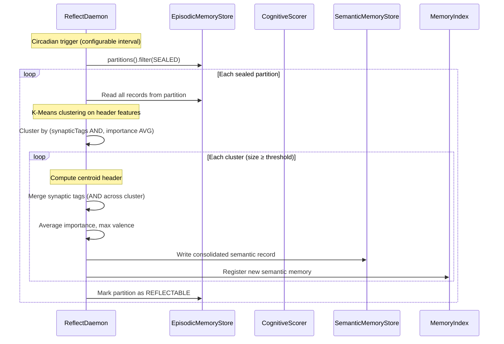
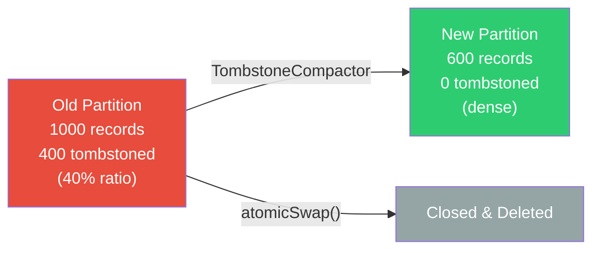
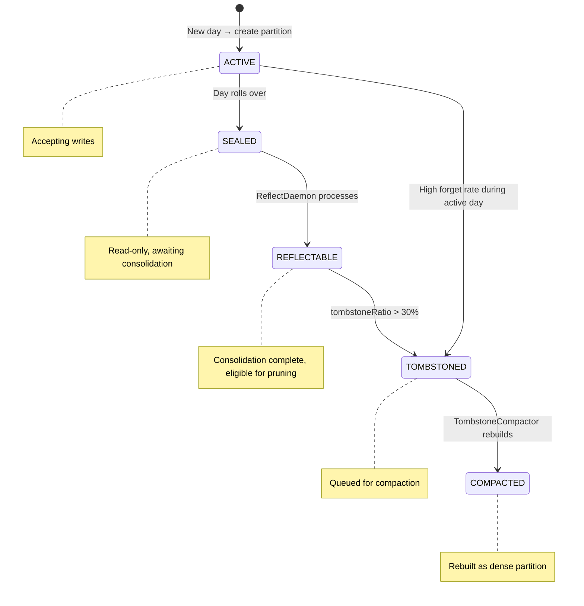

# 🛏️ Hippocampus — Sleep Consolidation

> **Package**: `com.spectrayan.spector.memory.hippocampus`
>
> **Biological Analog**: During sleep, the **hippocampus replays** episodic memory traces to the neocortex, gradually transferring knowledge from episode-specific to generalized semantic form. This is called **systems consolidation**. Simultaneously, **synaptic pruning** weakens unused connections — the brain's garbage collector.

---

## The Two Mechanisms

### 1. ReflectDaemon — Sleep Consolidation

The `ReflectDaemon` performs K-Means clustering on episodic memories to extract semantic knowledge:



**Key behaviors**:

- **Tag merging**: Uses bitwise AND across the cluster — only common tags survive, representing the shared theme
- **Importance averaging**: The consolidated memory inherits the mean importance of its source episodes
- **Minimum cluster size**: Small clusters (noise) are not promoted — only patterns are

!!! example "Example: Consolidation in Action"
    An agent encounters 15 episodic memories tagged `[database, connection, error]` over a week. The ReflectDaemon clusters them and promotes a single semantic memory: *"Database connection issues are recurring — check connection pool sizing and timeout settings."*

---

### 2. TombstoneCompactor — Synaptic Pruning

When memories are `forget()`'d, they are tombstoned (bit 0 of flags byte set to 1). The scorer skips them in Phase 1 (~1 cycle). But tombstoned records still consume disk space.

When the tombstone ratio in a partition exceeds a threshold (default: 30%), the `TombstoneCompactor` triggers a **partition rebuild**:



**The rebuild process**:

1. Allocate a new partition file
2. Sequentially copy only live (non-tombstoned) records
3. Atomically swap the new partition into the `ConcurrentMap`
4. Close and delete the old partition

```java
// Atomic swap — readers see either the old or new partition, never a torn state
public boolean replacePartition(String key, 
    EpisodicPartition oldPartition, EpisodicPartition newPartition) {
    boolean replaced = partitions.replace(key, oldPartition, newPartition);
    if (replaced) {
        oldPartition.close();
    }
    return replaced;
}
```

!!! warning "Concurrent Safety"
    The swap uses `ConcurrentMap.replace(key, old, new)` — a CAS (compare-and-swap) operation. Readers that are mid-scan on the old partition will complete safely because the old `MemorySegment` remains valid until `close()`. New scans will use the compacted partition.

---

## Circadian Trigger

The ReflectDaemon runs on a configurable schedule. During ingestion, the `CognitiveIngestionTarget` checks if it's time for a consolidation cycle:

```java
// In CognitiveIngestionTarget — after each write
private void checkCircadianTrigger() {
    long now = System.currentTimeMillis();
    if (now - lastReflectMs > reflectIntervalMs) {
        lastReflectMs = now;
        reflectDaemon.reflect();
    }
}
```

The default interval is 24 hours — matching the biological circadian cycle. For testing, it can be set to any duration.

---

## Partition State Machine



---

## ReflectReport

Each consolidation cycle produces a `ReflectReport` summarizing what happened:

```java
public record ReflectReport(
    int partitionsProcessed,
    int memoriesConsolidated,
    int semanticMemoriesCreated,
    long durationMs
) {}
```

This can be logged, monitored, or exposed via the `MemoryIntrospector` for observability.

---

## Next Steps

- :material-brain: [**Cortex — Tier Stores**](cortex.md) — the 4-tier architecture
- :material-flash: [**Synapse — Tags & Scoring**](synapse.md) — the 32-byte header
- :material-head-cog: [**Dopamine — Surprise Detection**](dopamine.md) — auto-importance scoring
