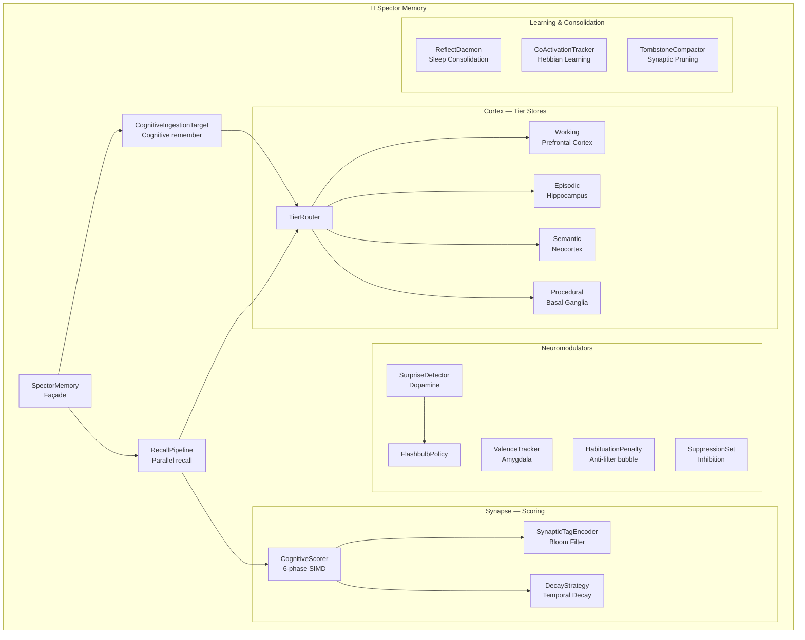

# 🧠 Cognitive Memory

!!! quote "The Vision"
    Legacy AI frameworks bolt memory onto flat vector databases. Spector Memory is designed from the ground up as a **cognitive memory engine** — a biologically-inspired system where memories have importance, emotions, temporal decay, and contextual tags. It's the difference between a filing cabinet and a brain.

---

## What Makes This Different

Every AI memory solution today — Mem0, Letta (MemGPT), Zep — wraps a Python layer around Postgres/pgvector or ChromaDB. They suffer from:

- **Network latency**: 50-200ms per query (HTTP → Postgres → HTTP)
- **Python GIL**: Sequential embedding + scoring under a global lock
- **Post-filtering trap**: Retrieve top-K by similarity, *then* filter by importance/time — losing critical memories that are old but vital

Spector Memory collapses the entire cognitive stack onto a **zero-GC, off-heap Panama memory store** with SIMD-accelerated scoring. The result:

| Metric | Python Memory Layer | **Spector Memory** |
|---|---|---|
| Query latency (1M memories) | 50-200ms | **~2ms** |
| GC pauses | Unpredictable | **Zero** (100% off-heap) |
| Scoring pipeline | Post-filter (lossy) | **Fused SIMD** (lossless) |
| Concurrent queries | GIL-limited | **10,000+ QPS** (Virtual Threads) |
| Memory per record | ~500B (Python objects) | **32B header + quantized vector** |

---

## The Biological Metaphor

Spector Memory maps every major cognitive subsystem from neuroscience to a dedicated Java package:

---

## The 4-Tier Memory Architecture

Just as the human brain has distinct memory systems, Spector organizes memories into four cognitive tiers:

=== "🧪 Working Memory"

    **Biological analog: Prefrontal Cortex**
    
    Volatile, limited-capacity buffer for the current task context. Circular buffer — oldest entries are evicted when full.
    
    - **Capacity**: Configurable (default: 100 records)
    - **Storage**: In-memory `Arena.ofShared()` segment
    - **Use case**: "What was the user just talking about?"

=== "📝 Episodic Memory"

    **Biological analog: Hippocampus**
    
    Time-stamped event records. Partitioned by day, backed by mmap'd files for persistence across JVM restarts. Supports sleep consolidation into semantic memory.
    
    - **Capacity**: Unbounded (partitioned, mmap-backed)
    - **Storage**: `FileChannel.map()` with 64-byte metadata header per partition
    - **Use case**: "What error did we debug yesterday?"

=== "🧬 Semantic Memory"

    **Biological analog: Neocortex**
    
    Distilled, permanent knowledge. Created by sleep consolidation (ReflectDaemon) from episodic clusters, or directly by the user.
    
    - **Capacity**: Configurable (default: 5,000 records)
    - **Storage**: Header-only slab (fast metadata scan)
    - **Use case**: "The user prefers dark mode."

=== "⚙️ Procedural Memory"

    **Biological analog: Basal Ganglia**
    
    Learned procedures, rules, and patterns. Small, append-only store for procedural knowledge.
    
    - **Capacity**: Configurable (default: 500 records)
    - **Storage**: In-memory `Arena.ofShared()` segment
    - **Use case**: "Always use exponential backoff for retries."

---

## Explore the Documentation

-   :material-brain:{ .lg .middle } **System Architecture**

    ---

    Package hierarchy, data flow diagrams, and extensibility model

    [:octicons-arrow-right-24: Architecture](architecture.md)

-   :material-lightning-bolt:{ .lg .middle } **6-Phase Scoring Pipeline**

    ---

    Deep dive into the SIMD hot-loop: tombstone → tags → valence → importance → L2 → fused score

    [:octicons-arrow-right-24: Scoring Pipeline](scoring-pipeline.md)

-   :material-head-cog:{ .lg .middle } **Biological Systems**

    ---

    Each brain region mapped to code: Cortex, Hippocampus, Synapse, Dopamine, Amygdala, Hebbian, Habituation, Inhibition

    [:octicons-arrow-right-24: Start with Cortex](cortex.md)

-   :material-speedometer:{ .lg .middle } **Performance & SIMD**

    ---

    Benchmark results, SIMD kernel throughput, optimization techniques, virtual thread scaling

    [:octicons-arrow-right-24: Performance](performance.md)

-   :material-memory:{ .lg .middle } **Off-Heap Panama Design**

    ---

    Zero-GC architecture, MemorySegment lifecycle, mmap partitions, 32-byte CognitiveRecord binary format

    [:octicons-arrow-right-24: Panama Design](panama-design.md)

-   :material-api:{ .lg .middle } **API Reference**

    ---

    SpectorMemory.Builder, RecallOptions, CognitiveResult, MemoryType — full method signatures

    [:octicons-arrow-right-24: API Reference](api-reference.md)

