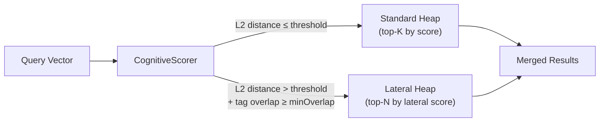
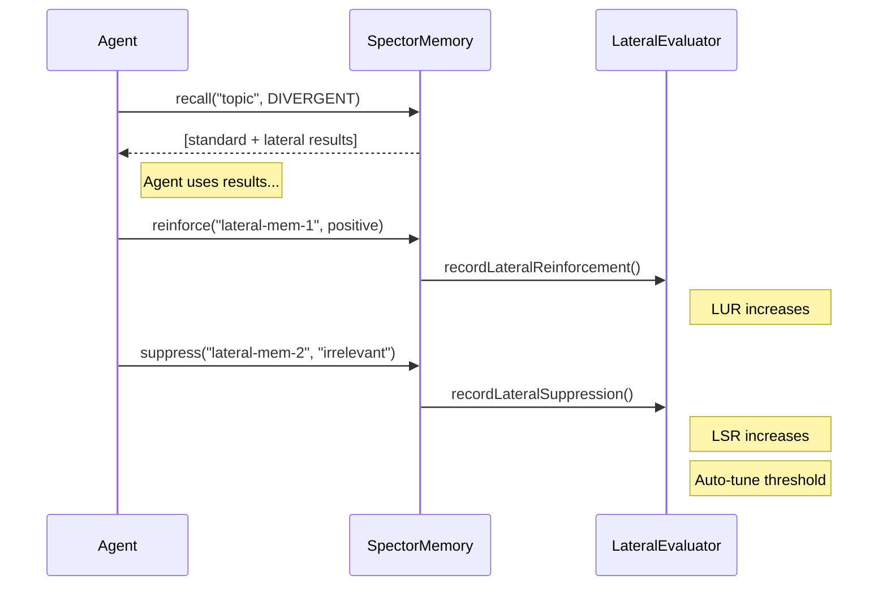

# Explorer — Lateral Retrieval

The **Explorer** profile enables **lateral retrieval** — surfacing memories that are semantically distant from the query but share contextual tags. This is the computational equivalent of divergent thinking: connecting ideas across domains.

---

## The Problem

Standard similarity-based retrieval has a blind spot: it only finds memories that are **close** to the query in vector space. This creates a filter bubble — the agent keeps retrieving the same cluster of closely related memories.

But some of the most valuable insights come from **cross-domain connections**:

- A debugging agent stuck on a race condition might benefit from recalling a design pattern used in a completely different subsystem
- A research agent exploring "database indexing" might gain from a memory about "B-tree file system layouts" — related by tags, but distant in embedding space

---

## How It Works

### Dual-Heap Architecture

When `lateralMode=true`, the [CognitiveScorer](scoring-pipeline.md) maintains **two priority queues** instead of one:



A memory is classified as a **lateral candidate** when:

1. **Semantically distant**: `l2dist > lateralDistanceThreshold` (default: 1.2)
2. **Contextually related**: `tagOverlap >= lateralMinTagOverlap` (default: 0.5)

### Lateral Scoring Formula

Lateral candidates use an **inverted** scoring function — higher distance means higher lateral score:

$$
\text{lateralScore} = \frac{1}{1 + \frac{1}{d}} \cdot \text{tagOverlap} \cdot \text{importance} \cdot \text{decay}
$$

Where $d$ is the L2 distance. This produces a bounded score in $(0, 1)$:

| L2 Distance | Lateral Similarity |
|:---:|:---:|
| 0.5 | 0.33 |
| 1.0 | 0.50 |
| 1.5 | 0.60 |
| 2.0 | 0.67 |
| 5.0 | 0.83 |
| ∞ | 1.00 |

### Result Blending

After the scoring loop, lateral results are appended after standard results:

```
Final results = [standard top-K] + [lateral top-N]
```

The caller can distinguish them via `CognitiveResult.retrievalMode()`:

```java
for (CognitiveResult r : results) {
    if (r.isLateral()) {
        System.out.println("Cross-domain insight: " + r.text());
    }
}
```

---

## Configuration

```java
// Via profile preset (recommended)
var results = memory.recall("performance optimization", CognitiveProfile.DIVERGENT);

// Via explicit options
var options = RecallOptions.builder()
    .profile(CognitiveProfile.DIVERGENT)
    .lateralDistanceThreshold(1.5f)   // how far is "far enough"
    .lateralMaxResults(5)             // max lateral candidates
    .lateralMinTagOverlap(0.3f)       // minimum tag overlap
    .build();
```

### Parameter Tuning

| Parameter | Default | Effect |
|:---|:---:|:---|
| `lateralDistanceThreshold` | 1.2 | Higher → only very distant memories qualify |
| `lateralMaxResults` | topK/3 | Caps the number of lateral results |
| `lateralMinTagOverlap` | 0.5 | Higher → requires stronger contextual connection |

---

## Auto-Tuning via the Lateral Evaluator

The system automatically monitors whether lateral results are useful through the **LateralEvaluator**:

### Feedback Loop



### Metrics

| Metric | Formula | Meaning |
|:---|:---|:---|
| **LUR** (Lateral Utility Rate) | reinforced / returned | "Are lateral results useful?" |
| **LSR** (Lateral Suppression Rate) | suppressed / returned | "Are lateral results noise?" |
| **LHI** (Lateral Hallucination Index) | suppressed / (reinforced + suppressed) | "Of all feedback, how much is negative?" |

### Auto-Tuning Rules

| Condition | Action |
|:---|:---|
| LUR < 0.05 (5%) | **Auto-disable** lateral mode |
| LUR < 0.10 (10%) | **Tighten** distance threshold by 10% |
| LUR > 0.30 (30%) | Lateral mode is healthy, no change |

### MCP Monitoring

The `memory_status` MCP tool shows lateral metrics:

```
Lateral Retrieval:
  Enabled:    true
  Threshold:  1.20
  Samples:    47
  LUR (util): 0.34
  LSR (supp): 0.09
  LHI (hall): 0.20
```

The `memory_reinforce` tool reports when feedback is recorded for a lateral result:

```
👍 Reinforced 'mem-123' with valence=50 (lateral result — feedback recorded)
```

---

## Performance

| Metric | Cost |
|:---|:---|
| Lateral detection | ~3 cycles per record (threshold compare + tag overlap) |
| Lateral heap | O(N log N) where N = lateralMaxResults (typically 3-5) |
| Auto-tuning | O(1) atomic increments, evaluated every `evaluationWindow` returns |

!!! note "Zero Overhead When Disabled"
    The lateral code path is gated by `lateralMode == true`. When `lateralMode` is false (the default for all profiles except DIVERGENT), no lateral detection or heap management occurs.

---

## When to Use Explorer

| Scenario | Recommendation |
|:---|:---|
| Agent is stuck on a problem | ✅ Switch to DIVERGENT |
| Brainstorming or creative tasks | ✅ Use DIVERGENT |
| Precision recall (debugging, audit) | ❌ Use DEBUGGING or CRITICAL |
| Building a knowledge base | ❌ Use SYSTEMATIZER |
| General conversation | ⚠️ BALANCED is usually sufficient |
