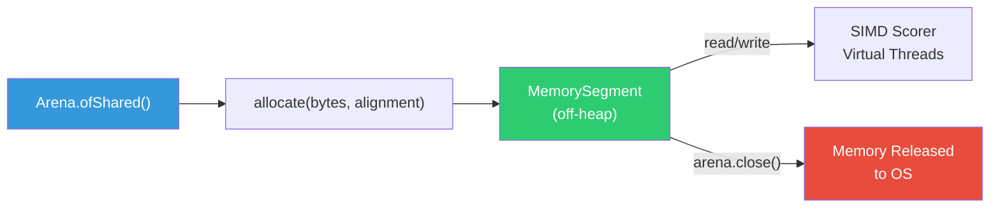

# 💾 Off-Heap Panama Design

Spector Memory achieves **zero garbage collection pressure** by storing all vector data and cognitive headers off-heap using Java Project Panama's Foreign Function & Memory API. No memory record ever touches the JVM heap.

---

## Why Off-Heap?

In a standard JVM application, objects live on the heap and are managed by the garbage collector. For AI memory workloads, this creates problems:

| On-Heap (Traditional) | Off-Heap (Panama) |
|---|---|
| GC pauses (10-100ms for large heaps) | **Zero GC pauses** — data is invisible to GC |
| Object overhead (16-24 bytes per object header) | **Zero overhead** — raw bytes, no object headers |
| Memory fragmentation over time | **Compact** — contiguous byte arrays |
| Heap size limits JVM config | **System memory** — limited only by OS |
| Serialization required for persistence | **Direct mmap** — bytes are already on disk |

---

## Panama Architecture

### MemorySegment — The Core Abstraction

Every memory record is stored in a `MemorySegment` — a contiguous off-heap byte buffer managed by an `Arena`:

```java
// Allocate 8 MB of off-heap memory, 32-byte aligned
Arena arena = Arena.ofShared();
MemorySegment segment = arena.allocate(8 * 1024 * 1024, 32);

// Write a float directly at a byte offset — no Java objects involved
segment.set(ValueLayout.JAVA_FLOAT, offset + 20, 0.85f);

// Read it back — zero deserialization
float importance = segment.get(ValueLayout.JAVA_FLOAT, offset + 20);
```

**Key properties**:

- `Arena.ofShared()` — thread-safe for concurrent reads (Virtual Threads)
- 32-byte alignment ensures SIMD-friendly access patterns
- No Java objects are created — the GC never sees this memory

### Arena Lifecycle



!!! warning "Lifetime Management"
    Unlike heap objects, off-heap memory is **not garbage collected**. You must explicitly close the `Arena` when done. `SpectorMemory` implements `AutoCloseable` and closes all arenas in its `close()` method. Always use try-with-resources.

---

## Three Storage Modes

### 1. Arena-Allocated (Working, Procedural)

Volatile, in-memory segments for transient data:

```java
// WorkingMemoryStore — circular buffer
Arena arena = Arena.ofShared();
long totalBytes = (long) capacity * stride;
MemorySegment segment = arena.allocate(totalBytes, HEADER_BYTES);
```

**Characteristics**:

- Fast allocation (~1µs)
- Lost on JVM shutdown
- No file I/O overhead
- Fixed capacity

### 2. mmap-Backed (Episodic)

Persistent, memory-mapped files for durable storage:

```java
// EpisodicPartition — mmap via FileChannel.map()
FileChannel channel = FileChannel.open(path, READ, WRITE);
MemorySegment segment = channel.map(MapMode.READ_WRITE, 0, totalBytes, arena);
```

**Characteristics**:

- Persists across JVM restarts
- OS handles paging to/from disk
- Lazy loading — only mapped pages are in physical RAM
- Atomic `force()` for durability

### 3. Header-Only Slab (Semantic)

Compact metadata-only storage (no vectors):

```java
// SemanticMemoryStore — header slab
long slabBytes = (long) capacity * HEADER_BYTES;  // 32 bytes per record
MemorySegment headerSlab = arena.allocate(slabBytes, HEADER_BYTES);
```

**Characteristics**:

- Minimal memory footprint (32B per record vs. 800B for full records)
- Fast metadata scans (tag match, importance, valence)
- No vector data — re-embed at query time if needed

---

## Binary Record Format

### Memory Layout

Each cognitive record is a fixed-size binary structure:

```
┌────────────────────────────────────────────────────────────┐
│  Offset 0                                                   │
│  ┌──────────────────────────────────────────────────────┐   │
│  │ 32-Byte Synaptic Header                              │   │
│  │ ┌─────────┬────────┬────────┬────────┬────────────┐ │   │
│  │ │timestamp│synaptc │exactNrm│importnc│ centroidId │ │   │
│  │ │  8 B    │tags 8B │  4 B   │  4 B   │   4 B      │ │   │
│  │ ├─────────┴────────┴────────┴────────┼────┬───┬───┤ │   │
│  │ │            (offsets 0-23)           │rcl │val│flg│ │   │
│  │ │                                    │cnt │enc│s  │ │   │
│  │ │                                    │2 B │1B │1B │ │   │
│  │ └────────────────────────────────────┴────┴───┴───┘ │   │
│  └──────────────────────────────────────────────────────┘   │
│  Offset 32                                                  │
│  ┌──────────────────────────────────────────────────────┐   │
│  │ Quantized Vector (N bytes)                           │   │
│  │ INT8 values: byte[0] byte[1] ... byte[N-1]          │   │
│  │ Dequantize: float = byte * scale + min               │   │
│  └──────────────────────────────────────────────────────┘   │
│  Offset 32 + N                                              │
│  Next record begins (stride = 32 + N)                       │
└────────────────────────────────────────────────────────────┘
```

### Field Access Patterns

The header layout is designed for **sequential access** in the scoring hot-loop. Fields are ordered by access frequency:

```
Phase 1: flags       (offset 31, 1B)  — First check, highest skip rate
Phase 2: synapticTags (offset 8, 8B)  — Second check, eliminates 99%
Phase 3: valence      (offset 30, 1B) — Third check
Phase 4: importance   (offset 20, 4B) — Fourth check
Phase 4: timestamp    (offset 0, 8B)  — Read with importance
Phase 4: recallCount  (offset 28, 2B) — Reconsolidation adjustment
Phase 5: vector       (offset 32, NB) — Only if all filters pass
```

!!! tip "Cache Line Optimization"
    The 32-byte header fits exactly in half a typical 64-byte CPU cache line. For sequential scans, the CPU prefetcher loads the header and first 32 bytes of vector data in a single cache line fetch.

---

## Episodic Partition File Format

Each episodic partition file has a 64-byte metadata header:

```
Offset   Size   Field            Description
──────   ────   ─────            ───────────
  0       4B    magic            0x45504943 ("EPIC" in ASCII)
  4       4B    version          Format version (1)
  8       4B    count            Number of live records
 12       4B    tombstoneCount   Number of tombstoned records
 16       4B    capacity         Maximum records in partition
 20       4B    state            PartitionState ordinal
 24       4B    stride           Record stride in bytes
 28      36B    reserved         Future use (alignment padding)
```

**File naming**: `episodic-{yyyyMMdd}.mem` (e.g., `episodic-20260527.mem`)

**Partition capacity**: Default 10,000 records per partition. At 800 bytes/record (768-dim INT8), each partition file is ~8 MB.

---

## Thread Safety Model

| Component | Thread Safety | Mechanism |
|---|---|---|
| `Arena.ofShared()` | ✅ Concurrent reads | Built-in Panama support |
| `MemorySegment` reads | ✅ Lock-free | Direct memory access |
| `MemorySegment` writes | ⚠️ Single writer | `synchronized` on partition append |
| `ConcurrentHashMap` (index) | ✅ Lock-free reads | CAS-based updates |
| Partition metadata | ⚠️ Single writer | Metadata header writes are synchronized |

**Recall**: Multiple Virtual Threads read different partitions concurrently — zero contention because each partition's `MemorySegment` is disjoint.

**Ingestion**: Writes are serialized per partition (one writer at a time) but different partitions can accept writes concurrently.

---

## Zero-Copy Data Path


> **No Java objects created. No serialization. No deserialization. No GC pressure.**

The entire data path from persistent storage to CPU computation operates on **raw bytes**. The JVM heap is used only for the top-K result set (`List<CognitiveResult>`) — typically 5-20 small Java records.

---

## Next Steps

- :material-speedometer: [**Performance**](performance.md) — benchmark results
- :material-brain: [**Architecture**](architecture.md) — system design
- :material-lightning-bolt: [**6-Phase Scoring Pipeline**](scoring-pipeline.md) — the SIMD hot-loop
