# ⚡ Performance & SIMD

Spector Memory is engineered for microsecond-scale latency. This page documents the benchmark results and the key performance techniques that make it possible.

---

## Benchmark Summary

Measured on **Intel Core Ultra 9 285K**, Java 25, AVX2 256-bit (8 float lanes), ZGC:

| Benchmark | Result | Notes |
|---|---|---|
| **SIMD L2 Distance (128-dim)** | 0.8 µs/vector | 1.2M vectors/sec |
| **SIMD L2 Distance (384-dim)** | 1.5 µs/vector | 2.6M vectors/sec |
| **SIMD L2 Distance (768-dim)** | 2.2 µs/vector | 1.4M vectors/sec |
| **SIMD L2 Distance (1024-dim)** | 3.0 µs/vector | 1.0M vectors/sec |
| **Reverse Index Lookup** | 180 ns/lookup | O(1) packed-key ConcurrentHashMap |
| **CognitiveScorer (10K × 128-dim)** | 2.9 ms total | Full 6-phase pipeline |
| **Batch Habituation (1K IDs)** | 101 µs total | 100 ns per penalty computation |
| **TierRouter.totalCount()** | 17 ms / 100K calls | 170 ns per call |
| **Full Pipeline (1K ingest + 100 recall)** | < 50 ms/query | End-to-end latency |
| **Real Embedding (qwen3-embedding 4096-dim)** | 31 ms/embed | Via Ollama (network bound) |

---

## Key Techniques

### O(1) Reverse Index

Memory IDs are resolved in constant time using a packed-key `ConcurrentHashMap<Long, String>`:

```java
// Pack (type, offset) into a single long — zero String concatenation
private static long reverseKey(MemoryType type, long offset) {
    return ((long) type.ordinal() << 48) | (offset & 0x0000_FFFF_FFFF_FFFFL);
}
```

This yields **180 ns** lookups at 50K entries.

---

### SIMD Euclidean Distance

Quantized INT8 Euclidean distance uses the Java Vector API for hardware acceleration:

```java
// Vectorized dequantization + L2 in a single SIMD pass
FloatVector vQuery = FloatVector.fromArray(SPECIES, queryVector, i);
ByteVector vQuantized = ByteVector.fromMemorySegment(SPECIES_BYTE, segment, offset + i, NATIVE);
FloatVector vFloat = vQuantized.castShape(SPECIES, 0);  // INT8 → float32
FloatVector vDequant = vFloat.mul(vScale).add(vMin);    // Affine dequantization
FloatVector vDiff = vQuery.sub(vDequant);
vSum = vDiff.fma(vDiff, vSum);                          // Fused multiply-add
```

This achieves **2.2 µs/vector** at 768 dimensions (1.4M vectors/sec).

---

### Batch Habituation

The habituation penalty module computes all penalties in a single batch call with amortized map access, processing 1K penalties in **101 µs** total.

---

### Inline Header Capture

`ScoredRecord` captures the `CognitiveHeader` inline during scoring, eliminating N×8 off-heap re-reads per recall query.

---

### Direct TierRouter Access

`totalCount()` uses direct field access to typed store references rather than iteration, completing 100K calls in **17 ms** (170 ns/call).

---

## Parallel Tier Scanning

Each memory tier is scanned on a dedicated **Virtual Thread** via `ConcurrentTasks.forkJoinAll()`:

```mermaid
gantt
    title Parallel Recall: 5 concurrent scans
    dateFormat X
    axisFormat %L ms
    
    section Working (100 records)
    Scan     :a1, 0, 1
    section Episodic P1 (5K records)
    Scan     :a2, 0, 3
    section Episodic P2 (3K records)
    Scan     :a3, 0, 2
    section Semantic (200 headers)
    Scan     :a4, 0, 1
    section Procedural (50 records)
    Scan     :a5, 0, 1
    section Merge + Rank
    Top-K    :a6, 3, 4
```



**Key insight**: Episodic partitions use **disjoint memory segments** — each partition's mmap is a separate `MemorySegment`. This guarantees zero contention between virtual threads, enabling perfect parallel scaling.

**Fallback**: If parallel scanning fails (e.g., thread pool exhaustion), the pipeline falls back to sequential scanning with identical results.

---

## Memory Footprint

| Component | Formula | 10K memories (768-dim) |
|---|---|---|
| Episodic partition | 64B header + N × (32B + vecBytes) | 64B + 10K × 800B = **7.8 MB** |
| Working memory | capacity × (32B + vecBytes) | 100 × 800B = **78 KB** |
| Semantic headers | capacity × 32B | 5K × 32B = **156 KB** |
| Procedural store | capacity × (32B + vecBytes) | 500 × 800B = **390 KB** |
| Forward index | ~120B per entry | 10K × 120B = **1.2 MB** |
| Reverse index | ~60B per entry | 10K × 60B = **600 KB** |
| **Total** | | **~10.2 MB** |

!!! tip "vs. Python Memory Layers"
    A Python memory system stores each memory as a Python object (~500-800 bytes overhead) plus the vector in NumPy (~3KB for 768-dim float32). Spector stores the same memory in **800 bytes** (32B header + 768B INT8 vector) — a 5-10× reduction.

---

## Test Suite

```
spector-core:   276 tests ✅   (includes 15 SIMD kernel verification tests)
spector-memory: 167 tests ✅   (includes performance benchmarks + index tests)
                + 10 Ollama real embedding E2E tests (gated by OLLAMA_LIVE=true)
Total: 443 tests, 0 failures
```

### Running Benchmarks

```bash
# Run all memory tests (includes benchmark assertions)
mvn test -pl spector-memory

# Run only performance benchmarks
mvn test -pl spector-memory -Dtest=PerformanceBenchmarkTest

# Run Ollama real embedding E2E tests
OLLAMA_LIVE=true mvn test -pl spector-memory -Dtest=OllamaRealEmbeddingTest
```

---

## Next Steps

- :material-memory: [**Off-Heap Panama Design**](panama-design.md) — zero-GC architecture
- :material-lightning-bolt: [**6-Phase Scoring Pipeline**](scoring-pipeline.md) — the SIMD hot-loop
- :material-brain: [**Architecture**](architecture.md) — system-level design
