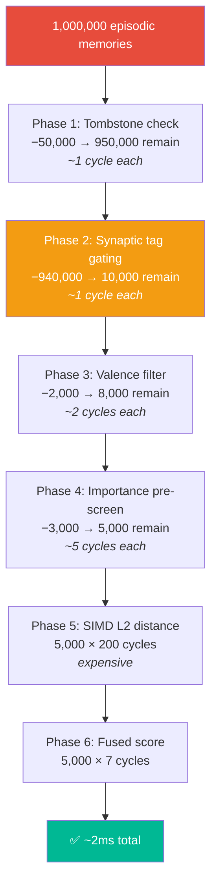

# The 6-Phase Scoring Pipeline

The `CognitiveScorer` is the performance-critical inner loop of Spector Memory. It scans off-heap `MemorySegment` data using **six sequential phases**, each eliminating candidates before the expensive SIMD vector math. This design is inspired by the brain's **sensory gating** — the auditory cortex filters out background noise before the prefrontal cortex evaluates it.

---

## Why Fused Scoring?

### The Truncation Trap

In a standard vector database, you:

1. Retrieve the top-K nearest vectors by L2 distance
2. **Then** apply business logic (importance, time, tags) in Java

This **fails catastrophically** for AI memory:

!!! danger "The Problem"
    If an AI agent asks *"What is the user's core preference?"*, the most important memory might be 6 months old and slightly less semantically similar than a useless conversation from 5 minutes ago. If you pull the top-100 nearest vectors and *then* sort by importance, the vital 6-month-old memory was already **dropped at step 1**.

### The Fix: Fuse Everything

Spector fuses temporal decay and importance directly into the scoring loop:

$$\text{Similarity} = \frac{1}{1 + \text{L2\_Distance}(q, x)}$$

$$\text{FinalScore} = \alpha \cdot \text{Similarity} + \beta \cdot \text{Importance} \cdot \text{Decay}(\text{AdjustedAge})$$

Where $\alpha$ (default: 0.6) and $\beta$ (default: 0.4) are user-configurable scoring weights.

---

## The Six Phases

```java
for (int i = 0; i < recordCount; i++) {
    long offset = baseOffset + (long) i * stride;

    // ── Phase 1: Tombstone Check (~1 cycle) ──
    byte flags = segment.get(LAYOUT_FLAGS, offset + OFFSET_FLAGS);
    if (isTombstoned(flags)) continue;

    // ── Phase 2: Synaptic Tag Gating (~1 cycle) ──
    if (queryTagMask != 0) {
        long recordTags = segment.get(LAYOUT_SYNAPTIC_TAGS, offset + OFFSET_SYNAPTIC_TAGS);
        if ((recordTags & queryTagMask) != queryTagMask) continue;
    }

    // ── Phase 3: Valence Filter (~2 cycles) ──
    byte valence = segment.get(LAYOUT_VALENCE, offset + OFFSET_VALENCE);
    if (valence < minValence || valence > maxValence) continue;

    // ── Phase 4: Temporal/Importance Pre-screen (~5 cycles) ──
    float importance = segment.get(LAYOUT_IMPORTANCE, offset + OFFSET_IMPORTANCE);
    if (importance < minImportance) continue;
    long timestamp = segment.get(LAYOUT_TIMESTAMP, offset + OFFSET_TIMESTAMP);
    short recallCount = segment.get(LAYOUT_RECALL_COUNT, offset + OFFSET_RECALL_COUNT);
    int adjustedBucket = DecayStrategy.adjustForReconsolidation(rawBucket, recallCount);
    if (adjustedBucket >= MAX_BUCKET && importance < 1.0f && !isPinned(flags)) continue;

    // ── Phase 5: SIMD L2 Distance (~200 cycles) ──
    float l2dist = SimilarityFunction.EUCLIDEAN.computeQuantizedFromSegment(
        queryVector, segment, layout.vectorOffset(offset),
        effectiveMins, effectiveScales, quantizedVecBytes);
    float similarity = 1.0f / (1.0f + l2dist);

    // ── Phase 6: Fused Cognitive Score (~7 cycles) ──
    float decay = DecayStrategy.decay(adjustedBucket);
    float finalScore = alpha * similarity + beta * importance * decay;
    
    heap.insertWithOverflow(offset, finalScore);
}
```

---

## Phase-by-Phase Deep Dive

### Phase 1: Tombstone Check

**Cost**: ~1 CPU cycle (single byte read + bit test)

```java
byte flags = segment.get(LAYOUT_FLAGS, offset + OFFSET_FLAGS);
if ((flags & 0x01) != 0) continue; // Bit 0 = tombstone
```

Tombstoned memories are skipped without reading any other fields. When the tombstone ratio in an episodic partition exceeds 30%, the `TombstoneCompactor` triggers a partition rebuild.

---

### Phase 2: Synaptic Tag Gating

**Cost**: ~1 CPU cycle (single `long` read + bitwise AND)

```java
long recordTags = segment.get(LAYOUT_SYNAPTIC_TAGS, offset + OFFSET_SYNAPTIC_TAGS);
if ((recordTags & queryTagMask) != queryTagMask) continue;
```

!!! info "Bloom Filter Containment"
    The check `(record & query) != query` is a **containment check**, not an overlap check. It verifies that **all** query tag bits are present in the record's Bloom filter. This is the correct Bloom filter match — it can have false positives but never false negatives.

**Selectivity**: If an agent has 1,000,000 memories and only 10,000 match the query tags, this phase eliminates **990,000 records** in ~990µs — saving 990,000 × 200 cycles of SIMD math.

The synaptic tag Bloom filter uses MurmurHash3-inspired double hashing with k=3 hash functions in a 64-bit field. False positive rates:

| Tags per Record | FPR | Assessment |
|---|---|---|
| 5 | 0.03% | Excellent |
| 10 | 0.2% | Excellent |
| 20 | 2.3% | Good |
| 50 | 12% | Acceptable — vector distance rejects false matches |

---

### Phase 3: Valence Filter

**Cost**: ~2 CPU cycles (byte read + 2 comparisons)

```java
byte valence = segment.get(LAYOUT_VALENCE, offset + OFFSET_VALENCE);
if (valence < minValence || valence > maxValence) continue;
```

Valence represents **emotional coloring** on a scale of -128 to +127:

- **Negative**: Error memories, failures, warnings
- **Zero**: Neutral factual memories
- **Positive**: Successes, preferred outcomes

!!! example "Use Case"
    An agent debugging an error can filter to `maxValence = -10` to recall only negative-outcome memories — "What went wrong last time?"

---

### Phase 4: Importance/Decay Pre-screen

**Cost**: ~5 CPU cycles (float read + timestamp read + bucket computation)

```java
float importance = segment.get(LAYOUT_IMPORTANCE, offset + OFFSET_IMPORTANCE);
if (importance < minImportance) continue;

int rawBucket = DecayStrategy.ageToBucket(timestamp, nowMs);
int adjustedBucket = DecayStrategy.adjustForReconsolidation(rawBucket, recallCount);

if (adjustedBucket >= MAX_BUCKET && importance < 1.0f && !isPinned(flags)) continue;
```

**Reconsolidation**: Every 3 recalls shifts the decay bucket back by 1, simulating how frequently-recalled memories become more durable (Long-Term Potentiation). A memory recalled 12 times is 4 buckets "younger" than its actual age.

**Decay Buckets** (precomputed — no `Math.exp()` required):

| Bucket | Age Range | Decay Multiplier |
|---|---|---|
| 0 | 0–1 hours | 1.00 |
| 1 | 1–6 hours | 0.95 |
| 2 | 6–24 hours | 0.85 |
| 3 | 1–3 days | 0.70 |
| 4 | 3–7 days | 0.50 |
| 5 | 1–2 weeks | 0.30 |
| 6 | 2–4 weeks | 0.15 |
| 7 | 1–3 months | 0.05 |
| 8+ | 3+ months | 0.01 |

!!! warning "The `exp()` Bottleneck"
    Naive exponential decay `Math.exp(-λ·age)` costs 50-100ns per call and cannot be SIMD-vectorized. Spector uses precomputed decay buckets — a single array lookup per record (~1ns). At 1M memories, this saves **50-100ms** of scalar overhead.

---

### Phase 5: SIMD L2 Distance

**Cost**: ~200 CPU cycles (the dominant cost)

```java
float l2dist = SimilarityFunction.EUCLIDEAN.computeQuantizedFromSegment(
    queryVector, segment, layout.vectorOffset(offset),
    effectiveMins, effectiveScales, quantizedVecBytes);
float similarity = 1.0f / (1.0f + l2dist);
```

This is the expensive operation that phases 1-4 are designed to gate. It:

1. Reads INT8 quantized vector bytes directly from the off-heap `MemorySegment`
2. Dequantizes via calibration: `float_val = byte_val * scale + min`
3. Computes Euclidean distance using the Java Vector API (AVX2/AVX-512)
4. Converts distance to similarity: `1 / (1 + L2)`

**Throughput**: ~2.2µs per 768-dim vector (1.4M vectors/sec on AVX2).

---

### Phase 6: Fused Cognitive Score

**Cost**: ~7 CPU cycles (2 multiplies + 1 add + heap insert)

```java
float decay = DecayStrategy.decay(adjustedBucket);
float finalScore = alpha * similarity + beta * importance * decay;
heap.insertWithOverflow(offset, finalScore);
```

The final score fuses three signals:

- **Semantic similarity** (α-weighted): How relevant is this memory to the query?
- **Importance** (β-weighted): How important was this memory at ingestion?
- **Temporal decay** (β-weighted): How recent is this memory?

Results are tracked in a **min-heap** of size K — only the top-K scored records survive.

---

## The Math: Gating Efficiency



> **Without gating**: 1,000,000 × 200 cycles = ~200ms → **100× improvement** from early elimination.

---

## Parallel Tier Scanning

The `RecallPipeline` scans all tiers in parallel using `ConcurrentTasks.forkJoinAll()`:

```mermaid
gantt
    title Parallel Recall Scan (Virtual Threads)
    dateFormat X
    axisFormat %L ms
    section Working
    Scan 100 records     :a1, 0, 1
    section Episodic P1
    Scan 5000 records    :a2, 0, 3
    section Episodic P2
    Scan 3000 records    :a3, 0, 2
    section Semantic
    Header scan 200      :a4, 0, 1
    section Procedural
    Scan 50 records      :a5, 0, 1
    section Merge
    Sort + top-K         :a6, 3, 4
```



Each partition scan runs on a **dedicated Virtual Thread** — disjoint memory segments guarantee zero contention. The merge phase sorts all tier results and returns the global top-K.

---

## Next Steps

- :material-brain: [**Cortex — Tier Stores**](cortex.md) — the 4-tier memory architecture
- :material-flash: [**Synapse — Tags & Scoring**](synapse.md) — Bloom filter and binary layout
- :material-speedometer: [**Performance**](performance.md) — benchmark results
