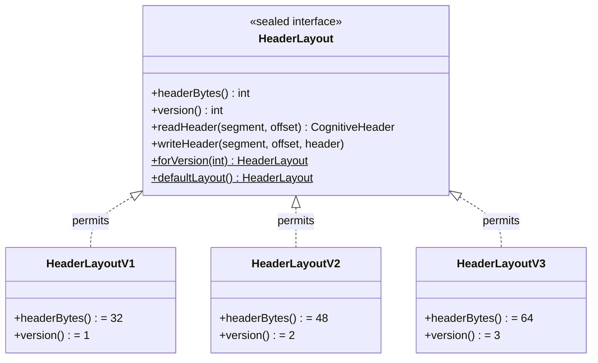
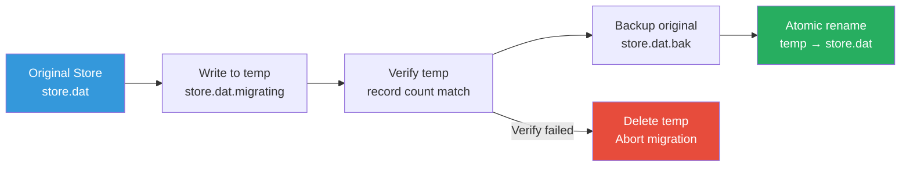

# 🔗 Synapse — Tags & Scoring

> **Package**: `com.spectrayan.spector.memory.synapse`
>
> **Biological Analog**: In neuroscience, the **Synaptic Tagging and Capture (STC)** hypothesis (Frey & Morris, 1997) describes how synapses are "tagged" during learning with lightweight chemical markers. These tags don't contain the memory itself — they identify *what* the memory is about and *when* it was formed, enabling the brain to route consolidation activity efficiently.

---

## Versioned Header Layouts

Every cognitive memory record begins with a synaptic header — the digital equivalent of a synaptic tag. The header format is **versioned** via the `HeaderLayout` sealed interface, supporting three layout sizes:



### V1 — Core Layout (32 bytes)

The original layout, still supported for backward compatibility. Contains all fields required for the [6-Phase Scoring Pipeline](scoring-pipeline.md).

```
 Offset   Size   Field             Description
 ──────   ────   ─────             ───────────
    0      8B    timestamp_ms      Unix epoch ms when memory was formed
    8      8B    synaptic_tags     64-bit Bloom filter of contextual markers
   16      4B    exact_norm        L2 norm of original float vector
   20      4B    importance        Cognitive importance (0.05 – 10.0)
   24      4B    recall_count      Times recalled (LTP reconsolidation counter)
   28      2B    centroid_id       IVF centroid assignment (max 65,535)
   30      1B    valence           Emotional coloring (signed: -128 to +127)
   31      1B    flags             Bit flags (see below)
                                   ═══════════════════════════════════
                                   Total: 32 bytes (1× AVX2 register)
```

!!! info "Why 32 bytes?"
    The V1 header is exactly one **AVX2 register width** (256 bits). The entire header can be loaded in a single SIMD instruction for bulk scanning operations.

### V2 — Extended Layout (48 bytes)

Adds **arousal** and **storage strength** for emotional modulation and the future [Two-Factor Memory Strength](../labs/roadmap.md#two-factor-memory-strength-bjork-bjork-1992) model.

```
 Offset   Size   Field             Description
 ──────   ────   ─────             ───────────
    0     32B    [V1 core]         All V1 fields (timestamp through flags)
   ─────────────────────────────── V2 extension ───────────────────────
   32      1B    arousal           Emotional intensity (unsigned: 0-255)
   33      3B    [padding]         Alignment padding
   36      4B    storage_strength  Durability factor S(t) for Two-Factor model
   40      8B    [reserved]        Future use (zeroed)
                                   ═══════════════════════════════════
                                   Total: 48 bytes (1.5× AVX2 registers)
```

**New fields:**

| Field | Type | Range | Purpose |
|:---|:---|:---|:---|
| `arousal` | unsigned byte | 0 (calm) – 255 (extreme) | Modulates decay curve — high-arousal memories resist forgetting |
| `storage_strength` | float | 0.0 – 5.0 | Two-Factor model durability (default: 1.0). Reserved for [Labs](../labs/roadmap.md) |

### V3 — Full Cache-Line Layout (64 bytes) ⭐ Default

The default for all new stores. Extends V2 with a 16-byte future buffer, aligned to a full **CPU cache line** (64 bytes) for optimal sequential scan performance.

```
 Offset   Size   Field             Description
 ──────   ────   ─────             ───────────
    0     32B    [V1 core]         All V1 fields (timestamp through flags)
   ─────────────────────────────── V2 extension ───────────────────────
   32      1B    arousal           Emotional intensity (unsigned: 0-255)
   33      3B    [padding]         Alignment padding
   36      4B    storage_strength  Durability factor S(t)
   40      8B    [reserved_1]     Future use (zeroed)
   ─────────────────────────────── V3 extension ───────────────────────
   48     16B    [reserved_2]     Future expansion buffer (zeroed)
                                   ═══════════════════════════════════
                                   Total: 64 bytes (1× cache line, 2× AVX2)
```

!!! tip "Why V3 is the default"
    **Cache-line alignment** eliminates split-line reads during sequential scans. When the scorer iterates over 1M records, each header read hits exactly one cache line — no partial line loads, no false sharing. The 16 bytes of reserved space cost ~1.5% total memory overhead but prevent future migration costs when new fields are added.

### Version Comparison

| Property | V1 (32B) | V2 (48B) | V3 (64B) |
|:---|:---:|:---:|:---:|
| Core fields | ✅ | ✅ | ✅ |
| Arousal | ❌ (default: 0) | ✅ | ✅ |
| Storage strength | ❌ (default: 1.0) | ✅ | ✅ |
| Future buffer | ❌ | ❌ | ✅ (16B) |
| Cache-line aligned | ❌ | ❌ | ✅ |
| Memory per 1M records | 32 MB | 48 MB | 64 MB |
| SIMD reads per header | 1 | 2 | 2 |

### Backward Compatibility

When a V3 reader encounters a V1 file, the missing fields return safe defaults:

```java
// V1 → V3 transparent upgrade
CognitiveHeader header = layout.readHeader(segment, offset);
header.arousal();          // → 0   (neutral — no arousal effect)
header.storageStrength();  // → 1.0 (default durability)
```

No data migration is required for reads. The `CognitiveScorer` checks `headerBytes > 32` to determine whether arousal is available and skips the arousal read on V1 segments.

---

## HeaderMigrator — One-Time Version Upgrades

The `HeaderMigrator` performs atomic, one-time migration of store files between header versions.

### Supported Paths

```
 Upgrade (lossless):
   V1 (32B) ──→ V2 (48B)  ✅   New fields filled with defaults
   V1 (32B) ──→ V3 (64B)  ✅   New fields filled with defaults
   V2 (48B) ──→ V3 (64B)  ✅   Existing V2 fields preserved

 Downgrade (lossy):
   V3 (64B) ──→ V2 (48B)  ⚠️   Reserved buffer lost
   V3 (64B) ──→ V1 (32B)  ⚠️   Arousal + storage_strength lost
   V2 (48B) ──→ V1 (32B)  ⚠️   Arousal + storage_strength lost
```

### Atomic Migration Process



1. **Write** — Records are read from source, headers expanded/shrunk, written to `store.dat.migrating`
2. **Verify** — Record count in temp file must match source exactly
3. **Backup** — Original file renamed to `store.dat.bak`
4. **Rename** — Temp file atomically renamed to `store.dat`
5. **Cleanup** — On startup, orphaned `.migrating` files are detected and deleted

### Usage

```java
HeaderMigrator migrator = new HeaderMigrator();

// Upgrade V1 store to V3
migrator.migrate(
    Path.of("/data/episodic.dat"),
    HeaderLayout.forVersion(1),  // source layout
    HeaderLayout.forVersion(3),  // target layout
    quantizedVecBytes            // vector payload size
);
```

---

## Flags Bitfield

The `flags` byte at offset 31 encodes per-record state:

```
 Bit   Name          Description
 ───   ────          ───────────
  0    tombstone     Record is logically deleted (pruned by Deep Sleep)
  1-2  memory_type   2-bit type: 0=WORKING, 1=EPISODIC, 2=SEMANTIC, 3=PROCEDURAL
  3    consolidated  Has been reflected into Semantic tier
  4    pinned        Exempt from decay and pruning (flashbulb memories)
  5    resolved      Zeigarnik Effect — resolved tasks return to normal decay
  6-7  reserved      Future use
```

### Zeigarnik Effect (Bit 5)

Unresolved memories (bit 5 = 0) resist time-decay — their decay bucket is clamped to 0, keeping them perpetually "fresh." This models the psychological phenomenon where incomplete tasks remain more accessible than completed ones.

```java
// In CognitiveScorer Phase 4:
if (!isResolved(flags) && !isPinned(flags)) {
    adjustedBucket = 0;  // acts like the memory was just formed
}

// Agent marks task complete:
memory.markResolved("task-123");  // bit 5 → 1, normal decay resumes
```

---

## SynapticTagEncoder — The Inline Bloom Filter

The `synaptic_tags` field is a **64-bit inline Bloom filter** rather than a discrete bitmap. This enables encoding thousands of unique tag strings across the system while each individual record holds 5-50 tags with negligible false positive rates.

### How It Works

```java
public static long encode(String... tags) {
    long filter = 0L;
    for (String tag : tags) {
        filter |= encodeTag(tag);
    }
    return filter;
}

private static long encodeTag(String tag) {
    long h = murmurHash64(tag);
    long h1 = h;
    long h2 = h >>> 32 | h << 32; // Swap halves for second hash
    
    long filter = 0L;
    for (int i = 0; i < K; i++) {  // K = 3 hash functions
        int bitIndex = Math.abs((int) ((h1 + (long) i * h2) % M)); // M = 64
        filter |= (1L << bitIndex);
    }
    return filter;
}
```

**Key properties**:

| Property | Value |
|:---|:---|
| Filter size | 64 bits (fits in a single CPU register) |
| Hash functions | k = 3 (MurmurHash3-inspired double hashing) |
| Bits per tag | 3 |
| Match operation | `(record & query) == query` (containment check) |
| Cost | **1 CPU cycle** (single `long` read + bitwise AND) |

### False Positive Rates

| Tags per Record | FPR | Assessment |
|:---|:---|:---|
| 5 tags | 0.03% | Excellent — 1 false match per 3,000 records |
| 10 tags | 0.2% | Excellent — 1 false match per 500 records |
| 20 tags | 2.3% | Good — vector distance rejects false matches |
| 50 tags | 12% | Acceptable — still useful for coarse gating |

!!! tip "System vs. Record Tags"
    The system can have **thousands** of unique tag strings. But any single record should have at most **10-50 tags** for the Bloom filter to remain effective. This is a natural fit — a single memory rarely has more than 5-15 contextual associations.

### Tag Overlap Scoring

Beyond binary gating, the `SynapticTagEncoder` also computes a **fractional overlap ratio** for weighted tag relevance in Phase 6:

```java
public static float overlapRatio(long recordTags, long queryMask) {
    if (queryMask == 0) return 0f;
    int overlapBits = Long.bitCount(recordTags & queryMask);
    int queryBits = Long.bitCount(queryMask);
    return (float) overlapBits / queryBits;
}
```

This ratio is used as a multiplier in the scoring formula: `finalScore = baseScore × (1 + tagOverlap × tagRelevanceBoost)`. A record matching 3 of 5 query tags gets a 60% tag boost vs 100% for a full match.

---

## CognitiveRecordLayout — Binary Format

The `CognitiveRecordLayout` class manages reading/writing headers and quantized vectors to/from off-heap `MemorySegment`. It delegates header operations to the active `HeaderLayout`:

```java
public final class CognitiveRecordLayout {
    private final HeaderLayout headerLayout;
    private final int quantizedVecBytes;
    
    /**
     * Record stride = header bytes + vector payload.
     * V1: 32 + vecBytes, V2: 48 + vecBytes, V3: 64 + vecBytes.
     */
    public int stride() {
        return headerLayout.headerBytes() + quantizedVecBytes;
    }
    
    /**
     * Offset where the quantized vector begins within a record.
     */
    public long vectorOffset(long recordOffset) {
        return recordOffset + headerLayout.headerBytes();
    }
    
    public void writeHeader(MemorySegment segment, long offset, CognitiveHeader header) {
        headerLayout.writeHeader(segment, offset, header);
    }
    
    public CognitiveHeader readHeader(MemorySegment segment, long offset) {
        return headerLayout.readHeader(segment, offset);
    }
}
```

### CognitiveHeader Record

The header data is represented as a Java `record` with all fields from all versions:

```java
public record CognitiveHeader(
    long timestampMs,       // when the memory was formed
    long synapticTags,      // 64-bit Bloom filter
    float exactNorm,        // L2 norm of original vector
    float importance,       // cognitive importance (0.05 – 10.0)
    int recallCount,        // LTP reconsolidation counter
    short centroidId,       // IVF partition routing ID
    byte valence,           // emotional coloring (-128 to +127)
    byte flags,             // bit field (tombstone, type, consolidated, pinned, resolved)
    byte arousal,           // V2+: emotional intensity (unsigned 0-255)
    float storageStrength   // V2+: Two-Factor durability S(t)
) {
    /**
     * V1-compatible constructor — fills V2+ fields with safe defaults.
     */
    public CognitiveHeader(long timestampMs, long synapticTags, float exactNorm,
                            float importance, int recallCount, short centroidId,
                            byte valence, byte flags) {
        this(timestampMs, synapticTags, exactNorm, importance,
             recallCount, centroidId, valence, flags,
             (byte) 0,   // arousal: neutral
             1.0f);      // storageStrength: default durability
    }
}
```

---

## DecayStrategy — SIMD-Friendly Temporal Decay

!!! warning "The `exp()` Problem"
    The naive decay formula `Math.exp(-λ·age)` costs 50-100ns per call and is a **scalar operation** — it cannot be SIMD-vectorized. At 1M memories, this adds 50-100ms of pure overhead, destroying the SIMD advantage.

### The Solution: Precomputed Decay Buckets

`DecayStrategy` quantizes time into discrete buckets and uses a precomputed lookup table:

```java
// Precomputed — zero Math.exp() calls at query time
private static final float[] DECAY_TABLE = {
    1.00f,  // Bucket 0: 0-1 hours
    0.95f,  // Bucket 1: 1-6 hours
    0.85f,  // Bucket 2: 6-24 hours
    0.70f,  // Bucket 3: 1-3 days
    0.50f,  // Bucket 4: 3-7 days
    0.30f,  // Bucket 5: 1-2 weeks
    0.15f,  // Bucket 6: 2-4 weeks
    0.05f,  // Bucket 7: 1-3 months
    0.01f   // Bucket 8+: 3+ months
};

public static float decay(int bucket) {
    return DECAY_TABLE[Math.min(bucket, DECAY_TABLE.length - 1)];
}
```

### Reconsolidation Adjustment

Every 3 recalls shifts the bucket back by 1, simulating Long-Term Potentiation:

```java
public static int adjustForReconsolidation(int rawBucket, int recallCount) {
    return Math.max(0, rawBucket - (recallCount / 3));
}
```

A memory recalled 12 times is 4 buckets "younger" than its actual age — it resists forgetting.

### Arousal-Modulated Decay

Emotionally intense memories resist forgetting. The `arousal` byte (V2+ headers) modulates the decay curve through a 4-bucket lookup table:

```java
private static final int[] AROUSAL_THRESHOLDS = {64, 128, 192};
private static final float[] AROUSAL_MODIFIERS = {1.0f, 1.15f, 1.35f, 1.65f};
```

| Arousal Range | Bucket | Modifier | Biological Basis |
|:---|:---:|:---:|:---|
| 0-63 (neutral) | 0 | 1.00× | Normal forgetting — routine memories |
| 64-127 (mild) | 1 | 1.15× | Slightly persistent — mildly emotional |
| 128-191 (moderate) | 2 | 1.35× | Noticeably persistent — significant events |
| 192-255 (extreme) | 3 | 1.65× | Very hard to forget — flashbulb memories |

The modifier **multiplies the base decay factor**, slowing the decay rate. A production outage at arousal=200 decays 1.65× slower than a routine log entry at arousal=0.

```java
/**
 * Computes decay with arousal modulation.
 * Higher arousal → slower decay → memory persists longer.
 */
public static float computeDecayWithArousal(int bucket, byte arousal) {
    float baseFactor = decay(bucket);
    float modifier = arousalModifier(arousal);
    return Math.min(1.0f, baseFactor * modifier);
}

/**
 * Returns the arousal modifier for a given arousal byte (unsigned 0-255).
 */
public static float arousalModifier(byte arousal) {
    int unsigned = Byte.toUnsignedInt(arousal);
    for (int i = AROUSAL_THRESHOLDS.length - 1; i >= 0; i--) {
        if (unsigned >= AROUSAL_THRESHOLDS[i]) return AROUSAL_MODIFIERS[i + 1];
    }
    return AROUSAL_MODIFIERS[0];
}
```

**Automatic arousal derivation:** When arousal is not explicitly set by the LLM, it is auto-derived from valence at ingestion time:

$$
\text{arousal} = \min(255, |\text{valence}| \times 2)
$$

This means both extremely positive (valence=+100) and extremely negative (valence=-100) memories are equally arousing — matching the psychological finding that emotional intensity, not polarity, drives memory persistence.

### Wiring in CognitiveScorer

The scorer reads arousal from the header and applies the modifier to both standard and lateral scoring paths:

```java
// In CognitiveScorer, after Phase 4 (temporal/importance pre-screen):

// Read arousal — only available on V2+ layouts
byte arousal = hasArousal
    ? segment.get(LAYOUT_AROUSAL, offset + OFFSET_AROUSAL)
    : (byte) 0;  // V1 fallback: no arousal effect

// Phase 6: Standard scoring
float decay = DecayStrategy.decay(adjustedBucket) * DecayStrategy.arousalModifier(arousal);
decay = Math.min(1.0f, decay);
float baseScore = alpha * similarity + beta * importance * decay;
```

---

## Next Steps

- :material-head-cog: [**Dopamine — Surprise Detection**](dopamine.md) — auto-importance scoring
- :material-brain: [**Cortex — Tier Stores**](cortex.md) — the 4-tier architecture
- :material-lightning-bolt: [**6-Phase Scoring Pipeline**](scoring-pipeline.md) — how scoring uses the header
- :material-flask: [**Labs — Research Roadmap**](../labs/roadmap.md) — Two-Factor Memory, Dynamic Quantization
