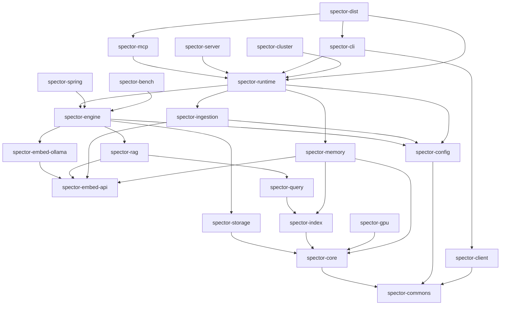
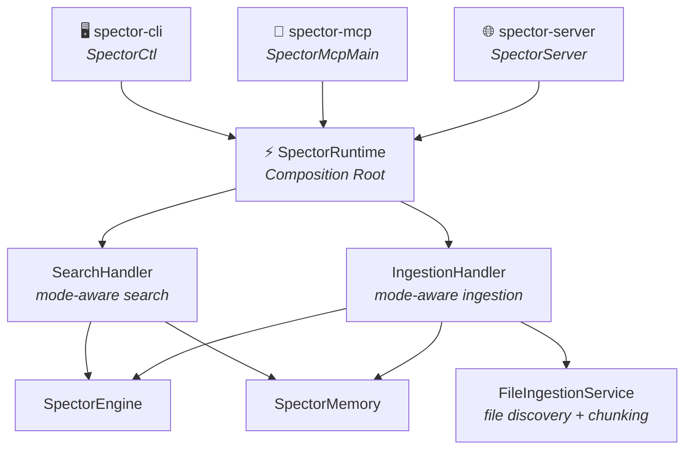

# Modules

Spector Search is organized as a multi-module Maven project. Each module has a focused responsibility, clear API boundaries, and minimal cross-module coupling.

---

## Module Dependency Graph

> [!IMPORTANT]
> **Key change:** `spector-ingestion` is now a **pure utility** (file discovery, chunking). It does NOT depend on `engine` or `runtime`. Instead, `spector-runtime` depends on `spector-ingestion` and routes ingested content through its mode-aware `IngestionHandler`.

---

## Architecture: Entry Points → Runtime → Subsystems

All entry points (MCP, CLI, Server) route through `SpectorRuntime`:

**SpectorRuntime** is a thin composition root — it creates and wires subsystems but contains no business logic. Each handler owns its domain:

| Handler | Responsibility | Routes to |
|---------|---------------|-----------|
| `SearchHandler` | Mode-aware search | Engine (SEARCH mode) or Memory (MEMORY mode) |
| `IngestionHandler` | Mode-aware ingestion (text, file, directory) | Engine or Memory + FileIngestionService |

---

## Module Overview

### Foundation Layer

| Module | Description |
|:---|:---|
| [spector-commons](spector-commons.md) | Shared utilities — concurrent primitives, I/O helpers |
| [spector-core](spector-core.md) | Core abstractions — quantization, SIMD, similarity functions |
| [spector-config](spector-config.md) | Configuration — `SpectorProperties`, `SpectorConfigFactory`, YAML loading |
| [spector-storage](spector-storage.md) | Persistent storage — memory-mapped files, arena management |

### Embedding Layer

| Module | Description |
|:---|:---|
| [spector-embed-api](spector-embed-api.md) | Embedding provider SPI — model-agnostic interface |
| [spector-embed-ollama](spector-embed-ollama.md) | Ollama embedding implementation |

### Search Layer

| Module | Description |
|:---|:---|
| [spector-index](spector-index.md) | Vector indexing — HNSW, IVF, brute-force |
| [spector-query](spector-query.md) | Query processing — parsing, planning, execution |
| [spector-gpu](spector-gpu.md) | GPU acceleration — Panama FFM bindings |

### Intelligence Layer

| Module | Description |
|:---|:---|
| [spector-rag](spector-rag.md) | RAG pipeline — retrieval-augmented generation |
| [spector-engine](spector-engine.md) | Search engine — orchestrates index + RAG + storage |
| [spector-ingestion](spector-ingestion.md) | Ingestion utilities — file discovery, chunking, title extraction (pure utility, no engine dependency) |
| [spector-memory](spector-memory.md) | Cognitive memory — biologically-inspired agent memory |

### Runtime Layer

| Module | Description |
|:---|:---|
| [spector-runtime](spector-runtime.md) | Composition root — wires engine + memory + ingestion, exposes `SearchHandler` and `IngestionHandler` |
| [spector-mcp](spector-mcp.md) | MCP server — Model Context Protocol integration via stdio |
| [spector-server](spector-server.md) | HTTP server — REST API endpoints + SSE streaming |

### Client Layer

| Module | Description |
|:---|:---|
| [spector-cli](spector-cli.md) | CLI tool — `spectorctl` with remote (HTTP) and local batch (runtime) modes |
| [spector-client](spector-client.md) | Java client — programmatic HTTP API access |
| [spector-spring](spector-spring.md) | Spring AI integration — auto-configuration |

### Infrastructure

| Module | Description |
|:---|:---|
| [spector-cluster](spector-cluster.md) | Distributed mode — cluster coordination |
| [spector-bench](spector-bench.md) | Benchmarks — JMH performance testing |
| [spector-dist](spector-dist.md) | Distribution — single fat JAR packaging |
