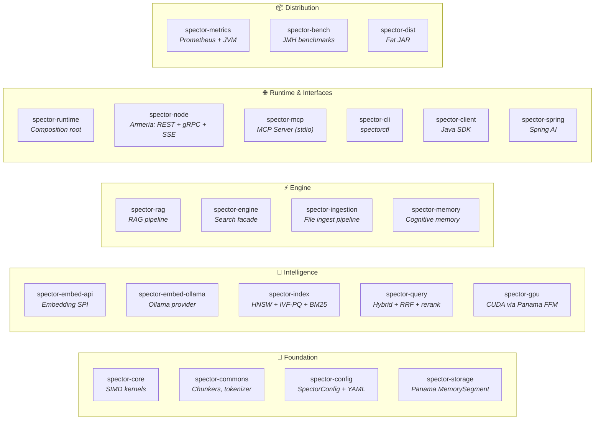
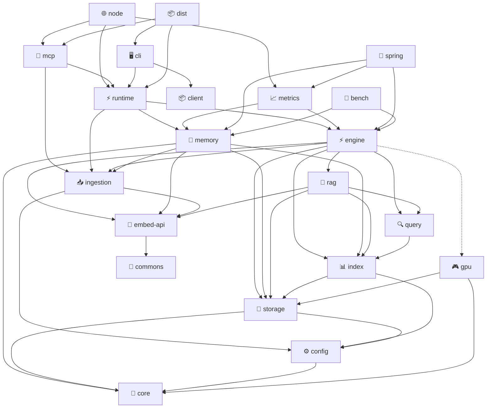
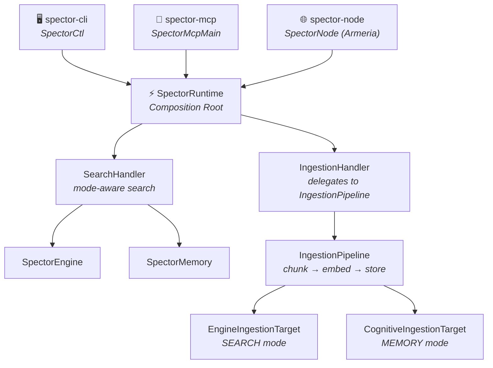

# Modules

Spector Search is organized as a multi-module Maven project. Each module has a focused responsibility, clear API boundaries, and minimal cross-module coupling.

---

## Architecture

---

## Module Dependency Graph

> **Legend:** Solid arrows = compile dependency. Dotted arrow (`gpu`) = optional dependency.

!!! important "Architecture"
    `spector-ingestion` defines the `IngestionPipeline` and `IngestionTarget` interface. Both `spector-engine` and `spector-memory` depend on it to implement their `IngestionTarget`. `spector-memory` is fully independent of `spector-engine` — they are peers, wired together only at the `SpectorRuntime` composition root.

---

## Architecture: Entry Points → Runtime → Subsystems

All entry points (MCP, CLI, Server) route through `SpectorRuntime`:

**SpectorRuntime** is a thin composition root — it creates and wires subsystems but contains no business logic. Each handler owns its domain:

| Handler | Responsibility | Routes to |
|---------|---------------|-----------|
| `SearchHandler` | Mode-aware search | Engine (SEARCH mode) or Memory (MEMORY mode) |
| `IngestionHandler` | Delegates to unified `IngestionPipeline` | Pipeline → `EngineIngestionTarget` or `CognitiveIngestionTarget` |

---

## Module Overview

### Foundation Layer

| Module | Description |
|:---|:---|
| [spector-commons](spector-commons.md) | Shared utilities — concurrent primitives, I/O helpers |
| [spector-core](spector-core.md) | Core abstractions — quantization, SIMD, similarity functions |
| [spector-config](spector-config.md) | Configuration — `SpectorProperties`, `SpectorConfigFactory`, YAML loading |
| [spector-storage](spector-storage.md) | Persistent storage — memory-mapped files, arena management |

### Embedding Layer

| Module | Description |
|:---|:---|
| [spector-embed-api](spector-embed-api.md) | Embedding provider SPI — model-agnostic interface |
| [spector-embed-ollama](spector-embed-ollama.md) | Ollama embedding implementation |

### Search Layer

| Module | Description |
|:---|:---|
| [spector-index](spector-index.md) | Vector indexing — HNSW, IVF, brute-force |
| [spector-query](spector-query.md) | Query processing — parsing, planning, execution |
| [spector-gpu](spector-gpu.md) | GPU acceleration — Panama FFM bindings |

### Intelligence Layer

| Module | Description |
|:---|:---|
| [spector-rag](spector-rag.md) | RAG pipeline — retrieval-augmented generation |
| [spector-engine](spector-engine.md) | Search engine — orchestrates index + RAG + storage |
| [spector-ingestion](spector-ingestion.md) | Unified ingestion pipeline — `IngestionPipeline` (builder), `IngestionTarget` interface, `FileDiscoveryService` |
| [spector-memory](spector-memory.md) | Cognitive memory — biologically-inspired agent memory |

### Runtime Layer

| Module | Description |
|:---|:---|
| [spector-runtime](spector-runtime.md) | Composition root — wires engine + memory + ingestion pipeline, exposes `SearchHandler` and `IngestionHandler` |
| [spector-mcp](spector-mcp.md) | MCP server — Model Context Protocol integration via stdio |
| [spector-node](spector-node.md) | Unified node — Armeria HTTP REST + gRPC + SSE events + cluster coordination |

### Client Layer

| Module | Description |
|:---|:---|
| [spector-cli](spector-cli.md) | CLI tool — `spectorctl` with remote (HTTP) and local batch (runtime) modes |
| [spector-client](spector-client.md) | Java client — programmatic HTTP API access |
| [spector-spring](spector-spring.md) | Spring AI integration — auto-configuration |

### Infrastructure

| Module | Description |
|:---|:---|
| [spector-metrics](spector-metrics.md) | Metrics — Prometheus + JVM instrumentation |
| [spector-bench](spector-bench.md) | Benchmarks — JMH performance testing |
| [spector-dist](spector-dist.md) | Distribution — single fat JAR packaging |
