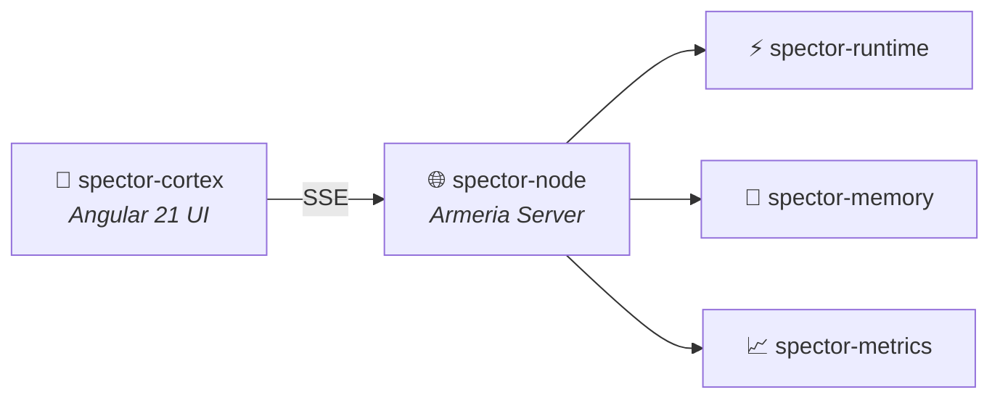

# spector-cortex

!!! info "Module Type"
    **Frontend Application** — Angular 21 standalone UI (not a Maven module)

## Purpose

`spector-cortex` is the real-time neural visualization dashboard for Spector's cognitive memory engine. It provides interactive 3D and 2D visualizations of the entire cognitive pipeline — from SIMD vector processing to Hebbian graph spreading activation to Ebbinghaus decay curves.

Unlike the backend Java modules, this is a standalone **Angular 21 application** that runs independently and connects to a Spector Node via SSE.

## Key Features

| Feature | Description |
|:--------|:------------|
| **Neural Graph** | 200-node Three.js 3D graph with 3 edge types and particle trails |
| **Vector Space** | 300-point PCA-projected embedding cloud |
| **Scoring Pipeline** | Animated 6-phase cognitive funnel |
| **Live Metrics** | Real-time recall/remember/reinforce/forget time-series |
| **Cognitive Profiles** | 6-axis radar chart with smooth profile transitions |
| **SIMD Lanes** | 16-lane register heatmap |
| **Memory Heatmap** | Off-heap segment utilization |
| **Decay Curve** | Ebbinghaus + LTP reconsolidation overlay |
| **Query History** | Scrollable timeline with latency and profile chips |
| **Zeigarnik Effect** | Unresolved memory tension gauge |
| **Habituation** | IoR, satiation, and penalty gauges |
| **Mock Data** | Toggleable simulated events for demo/development |

## Technology Stack

| Layer | Technology |
|:------|:-----------|
| Framework | Angular 21 (standalone, zoneless) |
| UI Components | Angular Material 3 |
| 3D Rendering | Three.js |
| 2D Charts | Canvas 2D API |
| State | Angular Signals |
| Data Stream | SSE (`ng-sse-client`) |
| Styling | SCSS + M3 CSS tokens |

## Quick Start

```bash
cd spector-cortex
npm install
npx ng serve --port 4300
```

## Dependencies

`spector-cortex` has **no compile-time dependency** on any Java module. It communicates with the backend exclusively through SSE:



## Related

- [Cortex Dashboard — Full Documentation](../cortex/index.md)
- [Cognitive Memory Overview](../memory/index.md)
- [spector-node](spector-node.md)
- [spector-metrics](spector-metrics.md)
