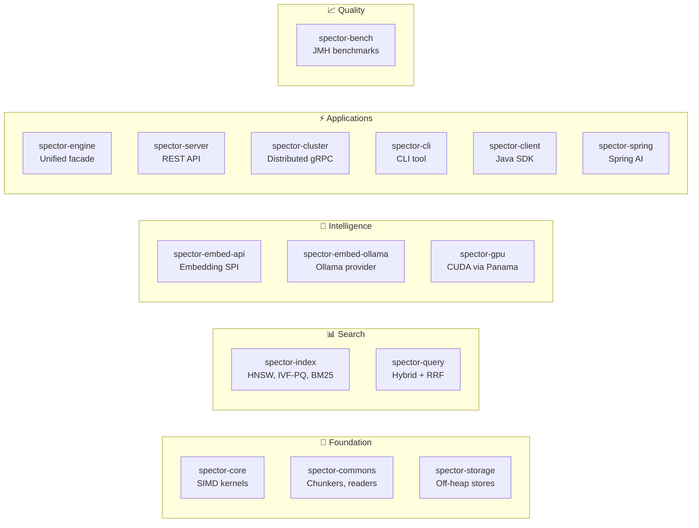

# 🤝 Contributing

> **We'd love your help making Spector Search even better!** Whether you're fixing a bug, adding a feature, improving docs, or optimizing performance — every contribution matters. This page covers everything you need to get started.

---

## 🚀 Development Setup

### 📋 Prerequisites

| Tool | Version | Notes |
|------|---------|-------|
| ☕ JDK | 25+ | OpenJDK with Vector API incubator |
| 📦 Maven | 3.9+ | Multi-module reactor build |
| 🔧 Git | 2.40+ | Version control |

### 🏗️ First-Time Setup

```bash
# Fork and clone
git clone https://github.com/<your-username>/spector-search.git
cd spector-search

# Verify JDK
java -version   # Should show 25+

# Build the project
mvn clean compile

# Run the full test suite (316+ tests)
mvn test

# Verify SIMD support
java --add-modules jdk.incubator.vector -cp spector-core/target/classes \
  com.spectrayan.spector.core.SimdCapability
```

> [!TIP]
> The full build takes ~2 minutes. Use `mvn test -pl spector-core` to test a single module during development.

---

## 📦 Module Structure



---

## 🧪 Running Tests

```bash
# Full suite
mvn test

# Single module
mvn test -pl spector-core

# Single test class
mvn test -pl spector-core -Dtest=DotProductTest

# With JMH benchmarks
mvn -pl spector-bench exec:java
```

---

## 📝 Code Style

### Java Conventions

| Rule | Details |
|------|---------|
| **Java 25 features** | Records, sealed classes, pattern matching, switch expressions |
| **Vector API** | Always use `FloatVector.SPECIES_PREFERRED`, never hardcode lanes |
| **Panama FFM** | `Arena.ofShared()` for concurrent, `Arena.ofConfined()` for single-thread |
| **Virtual Threads** | `ReentrantLock` instead of `synchronized` (avoids pinning) |
| **Testing** | JUnit 5 + AssertJ for all new features |
| **Javadoc** | Required on all public classes and methods |

### ⚡ Performance Rules

- **No allocations in hot paths** — Reuse buffers, use slice-based APIs
- **Branchless SIMD** — Use `VectorMask` for tail handling, no scalar fallback
- **Benchmark before/after** — Performance PRs must include JMH results

### 🏗️ Architecture Rules

- **Respect module boundaries** — Follow the dependency graph, no circular dependencies
- **Interface-first** — Add interfaces before implementations
- **Zero-copy** — Prefer `MemorySegment` slices over array copies

---

## 🌿 Branch Naming

```
feat/add-quantization-support
fix/hnsw-concurrent-insert-race
perf/simd-avx512-unroll-loop
refactor/storage-arena-lifecycle
docs/api-usage-examples
```

---

## 💬 Commit Messages

Follow [Conventional Commits](https://www.conventionalcommits.org/):

```
feat(core): add AVX-512 double-pump dot product kernel
fix(index): prevent HNSW neighbor list corruption under concurrent insert
perf(storage): use bulk MemorySegment.copy for vector reads
refactor(query): extract RRF into standalone utility class
docs: add benchmark results to README
test(index): add property tests for HNSW persistence round-trip
```

| Type | Purpose |
|------|---------|
| `feat` | New feature |
| `fix` | Bug fix |
| `perf` | Performance improvement |
| `refactor` | Code restructuring (no behavior change) |
| `docs` | Documentation only |
| `test` | Adding or updating tests |
| `chore` | Build, CI, tooling changes |

---

## ✅ Testing Requirements

All new features require tests. The project uses:

| Framework | Purpose |
|-----------|---------|
| **JUnit 5** | Unit tests |
| **AssertJ** | Fluent assertions |
| **jqwik** | Property-based tests |
| **JMH** | Performance benchmarks |

### Test Categories

| Type | When Required | Location |
|------|---------------|----------|
| Unit tests | All changes | `src/test/java/` in each module |
| Property tests | Algorithm changes | `src/test/java/` with `@Property` |
| Integration tests | Cross-module changes | `spector-engine/src/test/` |
| Benchmarks | Performance PRs | `spector-bench/src/main/` |

### Property-Based Tests Example

```java
@Property(tries = 100)
void hnswPersistenceRoundTrip(@ForAll @Size(min=10, max=1000) List<float[]> vectors) {
    // Build index, persist, reload, verify identical search results
}
```

---

## 🔄 Pull Request Process

1. **Create a branch** from `main` with appropriate naming
2. **Make changes** with tests
3. **Ensure all tests pass** — `mvn test`
4. **Fill out the PR template**
5. **Link related issues** — `Closes #123` or `Fixes #456`
6. **One approval required** from a maintainer
7. **Squash merge** to keep history clean

### ✅ PR Checklist

- [ ] Code follows the project's coding standards
- [ ] Tests added/updated for the change
- [ ] Javadoc updated for public API changes
- [ ] No hardcoded secrets or credentials
- [ ] Commit messages follow Conventional Commits
- [ ] JMH benchmarks included (if performance-related)
- [ ] No circular module dependencies introduced

---

## 🐛 Reporting Issues

### Bug Reports

Use the [Bug Report template](https://github.com/spectrayan/spector-search/issues/new?template=bug_report.md):
- Steps to reproduce
- Expected vs actual behavior
- JDK version and SIMD capability output
- Relevant logs or stack traces

### 💡 Feature Requests

Use the [Feature Request template](https://github.com/spectrayan/spector-search/issues/new?template=feature_request.md):
- Problem you're solving
- Proposed solution
- Alternatives considered

---

## 💬 Getting Help

| Channel | Use For |
|---------|---------|
| [GitHub Discussions](https://github.com/spectrayan/spector-search/discussions) | General questions |
| [GitHub Issues](https://github.com/spectrayan/spector-search/issues) | Bug reports |
| [SECURITY.md](https://github.com/spectrayan/spector-search/blob/main/SECURITY.md) | Security vulnerabilities |
| developer@spectrayan.com | Direct contact |

---

## 🔗 See Also

- [Architecture Overview](../architecture/overview.md) — System design
- [Core Concepts](../architecture/core-concepts.md) — Algorithms and data structures
- [Performance Tuning](performance-tuning.md) — Benchmark methodology
