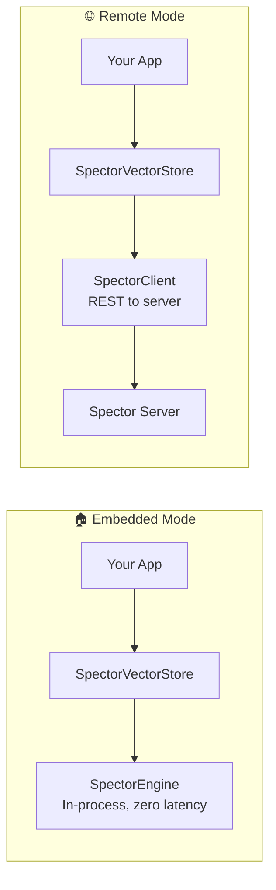

# 🌱 Spring AI Integration

> **Seamlessly integrate Spector Search into your Spring AI applications.** The `spector-spring` module implements Spring AI's `VectorStore` interface, giving you access to filter expressions, RAG patterns, and the full Spring AI ecosystem backed by sub-millisecond search.

---

## 📦 Maven Dependency

```xml
<dependency>
    <groupId>com.spectrayan</groupId>
    <artifactId>spector-spring</artifactId>
    <version>1.0-SNAPSHOT</version>
</dependency>
```

Spring AI dependencies (BOM recommended):

```xml
<dependencyManagement>
    <dependencies>
        <dependency>
            <groupId>org.springframework.ai</groupId>
            <artifactId>spring-ai-bom</artifactId>
            <version>1.0.0</version>
            <type>pom</type>
            <scope>import</scope>
        </dependency>
    </dependencies>
</dependencyManagement>
```

---

## ⚡ Configuration Modes



### 🏠 Embedded Mode (In-Process)

Use the SpectorEngine directly — no network, lowest latency:

```java
import org.springframework.ai.vectorstore.spector.SpectorVectorStore;
import com.spectrayan.spector.engine.SpectorEngine;
import com.spectrayan.spector.engine.SpectorConfig;

@Configuration
public class VectorStoreConfig {

    @Bean
    public SpectorEngine spectorEngine() {
        var config = SpectorConfig.DEFAULT
            .withDimensions(384)
            .withCapacity(100_000);
        return new SpectorEngine(config);
    }

    @Bean
    public VectorStore vectorStore(SpectorEngine engine) {
        return new SpectorVectorStore(engine);
    }
}
```

### 🌐 Remote Mode (Client SDK)

Connect to a running Spector Search server:

```java
import com.spectrayan.spector.client.SpectorClient;

@Configuration
public class VectorStoreConfig {

    @Bean
    public SpectorClient spectorClient() {
        return SpectorClient.builder()
            .host("spector-server.internal")
            .port(7070)
            .apiKey("my-api-key")
            .build();
    }

    @Bean
    public VectorStore vectorStore(SpectorClient client) {
        return new SpectorVectorStore(client);
    }
}
```

---

## 📄 Adding Documents

```java
import org.springframework.ai.document.Document;
import org.springframework.ai.vectorstore.VectorStore;

@Service
public class DocumentService {

    private final VectorStore vectorStore;

    public DocumentService(VectorStore vectorStore) {
        this.vectorStore = vectorStore;
    }

    public void addDocuments() {
        List<Document> documents = List.of(
            new Document("HNSW enables fast approximate nearest neighbor search",
                Map.of("source", "architecture.md", "category", "indexing")),
            new Document("BM25 provides keyword scoring with term frequency saturation",
                Map.of("source", "algorithms.md", "category", "search")),
            new Document("Virtual threads allow millions of concurrent operations",
                Map.of("source", "concurrency.md", "category", "runtime"))
        );

        vectorStore.add(documents);
    }
}
```

---

## 🔍 Similarity Search

### Basic Search

```java
List<Document> results = vectorStore.similaritySearch("nearest neighbor search");
```

### Search with Parameters

```java
import org.springframework.ai.vectorstore.SearchRequest;

List<Document> results = vectorStore.similaritySearch(
    SearchRequest.query("vector search algorithms")
        .withTopK(10)
        .withSimilarityThreshold(0.7)
);
```

### 🎯 Filter Expressions

SpectorVectorStore supports Spring AI's metadata filter expressions:

```java
// Filter by category
List<Document> results = vectorStore.similaritySearch(
    SearchRequest.query("search algorithms")
        .withTopK(5)
        .withFilterExpression("category == 'indexing'")
);

// Complex filters
List<Document> results = vectorStore.similaritySearch(
    SearchRequest.query("performance")
        .withTopK(10)
        .withFilterExpression("category == 'search' && source == 'algorithms.md'")
);
```

**Supported filter operators:**

| Operator | Example |
|----------|---------|
| `==` | `category == 'search'` |
| `!=` | `category != 'draft'` |
| `>`, `>=`, `<`, `<=` | `version > 2` |
| `&&` | `a == 'x' && b == 'y'` |
| `\|\|` | `a == 'x' \|\| a == 'y'` |
| `in` | `category in ['search', 'index']` |
| `not in` | `status not in ['archived']` |

---

## 🗑️ Deleting Documents

```java
vectorStore.delete(List.of("doc-id-1", "doc-id-2"));
```

---

## 🤖 RAG Service

The `SpectorRagService` provides end-to-end retrieval-augmented generation:

```java
import org.springframework.ai.vectorstore.spector.rag.SpectorRagService;

@Service
public class AiAssistant {

    private final SpectorRagService ragService;

    public AiAssistant(SpectorRagService ragService) {
        this.ragService = ragService;
    }

    public String getContext(String userQuery) {
        RagConfig config = new RagConfig(
            10,      // topK
            0.7f,    // similarity threshold
            4096     // token limit
        );

        RetrievalResult result = ragService.retrieve(userQuery, config);
        return result.contextText();
    }
}
```

### 💬 RAG with Spring AI ChatClient

```java
@Service
public class RagChatService {

    private final ChatClient chatClient;
    private final VectorStore vectorStore;

    public String ask(String question) {
        return chatClient.prompt()
            .system("Answer based on the provided context.")
            .user(question)
            .advisors(new QuestionAnswerAdvisor(vectorStore))
            .call()
            .content();
    }
}
```

!!! tip
    Spring AI's `QuestionAnswerAdvisor` automatically retrieves relevant context from the VectorStore and includes it in the prompt — no manual context assembly needed.

---

## ⚙️ Spring Boot Auto-Configuration

Configure via `application.yml`:

```yaml
spector:
  search:
    mode: embedded          # or "remote"
    dimensions: 384
    capacity: 100000
    # Remote mode settings
    host: localhost
    port: 7070
    api-key: ${SPECTOR_API_KEY:}
```

---

## ⚠️ Error Handling

| Exception | Cause |
|-----------|-------|
| `SpectorVectorStoreException` | Connection failure, server error |
| `SpectorRagServiceException` | RAG pipeline errors |

```java
try {
    vectorStore.add(documents);
} catch (SpectorVectorStoreException e) {
    log.error("Failed to add documents: {}", e.getMessage());
}
```

---

## 🎯 Complete Example

```java
@SpringBootApplication
public class SearchApp {

    @Bean
    public VectorStore vectorStore() {
        var engine = new SpectorEngine(
            SpectorConfig.DEFAULT.withDimensions(384));
        return new SpectorVectorStore(engine);
    }

    @Bean
    CommandLineRunner demo(VectorStore store) {
        return args -> {
            // Add documents
            store.add(List.of(
                new Document("HNSW uses multi-layer graphs for fast ANN search",
                    Map.of("topic", "indexing")),
                new Document("Product quantization compresses vectors 32x",
                    Map.of("topic", "compression"))
            ));

            // Search with filter
            var results = store.similaritySearch(
                SearchRequest.query("compression techniques")
                    .withTopK(5)
                    .withFilterExpression("topic == 'compression'"));

            results.forEach(doc ->
                System.out.println(doc.getContent()));
        };
    }
}
```

---

## 🔗 See Also

- [Java SDK Guide](java-client.md) — Direct SDK usage
- [RAG Pipeline](../architecture/rag-pipeline.md) — How the RAG pipeline works internally
- [REST API Reference](../api-reference/rest-endpoints.md) — Underlying REST endpoints
- [Configuration Guide](../configuration/parameters.md) — All configurable parameters