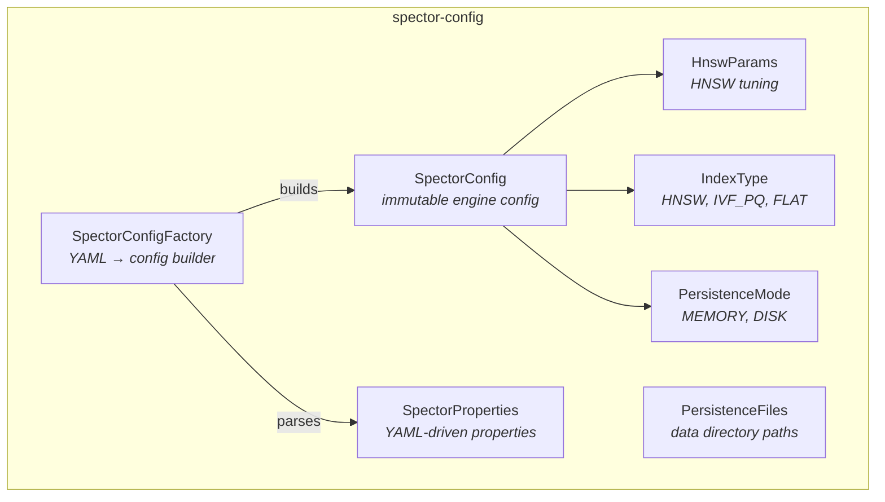

# spector-config ⚙️

> **Configuration system for Spector — YAML-driven, programmatic, and environment-aware.**

`spector-config` defines all tuning parameters for the Spector engine, memory, ingestion, and persistence. It provides both programmatic builders and YAML file loading via `SpectorConfigFactory`.

---

## 🏗️ Architecture



---

## 📦 Key Classes

### `SpectorConfig`

Immutable configuration record with fluent `with*()` builder methods:

```java
var config = SpectorConfig.DEFAULT
    .withDimensions(384)
    .withCapacity(100_000)
    .withQuantization(QuantizationType.SVASQ)
    .withRescore(3)
    .withGpu(true);
```

### `SpectorProperties`

Full YAML-mapped properties for all Spector subsystems:

```yaml
spector:
  mode: search
  engine:
    dimensions: 768
    similarity: COSINE
    capacity: 100000
    persistence-mode: DISK
    data-directory: .spector/index
  embedding:
    model: nomic-embed-text
    base-url: http://localhost:11434
  memory:
    enabled: true
    persistence-mode: DISK
  ingestion:
    chunk-size: 800
    chunk-overlap: 100
```

### `SpectorConfigFactory`

Creates `SpectorConfig` and `SpectorProperties` from YAML:

```java
SpectorProperties props = SpectorConfigFactory.load(Path.of("spector.yml"));
SpectorConfig config = SpectorConfigFactory.toEngineConfig(props);
```

---

## 📊 Configuration Parameters

| Parameter | Default | Description |
|-----------|---------|-------------|
| `dimensions` | 384 | Vector dimensionality |
| `capacity` | 100,000 | Max documents |
| `similarity` | COSINE | Similarity function (COSINE, DOT_PRODUCT, EUCLIDEAN) |
| `indexType` | HNSW | Index type (HNSW, IVF_PQ, FLAT) |
| `quantization` | NONE | Quantization (NONE, SCALAR_INT8, SCALAR_INT4, SVASQ, SVASQ_4) |
| `persistenceMode` | MEMORY | Persistence (MEMORY, DISK) |

---

## ⚙️ Dependencies

```xml
<dependency>
    <groupId>com.spectrayan</groupId>
    <artifactId>spector-config</artifactId>
    <version>0.1.0-SNAPSHOT</version>
</dependency>
```
