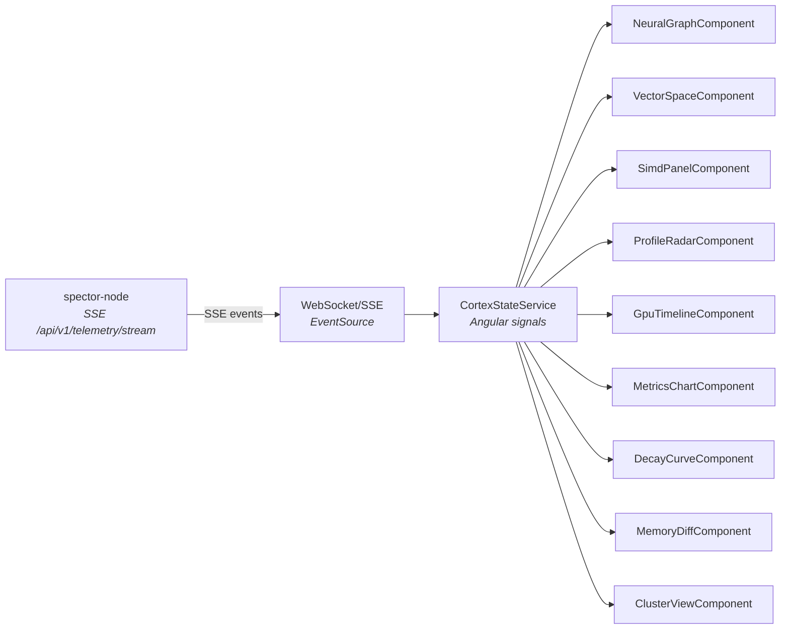

# spector-cortex 🧠

> **Real-time neural dashboard for Spector — a live visualization of the cognitive memory engine's internal state.**

`spector-cortex` is an Angular 21 application that renders real-time telemetry from the Spector engine as interactive, animated visualizations. It connects to `spector-node` via Server-Sent Events (SSE) and presents 10+ live dashboard cards covering every layer of the engine — from SIMD lane utilization to cognitive profile radar.

---

## 🖥️ Dashboard Cards

| Card | Rendering | Description |
|:---|:---|:---|
| **Neural Graph** | THREE.js (WebGL) | 3D force-directed graph of memory nodes with Hebbian/temporal/entity edges, traversal particles, and layer toggle controls |
| **Vector Space** | THREE.js (WebGL) | 3D point cloud of embedding projections with query dot, k-NN lines, axes grid, dimension labels, and layer toggle controls |
| **SIMD Panel** | Canvas 2D | 16-lane SIMD hardware visualization showing lane intensity (processing speed) and utilization (fill level) with color-coded bars |
| **Cognitive Profile Radar** | Canvas 2D | Hexagonal radar chart showing 6 cognitive axes (α, β, strictness, hyperfocus, lateral, valence) with animated dot displacement toward the dominant profile corner |
| **GPU Timeline** | Canvas 2D | Swimlane timeline of CUDA kernel executions across GPU streams with color-coded kernel types |
| **Metrics Chart** | Canvas 2D | Time-series chart of search latency, throughput, and memory metrics |
| **Decay Curve** | Canvas 2D | Ebbinghaus decay vs LTP reconsolidation curves with filled area |
| **Memory Diff** | Canvas 2D | Before/after comparison of memory tier distributions across reflect cycles |
| **Cluster View** | Canvas 2D | Orbital layout of cluster nodes with status indicators, shard counts, and replication links |
| **Query Pipeline** | HTML/CSS | Step-by-step breakdown of the latest search query with timing |
| **Habituation Stats** | HTML/CSS | Anti-repetition metrics (inhibition of return, semantic satiation) |

---

## 🏗️ Architecture



### Key Services

| Service | Responsibility |
|:---|:---|
| `CortexStateService` | Manages all dashboard state as Angular signals. Parses SSE events and updates signals. Provides layer toggle state (`GraphLayerToggles`, `VectorLayerToggles`). |
| `ThemeService` | Resolves Angular Material 21 (M3) CSS variables to canvas-compatible hex colors via `getCanvasColor()`. Required because HTML5 Canvas 2D does not support `oklch()` color space. |

---

## ⚙️ Angular 21 Patterns

### Injection Context for `effect()`

Angular 21 requires `effect()` to be called within an **injection context** (constructor, field initializer, or `runInInjectionContext`). All reactive effects in canvas components are placed in constructors with initialization guards:

```typescript
constructor() {
  effect(() => {
    const data = this.state.someSignal();
    if (data && this.scene) {  // Guard: skip before ngAfterViewInit
      this.updateVisualization(data);
    }
  });
}
```

### Canvas Color Compatibility

Angular Material 21 uses `oklch()` color space for CSS variables. Since HTML5 Canvas 2D silently ignores `oklch()` values, all canvas components use either:
- `ThemeService.getCanvasColor()` — resolves M3 variables to hex via off-screen div probe
- Hardcoded hex colors — for critical rendering paths where theme resolution is unreliable

### THREE.js Timer (not Clock)

`THREE.Clock` is deprecated in three.js r183+. Both `NeuralGraphComponent` and `VectorSpaceComponent` use `THREE.Timer` with explicit `update(timestamp)` per frame.

---

## 🚀 Development

```bash
# Install dependencies
npm install

# Start dev server (http://localhost:4200)
npm run start

# Production build
npm run build
```

### Prerequisites

- **Node.js 22+**
- **Angular CLI 21.x**
- Running `spector-node` instance (default: `http://localhost:7070`)

---

## 📁 Project Structure

```
src/app/
├── core/
│   ├── models/          # TypeScript interfaces (cortex-events, memory-types)
│   └── services/        # CortexStateService, ThemeService
├── features/
│   ├── neural-graph/    # THREE.js 3D knowledge graph
│   ├── vector-space/    # THREE.js 3D embedding visualization
│   ├── simd-panel/      # Canvas 2D SIMD lane visualization
│   ├── profile-radar/   # Canvas 2D cognitive profile hexagon
│   ├── gpu-timeline/    # Canvas 2D GPU kernel timeline
│   ├── metrics-chart/   # Canvas 2D metrics time-series
│   ├── decay-curve/     # Canvas 2D Ebbinghaus/LTP curves
│   ├── memory-diff/     # Canvas 2D memory tier diffs
│   └── cluster-view/    # Canvas 2D cluster node topology
└── dashboard/           # Main layout component
```

---

## 🔗 Dependencies

| Dependency | Purpose |
|:---|:---|
| `@angular/core` 21.x | Component framework with signals |
| `@angular/material` 21.x | Material 3 design system |
| `three` (r183+) | WebGL 3D rendering (neural graph, vector space) |
| `@angular/cdk` | Layout utilities, overlay |
