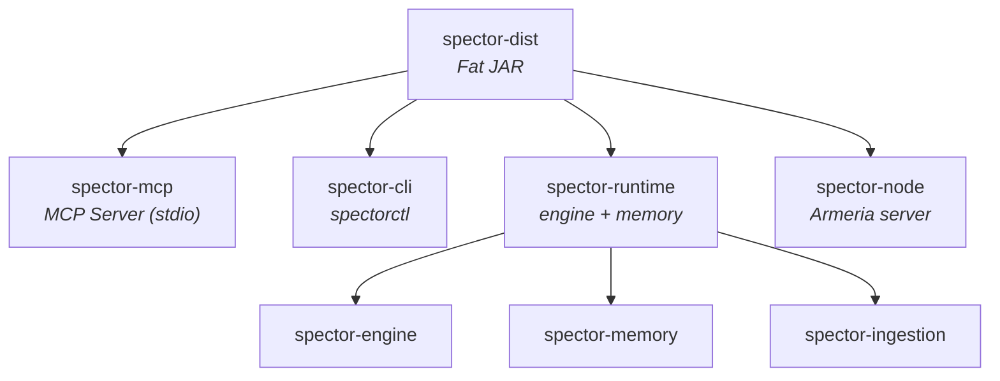

# spector-dist 📦

> **Single fat JAR distribution — all Spector modules in one deployable artifact.**

`spector-dist` uses the Maven Shade Plugin to produce a single executable JAR that includes the MCP server, CLI, runtime, engine, memory, and all dependencies.

---

## 🏗️ What's Included



---

## 🚀 Building

```bash
# Build the fat JAR (skip tests for speed)
mvn package -pl spector-dist -am -DskipTests
```

Output: `spector-dist/target/spector.jar`

## 🚀 Running

```bash
# Start the MCP server (for AI agents — Claude, Cursor, etc.)
java --add-modules jdk.incubator.vector \
  --enable-native-access=ALL-UNNAMED --enable-preview \
  -jar spector-dist/target/spector.jar \
  --config spector.yml

# Start the Armeria node (REST + gRPC + SSE)
java --add-modules jdk.incubator.vector \
  --enable-native-access=ALL-UNNAMED --enable-preview \
  -cp spector-dist/target/spector.jar \
  com.spectrayan.spector.node.SpectorNode

# Start the file ingestion pipeline
java --add-modules jdk.incubator.vector \
  --enable-native-access=ALL-UNNAMED --enable-preview \
  -cp spector-dist/target/spector.jar \
  com.spectrayan.spector.ingestion.FileIngestionMain \
  --config spector.yml --root .
```

---

## 📊 JAR Contents

The shaded JAR contains all transitive dependencies:

| Component | Modules |
|-----------|---------|
| **Core** | spector-core, spector-commons, spector-config, spector-storage |
| **Search** | spector-index, spector-query, spector-gpu |
| **Intelligence** | spector-embed-api, spector-embed-ollama, spector-rag |
| **Engine** | spector-engine, spector-ingestion, spector-memory |
| **Runtime** | spector-runtime, spector-metrics |
| **Interfaces** | spector-mcp, spector-node, spector-cli, spector-client |
| **Integration** | spector-spring |
