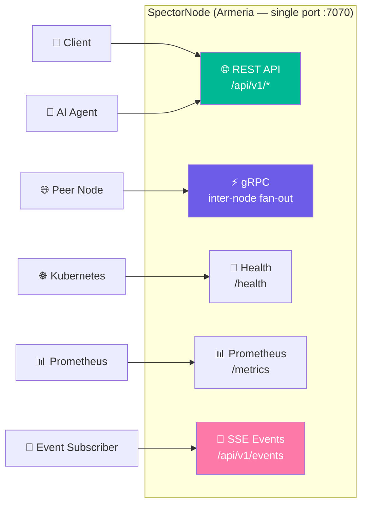
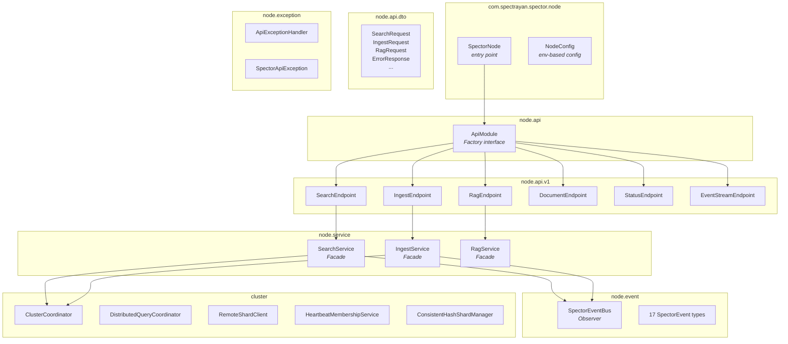

# spector-node ⚡

> **Unified Armeria-powered node — serves HTTP REST, gRPC, SSE events, Prometheus metrics, and health probes on a single Netty port.**

`spector-node` is the production entry point for Spector Search. It replaces the old `spector-node` (Armeria) and `spector-node` (gRPC) modules with a single, unified Armeria binary. One port, one NIO runtime, one binary.

---

## 🏗️ Architecture



---

## 📦 Package Structure



---

## 🧩 Key Components

| Component | Role |
|-----------|------|
| **`SearchService`**, **`IngestService`**, **`RagService`** | Service facades that hide local vs cluster routing — callers don't know if they're hitting a single node or a distributed shard |
| **`ApiModule`** | Pluggable endpoint registration — each API version (`v1`, `v2`, …) registers its routes as a self-contained module |
| **`SpectorEventBus`** | In-process event bus with 17 sealed `SpectorEvent` types — decouples producers (services) from consumers (SSE, metrics, cluster sync) |
| **`ClusterCoordinator`** | Orchestrates distributed mode — consistent-hash shard routing, heartbeat membership, and gRPC fan-out to peer nodes |
| **`ApiExceptionHandler`** | Centralized error handling — maps exceptions to structured JSON error responses with HTTP status codes |

---

## ⚡ Protocols Served (Single Port)

| Protocol | Path | Format |
|----------|------|--------|
| HTTP REST | `/api/v1/*` | JSON |
| gRPC | (auto-detected via `application/grpc`) | Protobuf |
| Health | `/health` | 200 OK |
| Prometheus | `/metrics` | OpenMetrics text |
| SSE Events | `/api/v1/events` | Server-Sent Events |

---

## 🚀 Running

### Environment Variables

| Variable | Default | Description |
|----------|---------|-------------|
| `SPECTOR_PORT` | 7070 | HTTP + gRPC port |
| `SPECTOR_NODE_ID` | hostname | Unique node identifier |
| `SPECTOR_SEED_NODES` | _(none)_ | Comma-separated seed endpoints (triggers CLUSTERED mode) |
| `SPECTOR_API_KEY` | _(none)_ | API key for authentication |
| `SPECTOR_DIMS` | 384 | Vector dimensions |
| `SPECTOR_MAX_CONNECTIONS` | 10,000 | Max concurrent connections |
| `SPECTOR_REQUEST_TIMEOUT` | 30 | Request timeout (seconds) |
| `SPECTOR_COMPRESSION` | true | Enable gzip/brotli response compression |
| `SPECTOR_IDLE_TIMEOUT` | 60 | Idle connection timeout (seconds) |
| `SPECTOR_MCP_ENABLED` | true | Enable MCP-over-SSE at /mcp |

### Launching

```bash
# Standalone mode
SPECTOR_PORT=7070 SPECTOR_DIMS=384 \
  java --add-modules jdk.incubator.vector --enable-preview \
  -cp spector-dist/target/spector.jar \
  com.spectrayan.spector.node.SpectorNode

# Clustered mode (3 nodes)
SPECTOR_SEED_NODES=node-1:7070,node-2:7070,node-3:7070 \
SPECTOR_NODE_ID=node-1 SPECTOR_PORT=7070 \
  java --add-modules jdk.incubator.vector --enable-preview \
  -cp spector-dist/target/spector.jar \
  com.spectrayan.spector.node.SpectorNode
```

---

## 📡 Event System (17 Event Types)

Subscribe via SSE:
```bash
# All events
curl -N http://localhost:7070/api/v1/events

# Filter by category
curl -N http://localhost:7070/api/v1/events?filter=search,document
```

| Category | Events |
|----------|--------|
| `node` | `SpectorNodeStartedEvent`, `SpectorNodeStoppingEvent`, `SpectorNodeHealthChangedEvent` |
| `search` | `SpectorSearchCompletedEvent`, `SpectorSearchFailedEvent` |
| `document` | `SpectorDocumentIngestedEvent`, `SpectorDocumentDeletedEvent`, `SpectorBulkIngestCompletedEvent` |
| `cluster` | `SpectorNodeJoinedEvent`, `SpectorNodeLeftEvent`, `SpectorShardRebalancedEvent`, `SpectorReplicaSyncCompletedEvent` |
| `mcp` | `SpectorMcpClientConnectedEvent`, `SpectorMcpClientDisconnectedEvent`, `SpectorMcpToolExecutedEvent` |
| `engine` | `SpectorIndexRebuiltEvent`, `SpectorEmbeddingProviderChangedEvent` |

---

## 🔗 REST API Endpoints

| Method | Path | Description |
|--------|------|-------------|
| `GET` | `/health` | K8s readiness/liveness probe |
| `GET` | `/metrics` | Prometheus scrape endpoint |
| `GET` | `/api/v1/status` | Engine status, SIMD info, cluster mode |
| `GET` | `/api/v1/metrics` | Request metrics |
| `POST` | `/api/v1/search` | Keyword/vector/hybrid search |
| `GET` | `/api/v1/search/stream` | Streaming search via SSE |
| `POST` | `/api/v1/ingest` | Ingest with pre-computed vector |
| `POST` | `/api/v1/ingest/auto` | Ingest with auto-embedding |
| `POST` | `/api/v1/ingest/bulk` | Batch ingest documents |
| `POST` | `/api/v1/rag` | RAG context retrieval |
| `DELETE` | `/api/v1/documents/{id}` | Delete document |
| `GET` | `/api/v1/events` | Live event stream (SSE) |
